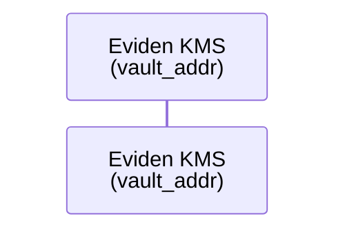

# Mermaid diagram conventions

These rules prevent rendering errors in the mdBook documentation site, VS Code preview,
and GitHub preview. The bundled Mermaid version uses `marked.js` internally to parse
node and edge label content; breaking its constraints silently corrupts diagrams.

## Line breaks

**Use `<br/>`, never `\n`**, for line breaks inside node labels and edge labels.

```mermaid
%%  WRONG — \n is rendered as the literal string "\n" in most Mermaid versions:
flowchart LR
    A["line one\nline two"]

%%  CORRECT — <br/> is interpreted as a line break:
flowchart LR
    A["line one<br/>line two"]
```

This applies to:

- node labels: `["…"]`, `("…")`, `{"…"}`, `(["…"])`, `[/"…"/]`, etc.
- edge labels: `-- "…" -->`, `-. "…" .->`, `== "…" ==>`

## Avoid list markers in node / edge label content

`marked.js` tokenises node label content as Markdown. Any line that starts with a
list marker (`-`, `*`, `+`, `1.`, `2.`, …) produces a `list` token, which
Mermaid's `markdownToHTML` function cannot render and falls back to the error string
`Unsupported markdown: list`.

**Do not start a line (after `<br/>`) with a list marker.**

```mermaid
%%  WRONG — "- item" and "+ item" are list markers:
flowchart LR
    A["Contain<br/>- revoke key<br/>+ stop SPIRE"]

%%  CORRECT — use neutral Unicode prefixes or reword:
flowchart LR
    A["Contain<br/>① revoke key<br/>② stop SPIRE"]
```

Also avoid ordered list markers at the **start** of an edge label:

```mermaid
%%  WRONG — "1. " is an ordered list marker:
flowchart LR
    Admin -- "1. provision AppRoles<br/>+ PKI CA key" --> KMS

%%  CORRECT:
flowchart LR
    Admin -- "① provision AppRoles + PKI CA key" --> KMS
```

## Supported Markdown in node labels

Mermaid's `markdownToHTML` supports only a subset of Markdown tokens in node/edge labels:

| Token | Supported | Example |
|---|---|---|
| Plain text | ✅ | `Node text` |
| Bold | ✅ | `**bold**` |
| Italic | ✅ | `*italic*` |
| HTML (e.g. `<br/>`) | ✅ | Line breaks |
| Paragraph | ✅ | Implicit in multi-token content |
| List (ordered or unordered) | ❌ | Produces `Unsupported markdown: list` |
| Heading (`#`) | ❌ | Produces `Unsupported markdown: heading` |
| Code span (`` ` ``) | ❌ | Produces `Unsupported markdown: code` |
| Blockquote (`>`) | ❌ | Produces `Unsupported markdown: blockquote` |

> **Tip:** keep node labels short and plain. Use sub-headings and prose in the
> surrounding document text to supply detail that cannot fit cleanly in a diagram node.

## Sequence diagram participant aliases

`<br/>` works in participant alias labels:



The same constraints apply: no list markers, no code spans.

## Checking for violations before commit

```bash
# Find literal \n inside Mermaid blocks (should return nothing):
python3 - <<'EOF'
import re, sys
for path in sys.argv[1:]:
    with open(path) as f:
        lines = f.readlines()
    in_mermaid = False
    for i, line in enumerate(lines, 1):
        s = line.rstrip('\n')
        if s.strip() == '```mermaid': in_mermaid = True; continue
        if in_mermaid and s.strip() == '```': in_mermaid = False; continue
        if in_mermaid and r'\n' in s:
            print(f"{path}:{i}: {s}")
EOF documentation/docs/**/*.md
```
