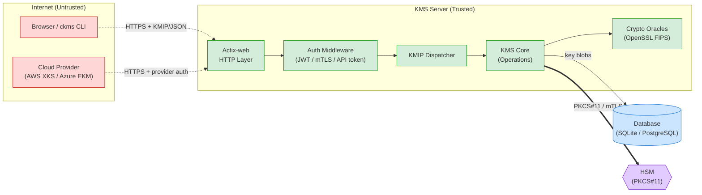
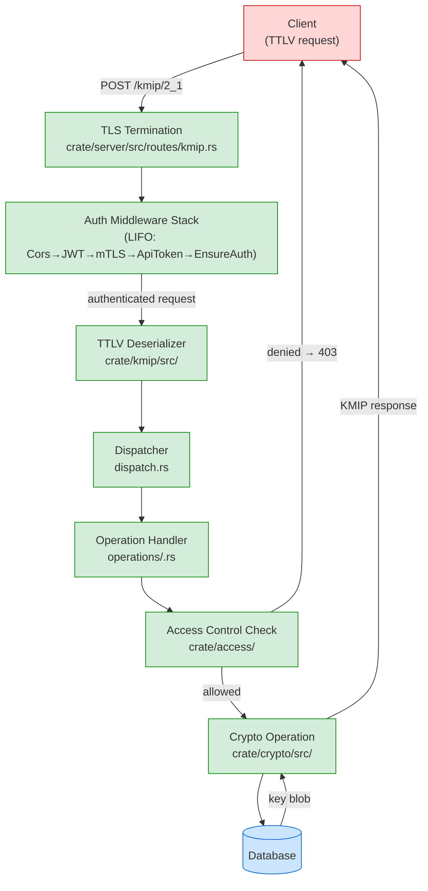

# Threat Model Diagram Conventions

Mermaid DFD conventions for the Cosmian KMS threat model. Follow these rules exactly for every diagram to ensure visual consistency across analyses.

## Shape Conventions (DFD Level 0/1)

| Element Type | Mermaid Shape | Example |
|---|---|---|
| External entity (user, browser, cloud) | `actor` or rectangle `[name]` | `Browser["Browser / API Client"]` |
| Process (server component) | rounded rectangle `(name)` | `Auth("Auth Middleware")` |
| Data store (database, file) | cylinder `[(name)]` | `DB[("SQLite / PostgreSQL")]` |
| HSM / external hardware | hexagon `{{name}}` | `HSM{{"HSM (PKCS#11)"}}` |
| Trust boundary | subgraph with dashed border | `subgraph Internet["--- Internet ---"]` |

## Color Conventions

| Zone | Fill | Border | Meaning |
|------|------|--------|---------|
| Untrusted / Internet | `#ffd6d6` | `#cc0000` | External actors, internet |
| Semi-trusted | `#fff3cd` | `#cc8800` | Auth boundary |
| Trusted (internal) | `#d4edda` | `#008800` | Server internals |
| Data store | `#cce5ff` | `#0066cc` | Persistent storage |
| HSM / hardware | `#e2ccff` | `#6600cc` | Hardware trust anchor |

Apply colors using `style` or `classDef`:

```mermaid
classDef untrusted fill:#ffd6d6,stroke:#cc0000
classDef trusted fill:#d4edda,stroke:#008800
classDef datastore fill:#cce5ff,stroke:#0066cc
classDef hsm fill:#e2ccff,stroke:#6600cc
```

## Data Flow Arrow Conventions

| Arrow type | Mermaid syntax | Meaning |
|---|---|---|
| Normal data flow | `A --\|HTTPS/TLS\| B` | Standard request/response |
| Encrypted channel | `A ==\|mTLS\| B` | Mutually authenticated, encrypted |
| Trust boundary crossing | `A -.-\|JSON/TTLV\| B` | Crossing a trust boundary |
| Destructive/sensitive | `A --\|key material\| B` | Carry sensitive data |

## Level 0 — System Context Template



## Level 1 — KMIP Request Flow Template



## Pre-Render Checklist

Before including any diagram in an output file:

- [ ] All nodes have correct shape for their element type
- [ ] All nodes have correct `classDef` color applied
- [ ] Trust boundary crossings use `-.->` arrows
- [ ] Sensitive data flows (key material) are labeled
- [ ] No orphaned nodes (every node has at least one edge)
- [ ] Diagram does not exceed 25 nodes (split into sub-diagrams if needed)
- [ ] Mermaid syntax is valid (no unmatched quotes or brackets)

## Common Mistakes

❌ Using `graph` instead of `flowchart` (prefer `flowchart` for DFDs)
❌ Forgetting to apply `classDef` to nodes
❌ Showing trust boundaries without `subgraph`
❌ Not labeling data flow arrows (unlabeled arrows hide what data flows)
❌ Combining architecture style and DFD style in the same diagram
