# Cosmian KMS Script Suite

This directory contains the complete script infrastructure for building, testing, packaging, and releasing Cosmian KMS.
The primary entrypoint is `nix.sh`, which provides a unified interface to all workflows through Nix-managed environments.

## Quick Visual Overview

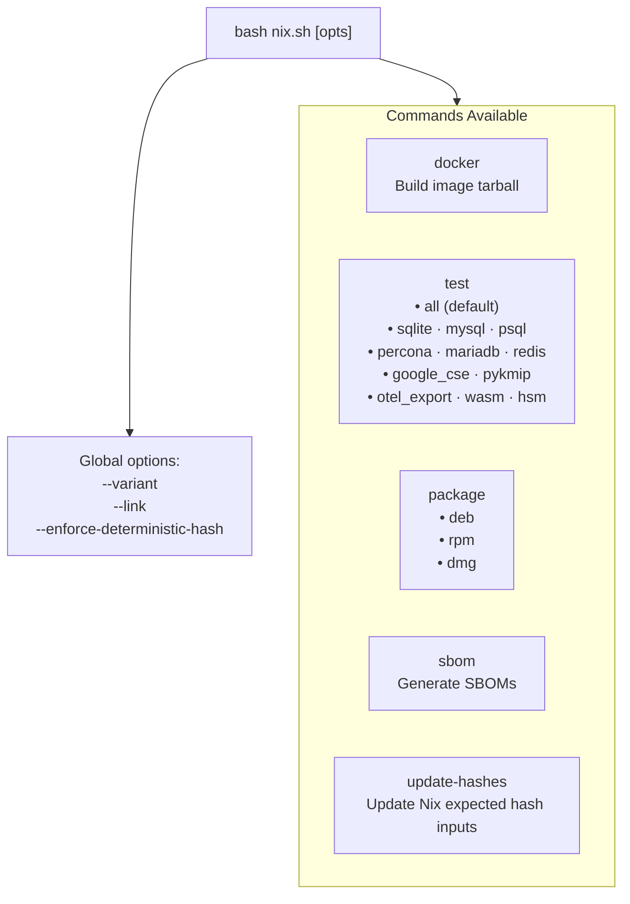

**Common workflows:**

```bash
# Development iteration
bash nix.sh test sqlite

# Build packages + run smoke tests
bash nix.sh package

# SBOM for compliance
bash nix.sh sbom

# Docker image tarball (optional)
bash nix.sh docker --load
```

**📊 For detailed visual execution flows, see [Script Ecosystem → Visual Execution Diagrams](#visual-execution-diagrams)**

---

[TOC]

---

## Overview

Cosmian KMS uses **Nix** to achieve:

- **Reproducible builds**: Pinned dependencies (nixpkgs 24.05, Rust 1.90.0, OpenSSL 3.6.0 + OpenSSL 3.1.2 FIPS provider)
- **Hermetic packaging**: Static linking, no runtime /nix/store paths
- **Offline capability**: Pre-warming enables network-free builds
- **Variant isolation**: FIPS and non-FIPS builds with controlled feature sets

**OpenSSL note**: KMS links against OpenSSL **3.6.0**, but OpenSSL **3.1.2** must still be used for the **FIPS provider** because it is the official FIPS provider version available today (no more recent FIPS provider version).

**Key principle**: `nix.sh` is the single entrypoint for developers and CI; it orchestrates all other scripts within controlled Nix environments.

---

## nix.sh — Unified Command Interface

### Commands

#### 1. `docker` — Build Docker Image Tarball

Builds a Docker image tarball via Nix attributes, and can optionally load and test it.

**Syntax:**

```bash
bash .github/scripts/nix.sh docker [--variant <fips|non-fips>] [--force] [--load] [--test]
```

**Examples:**

```bash
# Build and load a non-FIPS image
bash .github/scripts/nix.sh docker --variant non-fips --load

# Build, load and run container tests
bash .github/scripts/nix.sh docker --variant fips --load --test
```

---

#### 2. `test` — Run Test Suites

Executes comprehensive test suites across databases, cryptographic backends, and client protocols.

**Syntax:**

```bash
# Global options must come before the command token (except `docker`, which parses `--variant` itself)
bash .github/scripts/nix.sh [--variant <fips|non-fips>] [--link <static|dynamic>] test [type] [backend]
```

**Test Types:**

| Type            | Description                               | Script               | Notes                           |
| --------------- | ----------------------------------------- | -------------------- | ------------------------------- |
| `all`           | Run complete test suite (default)         | `test_all.sh`        | Includes DB + HSM (if release)  |
| `sqlite`        | SQLite embedded database tests            | `test_sqlite.sh`     | Always run; core functionality  |
| `mysql`         | MySQL backend tests                       | `test_mysql.sh`      | Requires MySQL server           |
| `percona`       | Percona XtraDB Cluster tests              | `test_percona.sh`    | Requires Percona server         |
| `mariadb`       | MariaDB backend tests                     | `test_maria.sh`      | Requires MariaDB server         |
| `psql`          | PostgreSQL backend tests                  | `test_psql.sh`       | Requires PostgreSQL server      |
| `redis`         | Redis-findex encrypted index tests        | `test_redis.sh`      | Non-FIPS only; requires Redis   |
| `google_cse`    | Google Client-Side Encryption integration | `test_google_cse.sh` | Requires OAuth credentials      |
| `pykmip`        | PyKMIP client compatibility tests         | `test_pykmip.sh`     | Non-FIPS only; runs against a running KMS |
| `otel_export`   | OTEL export integration tests             | `test_otel_export.sh`| Requires Docker                 |
| `wasm`          | WASM tests                                | `test_wasm.sh`       | Uses Node + wasm-pack           |
| `hsm [backend]` | Hardware Security Module tests            | `test_hsm*.sh`       | Linux only; see backends below  |

**HSM Backends** (used with `test hsm [backend]`):

- `softhsm2` — Software HSM emulator (default in CI)
- `utimaco` — Utimaco simulator tests
- `proteccio` — Proteccio NetHSM tests
- `all` — Run all HSM backends sequentially (default)

**Environment Variables:**

Database connections:

- `REDIS_HOST`, `REDIS_PORT`
- `MYSQL_HOST`, `MYSQL_PORT`
- `PERCONA_HOST`, `PERCONA_PORT`
- `MARIADB_HOST`, `MARIADB_PORT`
- `POSTGRES_HOST`, `POSTGRES_PORT`

Google CSE (required for `google_cse` tests):

- `TEST_GOOGLE_OAUTH_CLIENT_ID`
- `TEST_GOOGLE_OAUTH_CLIENT_SECRET`
- `TEST_GOOGLE_OAUTH_REFRESH_TOKEN`
- `GOOGLE_SERVICE_ACCOUNT_PRIVATE_KEY`

**Examples:**

```bash
# Run all tests (default variant: FIPS)
bash .github/scripts/nix.sh test

# Specific database tests
bash .github/scripts/nix.sh test sqlite
bash .github/scripts/nix.sh test psql

# Percona / MariaDB
bash .github/scripts/nix.sh test percona
bash .github/scripts/nix.sh test mariadb

# Redis tests (non-FIPS required)
bash .github/scripts/nix.sh --variant non-fips test redis

# PyKMIP client tests (non-FIPS, includes Python environment)
bash .github/scripts/nix.sh --variant non-fips test pykmip

# OTEL export integration tests (requires Docker)
bash .github/scripts/nix.sh test otel_export

# WASM tests
bash .github/scripts/nix.sh test wasm

# Google CSE tests (with credentials)
TEST_GOOGLE_OAUTH_CLIENT_ID=... \
TEST_GOOGLE_OAUTH_CLIENT_SECRET=... \
TEST_GOOGLE_OAUTH_REFRESH_TOKEN=... \
GOOGLE_SERVICE_ACCOUNT_PRIVATE_KEY=... \
  bash .github/scripts/nix.sh test google_cse

# HSM tests (specific backend)
bash .github/scripts/nix.sh test hsm softhsm2
bash .github/scripts/nix.sh test hsm all
```

**Special Modes:**

- **Pure shell**: Standard DB tests run in `--pure` mode (hermetic)
- **Non-pure shell**: HSM tests need system PKCS#11 libraries; automatically disables `--pure`
- **Auto-dependencies**: `nix.sh` injects `WITH_WGET`, `WITH_HSM`, `WITH_PYTHON` env vars to provision tools

---

#### 3. `package` — Build Distribution Packages

Creates platform-native packages (DEB, RPM, DMG) using Nix derivations, with mandatory smoke tests.

**Syntax:**

```bash
bash .github/scripts/nix.sh [--variant <fips|non-fips>] [--link <static|dynamic>] \
   [--enforce-deterministic-hash <true|false>] package [type]
```

**Package Types:**

| Type   | Platform | Output                   | Script                       |
| ------ | -------- | ------------------------ | ---------------------------- |
| `deb`  | Linux    | Debian/Ubuntu `.deb`     | `package/package_deb.sh` |
| `rpm`  | Linux    | RedHat/SUSE `.rpm`       | `package/package_rpm.sh` |
| `dmg`  | macOS    | macOS disk image `.dmg`  | `package/package_dmg.sh` |
| (none) | Auto     | All types for current OS | —                            |

**Build Process:**

1. **Prewarm** (skippable via `NO_PREWARM=1`):
   - Fetch pinned nixpkgs (24.05) to local store
   - Pre-download packaging tools (`dpkg`, `rpm`, `cpio`) for offline use
2. **Build**:
   - Execute package-specific Nix script
   - On Linux: Use Nix derivations directly (`nix-build`)
   - On macOS: Use `nix-shell` (non-pure) + `cargo-packager` for DMG (requires `hdiutil`, `osascript`)
3. **Smoke Test** (mandatory):
   - Extract package to temp directory
   - Run `cosmian_kms --info`
   - Verify OpenSSL versions are as expected (runtime/library is typically `3.6.0`; for FIPS variants the FIPS provider remains `3.1.2`)
   - Fail entire build if test fails
4. **Checksum**:
   - Generate SHA-256 checksum file (`.sha256`) alongside package

**Examples:**

```bash
# Build all packages for current platform (Linux: deb+rpm; macOS: dmg)
bash .github/scripts/nix.sh package

# Build the full matrix (fips/non-fips × static/dynamic) when no variant/link is explicitly provided
# (this is the default behavior for `package` on Linux when invoked as `bash nix.sh package`)

# Build specific package type (FIPS variant)
bash .github/scripts/nix.sh package deb
bash .github/scripts/nix.sh package rpm

# Build non-FIPS variant
bash .github/scripts/nix.sh --variant non-fips package deb
bash .github/scripts/nix.sh --variant non-fips package dmg

# Build dynamic OpenSSL linkage (system OpenSSL; packaging still bundles needed libs)
bash .github/scripts/nix.sh --link dynamic package deb
```

**Output Locations:**

- DEB: `result-deb-<variant>-<link>/` symlink
- RPM: `result-rpm-<variant>-<link>/` symlink
- DMG: `result-dmg-<variant>-<link>/` symlink

**Offline Builds:**
After one successful online run, subsequent package builds work offline (network disconnected) if:

- Nix store contains pinned nixpkgs
- Cargo vendor cache is populated
- OpenSSL 3.1.2 tarball (FIPS provider) is cached (runtime OpenSSL is 3.6.0)

---

#### 4. `sbom` — Generate Software Bill of Materials

Produces comprehensive SBOM files using `sbomnix` tools for supply chain transparency and compliance.

**Syntax:**

```bash
bash .github/scripts/nix.sh [--variant <fips|non-fips>] [--link <static|dynamic>] sbom [--target <openssl|server>]
```

**What it does:**

- Default target is `openssl`: generates an SBOM for the OpenSSL **3.1.2** derivation (`openssl312`)
- Target `server`: generates an SBOM for the KMS server derivation (selected by `--variant` and `--link`)
- Generates multiple SBOM formats + vulnerability reports
- Runs **outside** `nix-shell` (sbomnix needs direct `nix` commands)

**Generated Files** (in `./sbom/` directory):

| File            | Format    | Description                                  |
| --------------- | --------- | -------------------------------------------- |
| `bom.cdx.json`  | CycloneDX | Industry-standard SBOM (OWASP ecosystem)     |
| `bom.spdx.json` | SPDX      | ISO/IEC 5962:2021 standard SBOM              |
| `sbom.csv`      | CSV       | Spreadsheet-friendly dependency list         |
| `vulns.csv`     | CSV       | Vulnerability scan results (CVE mapping)     |
| `graph.png`     | PNG       | Visual dependency graph                      |
| `meta.json`     | JSON      | Build metadata (timestamps, variant, hashes) |
| `README.txt`    | Text      | Integration guide and usage instructions     |

**Examples:**

```bash
# Default: SBOM for OpenSSL 3.1.2 derivation
bash .github/scripts/nix.sh sbom

# SBOM for KMS server (FIPS, static)
bash .github/scripts/nix.sh sbom --target server

# SBOM for KMS server (non-FIPS, static)
bash .github/scripts/nix.sh --variant non-fips --link static sbom --target server

# SBOM for KMS server (FIPS, dynamic)
bash .github/scripts/nix.sh --variant fips --link dynamic sbom --target server
```

**Use Cases:**

- Compliance audits (SBOM submission to customers)
- Vulnerability monitoring (scan `vulns.csv` for CVEs)
- License verification (check dependencies in `bom.spdx.json`)
- Supply chain attestation (provenance tracking)

---

#### 5. `update-hashes` — Update Expected Hashes

Updates Nix expected-hash inputs by parsing **GitHub Actions** packaging logs (fixed-output derivation hash mismatches).

This works even if the workflow run is still in progress (it fetches per-job logs directly when needed).

This command is meant to be used after a CI packaging job fails with a message like:

- `specified: sha256-...`
- `got: sha256-...`

**Prerequisite:** `gh` CLI installed and authenticated (`gh auth login`).

**Syntax:**

```bash
# Optional argument: a GitHub Actions workflow RUN_ID
bash .github/scripts/nix.sh update-hashes [RUN_ID]
```

**What it updates (in nix/expected-hashes/):**

- `ui.vendor.fips.sha256`
- `ui.vendor.non-fips.sha256`
- `server.vendor.static.sha256`, `server.vendor.dynamic.sha256`
- `cli.vendor.linux.sha256`
- `cli.vendor.static.darwin.sha256`, `cli.vendor.dynamic.darwin.sha256`

**Examples:**

```bash
# Use the latest packaging workflow run
bash .github/scripts/nix.sh update-hashes

# Use a specific workflow run
bash .github/scripts/nix.sh update-hashes 123456789
```

**Platform Support:**

- `x86_64-linux` (Intel/AMD Linux)
- `aarch64-linux` (ARM64 Linux)
- `aarch64-darwin` (Apple Silicon macOS)

**Important**: Hash updates should be reviewed carefully. Binary hash changes indicate:

- Code modifications affecting the binary
- Dependency updates (even with locked `Cargo.lock`, Nix vendor hash may differ)
- Potential supply chain tampering (investigate unexpected changes)

---

### Global Options

All commands support these flags (place them **before** the command token; `docker` additionally accepts `--variant` after the command):

| Flag              | Values             | Default                               | Effect                    |
| ----------------- | ------------------ | ------------------------------------- | ------------------------- |
| `-v`, `--variant` | `fips`, `non-fips` | `fips`                                | Cryptographic feature set |
| `-l`, `--link`    | `static`, `dynamic`| `static`                              | OpenSSL linkage mode      |
| `--enforce-deterministic-hash` | `true`, `false` | `false`                      | Enforce expected-hash checks in Nix derivations |
| `-h`, `--help`    | —                  | —                                     | Show usage and exit       |

**Feature Set Differences:**

| Aspect          | FIPS Variant                      | Non-FIPS Variant                |
| --------------- | --------------------------------- | ------------------------------- |
| Crypto backend  | OpenSSL 3.6.0 runtime + OpenSSL 3.1.2 FIPS provider | OpenSSL 3.6.0 runtime (default/legacy providers) |
| Redis-findex    | Disabled                          | Enabled                         |
| Reproducibility | Bit-for-bit deterministic (Linux) | Hash-verified (may vary by env) |
| Target users    | Government, regulated industries  | General enterprise              |

---

### Internal Mechanics

**Key Functions:**

| Function                         | Purpose                                                       |
| -------------------------------- | ------------------------------------------------------------- |
| `usage()`                        | Display help text and exit                                    |
| `compute_sha256(file)`           | Platform-agnostic SHA-256 hash (uses `sha256sum` or `shasum`) |
| `resolve_pinned_nixpkgs_store()` | Realize pinned nixpkgs tarball in local Nix store             |
| `prewarm_nixpkgs_and_tools()`    | Pre-fetch nixpkgs + packaging tools (skip via `NO_PREWARM=1`) |

**Execution Flow:**

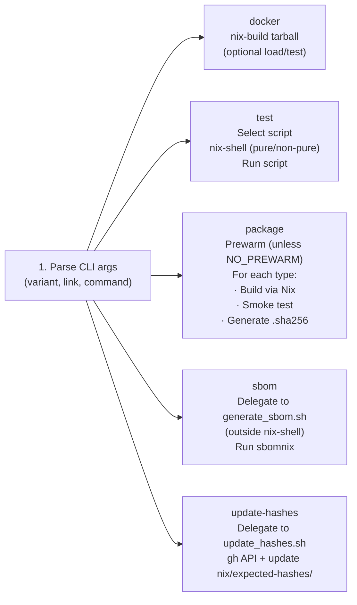

**Pure vs Non-Pure Shell:**

| Scenario                     | Mode     | Rationale                                        |
| ---------------------------- | -------- | ------------------------------------------------ |
| Database tests (sqlite/psql) | `--pure` | Self-contained test environment                  |
| HSM tests                    | Non-pure | Needs system PKCS#11 libraries (vendor-specific) |
| macOS DMG packaging          | Non-pure | Requires system tools (`hdiutil`, `osascript`)   |

---

## The Role of Nix

Nix provides the foundation for deterministic, auditable builds:

### Key Benefits

| Aspect                     | Implementation                                | Impact                                           |
| -------------------------- | --------------------------------------------- | ------------------------------------------------ |
| **Pinned Dependencies**    | nixpkgs 24.05 tarball locked by hash          | Identical build environment across machines/time |
| **Reproducible Toolchain** | Rust 1.90.0 from Nix (no rustup)              | Eliminates "works on my machine" compiler issues |
| **Static OpenSSL**         | Link against OpenSSL 3.6.0; vendored 3.1.2 tarball for the FIPS provider | No runtime SSL dependency; portable binaries     |
| **Hash Enforcement**       | Binary SHA-256 checked in `installCheckPhase` | Detects drift/tampering (FIPS builds on Linux)   |
| **Offline Capability**     | Pre-warmed store + Cargo offline cache        | Air-gapped builds after first online run         |
| **Variant Isolation**      | Separate derivations for FIPS/non-FIPS        | Controlled cryptographic footprint               |

### Reproducibility Guarantees

**FIPS builds on Linux** are **bit-for-bit reproducible**:

- Same source code + Nix environment → identical binary hash
- Verified by CI hash checks against `nix/expected-hashes/`

**Non-FIPS builds** use hash verification for consistency tracking but may produce different binaries across environments due to less restrictive build constraints.

### Hash Update Workflow

When an expected-hash mismatch occurs:

1. **Investigate**: confirm the change is expected (dependency bump vs. suspicious drift)
2. **If CI failed on a fixed-output derivation hash** (Cargo vendor / UI deps):
   - Run `bash .github/scripts/nix.sh update-hashes [RUN_ID]` to update `nix/expected-hashes/*` from CI logs
3. **If you enabled deterministic *binary* hash enforcement** (optional in Nix):
   - Rebuild the relevant derivation and copy the generated `cosmian-kms-server.*.sha256` file into `nix/expected-hashes/` as instructed by the build output
4. **Commit**: include updated hash files in the PR with a short rationale

---

## Script Ecosystem

This section provides both tabular reference and visual execution diagrams to understand the complete script infrastructure.

**Navigation Guide:**

- **Visual Diagrams** → See [Visual Execution Diagrams](#visual-execution-diagrams) below for flowcharts showing command execution paths
- **Script Tables** → See [Core Scripts](#core-scripts) for reference tables of all scripts and their purposes
- **Call Graphs** → See [Script Dependencies Graph](#script-dependencies-graph) for understanding script relationships

### Visual Execution Diagrams

The following diagrams illustrate how commands flow through the script ecosystem. Each diagram focuses on a specific aspect:

1. **High-Level Command Flow** - Overview of nix.sh dispatch logic
2. **Docker Command Flow** - Docker image build/load/test path
3. **Test Command Dispatch Tree** - How test types route to scripts
4. **Package Command Workflow** - Packaging process with smoke tests
5. **SBOM Generation Flow** - Supply chain documentation workflow
6. **Update Hashes Workflow** - Hash maintenance automation
7. **Nix Shell Environment Modes** - Pure vs non-pure execution contexts
8. **Complete Test Execution Matrix** - Test availability by variant/platform
9. **Script Dependencies Graph** - Script source relationships and function sharing

### Core Scripts

#### `.github/scripts/` (root — entrypoints only)

| Script      | Purpose                                 | Invocation Context          |
| ----------- | --------------------------------------- | --------------------------- |
| `nix.sh`    | Unified entrypoint                      | Developer CLI, CI pipelines |
| `common.sh` | Shared test helpers (sourced by others) | Never run directly          |

#### `test/` — Test suite runners

| Script                  | Purpose                               | Invocation Context          |
| ----------------------- | ------------------------------------- | --------------------------- |
| `test_*.sh`             | Individual test suite runners         | Via `nix.sh test <type>`    |
| `azure_ekm_test.sh`     | Azure EKM integration tests           | Via `nix.sh test azure_ekm` |
| `google_cse_with_hsm.sh`| Google CSE + HSM combined test        | CI                          |

#### `package/` — Build distributables

| Script              | Purpose                           | Invocation Context        |
| ------------------- | --------------------------------- | ------------------------- |
| `package_deb.sh`    | Debian package build              | Via `nix.sh package deb`  |
| `package_rpm.sh`    | RPM package build                 | Via `nix.sh package rpm`  |
| `package_dmg.sh`    | macOS DMG build                   | Via `nix.sh package dmg`  |
| `package_common.sh` | Shared packaging helpers          | Sourced by `package_*.sh` |
| `smoke_test_*.sh`   | Post-package smoke tests          | Via `nix.sh package`      |

#### `release/` — Release management

| Script                  | Purpose                           | Invocation Context        |
| ----------------------- | --------------------------------- | ------------------------- |
| `release.sh`            | Version bump automation           | Release workflow          |
| `get_version.sh`        | Extract version from `Cargo.toml` | Packaging scripts         |
| `update_hashes.sh`      | Update Nix expected hashes        | Via `nix.sh update-hashes`|
| `clean_result.sh`       | Remove Nix result symlinks        | Developer housekeeping    |
| `generate_signing_key.sh`| Generate GPG signing key         | One-time setup            |

#### `sbom/` — Software Bill of Materials

| Script             | Purpose                       | Invocation Context |
| ------------------ | ----------------------------- | ------------------ |
| `generate_sbom.sh` | SBOM generation orchestrator  | Via `nix.sh sbom`  |
| `dedup_cves.py`    | Deduplicate CVE reports        | Post-processing    |
| `filter_vulns.py`  | Filter vulnerability reports   | Post-processing    |

#### `benchmarks/` — Performance benchmarks

| Script                            | Purpose                         |
| --------------------------------- | ------------------------------- |
| `benchmarks.sh`                   | CI benchmark smoke test         |
| `run_benchmarks.sh`               | Start KMS + run ckms bench      |
| `run_benchmarks_docker.sh`        | Docker-based benchmark runs     |
| `run_benchmarks_load_tests.sh`    | Load test benchmarks            |

#### `build/` — Nix build helpers

| Script          | Purpose                    |
| --------------- | -------------------------- |
| `nix_build.sh`  | Nix-shell build helper     |
| `build_ui.sh`   | Build the web UI           |
| `build_ui_all.sh`| Build UI all variants     |

#### `pykmip/` — PyKMIP client tools

| File                  | Purpose                               |
| --------------------- | ------------------------------------- |
| `setup_pykmip.sh`     | Install PyKMIP + configure venv       |
| `test_pykmip.sh`      | PyKMIP client test runner             |
| `test_synology_dsm.sh`| Synology DSM simulation tests         |
| `pykmip_client.py`    | Python KMIP client                    |
| `kms.toml`            | KMS server config for KMIP socket     |
| `README_PYKMIP.md`    | PyKMIP usage documentation            |

#### `docs/` — Documentation generation

| Script                 | Purpose                               |
| ---------------------- | ------------------------------------- |
| `renew_ckms_markdown.sh`| Regenerate ckms CLI docs             |
| `renew_server_doc.sh`  | Regenerate server docs                |
| `gen_kmip_xml_tables.py`| Generate KMIP XML tables             |
| `update_readme_kmip.py`| Update KMIP README references        |

#### `demo/` — Demo environment

| Script                    | Purpose                               |
| ------------------------- | ------------------------------------- |
| `reinitialize_demo_kms.sh`| Demo server key rotation              |

#### `windows/` — Windows CI helpers

| Script             | Purpose                               |
| ------------------ | ------------------------------------- |
| `cargo_build.ps1`  | Windows Cargo build                   |
| `cargo_test.ps1`   | Windows Cargo test                    |
| `test_ui.ps1`      | Windows UI test runner                |
| `windows_ui.ps1`   | Windows UI build helper               |

#### `shared/` — Shared utilities

| Script        | Purpose                               |
| ------------- | ------------------------------------- |
| `colors.sh`   | Terminal color vars + print helpers   |

### Test Scripts Detailed

#### Database Tests

| Test Type    | Script           | Requirements      | Key Features                         |
| ------------ | ---------------- | ----------------- | ------------------------------------ |
| SQLite       | `test_sqlite.sh` | None (embedded)   | Bins, benchmarks, DB tests           |
| PostgreSQL   | `test_psql.sh`   | PostgreSQL server | Connection check + targeted tests    |
| MySQL        | `test_mysql.sh`  | MySQL server      | Connection check + targeted tests    |
| Percona      | `test_percona.sh`| Percona server    | Connection check + targeted tests    |
| MariaDB      | `test_maria.sh`  | MariaDB server    | Connection check + targeted tests    |
| Redis-findex | `test_redis.sh`  | Redis server      | Non-FIPS only; encrypted index tests |

#### Specialized Tests

| Test Type    | Script                 | Requirements                   | Key Features                                 |
| ------------ | ---------------------- | ------------------------------ | -------------------------------------------- |
| Google CSE   | `test_google_cse.sh`   | OAuth credentials (4 env vars) | Client-Side Encryption integration           |
| PyKMIP       | `test_pykmip.sh`       | Running KMS + Python tooling   | KMIP protocol compatibility (non-FIPS only)  |
| OTEL export  | `test_otel_export.sh`  | Docker                          | OTEL collector + export integration tests    |
| WASM         | `test_wasm.sh`         | Node.js + wasm-pack            | WASM build/tests in a non-pure nix-shell     |

#### HSM Tests

| Backend      | Script                  | Requirements           | Key Features                         |
| ------------ | ----------------------- | ---------------------- | ------------------------------------ |
| SoftHSM2     | `test_hsm_softhsm2.sh`  | SoftHSM2 library       | Token init, server + loader tests    |
| Utimaco      | `test_hsm_utimaco.sh`   | Utimaco simulator      | Simulator setup, PKCS#11 tests       |
| Proteccio    | `test_hsm_proteccio.sh` | Proteccio NetHSM       | NetHSM env config, integration tests |
| Orchestrator | `test_hsm.sh`           | All above (sequential) | Runs all three backends in order     |

**HSM Test Characteristics:**

- Run in **non-pure** `nix-shell` (needs system PKCS#11 libraries)
- Linux only (vendor libraries unavailable on macOS)
- Sequential execution (backends may conflict if parallel)

### Nix Visual Execution Diagrams

#### High-Level Command Flow

This diagram shows how `nix.sh` dispatches to different execution paths:

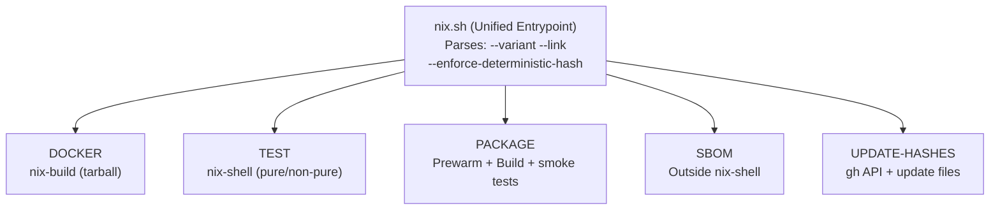

#### Docker Command Flow

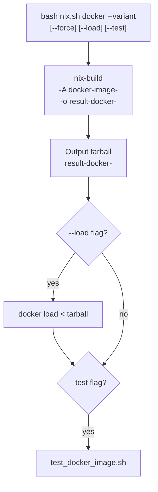

#### Test Command Dispatch Tree

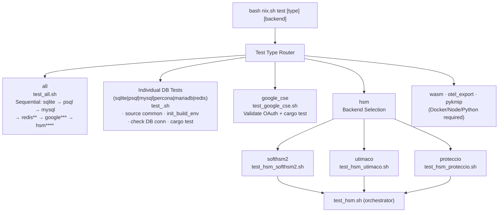

#### Package Command Workflow

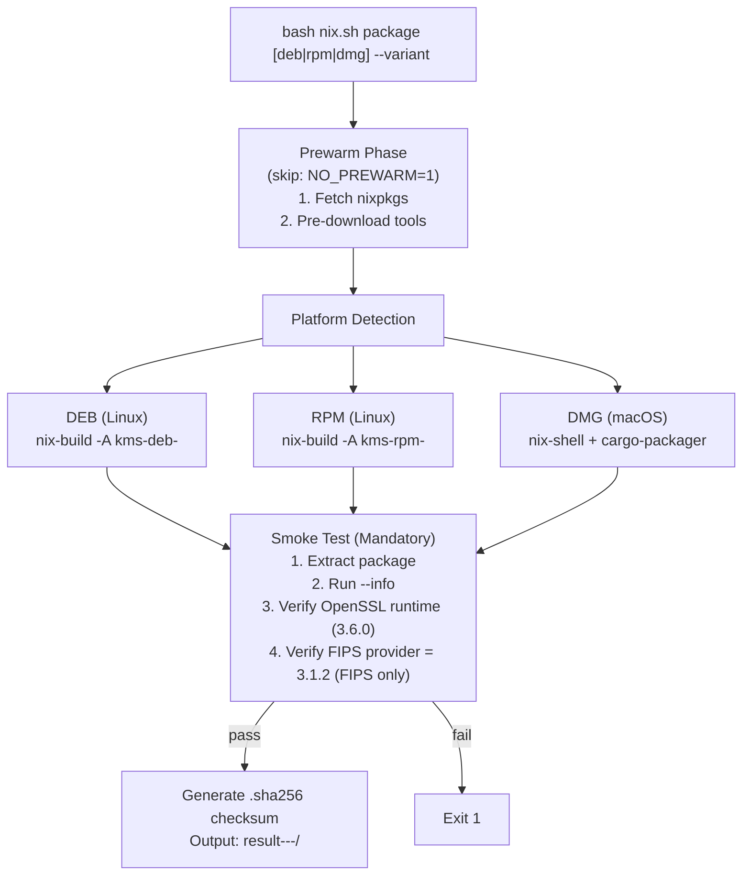

#### SBOM Generation Flow

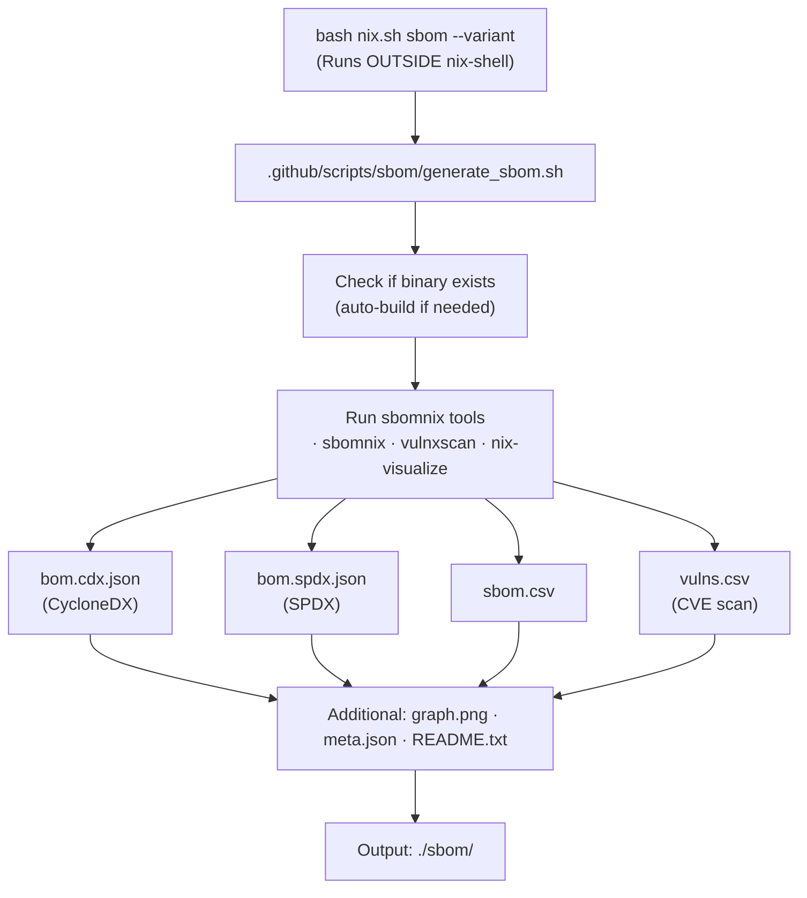

#### Update Hashes Workflow

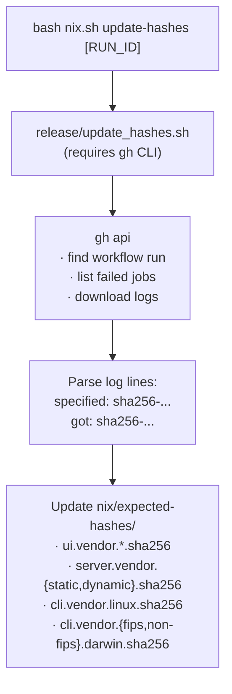

#### Nix Shell Environment Modes

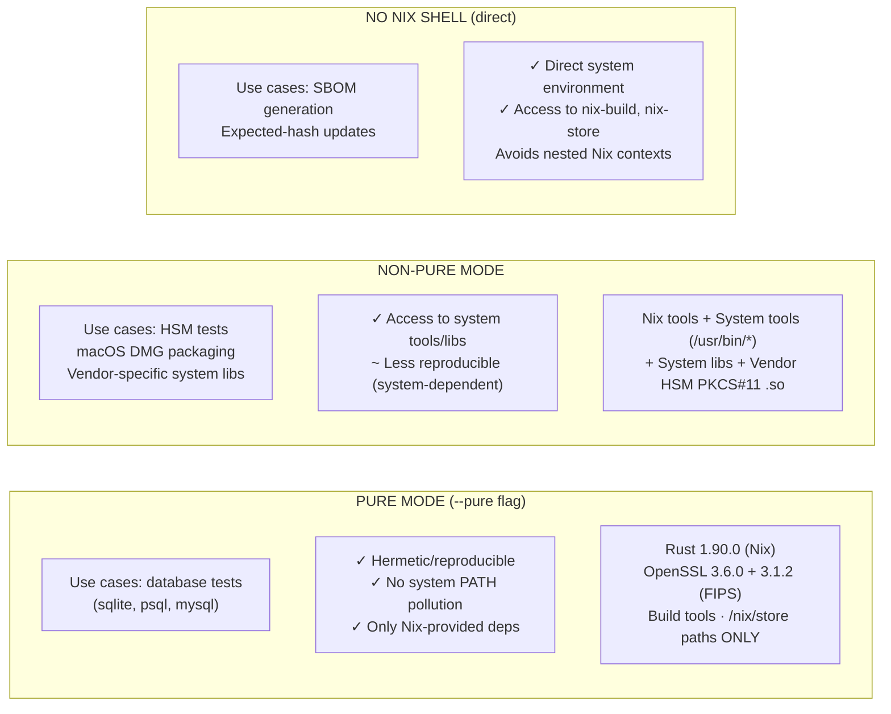

#### Complete Test Execution Matrix

| Test Type    | Profile | Variant    | Platform   | Dependencies            |
|--------------|:-------:|:----------:|:----------:|-------------------------|
| sqlite       | Any     | Any        | Any        | None (builtin)          |
| psql         | Any     | Any        | Any        | PostgreSQL server        |
| mysql        | Any     | Any        | Any        | MySQL server             |
| percona      | Any     | Any        | Any        | Percona server           |
| mariadb      | Any     | Any        | Any        | MariaDB server           |
| redis        | Any     | **non-FIPS** | Any      | Redis server             |
| google_cse   | Any     | Any        | Any        | 4 OAuth env vars         |
| pykmip       | Any     | **non-FIPS** | Any      | Python 3.11 + running KMS |
| otel_export  | Any     | Any        | Any        | Docker                  |
| wasm         | Any     | Any        | Any        | Node.js + wasm-pack     |
| hsm (all)    | Any     | Any        | **Linux**  | PKCS#11 vendor libs     |

#### Script Dependencies Graph

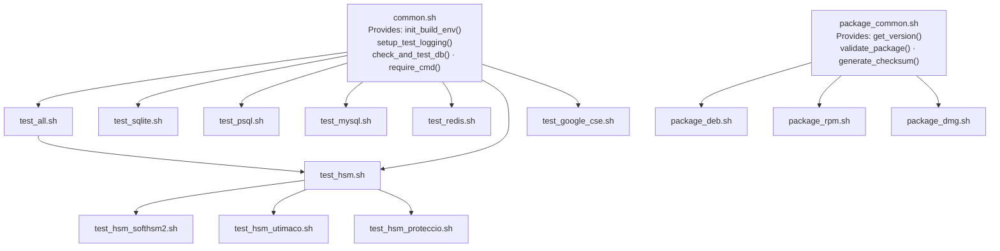

#### End-to-End Release Pipeline

This diagram shows the complete artifact generation pipeline for a production release:

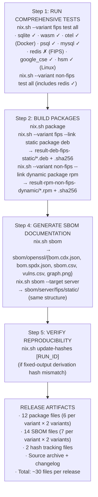

#### Artifact Flow Summary

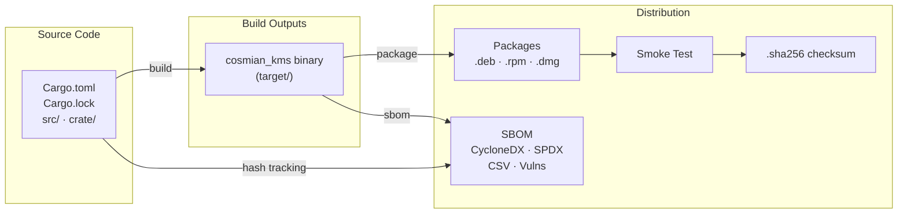

---

## Maintenance Guidelines

### Adding a New Test Type

1. **Create test script**: `.github/scripts/test_<name>.sh`
   - Source `common.sh` for shared helpers
   - Call `init_build_env "$@"` to parse variant/link
   - Use `require_cmd` to check dependencies
   - Run targeted `cargo test` commands

2. **Update dispatcher**: Add case to `nix.sh` test command handling

   ```bash
   <name>)
     SCRIPT="$REPO_ROOT/.github/scripts/test_<name>.sh"
     KEEP_VARS="..." # Add any required env vars
     ;;
   ```

3. **Update help text**: Add to `usage()` function in `nix.sh`

4. **Optional**: Add to `test_all.sh` if it should run in comprehensive test suite

### Updating Expected Hashes

**When to update:**

- After updating dependencies that affect fixed-output derivations (Cargo vendor, UI npm deps)
- After CI packaging failures due to `specified:`/`got:` hash mismatch errors
- After Nix derivation changes that alter vendoring inputs

**Process:**

```bash
# Automatic (recommended): update from CI logs (requires `gh auth login`)
bash .github/scripts/nix.sh update-hashes [RUN_ID]

# Optional: deterministic *binary* hash enforcement (if enabled) writes a
# cosmian-kms-server.*.sha256 file into the Nix output with copy instructions.
```

**Review checklist:**

- [ ] Understand why hash changed (code change, dep update, etc.)
- [ ] Verify `cosmian_kms --info` shows correct version
- [ ] Smoke test passes (OpenSSL 3.6.0 runtime; 3.1.2 provider for FIPS)
- [ ] No unexpected `/nix/store` paths in binary (Linux: `ldd`, `readelf -d`)
- [ ] Document reason in commit message

### Script Best Practices

- **Prefer `nix.sh` invocation**: Don't run test scripts directly; use `nix.sh test <type>` to ensure correct environment
- **Keep scripts side-effect minimal**: Rely on Nix for purity; avoid global state changes
- **Use `set -euo pipefail`**: Fail fast on errors; catch undefined variables
- **Source `common.sh`** for shared logic (don't duplicate)
- **Add usage functions**: Include `--help` text in all standalone scripts
- **Test in CI**: Ensure new scripts work in GitHub Actions (check `NO_PREWARM` behavior)

---

## Future Enhancements

### Proposed Improvements

| Enhancement                                     | Benefit                                  | Effort |
| ----------------------------------------------- | ---------------------------------------- | ------ |
| Structured JSON output (`nix.sh --json`)        | Easier CI parsing, dashboard integration | Medium |
| UI bundle checksums in Nix derivations          | Detect accidental web UI drift           | Low    |
| `shellcheck` + `shfmt` lint target              | Enforce consistent script style          | Low    |
| HSM slot/PIN via CLI flags (not env only)       | Clearer invocation, better security      | Medium |
| Parallel test execution (independent DB tests)  | Faster CI runs                           | High   |
| SBOM integration in packages (embed in DEB/RPM) | One-click supply chain transparency      | Medium |
| Cross-compilation support (ARM Linux from x86)  | Broader platform coverage                | High   |
| Nix flakes migration                            | Modern Nix UX, better reproducibility    | High   |

### Ongoing Maintenance

- **Keep nixpkgs pinned**: Avoid unexpected breakage; update deliberately with testing
- **Monitor OpenSSL**: Watch for 3.1.x security patches; update tarball + hashes
- **Rust toolchain updates**: Test clippy/fmt changes before updating `rust-toolchain.toml`
- **Documentation sync**: Update this README when adding commands/scripts

---

## Quick Reference

### Common Tasks

```bash
# Development
bash .github/scripts/nix.sh test sqlite                # Quick test iteration

# Build a package (this also builds the server)
bash .github/scripts/nix.sh package deb

# Release preparation
bash .github/scripts/nix.sh --variant fips test all
bash .github/scripts/nix.sh --variant non-fips test all
bash .github/scripts/nix.sh package                    # All packages
bash .github/scripts/nix.sh sbom                       # OpenSSL 3.1.2 derivation SBOM
bash .github/scripts/nix.sh sbom --target server       # Server SBOM (default fips/static)
bash .github/scripts/nix.sh --variant non-fips sbom --target server

# Hash maintenance
bash .github/scripts/nix.sh update-hashes                 # Update expected-hashes from latest CI logs
bash .github/scripts/nix.sh update-hashes 123456789       # Use a specific workflow run

# CI simulation
NO_PREWARM=1 bash .github/scripts/nix.sh package deb   # Skip prewarm (cached store)
```

### Environment Variables

**Build/Package:**

- `NO_PREWARM=1`: Skip nixpkgs pre-fetch (for cached/offline builds)
- `NIX_PATH`: Override nixpkgs location (set automatically by `nix.sh`)

**Tests:**

- `RUST_LOG=<level>`: Cargo test verbosity (debug, info, warn, error)
- `COSMIAN_KMS_CONF`: Path to KMS config file (default: `.github/scripts/pykmip/kms.toml`)
- Database connection vars (see test section above)
- Google CSE credential vars (see test section above)

---

**Generated**: 2025-01-23
**Last Updated**: Match with changes to `nix.sh` and related scripts
**Maintainer**: Cosmian KMS Team
