# KMS Test Scenarios — Architecture & Sequence Diagrams

> This document describes the component topology and runtime flow for every
> unique MISE test task under `.mise/tasks/test/`.  Directory aliases
> (`db/sqlite` → `sqlite`, `hsm/softhsm2` → `hsm-softhsm2`) are **not**
> duplicated; only the canonical (implementation) task is documented.

---

## Table of Contents

1. [Master Orchestrator](#1-master-orchestrator)
2. [Database Backends](#2-database-backends)
3. [HSM Backends](#3-hsm-backends)
4. [Cloud Provider Integrations](#4-cloud-provider-integrations)
5. [Secret Backends](#5-secret-backends)
6. [SPIRE / SPIFFE](#6-spire--spiffe)
7. [PKI & Revocation](#7-pki--revocation)
8. [Audit, SIEM, Monitoring & Observability](#8-audit-siem-monitoring--observability)
9. [Database TDE Integrations](#9-database-tde-integrations)
10. [Client & Protocol Integrations](#10-client--protocol-integrations)
11. [Kubernetes E2E Tests](#11-kubernetes-e2e-tests)
12. [Web UI & WASM](#12-web-ui--wasm)
13. [Docker, Helm & Packaging](#13-docker-helm--packaging)
14. [Miscellaneous](#14-miscellaneous)

---

## 1. Master Orchestrator

### `test:_default`

**Description:** Run every test group, auto-skipping any that lack required infra/credentials/tools.

#### Architecture Overview

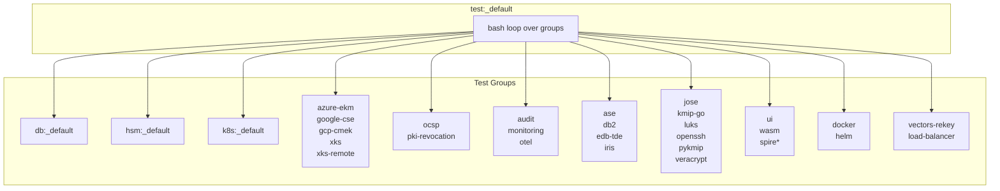
```mermaid
graph TB
    subgraph Orchestrator["test:_default"]
        run["bash loop over groups"]
    end

    subgraph Groups["Test Groups"]
        DB["db:_default"]
        HSM["hsm:_default"]
        K8S["k8s:_default"]
        Cloud["azure-ekm<br/>google-cse<br/>gcp-cmek<br/>xks<br/>xks-remote"]
        OCSP["ocsp<br/>pki-revocation"]
        Audit["audit<br/>monitoring<br/>otel"]
        TDE["ase<br/>db2<br/>edb-tde<br/>iris"]
        Client["jose<br/>kmip-go<br/>luks<br/>openssh<br/>pykmip<br/>veracrypt"]
        UI["ui<br/>wasm<br/>spire*"]
        Docker["docker<br/>helm"]
        Misc["vectors-rekey<br/>load-balancer"]
    end

    run --> DB
    run --> HSM
    run --> K8S
    run --> Cloud
    run --> OCSP
    run --> Audit
    run --> TDE
    run --> Client
    run --> UI
    run --> Docker
    run --> Misc
```

#### Sequence Diagram

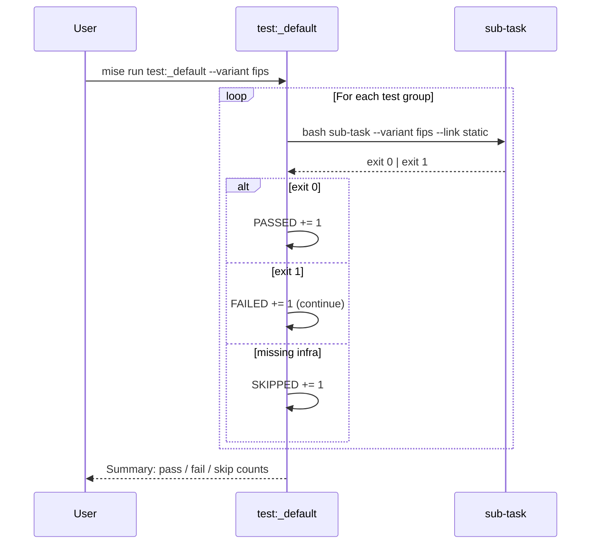
```mermaid
sequenceDiagram
    participant User as User
    participant Def as test:_default
    participant Sub as sub-task

    User->>Def: mise run test:_default --variant fips
    loop For each test group
        Def->>Sub: bash sub-task --variant fips --link static
        Sub-->>Def: exit 0 | exit 1
        alt exit 0
            Def->>Def: PASSED += 1
        else exit 1
            Def->>Def: FAILED += 1 (continue)
        else missing infra
            Def->>Def: SKIPPED += 1
        end
    end
    Def-->>User: Summary: pass / fail / skip counts
```

---

## 2. Database Backends

**Tasks:** `test:sqlite`, `test:psql`, `test:mysql`, `test:mariadb`, `test:percona`, `test:redis`
**Orchestrator:** `test:db:_default`

All DB tests follow the same pattern: enter Nix shell (FIPS OpenSSL 3.1.2) → run `cargo test` against the KMS server and database crates with the target backend configured via environment variables.

| Task | Backend | FIPS? | Notes |
|------|---------|-------|-------|
| `sqlite` | SQLite (file) | yes | Default. Also tests workspace binaries on CI. |
| `psql` | PostgreSQL | yes | Includes pg-failover test (docker compose stop pg1). |
| `mysql` | MySQL | yes | Disabled in CI. |
| `mariadb` | MariaDB | yes | — |
| `percona` | Percona XtraDB | yes | — |
| `redis` | Redis + Findex | **no** | Non-FIPS only. |

### Architecture Overview

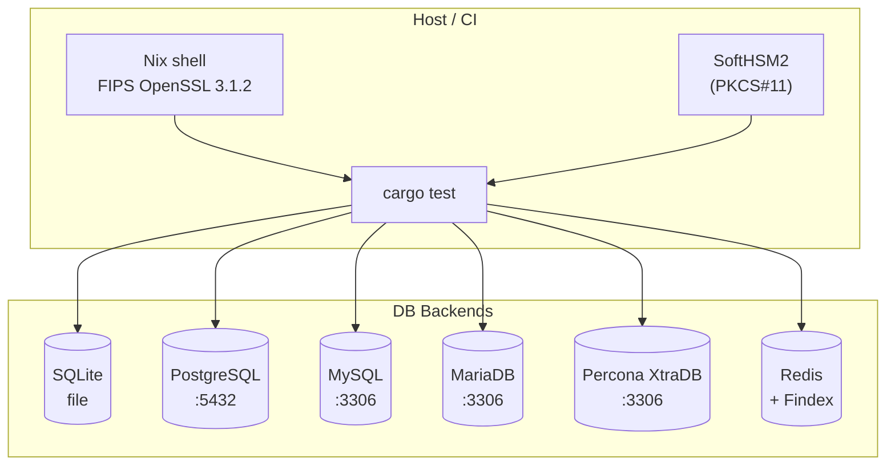
```mermaid
graph TB
    subgraph Host["Host / CI"]
        Nix["Nix shell<br/>FIPS OpenSSL 3.1.2"]
        Cargo["cargo test"]
        SoftHSM["SoftHSM2<br/>(PKCS#11)"]
    end

    subgraph Variants["DB Backends"]
        SQLite[("SQLite<br/>file")]
        PG[("PostgreSQL<br/>:5432")]
        MySQL[("MySQL<br/>:3306")]
        MariaDB[("MariaDB<br/>:3306")]
        Percona[("Percona XtraDB<br/>:3306")]
        Redis[("Redis<br/>+ Findex")]
    end

    Nix --> Cargo
    Cargo --> SQLite
    Cargo --> PG
    Cargo --> MySQL
    Cargo --> MariaDB
    Cargo --> Percona
    Cargo --> Redis
    SoftHSM --> Cargo
```

### Sequence Diagram (common pattern)

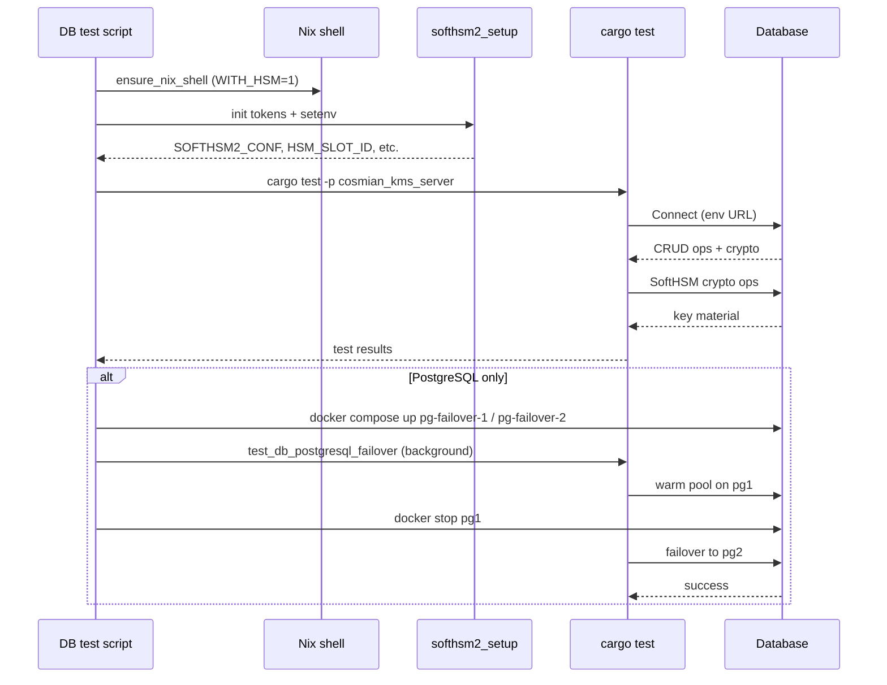
```mermaid
sequenceDiagram
    participant Script as DB test script
    participant Nix as Nix shell
    participant SoftHSM as softhsm2_setup
    participant Cargo as cargo test
    participant DB as Database

    Script->>Nix: ensure_nix_shell (WITH_HSM=1)
    Script->>SoftHSM: init tokens + setenv
    SoftHSM-->>Script: SOFTHSM2_CONF, HSM_SLOT_ID, etc.
    Script->>Cargo: cargo test -p cosmian_kms_server
    Cargo->>DB: Connect (env URL)
    DB-->>Cargo: CRUD ops + crypto
    Cargo->>DB: SoftHSM crypto ops
    DB-->>Cargo: key material
    Cargo-->>Script: test results
    alt PostgreSQL only
        Script->>DB: docker compose up pg-failover-1 / pg-failover-2
        Script->>Cargo: test_db_postgresql_failover (background)
        Cargo->>DB: warm pool on pg1
        Script->>DB: docker stop pg1
        Cargo->>DB: failover to pg2
        DB-->>Cargo: success
    end
```

---

## 3. HSM Backends

**Tasks:** `test:hsm-softhsm2`, `test:hsm-utimaco`, `test:hsm-proteccio`, `test:hsm-crypt2pay`
**Orchestrator:** `test:hsm:_default`
**Matrix:** `test:matrix` (cross-product HSM × DB × variant)

| Task | HSM Model | Platform | DB param |
|------|-----------|----------|----------|
| `hsm-softhsm2` | SoftHSM2 (software) | All | configurable |
| `hsm-utimaco` | Utimaco simulator | Linux only | passthrough |
| `hsm-proteccio` | Proteccio | Linux only | passthrough |
| `hsm-crypt2pay` | Crypt2Pay | Linux only | passthrough |

### Architecture Overview

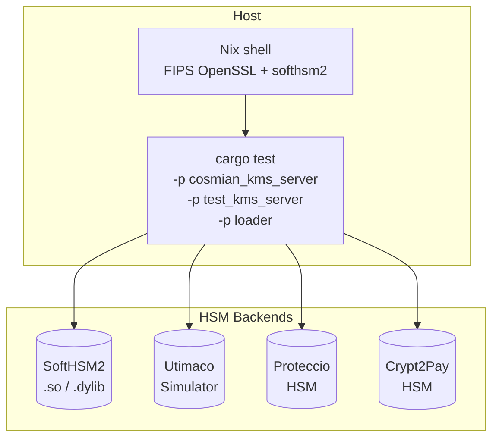
```mermaid
graph TB
    subgraph Host["Host"]
        Nix2["Nix shell<br/>FIPS OpenSSL + softhsm2"]
        Cargo2["cargo test<br/>-p cosmian_kms_server<br/>-p test_kms_server<br/>-p loader"]
    end

    subgraph HSMs["HSM Backends"]
        SHSM[("SoftHSM2<br/>.so / .dylib")]
        Utimaco[("Utimaco<br/>Simulator")]
        Proteccio[("Proteccio<br/>HSM")]
        Crypt2Pay[("Crypt2Pay<br/>HSM")]
    end

    Nix2 --> Cargo2
    Cargo2 --> SHSM
    Cargo2 --> Utimaco
    Cargo2 --> Proteccio
    Cargo2 --> Crypt2Pay
```

### Sequence Diagram (SoftHSM2 example; others analogous)

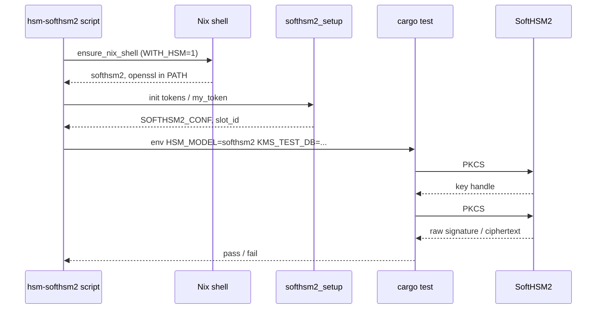
```mermaid
sequenceDiagram
    participant Script as hsm-softhsm2 script
    participant Nix as Nix shell
    participant Setup as softhsm2_setup
    participant Cargo as cargo test
    participant HSM as SoftHSM2

    Script->>Nix: ensure_nix_shell (WITH_HSM=1)
    Nix-->>Script: softhsm2, openssl in PATH
    Script->>Setup: init tokens / my_token
    Setup-->>Script: SOFTHSM2_CONF, slot_id
    Script->>Cargo: env HSM_MODEL=softhsm2 KMS_TEST_DB=...
    Cargo->>HSM: PKCS#11 create key
    HSM-->>Cargo: key handle
    Cargo->>HSM: PKCS#11 sign / encrypt
    HSM-->>Cargo: raw signature / ciphertext
    Cargo-->>Script: pass / fail
```

---

## 4. Cloud Provider Integrations

**Tasks:** `test:azure-ekm`, `test:google-cse`, `test:gcp-cmek`, `test:xks`, `test:xks-remote`

| Task | Cloud | FIPS? | Credential requirement |
|------|-------|-------|------------------------|
| `azure-ekm` | Azure EKM | no | Nix shell, Azure creds |
| `google-cse` | Google CSE | yes | OAuth client + service account key |
| `gcp-cmek` | GCP CMEK wrapping | yes | GCP project + IAM |
| `xks` | AWS XKS (local) | no | KMS build + SigV4 test script |
| `xks-remote` | AWS XKS (remote) | no | `WITH_XKS=1`, remote URL |

### Architecture Overview

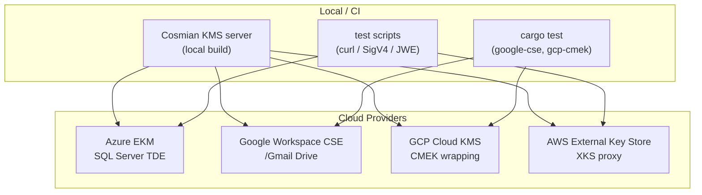
```mermaid
graph TB
    subgraph Local["Local / CI"]
        KMS["Cosmian KMS server<br/>(local build)"]
        TestScripts["test scripts<br/>(curl / SigV4 / JWE)"]
        CargoCloud["cargo test<br/>(google-cse, gcp-cmek)"]
    end

    subgraph Cloud["Cloud Providers"]
        Azure["Azure EKM<br/>SQL Server TDE"]
        GoogleCSE["Google Workspace CSE<br/>/Gmail Drive"]
        GCPCMEK["GCP Cloud KMS<br/>CMEK wrapping"]
        AWSXKS["AWS External Key Store<br/>XKS proxy"]
    end

    KMS --> Azure
    TestScripts --> Azure
    KMS --> GoogleCSE
    CargoCloud --> GoogleCSE
    KMS --> GCPCMEK
    CargoCloud --> GCPCMEK
    KMS --> AWSXKS
    TestScripts --> AWSXKS
```

### Sequence Diagram ( representative — `test:xks` )

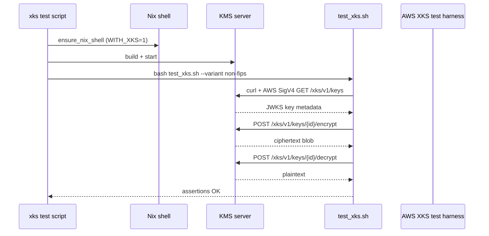
```mermaid
sequenceDiagram
    participant Script as xks test script
    participant Nix as Nix shell
    participant KMS as KMS server
    participant Test as test_xks.sh
    participant AWS as AWS XKS test harness

    Script->>Nix: ensure_nix_shell (WITH_XKS=1)
    Script->>KMS: build + start
    Script->>Test: bash test_xks.sh --variant non-fips
    Test->>KMS: curl + AWS SigV4 GET /xks/v1/keys
    KMS-->>Test: JWKS key metadata
    Test->>KMS: POST /xks/v1/keys/{id}/encrypt
    KMS-->>Test: ciphertext blob
    Test->>KMS: POST /xks/v1/keys/{id}/decrypt
    KMS-->>Test: plaintext
    Test-->>Script: assertions OK
```

---

## 5. Secret Backends

**Tasks:** `test:secret_aws`, `test:secret_azure`, `test:secret_cosmian_kms`, `test:secret_vault`

All four tasks delegate to the same underlying test harness; only the target backend changes.

### Architecture Overview

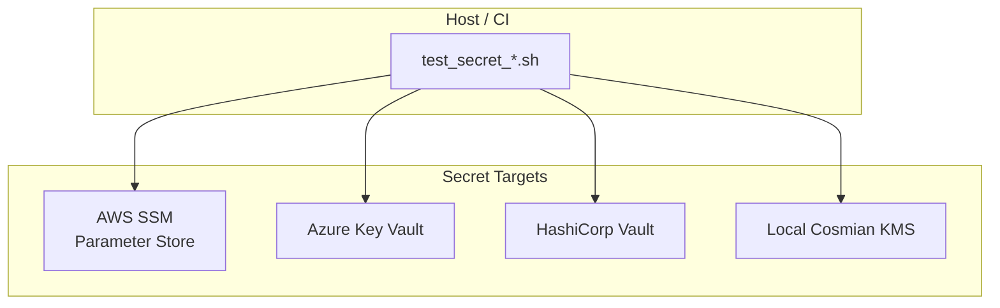
```mermaid
graph TB
    subgraph Host["Host / CI"]
        Scripts["test_secret_*.sh"]
    end

    subgraph Targets["Secret Targets"]
        AWS["AWS SSM<br/>Parameter Store"]
        AzureKV["Azure Key Vault"]
        Vault["HashiCorp Vault"]
        CKMS["Local Cosmian KMS"]
    end

    Scripts --> AWS
    Scripts --> AzureKV
    Scripts --> Vault
    Scripts --> CKMS
```

### Sequence Diagram

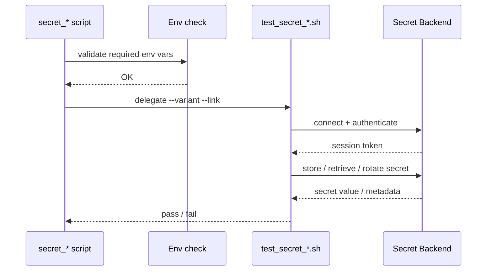
```mermaid
sequenceDiagram
    participant Script as secret_* script
    participant Env as Env check
    participant Test as test_secret_*.sh
    participant Backend as Secret Backend

    Script->>Env: validate required env vars
    Env-->>Script: OK
    Script->>Test: delegate --variant --link
    Test->>Backend: connect + authenticate
    Backend-->>Test: session token
    Test->>Backend: store / retrieve / rotate secret
    Backend-->>Test: secret value / metadata
    Test-->>Script: pass / fail
```

---

## 6. SPIRE / SPIFFE

### `test:spire`

**Description:** SPIRE + Mistral client full integration (non-FIPS only). Multi-tenant topology with two independent SPIRE deployments against the same KMS.

#### Architecture Overview

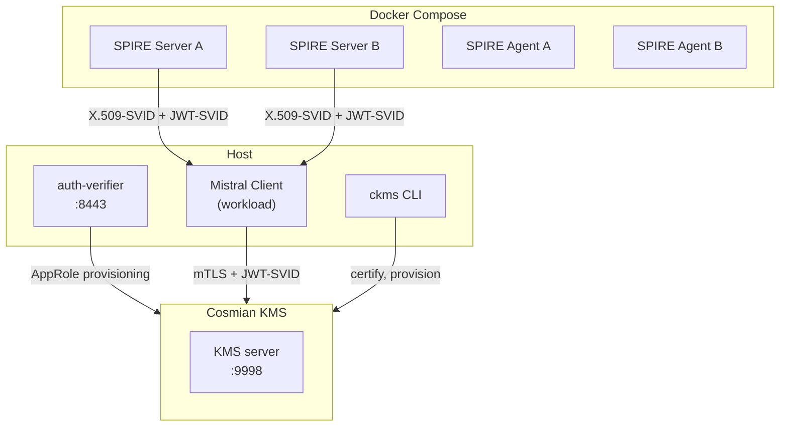
```mermaid
graph TB
    subgraph Host["Host"]
        AuthVrf["auth-verifier<br/>:8443"]
        CKMS["ckms CLI"]
        Mistral["Mistral Client<br/>(workload)"]
    end

    subgraph Docker["Docker Compose"]
        SSA["SPIRE Server A"]
        SBA["SPIRE Server B"]
        SAA["SPIRE Agent A"]
        SAB["SPIRE Agent B"]
    end

    subgraph KMS3["Cosmian KMS"]
        KMS_S["KMS server<br/>:9998"]
    end

    AuthVrf --> |AppRole provisioning| KMS3
    SSA --> |X.509-SVID + JWT-SVID| Mistral
    SBA --> |X.509-SVID + JWT-SVID| Mistral
    Mistral --> |mTLS + JWT-SVID| KMS3
    CKMS --> |certify, provision| KMS3
```

#### Sequence Diagram

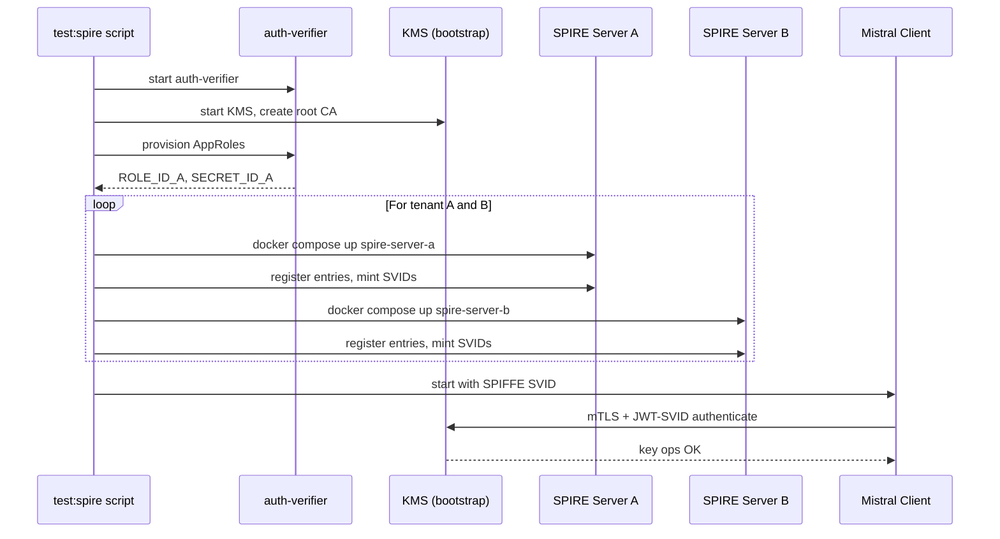
```mermaid
sequenceDiagram
    participant Test as test:spire script
    participant Auth as auth-verifier
    participant KMS as KMS (bootstrap)
    participant SSA as SPIRE Server A
    participant SBA as SPIRE Server B
    participant Mistral as Mistral Client

    Test->>Auth: start auth-verifier
    Test->>KMS: start KMS, create root CA
    Test->>Auth: provision AppRoles
    Auth-->>Test: ROLE_ID_A, SECRET_ID_A
    loop For tenant A and B
        Test->>SSA: docker compose up spire-server-a
        Test->>SSA: register entries, mint SVIDs
        Test->>SBA: docker compose up spire-server-b
        Test->>SBA: register entries, mint SVIDs
    end
    Test->>Mistral: start with SPIFFE SVID
    Mistral->>KMS: mTLS + JWT-SVID authenticate
    KMS-->>Mistral: key ops OK
```

---

### `test:spire-jwt-svid`

**Description:** SPIFFE JWT-SVID end-to-end authentication via SPIRE + ckms CLI.

#### Architecture Overview

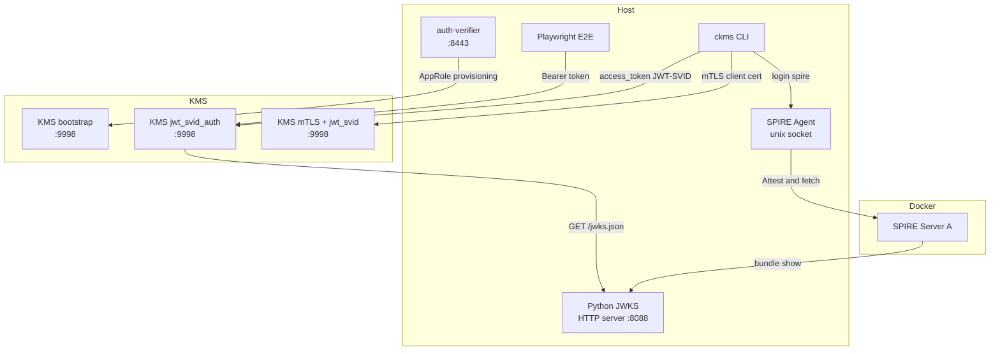
```mermaid
graph TB
    subgraph Host["Host"]
        CKMS2["ckms CLI"]
        Playwright["Playwright E2E"]
        JWKS["Python JWKS<br/>HTTP server :8088"]
        Agent["SPIRE Agent<br/>unix socket"]
        AuthVrf2["auth-verifier<br/>:8443"]
    end

    subgraph Docker2["Docker"]
        SPIRE_Srv["SPIRE Server A"]
    end

    subgraph KMS_Host["KMS"]
        K0["KMS bootstrap<br/>:9998"]
        K1["KMS jwt_svid_auth<br/>:9998"]
        K2["KMS mTLS + jwt_svid<br/>:9998"]
    end

    AuthVrf2 --> |AppRole provisioning| K0
    SPIRE_Srv --> |bundle show| JWKS
    K1 --> |GET /jwks.json| JWKS
    CKMS2 --> |access_token JWT-SVID| K1
    CKMS2 --> |login spire| Agent
    Agent --> |Attest and fetch| SPIRE_Srv
    Playwright --> |Bearer token| K1
    CKMS2 --> |mTLS client cert| K2
```

#### Sequence Diagram

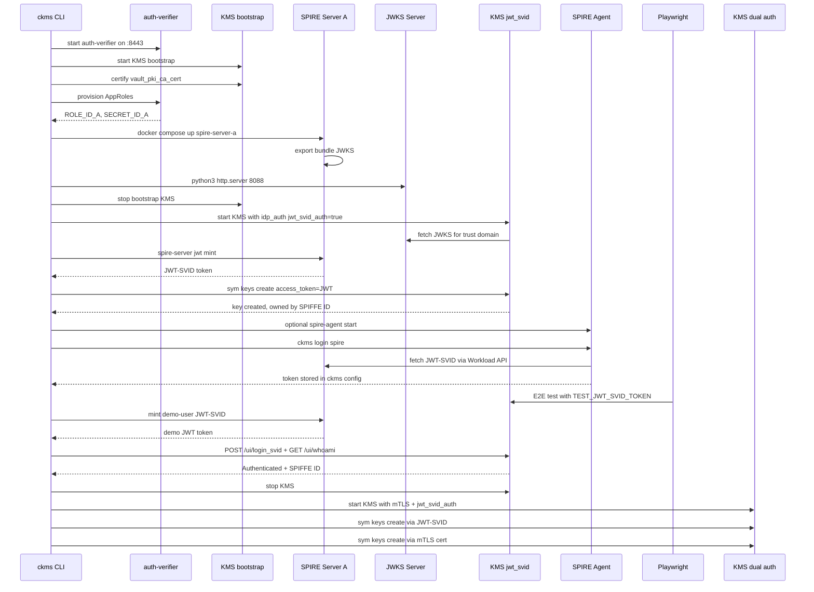
```mermaid
sequenceDiagram
    participant CKMS as ckms CLI
    participant Auth as auth-verifier
    participant K0 as KMS bootstrap
    participant SP as SPIRE Server A
    participant JWKS as JWKS Server
    participant K1 as KMS jwt_svid
    participant Agent as SPIRE Agent
    participant PW as Playwright
    participant K2 as KMS dual auth

    CKMS->>Auth: start auth-verifier on :8443
    CKMS->>K0: start KMS bootstrap
    CKMS->>K0: certify vault_pki_ca_cert
    CKMS->>Auth: provision AppRoles
    Auth-->>CKMS: ROLE_ID_A, SECRET_ID_A
    CKMS->>SP: docker compose up spire-server-a
    SP->>SP: export bundle JWKS
    CKMS->>JWKS: python3 http.server 8088
    CKMS->>K0: stop bootstrap KMS
    CKMS->>K1: start KMS with idp_auth jwt_svid_auth=true
    K1->>JWKS: fetch JWKS for trust domain
    CKMS->>SP: spire-server jwt mint
    SP-->>CKMS: JWT-SVID token
    CKMS->>K1: sym keys create access_token=JWT
    K1-->>CKMS: key created, owned by SPIFFE ID
    CKMS->>Agent: optional spire-agent start
    CKMS->>Agent: ckms login spire
    Agent->>SP: fetch JWT-SVID via Workload API
    Agent-->>CKMS: token stored in ckms config
    PW->>K1: E2E test with TEST_JWT_SVID_TOKEN
    CKMS->>SP: mint demo-user JWT-SVID
    SP-->>CKMS: demo JWT token
    CKMS->>K1: POST /ui/login_svid + GET /ui/whoami
    K1-->>CKMS: Authenticated + SPIFFE ID
    CKMS->>K1: stop KMS
    CKMS->>K2: start KMS with mTLS + jwt_svid_auth
    CKMS->>K2: sym keys create via JWT-SVID
    CKMS->>K2: sym keys create via mTLS cert
```

---

### `test:spire-kmip-key-manager`

**Description:** SPIRE kmip KeyManager plugin — binary KMIP 2.1 TCP/TLS.

#### Architecture Overview

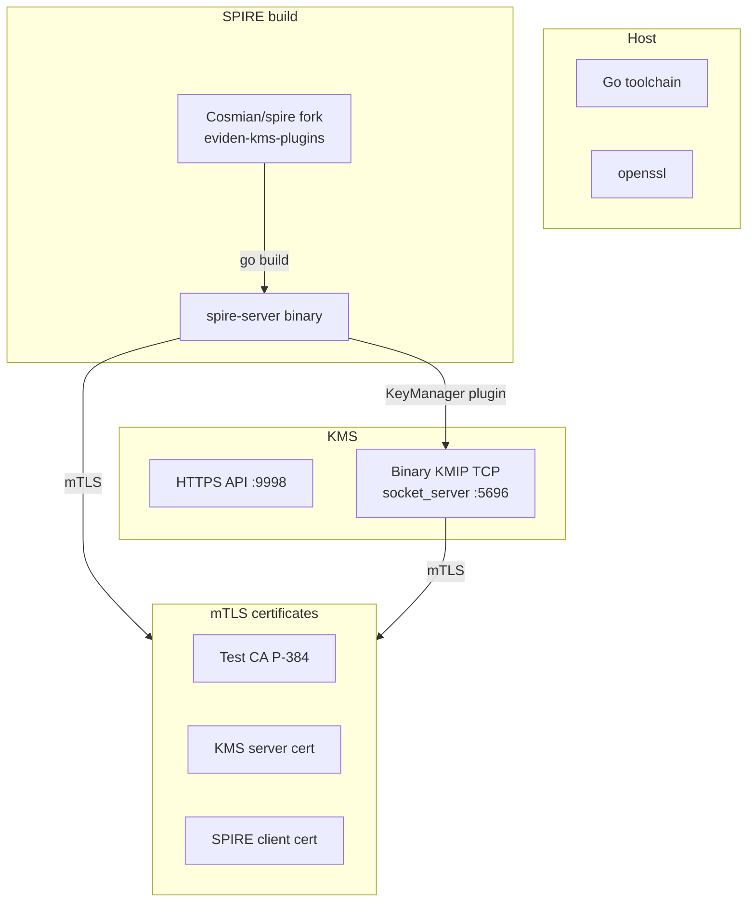
```mermaid
graph TB
    subgraph Host3["Host"]
        Go3["Go toolchain"]
        OpenSSL3["openssl"]
    end

    subgraph SPIRE_Build3["SPIRE build"]
        SPIRE_Fork3["Cosmian/spire fork<br/>eviden-kms-plugins"]
        SPIRE_Bin3["spire-server binary"]
    end

    subgraph KMS4["KMS"]
        HTTPS3["HTTPS API :9998"]
        KMIP_Socket["Binary KMIP TCP<br/>socket_server :5696"]
    end

    subgraph Certs3["mTLS certificates"]
        CA3["Test CA P-384"]
        KMS_Cert3["KMS server cert"]
        SP_Cert3["SPIRE client cert"]
    end

    SPIRE_Fork3 --> |go build| SPIRE_Bin3
    SPIRE_Bin3 --> |KeyManager plugin| KMIP_Socket
    SPIRE_Bin3 --> |mTLS| Certs3
    KMIP_Socket --> |mTLS| Certs3
```

#### Sequence Diagram

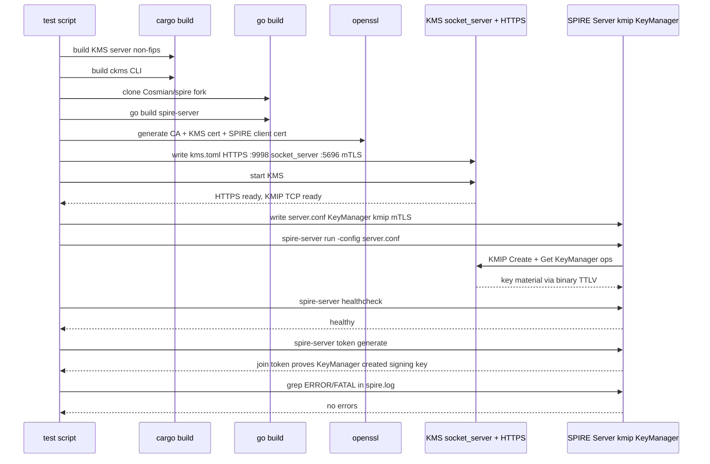
```mermaid
sequenceDiagram
    participant Test as test script
    participant Cargo as cargo build
    participant Go as go build
    participant OpenSSL as openssl
    participant KMS as KMS socket_server + HTTPS
    participant SP as SPIRE Server kmip KeyManager

    Test->>Cargo: build KMS server non-fips
    Test->>Cargo: build ckms CLI
    Test->>Go: clone Cosmian/spire fork
    Test->>Go: go build spire-server
    Test->>OpenSSL: generate CA + KMS cert + SPIRE client cert
    Test->>KMS: write kms.toml HTTPS :9998 socket_server :5696 mTLS
    Test->>KMS: start KMS
    KMS-->>Test: HTTPS ready, KMIP TCP ready
    Test->>SP: write server.conf KeyManager kmip mTLS
    Test->>SP: spire-server run -config server.conf
    SP->>KMS: KMIP Create + Get KeyManager ops
    KMS-->>SP: key material via binary TTLV
    Test->>SP: spire-server healthcheck
    SP-->>Test: healthy
    Test->>SP: spire-server token generate
    SP-->>Test: join token proves KeyManager created signing key
    Test->>SP: grep ERROR/FATAL in spire.log
    SP-->>Test: no errors
```

---

### `test:spire-kmip-upstream-authority`

**Description:** SPIRE kmip UpstreamAuthority plugin — KMS-backed CA signing.

#### Architecture Overview

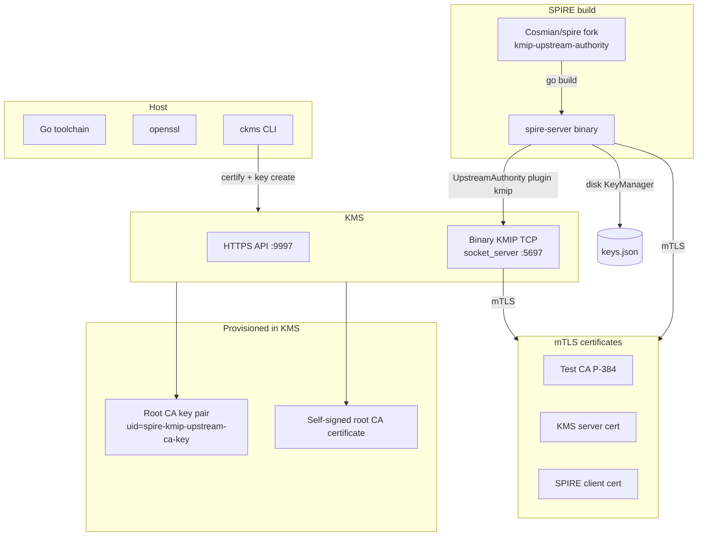
```mermaid
graph TB
    subgraph Host4["Host"]
        Go4["Go toolchain"]
        OpenSSL4["openssl"]
        CKMS3["ckms CLI"]
    end

    subgraph SPIRE_Build4["SPIRE build"]
        SPIRE_Fork4["Cosmian/spire fork<br/>kmip-upstream-authority"]
        SPIRE_Bin4["spire-server binary"]
    end

    subgraph KMS5["KMS"]
        HTTPS4["HTTPS API :9997"]
        KMIP_Socket2["Binary KMIP TCP<br/>socket_server :5697"]
    end

    subgraph Certs4["mTLS certificates"]
        CA4["Test CA P-384"]
        KMS_Cert4["KMS server cert"]
        SP_Cert4["SPIRE client cert"]
    end

    subgraph Provisioned2["Provisioned in KMS"]
        RootKey2["Root CA key pair<br/>uid=spire-kmip-upstream-ca-key"]
        RootCert2["Self-signed root CA certificate"]
    end

    SPIRE_Fork4 --> |go build| SPIRE_Bin4
    CKMS3 --> |certify + key create| KMS5
    KMS5 --> RootKey2
    KMS5 --> RootCert2
    SPIRE_Bin4 --> |UpstreamAuthority plugin kmip| KMIP_Socket2
    SPIRE_Bin4 --> |disk KeyManager| Disk2[(keys.json)]
    SPIRE_Bin4 --> |mTLS| Certs4
    KMIP_Socket2 --> |mTLS| Certs4
```

#### Sequence Diagram

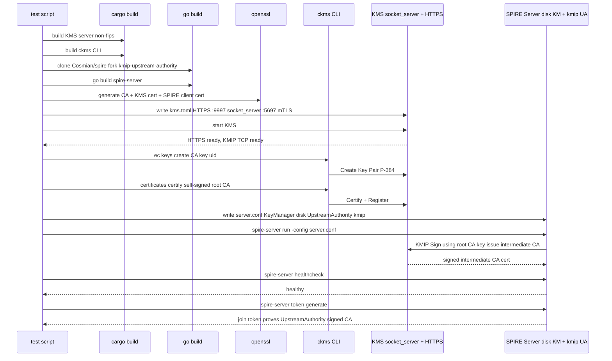
```mermaid
sequenceDiagram
    participant Test as test script
    participant Cargo as cargo build
    participant Go as go build
    participant OpenSSL as openssl
    participant CKMS as ckms CLI
    participant KMS as KMS socket_server + HTTPS
    participant SP as SPIRE Server disk KM + kmip UA

    Test->>Cargo: build KMS server non-fips
    Test->>Cargo: build ckms CLI
    Test->>Go: clone Cosmian/spire fork kmip-upstream-authority
    Test->>Go: go build spire-server
    Test->>OpenSSL: generate CA + KMS cert + SPIRE client cert
    Test->>KMS: write kms.toml HTTPS :9997 socket_server :5697 mTLS
    Test->>KMS: start KMS
    KMS-->>Test: HTTPS ready, KMIP TCP ready
    Test->>CKMS: ec keys create CA key uid
    CKMS->>KMS: Create Key Pair P-384
    Test->>CKMS: certificates certify self-signed root CA
    CKMS->>KMS: Certify + Register
    Test->>SP: write server.conf KeyManager disk UpstreamAuthority kmip
    Test->>SP: spire-server run -config server.conf
    SP->>KMS: KMIP Sign using root CA key issue intermediate CA
    KMS-->>SP: signed intermediate CA cert
    Test->>SP: spire-server healthcheck
    SP-->>Test: healthy
    Test->>SP: spire-server token generate
    SP-->>Test: join token proves UpstreamAuthority signed CA
```

---

### `test:spire-kmip`

**Description:** Orchestrator that runs both KeyManager and UpstreamAuthority suites sequentially.

#### Architecture Overview

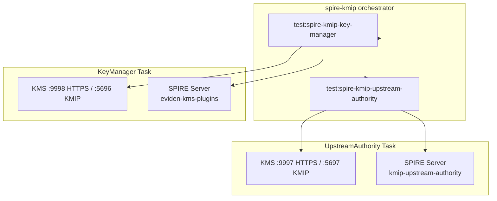
```mermaid
graph TB
    subgraph Orchestrator2["spire-kmip orchestrator"]
        Task1["test:spire-kmip-key-manager"]
        Task2["test:spire-kmip-upstream-authority"]
    end

    subgraph KM_Task["KeyManager Task"]
        KM_KMS["KMS :9998 HTTPS / :5696 KMIP"]
        KM_SP["SPIRE Server<br/>eviden-kms-plugins"]
    end

    subgraph UA_Task["UpstreamAuthority Task"]
        UA_KMS["KMS :9997 HTTPS / :5697 KMIP"]
        UA_SP["SPIRE Server<br/>kmip-upstream-authority"]
    end

    Orchestrator2 --> Task1
    Orchestrator2 --> Task2
    Task1 --> KM_KMS
    Task1 --> KM_SP
    Task2 --> UA_KMS
    Task2 --> UA_SP
```

#### Sequence Diagram

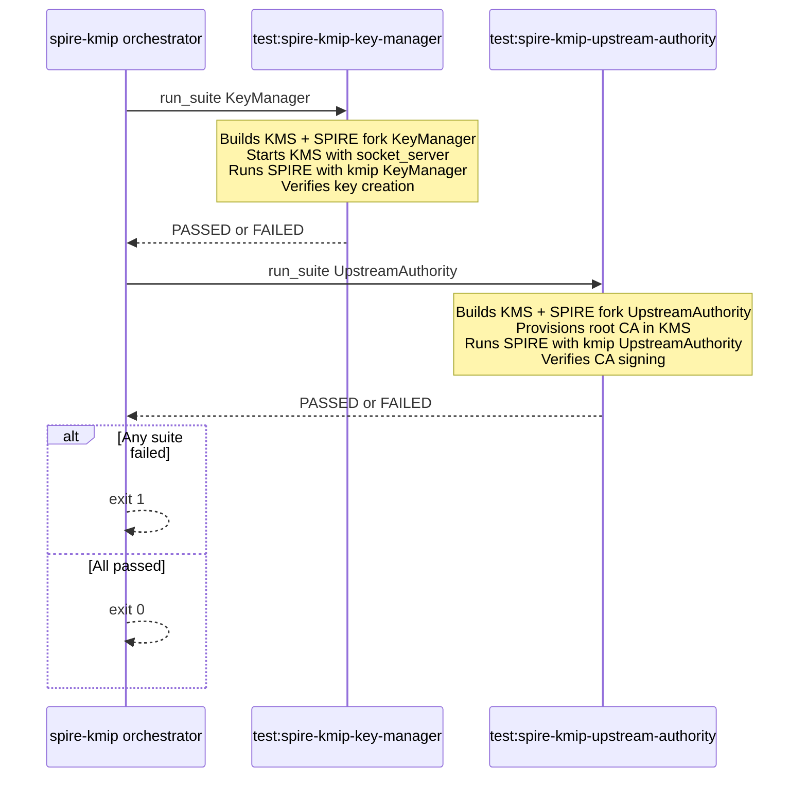
```mermaid
sequenceDiagram
    participant Orch as spire-kmip orchestrator
    participant KM as test:spire-kmip-key-manager
    participant UA as test:spire-kmip-upstream-authority

    Orch->>KM: run_suite KeyManager
    Note over KM: Builds KMS + SPIRE fork KeyManager<br/>Starts KMS with socket_server<br/>Runs SPIRE with kmip KeyManager<br/>Verifies key creation
    KM-->>Orch: PASSED or FAILED
    Orch->>UA: run_suite UpstreamAuthority
    Note over UA: Builds KMS + SPIRE fork UpstreamAuthority<br/>Provisions root CA in KMS<br/>Runs SPIRE with kmip UpstreamAuthority<br/>Verifies CA signing
    UA-->>Orch: PASSED or FAILED
    alt Any suite failed
        Orch-->>Orch: exit 1
    else All passed
        Orch-->>Orch: exit 0
    end
```

---

### `test:spire-pki`

**Description:** KMS PKI capability validation — M-01 through M-08 from Aembit Capability Validation Test Plan.

#### Architecture Overview

```mermaid
graph TB
    subgraph Host5["Host"]
        CKMS4["ckms CLI"]
        AuthVrf3["auth-verifier<br/>:8443"]
        TestScript["test_pki.sh"]
    end

    subgraph KMS6["KMS :9998"]
        API["HTTPS API"]
        SQLite2[(SQLite DB)]
    end

    AuthVrf3 --> |AppRole provisioning| KMS6
    CKMS4 --> |certify, keys create| KMS6
    TestScript --> CKMS4
    TestScript --> AuthVrf3
```

#### Sequence Diagram

```mermaid
sequenceDiagram
    participant Test as test script
    participant Cargo as cargo build
    participant Auth as auth-verifier
    participant KMS as KMS :9998
    participant CKMS as ckms CLI
    participant TestPKI as test_pki.sh

    Test->>Cargo: build KMS server non-fips
    Test->>Cargo: build auth-verifier
    Test->>Cargo: build ckms CLI
    Test->>Auth: start auth-verifier :8443
    Test->>KMS: start KMS :9998
    Test->>CKMS: certificates certify vault_pki_ca_cert
    CKMS->>KMS: create root CA key + cert
    Test->>Auth: provision AppRoles
    Auth-->>Test: ROLE_ID_A, SECRET_ID_A
    Test->>TestPKI: run test_pki.sh
    Note over TestPKI: M-01 / PKI-06 Self-signed cert prohibition<br/>M-02 / PKI-11 TLS version enforcement<br/>M-03 / PKI-12 Algorithm policy change<br/>M-04 / PKI-04 Zero-downtime CA rotation<br/>M-05 / PKI-17 Trust re-establishment<br/>M-06 / OBS-05 PKI signing latency less-than 500ms<br/>M-07 / INFO-2 DPoP signing key lifecycle<br/>M-08 / RES-08 Legacy + SPIFFE coexistence<br/>M-09 / PKI-03 Client/server certificate parity<br/>M-10 / WI-05 Revocation propagation
    TestPKI-->>Test: all scenarios passed
```

---

### `test:spire-sds`

**Description:** PKI-10 Service mesh SDS delivery — Envoy + SPIRE + Cosmian KMS.

#### Architecture Overview

```mermaid
graph TB
    subgraph DockerCompose["Docker Compose profile: spire"]
        SP_Srv2["SPIRE Server A"]
        SP_Agt2["SPIRE Agent A<br/>unix socket + SDS"]
        Envoy_U2["Envoy upstream<br/>mTLS server"]
        Envoy_D2["Envoy downstream<br/>mTLS client"]
    end

    subgraph Host6["Host"]
        AuthVrf4["auth-verifier<br/>:8443"]
        CKMS5["ckms CLI"]
        TestSDS2["test_sds.sh"]
    end

    subgraph KMS7["KMS :9998"]
        API2["HTTPS API"]
    end

    KMS7 --> |signs intermediate CA| SP_Srv2
    SP_Srv2 --> |issues X.509-SVIDs| SP_Agt2
    SP_Agt2 --> |SDS delivery| Envoy_U2
    SP_Agt2 --> |SDS delivery| Envoy_D2
    Envoy_D2 --> |mTLS| Envoy_U2
    AuthVrf4 --> |AppRole provisioning| KMS7
    CKMS5 --> |certify, provision| KMS7
    TestSDS2 --> |orchestrates| DockerCompose
```

#### Sequence Diagram

```mermaid
sequenceDiagram
    participant Test as test script
    participant Cargo as cargo build
    participant Auth as auth-verifier
    participant KMS as KMS :9998
    participant CKMS as ckms CLI
    participant SP_Srv as SPIRE Server A
    participant SP_Agt as SPIRE Agent A
    participant Envoy_U as Envoy upstream
    participant Envoy_D as Envoy downstream
    participant TestSDS as test_sds.sh

    Test->>Cargo: build KMS server, auth-verifier, ckms
    Test->>Auth: start auth-verifier :8443
    Test->>KMS: start KMS :9998
    Test->>CKMS: certificates certify vault_pki_ca_cert
    CKMS->>KMS: create root CA key + cert
    Test->>Auth: provision AppRoles
    Auth-->>Test: ROLE_ID_A, SECRET_ID_A
    Test->>SP_Srv: docker compose up spire-server-a Vault AppRole
    SP_Srv->>SP_Srv: ready http://localhost:8080/ready
    Test->>SP_Srv: spire-server token generate
    SP_Srv-->>Test: join token
    Test->>SP_Agt: docker compose up spire-agent-a join_token
    SP_Agt->>SP_Srv: Node attestation + SVID fetch
    SP_Agt-->>Test: ready http://localhost:8082/ready
    Test->>TestSDS: run test_sds.sh
    TestSDS->>SP_Srv: register workload entries
    TestSDS->>Envoy_U: start Envoy SDS upstream
    TestSDS->>Envoy_D: start Envoy SDS downstream
    Envoy_U->>SP_Agt: fetch tls_certificate via SDS
    Envoy_D->>SP_Agt: fetch tls_certificate via SDS
    SP_Agt-->>Envoy_U: X.509-SVID cert + key
    SP_Agt-->>Envoy_D: X.509-SVID cert + key
    Envoy_D->>Envoy_U: mTLS handshake with SDS-provided certs
    Envoy_U-->>Envoy_D: connection established
    TestSDS-->>Test: PKI-10 SDS delivery passed
```

---

## 7. PKI & Revocation

**Tasks:** `test:ocsp`, `test:pki-revocation`

### `test:ocsp`

**Description:** OCSP responder (RFC 6960) black-box test suite using `openssl ocsp` and `curl`. Tests GET/POST, nonce, caching, delegated signing, and root-compromise cascade.

#### Architecture Overview

```mermaid
graph TB
    subgraph Host7["Host"]
        OpenSSL5["openssl ocsp client"]
        Curl["curl"]
        CKMS6["ckms CLI"]
    end

    subgraph KMS8["Fresh KMS per scenario"]
        OCSP["OCSP responder<br/>GET /ocsp/{b64url}<br/>POST /ocsp/"]
        Store[("SQLite<br/>CA + leaf certs")]
    end

    CKMS6 --> |certify, revoke, export| Store
    OpenSSL5 --> |DER req| OCSP
    Curl --> |b64url DER| OCSP
    OCSP --> Store
```

#### Sequence Diagram

```mermaid
sequenceDiagram
    participant Test as ocsp test script
    participant KMS as Fresh KMS
    participant CKMS as ckms
    participant OpenSSL as openssl ocsp
    participant Curl as curl

    Test->>Test: Build KMS + ckms
    loop Each scenario
        Test->>KMS: start with ocsp_enabled=true + policy
        Test->>CKMS: issue_ca, issue_leaf, issue_delegate
        CKMS->>KMS: store certs
        Test->>OpenSSL: ocsp -issuer ca -cert leaf -url KMS/ocsp/
        OpenSSL->>KMS: POST DER OCSPRequest
        KMS-->>OpenSSL: OCSPResponse good/revoked/unknown
        Test->>Curl: GET /ocsp/{b64url}
        Curl->>KMS: base64url DER request
        KMS-->>Curl: HTTP 200 + Cache-Control + ETag
    end
    Test->>KMS: stop
```

---

### `test:pki-revocation`

**Description:** PKI revocation black-box test — CDP/CRL, AIA/OCSP, CA-compromise cascade.

#### Architecture Overview

```mermaid
graph TB
    subgraph Host8["Host"]
        OpenSSL6["openssl verify<br/>openssl ocsp"]
        CKMS7["ckms CLI"]
    end

    subgraph KMS9["Fresh KMS"]
        OCSP2["OCSP responder"]
        CRL["CRL endpoint<br/>auto-generated"]
        Store2[("SQLite<br/>cert chain")]
    end

    CKMS7 --> |certify, revoke, validate| Store2
    OpenSSL6 --> |verify -crl_check| CRL
    OpenSSL6 --> |ocsp| OCSP2
```

#### Sequence Diagram

```mermaid
sequenceDiagram
    participant Test as pki-revocation script
    participant KMS as Fresh KMS
    participant CKMS as ckms
    participant OpenSSL as openssl verify / ocsp

    Test->>KMS: start with ocsp_enabled=true kms_public_url set
    Test->>CKMS: issue_ca root, issue_ca intermediate, issue_leaf
    CKMS->>KMS: store chain
    Test->>OpenSSL: verify -crl_check leaf
    OpenSSL->>KMS: fetch CRL from CDP
    KMS-->>OpenSSL: CRL includes revoked certs
    Test->>CKMS: revoke intermediate keyCompromise
    Test->>OpenSSL: verify -crl_check leaf
    OpenSSL-->>Test: invalid / revoked
    Test->>CKMS: validate leaf
    CKMS->>KMS: internal cascade check
    KMS-->>CKMS: Invalid compromised root ancestor
```

---

## 8. Audit, SIEM, Monitoring & Observability

**Tasks:** `test:audit`, `test:audit-compat-generate-fixture`, `test:audit-compat-opensearch`, `test:audit-compat-splunk`, `test:cef-format`, `test:cef-syslog`, `test:cef-tcp-syslog`, `test:siem-fluent-bit`, `test:siem-filebeat`, `test:siem-cef-syslog`, `test:siem-cef-tcp-syslog`, `test:monitoring`, `test:otel`

**Orchestrators:** `test:cef` (format + UDP + TCP), `test:siem` (fluent-bit + filebeat)

### `test:audit`

**Description:** Tamper-evident JSONL audit log + HTTP audit middleware capture. Optionally runs OpenSearch and Splunk compatibility sub-tasks.

#### Architecture Overview

```mermaid
graph TB
    subgraph Host9["Host"]
        KMS10["KMS server<br/>audit middleware"]
        TestAudit["test_audit_log.sh"]
    end

    subgraph Outputs["Audit Outputs"]
        JSONL["/tmp/kms-audit-*.jsonl<br/>hash chain"]
    end

    subgraph SIEMs["SIEM Backends"]
        OpenSearch["OpenSearch<br/>ephemeral Docker"]
        Splunk["Splunk<br/>ephemeral Docker"]
    end

    TestAudit --> KMS10
    KMS10 --> JSONL
    TestAudit --> JSONL
    TestAudit --> |optional| OpenSearch
    TestAudit --> |optional| Splunk
```

#### Sequence Diagram

```mermaid
sequenceDiagram
    participant Test as audit test script
    participant KMS as KMS with audit middleware
    participant JSONL as JSONL log file
    participant OpenSearch as OpenSearch Docker
    participant Splunk as Splunk Docker

    Test->>KMS: start KMS with audit logging
    Test->>KMS: perform KMIP operations
    KMS->>JSONL: append tamper-evident JSONL line
    KMS->>JSONL: hash chain link
    JSONL-->>Test: file exists, hash verified
    Test->>OpenSearch: docker run opensearch
    Test->>OpenSearch: ingest JSONL via Python
    OpenSearch-->>Test: all fields indexed correctly
    alt SPLUNK_PASSWORD set
        Test->>Splunk: docker run splunk
        Test->>Splunk: HEC ingest JSONL
        Splunk-->>Test: sourcetype _json OK
    end
```

---

### `test:audit-compat-opensearch` / `test:audit-compat-splunk`

These take a pre-generated KMS JSONL audit file and verify full-field compatibility with the target SIEM backend.

#### Sequence Diagram

```mermaid
sequenceDiagram
    participant Script as audit-compat script
    participant Fixture as audit-compat-generate-fixture
    participant Docker as ephemeral container
    participant Python as validate_audit_compat.py

    Script->>Fixture: generate live JSONL if --file omitted
    Fixture->>Docker: run KMS + perform ops
    Docker-->>Fixture: JSONL file
    Fixture-->>Script: /tmp/kms-audit-*.jsonl
    Script->>Docker: start OpenSearch / Splunk container
    Docker-->>Script: HTTP ready
    Script->>Python: validate --backend opensearch|splunk
    Python->>Docker: index / search all fields
    Docker-->>Python: mappings + hits
    Python-->>Script: PASS all fields compatible
```

---

### CEF Tests (`test:cef-format`, `test:cef-syslog`, `test:cef-tcp-syslog`)

**Description:** CEF v27 format validation and syslog transport (UDP and TCP/rsyslog).

#### Architecture Overview

```mermaid
graph TB
    subgraph Host10["Host"]
        KMS11["KMS server<br/>non-fips build"]
        CEFScript["CEF test script<br/>curl / rsyslog receiver"]
    end

    subgraph Receivers["Syslog Receivers"]
        UDP["UDP syslog<br/>:514"]
        TCP["TCP syslog<br/>rsyslog :5514"]
    end

    KMS11 --> |CEF v27| UDP
    KMS11 --> |CEF v27| TCP
```

#### Sequence Diagram

```mermaid
sequenceDiagram
    participant Test as CEF test script
    participant KMS as KMS non-fips
    participant Receiver as syslog receiver

    Test->>KMS: start KMS with CEF export
    Test->>Receiver: start Docker UDP/TCP syslog
    Test->>KMS: trigger KMIP operations
    KMS->>Receiver: CEF v27 syslog messages
    Receiver-->>Test: captured lines
    Test->>Test: validate format, extensions, keys
```

---

### SIEM Tests (`test:siem-fluent-bit`, `test:siem-filebeat`)

**Description:** Fluent Bit JSONL file-tailing and Filebeat → Elasticsearch forwarding.

#### Architecture Overview

```mermaid
graph TB
    subgraph Host11["Host"]
        KMS12["KMS server<br/>non-fips build"]
        FluentBit["Fluent Bit<br/>Docker"]
        Filebeat["Filebeat<br/>Docker"]
    end

    subgraph Search["Search Backend"]
        ES["Elasticsearch<br/>:9200"]
    end

    KMS12 --> |JSONL audit log| FluentBit
    KMS12 --> |JSONL audit log| Filebeat
    FluentBit --> |parsed events| ES
    Filebeat --> |parsed events| ES
```

#### Sequence Diagram

```mermaid
sequenceDiagram
    participant Test as SIEM test script
    participant KMS as KMS non-fips
    participant Agent as Fluent Bit / Filebeat
    participant ES as Elasticsearch

    Test->>ES: ensure elasticsearch running
    Test->>KMS: start KMS with JSONL audit
    Test->>Agent: start Docker agent
    Test->>KMS: trigger KMIP operations
    KMS->>Agent: write JSONL lines
    Agent->>ES: POST parsed documents
    ES-->>Test: index contains expected events
```

---

### `test:monitoring`

**Description:** Monitoring stack — OTel collector → VictoriaMetrics → Grafana.

#### Architecture Overview

```mermaid
graph TB
    subgraph Host12["Host"]
        KMS13["KMS server<br/>OTLP exporter"]
    end

    subgraph Monitoring["Monitoring Stack"]
        OTel["OTel Collector<br/>contrib"]
        VM["VictoriaMetrics"]
        Grafana["Grafana<br/>:3000"]
    end

    KMS13 --> |OTLP/gRPC| OTel
    OTel --> |remote_write| VM
    Grafana --> |query| VM
```

#### Sequence Diagram

```mermaid
sequenceDiagram
    participant Test as monitoring test script
    participant KMS as KMS with OTLP
    participant OTel as OTel Collector
    participant VM as VictoriaMetrics
    participant Grafana as Grafana

    Test->>OTel: docker run otel-collector
    Test->>VM: docker run victoriametrics
    Test->>Grafana: docker run grafana
    Test->>KMS: start KMS with otlp URL
    KMS->>OTel: push metrics OTLP/gRPC
    OTel->>VM: remote_write
    Test->>VM: query kms_server_uptime_seconds_total
    VM-->>Test: non-zero value
    Test->>Grafana: GET /api/health
    Grafana-->>Test: HTTP 200
```

---

### `test:otel`

**Description:** OTLP/OpenTelemetry export integration test. Validates KMS metrics export to an OTel collector.

#### Architecture Overview

```mermaid
graph TB
    subgraph Host13["Host"]
        KMS14["KMS server<br/>cargo run"]
        Collector["OTel Collector<br/>Docker"]
    end

    KMS14 --> |OTLP/gRPC :4317| Collector
    Collector --> |:8889 /metrics| Prometheus_Scrape
```

#### Sequence Diagram

```mermaid
sequenceDiagram
    participant Test as otel test script
    participant KMS as KMS cargo run
    participant Collector as OTel Collector

    Test->>Collector: docker run collector
    Test->>KMS: write config with otlp endpoint
    Test->>KMS: cargo run KMS
    KMS->>Collector: OTLP metrics export
    Collector-->>Test: /metrics endpoint responds
    Test->>Test: scrape, assert expected series
```

---

## 9. Database TDE Integrations

**Tasks:** `test:ase`, `test:db2`, `test:edb-tde`, `test:docker-oracle`, `test:iris`

| Task | Database | Protocol | FIPS? | Requirement |
|------|----------|----------|-------|-------------|
| `ase` | SAP ASE | KMIP | no | Docker |
| `db2` | IBM Db2 LUW | KMIP | no | Docker |
| `edb-tde` | EDB Postgres | KMIP | no | Docker + EDB_SUBSCRIPTION_TOKEN |
| `docker-oracle` | Oracle | TDE | no | Docker amd64 only |
| `iris` | InterSystems IRIS | mTLS | no | Docker |

### Architecture Overview

```mermaid
graph TB
    subgraph Host14["Host"]
        Nix5["Nix shell<br/>FIPS OpenSSL"]
        KMS15["Cosmian KMS<br/>local build"]
        TestScripts2["test_*_tde.sh"]
    end

    subgraph DBContainers["Database Containers"]
        ASE["SAP ASE<br/>Docker"]
        DB2["IBM Db2<br/>Docker"]
        EDB["EDB Postgres<br/>Docker"]
        Oracle["Oracle<br/>Docker"]
        IRIS["InterSystems IRIS<br/>Docker"]
    end

    Nix5 --> KMS15
    TestScripts2 --> KMS15
    TestScripts2 --> ASE
    TestScripts2 --> DB2
    TestScripts2 --> EDB
    TestScripts2 --> Oracle
    TestScripts2 --> IRIS
    KMS15 <--> |KMIP / mTLS| ASE
    KMS15 <--> |KMIP| DB2
    KMS15 <--> |KMIP| EDB
    KMS15 <--> |TDE| Oracle
    KMS15 <--> |mTLS| IRIS
```

### Sequence Diagram (generic TDE pattern)

```mermaid
sequenceDiagram
    participant Test as TDE test script
    participant Nix as Nix shell
    participant KMS as Cosmian KMS
    participant DB as Database Container

    Test->>Nix: ensure_nix_shell
    Test->>KMS: build + start on free port
    Test->>DB: docker run database
    DB-->>Test: DB ready
    Test->>KMS: provision KEK via ckms / KMIP
    KMS-->>Test: key UID
    Test->>DB: configure TDE with KMS URL + key UID
    DB->>KMS: KMIP: Create / Get / Encrypt / Decrypt
    KMS-->>DB: key material / encrypted page keys
    Test->>DB: create encrypted tablespace
    DB-->>Test: success
    Test->>DB: verify data readable with TDE key
    DB-->>Test: plaintext confirmed
```

---

## 10. Client & Protocol Integrations

**Tasks:** `test:jose`, `test:kmip-go`, `test:luks`, `test:openssh`, `test:pykmip`, `test:veracrypt`

| Task | Client / Protocol | FIPS? | Notes |
|------|-------------------|-------|-------|
| `jose` | JOSE REST API + jwcrypto | no | Nix shell, KMS server |
| `kmip-go` | ovh/kmip-go (KMIP 1.0–1.4) | no | Go toolchain, binary TTLV |
| `luks` | LUKS disk encryption PKCS#11 | no | WITH_LUKS=1, HSM |
| `openssh` | OpenSSH PKCS#11 | no | WITH_OPENSSH=1, HSM |
| `pykmip` | PyKMIP + Synology DSM | no | WITH_PYTHON=1 |
| `veracrypt` | VeraCrypt PKCS#11 | no | Nix shell |

### Architecture Overview

```mermaid
graph TB
    subgraph Host15["Host"]
        KMS16["Cosmian KMS<br/>local build"]
        Nix6["Nix shell<br/>FIPS OpenSSL + PKCS#11"]
    end

    subgraph Clients["External Clients"]
        JOSE["jwcrypto / Python<br/>JOSE REST API"]
        KMIPGO["ovh/kmip-go<br/>binary TTLV"]
        LUKS2["cryptsetup<br/>LUKS format"]
        OpenSSH["ssh-keygen<br/>ssh-agent"]
        PyKMIP["PyKMIP client<br/>Synology DSM"]
        VeraCrypt["VeraCrypt<br/>volume mount"]
    end

    Nix6 --> KMS16
    KMS16 <--> |HTTPS JOSE| JOSE
    KMS16 <--> |TCP 5696 KMIP| KMIPGO
    KMS16 <--> |PKCS#11| LUKS2
    KMS16 <--> |PKCS#11| OpenSSH
    KMS16 <--> |KMIP JSON| PyKMIP
    KMS16 <--> |PKCS#11| VeraCrypt
```

### Sequence Diagram (JOSE example; others analogous)

```mermaid
sequenceDiagram
    participant Test as jose test script
    participant Nix as Nix shell
    participant KMS as KMS server
    participant JOSE as jwcrypto client

    Test->>Nix: ensure_nix_shell
    Test->>KMS: build + start
    Test->>JOSE: generate RSA / EC keypair
    JOSE->>KMS: JOSE REST create JWK
    KMS-->>JOSE: key handle
    JOSE->>KMS: sign / verify / encrypt / decrypt
    KMS-->>JOSE: JOSE response
    Test->>JOSE: assert jwcrypto interop
```

---

## 11. Kubernetes E2E Tests

**Tasks:** `test:k8s:_default`, `test:k8s:plugin`, `test:k8s:operator`, `test:k8s:csi-provider`, `test:k8s:kms-image`, `test:k8s:operator-image`, `test:k8s:csi-provider-image`, `test:helm`

### `test:k8s:_default`

**Description:** Orchestrator that runs all Kubernetes E2E tests (plugin, operator, CSI provider).

#### Architecture Overview

```mermaid
graph TB
    subgraph Orchestrator3["k8s:_default orchestrator"]
        Plugin["test:k8s:plugin"]
        PluginMTLS["test:k8s:plugin --mtls"]
        Operator["test:k8s:operator"]
        CSI["test:k8s:csi-provider"]
    end

    subgraph Minikube["Minikube cluster"]
        KMS_Pod["KMS Pod<br/>Helm chart"]
        Plugin_Bin["kubernetes-kms-plugin<br/>Minikube node"]
        Operator_Job["Operator Job<br/>inject secret"]
        CSI_DS["CSI Provider<br/>DaemonSet"]
    end

    Plugin --> KMS_Pod
    PluginMTLS --> KMS_Pod
    Operator --> KMS_Pod
    CSI --> KMS_Pod
```

---

### `test:k8s:plugin`

**Description:** Kubernetes KMS Provider Plugin — etcd Secret encryption. Deploys KMS in-cluster, creates a KEK, installs the plugin binary on the Minikube node as a systemd service, and verifies etcd Secret encryption.

#### Architecture Overview

```mermaid
graph TB
    subgraph Minikube2["Minikube Node"]
        PluginSvc["kubernetes-kms-plugin<br/>systemd<br/>unix socket"]
        K8sAPI["kube-apiserver"]
        etcd[("etcd<br/>encrypted secrets")]
    end

    subgraph K8s_NS["kms-plugin-e2e namespace"]
        KMS_Pod2["Cosmian KMS Pod<br/>Helm"]
    end

    K8sAPI --> |encryption provider config| PluginSvc
    PluginSvc --> |gRPC / mTLS| KMS_Pod2
    K8sAPI --> |encrypted write| etcd
```

#### Sequence Diagram

```mermaid
sequenceDiagram
    participant Test as k8s:plugin script
    participant Helm as Helm
    participant KMS as KMS Pod
    participant Node as Minikube node
    participant Plugin as kubernetes-kms-plugin

    Test->>Helm: deploy KMS in namespace
    Helm-->>Test: ClusterIP known
    Test->>KMS: port-forward + create KEK
    KMS-->>Test: KEK UID
    Test->>Node: install plugin binary + config
    Test->>Node: systemctl start plugin
    Plugin->>KMS: gRPC Encrypt / Decrypt
    KMS-->>Plugin: ciphertext / plaintext
    Test->>Node: kubectl create secret
    Node->>Plugin: encrypt secret data
    Plugin->>KMS: Encrypt
    KMS-->>Plugin: ciphertext
    Plugin-->>Node: encrypted DEK
    Node->>etcd: write encrypted Secret
```

---

### `test:k8s:operator`

**Description:** KMS Operator — injects a SecretData value from KMS into a workload Pod via initContainer.

#### Architecture Overview

```mermaid
graph TB
    subgraph Minikube3["Minikube"]
        KMS_Pod3["KMS Pod"]
        Job["Kubernetes Job<br/>initContainer inject<br/>+ busybox verify"]
    end

    KMS_Pod3 --> |HTTP| Job
```

#### Sequence Diagram

```mermaid
sequenceDiagram
    participant Test as k8s:operator script
    participant KMS as KMS Pod
    participant Job as Operator Job
    participant Verify as busybox verify

    Test->>KMS: deploy + create SecretData
    KMS-->>Test: Secret UID
    Test->>Job: kubectl apply Job
    Job->>KMS: initContainer: inject secret
    KMS-->>Job: plaintext written to /output
    Job->>Verify: cat /output/injected-secret
    Verify-->>Test: value matches
```

---

### `test:k8s:csi-provider`

**Description:** KMS CSI Provider — Secrets Store CSI Driver integration. DaemonSet in kube-system mounts secrets as volumes.

#### Architecture Overview

```mermaid
graph TB
    subgraph kube_system["kube-system"]
        CSI_Driver["Secrets Store CSI Driver"]
        Provider_DS["cosmian-kms-csi-provider<br/>DaemonSet<br/>unix socket"]
    end

    subgraph Test_NS["kms-csi-e2e"]
        KMS_Pod4["KMS Pod"]
    end

    subgraph Test_Pods["Test Pods"]
        Pod1["csi-known-pod<br/>secret mounted"]
        Pod2["csi-rotate-pod<br/>key rotated"]
        Pod3["csi-revoked-pod<br/>mount denied"]
    end

    CSI_Driver --> |gRPC| Provider_DS
    Provider_DS --> |HTTP| KMS_Pod4
    Pod1 --> |volume mount| CSI_Driver
    Pod2 --> |volume mount| CSI_Driver
    Pod3 --> |volume mount| CSI_Driver
```

#### Sequence Diagram

```mermaid
sequenceDiagram
    participant Test as k8s:csi-provider script
    participant KMS as KMS Pod
    participant Driver as Secrets Store CSI Driver
    participant Provider as CSI Provider DaemonSet
    participant Pod as Test Pod

    Test->>KMS: deploy + create secrets + keys
    Test->>Driver: helm install secrets-store-csi-driver
    Test->>Provider: kubectl apply DaemonSet
    Provider->>KMS: fetch secret value
    KMS-->>Provider: plaintext
    Test->>Pod: kubectl apply pod
    Pod->>Driver: mount request
    Driver->>Provider: gRPC Mount
    Provider-->>Pod: secret as file
    Test->>Pod: verify file contents
```

---

## 12. Web UI & WASM

**Tasks:** `test:ui`, `test:ui-auth`, `test:ui-oidc`, `test:wasm`

**Orchestrator:** `test:ui` (runs standard + auth + OIDC sequentially)

### Architecture Overview

```mermaid
graph TB
    subgraph Host16["Host"]
        KMS17["KMS server<br/>non-fips"]
        AuthVrf5["auth-verifier<br/>optional"]
        Playwright2["Playwright E2E<br/>Chromium"]
    end

    subgraph UI["Web UI"]
        React["React 19 + Vite"]
        WASM["cosmian_kms_client_wasm<br/>pkg"]
    end

    KMS17 --> |HTTPS| React
    AuthVrf5 --> |OIDC| React
    React --> WASM
    Playwright2 --> |automate browser| React
```

### Sequence Diagram (`test:ui` orchestrator)

```mermaid
sequenceDiagram
    participant Test as ui test script
    participant Nix as Nix shell
    participant KMS as KMS server
    participant Auth as auth-verifier
    participant PW as Playwright

    Test->>Nix: ensure_nix_shell WITH_WASM=1
    Test->>KMS: build + start
    Test->>Auth: build + start auth-verifier
    Test->>PW: run standard E2E suite
    PW->>KMS: create keys, objects, certificates
    KMS-->>PW: responses
    Test->>PW: run auth E2E suite
    PW->>Auth: login flow
    Auth-->>PW: JWT tokens
    Test->>PW: run OIDC E2E suite
    PW->>KMS: OIDC callback flow
    KMS-->>PW: session cookie
```

### WASM Build Sequence

```mermaid
sequenceDiagram
    participant Test as wasm test script
    participant Nix as Nix shell
    participant Rust as wasm-pack test --node
    participant Build as wasm-pack build --target web
    participant UI as UI source tree

    Test->>Nix: ensure_nix_shell WITH_WASM=1
    Test->>Rust: run wasm-bindgen unit tests
    Rust-->>Test: pass
    Test->>Build: build web-target WASM package
    Build-->>Test: pkg/ directory
    Test->>UI: copy pkg to ui/src/wasm/pkg
    Test->>UI: pnpm install + check + test:unit
    UI-->>Test: pass
```

---

## 13. Docker, Helm & Packaging

**Tasks:** `test:docker`, `test:helm`, `test:k8s:kms-image`, `test:k8s:operator-image`, `test:k8s:csi-provider-image`

### `test:docker`

**Description:** Docker image smoke tests. Builds the Nix-produced image, starts a container, and validates TLS handshake + cipher suites.

#### Architecture Overview

```mermaid
graph TB
    subgraph Host17["Host"]
        Nix7["Nix build<br/>docker image"]
        Docker2["Docker daemon"]
        TestScript2["test_docker_image.sh"]
    end

    subgraph Container["Docker Container"]
        KMS18["Cosmian KMS<br/>binary + OpenSSL"]
    end

    Nix7 --> |load| Docker2
    Docker2 --> KMS18
    TestScript2 --> |run + probe| KMS18
```

#### Sequence Diagram

```mermaid
sequenceDiagram
    participant Test as docker test script
    participant Nix as Nix build
    participant Docker as Docker
    participant KMS as KMS container

    Test->>Nix: build Docker image
    Nix-->>Test: image loaded
    Test->>Docker: run container
    Docker->>KMS: start process
    Test->>KMS: curl /health
    KMS-->>Test: HTTP 200
    Test->>KMS: openssl s_client -connect
    KMS-->>Test: TLS 1.3 handshake OK
    Test->>KMS: verify cipher suite per variant
    KMS-->>Test: FIPS or non-FIPS ciphers
```

---

### `test:helm`

**Description:** Helm chart lint, template validation, and optional E2E deployment on a live Kubernetes cluster.

#### Architecture Overview

```mermaid
graph TB
    subgraph Host18["Host"]
        Helm["helm CLI"]
        Kubectl["kubectl"]
    end

    subgraph Charts["charts/cosmian-kms"]
        Chart["Chart.yaml<br/>values.yaml<br/>templates/"]
    end

    subgraph Cluster["Live K8s Cluster<br/>option --e2e"]
        Release["Helm Release<br/>cosmian-kms-e2e"]
    end

    Helm --> |lint / template| Chart
    Helm --> |install --wait| Cluster
    Kubectl --> |cluster-info<br/>helm test| Cluster
```

#### Sequence Diagram

```mermaid
sequenceDiagram
    participant Test as helm test script
    participant Helm as helm
    participant Chart as cosmian-kms chart
    participant Cluster as Live K8s

    Test->>Helm: helm lint --strict
    Helm->>Chart: validate structure
    Chart-->>Helm: OK
    Test->>Helm: helm template (defaults, TLS, Ingress, minimal, NetworkPolicy)
    Helm->>Chart: render manifests
    Chart-->>Helm: valid YAML
    alt --e2e
        Test->>Cluster: kubectl cluster-info
        Cluster-->>Test: reachable
        Test->>Helm: helm install cosmian-kms-e2e
        Helm->>Cluster: deploy pods + svc
        Cluster-->>Helm: ready
        Test->>Helm: helm test (wget probe)
        Helm->>Cluster: run test pod
        Cluster-->>Helm: pass
    end
```

---

## 14. Miscellaneous

### `test:vectors-rekey`

**Description:** Generate ReKey and ReKeyKeyPair test vectors into `test_data/`.

#### Sequence Diagram

```mermaid
sequenceDiagram
    participant Test as vectors-rekey script
    participant Script2 as generate_rekey_vectors.sh
    participant Data as test_data/

    Test->>Script2: execute
    Script2->>Data: write ReKey vectors
    Script2->>Data: write ReKeyKeyPair vectors
    Data-->>Test: files created
```

---

### `test:load-balancer`

**Description:** nginx load-balancer graceful shutdown test. Validates that in-flight requests complete during a rolling KMS restart behind nginx.

#### Architecture Overview

```mermaid
graph TB
    subgraph Host19["Host"]
        Nginx["nginx<br/>reverse proxy"]
        KMS_A["KMS instance A"]
        KMS_B["KMS instance B"]
    end

    Nginx --> |upstream| KMS_A
    Nginx --> |upstream| KMS_B
```

#### Sequence Diagram

```mermaid
sequenceDiagram
    participant Test as load-balancer script
    participant Nginx as nginx
    participant KMS_A as KMS A
    participant KMS_B as KMS B

    Test->>KMS_A: start
    Test->>KMS_B: start
    Test->>Nginx: configure upstream A+B
    Test->>Nginx: flood concurrent requests
    loop rolling restart
        Test->>KMS_A: SIGTERM
        KMS_A->>KMS_A: drain in-flight
        KMS_A-->>Test: connections closed gracefully
        Test->>KMS_A: restart
    end
    Nginx-->>Test: zero failed requests
```

---

*End of document.*
