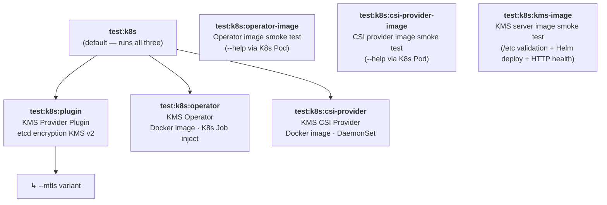
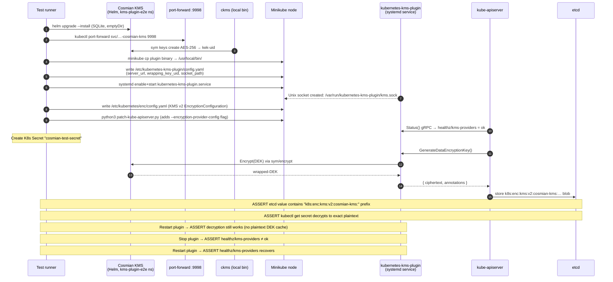
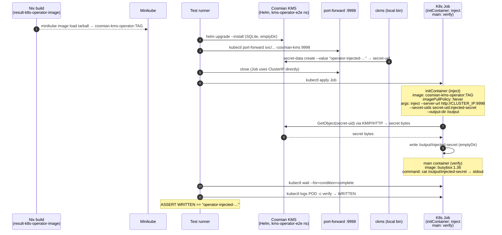
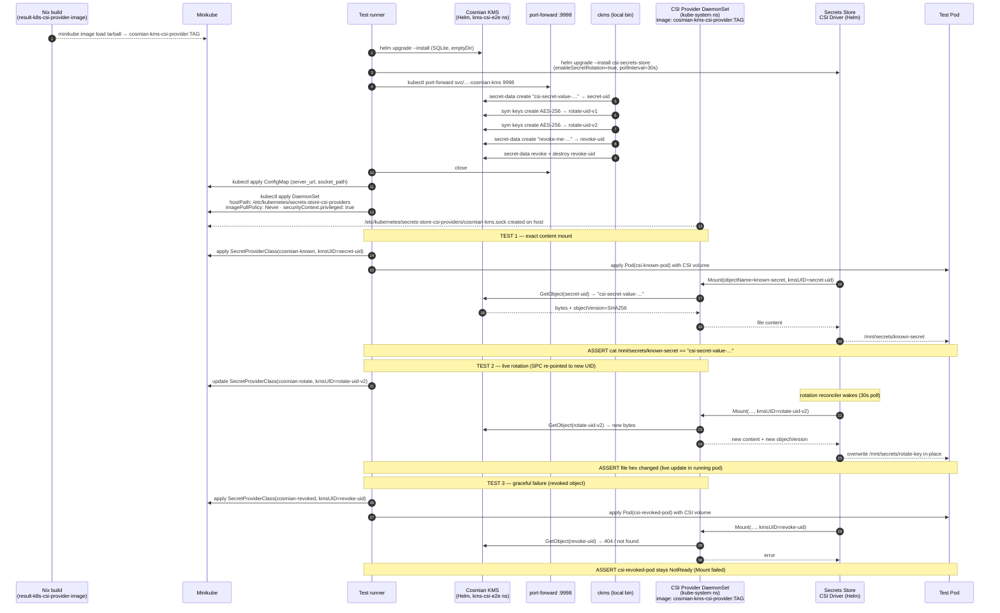
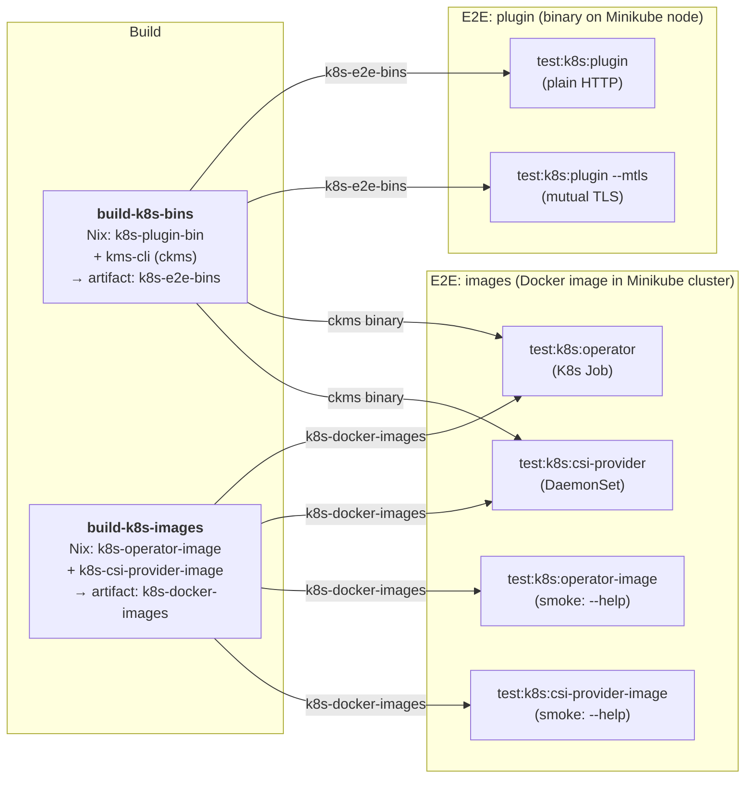

# Cosmian KMS — Kubernetes E2E Tests

Six mise tasks live under `test:k8s:`.
All tests require a running Minikube cluster (`minikube start --driver=docker`).

---

## 1. Task overview



> **Constraint**: `test:k8s:operator` and `test:k8s:csi-provider` use **only the published
> Docker images** (built by Nix, loaded into Minikube). No raw binaries are executed for
> those two components — the image is the artefact that ships to users.

---

## 2. Plugin test (`test:k8s:plugin`)

The plugin is the only component installed as a raw binary (it runs as a
**systemd unit on the Kubernetes control-plane node**, which has no container runtime
interface for plugins at the KMS v2 gRPC layer).



---

## 3. Operator test (`test:k8s:operator`)

The operator runs as a **Kubernetes Job** using the published Docker image.
`ckms` (a local binary) is only used as a test fixture helper to pre-populate
the KMS; the operator itself always runs inside the cluster via its image.



---

## 4. CSI Provider test (`test:k8s:csi-provider`)

The CSI provider runs as a **Kubernetes DaemonSet** using the published Docker
image. It exposes a Unix socket to the Secrets Store CSI Driver via a `hostPath`
volume — the same topology used in production.



---

## 5. CI pipeline (`packaging-kubernetes.yml`)



---

## Key design decisions

| Decision | Rationale |
|----------|-----------|
| Operator uses K8s **Job** (not raw binary) | The Job runs the same image that ships to users; tests the published artifact |
| CSI provider uses K8s **DaemonSet** (not systemd) | Mirrors production topology; image + hostPath socket — exactly what users deploy |
| `imagePullPolicy: Never` on all test pods/jobs | Forces Minikube to use the locally-loaded Nix image; prevents accidental registry pulls |
| `ckms` stays a local binary in both tests | It is a test *fixture helper* (pre-populates KMS), not the component under test |
| Plugin stays a binary on the node | KMS v2 gRPC runs as a privileged systemd service on the control-plane; no K8s container runtime involvement at that layer |

---

## `test:k8s:kms-image` — KMS server image smoke test

Tests the main KMS server Docker image (`ghcr.io/cosmian/kms` or `ghcr.io/cosmian/kms-fips`)
in a Kubernetes pod. This is the regression test for **issue #1132** where required `/etc`
files were missing from the 5.26 image after busybox was removed.

**Checks performed:**

1. **`/etc` validation pod** — a one-shot pod that asserts all of the following are present:
   - `/etc/passwd` — UID resolution (`runAsNonRoot: true`, `getpwuid()`)
   - `/etc/group` — GID resolution
   - `/etc/nsswitch.conf` — DNS / hostname resolution
   - `/etc/ssl/certs/ca-bundle.crt` — outbound TLS certificate verification (OIDC, etc.)
   - `/etc/cosmian` — bind-mount target for `COSMIAN_KMS_CONF` config files

2. **Helm deploy** — full KMS deployment via `charts/cosmian-kms` with the Helm chart's
   production security context (`runAsNonRoot`, `readOnlyRootFilesystem`, etc.).

3. **HTTP health check** — verifies `/version` responds over a `kubectl port-forward`.

**In CI:** triggered by `packaging-docker.yml` (`test-k8s-kms-pod` job) on every build,
for all four combinations of `{fips, non-fips} × {ubuntu-24.04 (amd64), ubuntu-24.04-arm (arm64)}`,
after the arch-specific images are pushed to GHCR.

```bash
# Run locally (requires minikube + helm):
DOCKER_IMAGE_NAME=ghcr.io/cosmian/kms:develop-amd64 mise run test:k8s:kms-image
```
