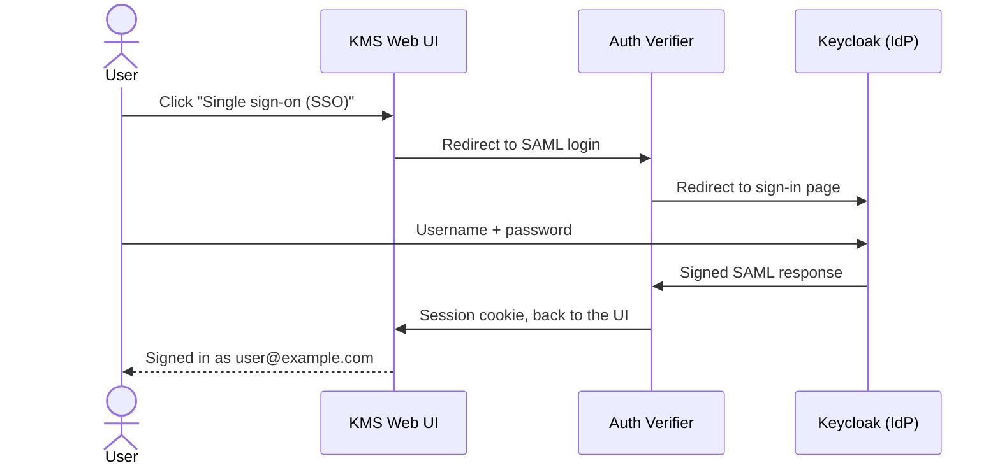

# SAML single sign-on — Web UI user validation guide

> [!abstract] Purpose
> Validate, through the KMS Web UI only, that a standard user can sign in with the company identity provider (SAML),
> work with keys under their own identity, share a key with a colleague, and sign out.
> Run time: about 30 minutes.

## How it works

The browser only talks to `https://localhost:8443`. Keycloak plays the corporate identity provider.



## Setup

> [!info] Prerequisites
> - Docker with Compose v2, `jq`, `openssl`, `curl`, `envsubst`
> - Rust toolchain, Node + pnpm 10, `wasm-pack`
> - A local Auth Verifier SAML image `cosmian-auth-verifier:*-saml`

Run from the KMS repository root.

1. Build the Web UI:

   ```bash
   cd ui && pnpm install && pnpm run build && cd ..
   ```

2. Start Keycloak, the Auth Verifier and the proxy:

   ```bash
   .mise/scripts/test/saml_sso/stack.sh up
   ```

3. In a second terminal, start the KMS:

   ```bash
   cargo run --bin cosmian_kms -- -c /tmp/kms-saml-sso/kms.toml
   ```

4. In the browser, open each address once and accept the self-signed certificate warning:
   - `https://localhost:9443`
   - `https://localhost:8443/ui`

> [!warning] Use a fresh browser profile
> Use a normal window for Alice and a **private window** for Bob, so both sessions can run side by side.
> Accept the certificate warnings again in the private window.

### Test accounts

| User  | Keycloak login         | Identity shown in the KMS |
| ----- | ---------------------- | ------------------------- |
| Alice | `alice` / `alice-pw`   | `alice@example.com`       |
| Bob   | `bob` / `bob-pw`       | `bob@example.com`         |

## Scenarios

> [!tip] How to record results
> Tick each expected result as you verify it. If one fails, note the step and take a screenshot.

### 1. Login page

1. Open `https://localhost:8443/ui`.

- [ ] The login page shows a **Single sign-on (SSO)** button.
- [ ] No username / password form is shown on the KMS page.

### 2. Sign in as Alice

1. Click **Single sign-on (SSO)**.
2. On the Keycloak page, sign in with `alice` / `alice-pw`.

- [ ] The browser goes to the Keycloak sign-in page, then comes back to the KMS **Locate** page.
- [ ] The header shows `alice@example.com` and a **Logout** button.
- [ ] No error message is displayed.

### 3. Session survives a reload

1. Press `F5`.
2. Open `https://localhost:8443/ui/locate` in a new tab.

- [ ] Alice is still signed in, in both tabs, without going back to Keycloak.

### 4. Create a key

1. In the menu, open **Symmetric → Keys → Create**.
2. Keep the defaults (256-bit AES), add the tag `saml-test`, click **Create Symmetric Key**.
3. Copy the key ID from the response.

- [ ] The key is created and its ID is displayed.

### 5. Find the key

1. Open **Locate**, enter the tag `saml-test`, click **Search Objects**.
2. Open **Access Rights → Owned**.

- [ ] The key appears in the search results.
- [ ] The key is listed in **Owned**, i.e. it belongs to `alice@example.com`.

### 6. Bob cannot see Alice's key

1. In a **private window**, open `https://localhost:8443/ui`, click **Single sign-on (SSO)**, sign in with `bob` / `bob-pw`.
2. Open **Locate**, search for the tag `saml-test`.
3. Open **Access Rights → Owned** and **Access Rights → Obtained**.

- [ ] The header shows `bob@example.com`.
- [ ] Alice's key is **not** found and is not listed in Owned or Obtained.

### 7. Alice shares the key with Bob

1. In Alice's window, open **Access Rights → Grant**.
2. Fill in:
   - **User Identifier**: `bob@example.com`
   - **KMIP Operations**: `get` and `encrypt`
   - **Object UID**: the key ID from scenario 4
3. Click **Grant Access**.
4. In Bob's window, open **Access Rights → Obtained**.

- [ ] Alice gets a success response.
- [ ] Bob now sees the key in **Obtained**, with the granted operations.

### 8. Bob uses the shared key

1. In Bob's window, open **Symmetric → Encrypt**.
2. Select any small text file, enter the key ID, and encrypt.

- [ ] The encryption succeeds and a file is downloaded.

### 9. Sign out

1. In Alice's window, click **Logout**.
2. Press the browser **Back** button, then reload the page.

- [ ] Alice lands on the login page.
- [ ] After Back + reload, the KMS pages are not accessible; the login page is shown.

### 10. Sign in again (identity provider session)

1. In Alice's window, click **Single sign-on (SSO)** again.

- [ ] Alice is signed in again **without** typing her password.

> [!note] Expected behaviour
> Logging out of the KMS does not log out of the identity provider: Keycloak still remembers Alice, as a corporate
> SSO portal would. To fully sign out, close the browser or sign out at
> `https://localhost:9443/realms/demo/account`.

### 11. Wrong password

1. Open a **new private window**, go to `https://localhost:8443/ui`, click **Single sign-on (SSO)**.
2. Sign in with `alice` and a wrong password.

- [ ] Keycloak shows an invalid username or password message.
- [ ] The KMS is not opened.

### 12. Session expiry

1. Sign in as Alice and leave the window idle for more than 15 minutes.
2. Reload the page.

- [ ] The login page is shown again: the session lifetime of the test realm is 15 minutes.

## Results

| #  | Scenario                          | Result | Notes |
| -- | --------------------------------- | ------ | ----- |
| 1  | Login page                        |        |       |
| 2  | Sign in as Alice                  |        |       |
| 3  | Session survives a reload         |        |       |
| 4  | Create a key                      |        |       |
| 5  | Find the key                      |        |       |
| 6  | Bob cannot see Alice's key        |        |       |
| 7  | Alice shares the key with Bob     |        |       |
| 8  | Bob uses the shared key           |        |       |
| 9  | Sign out                          |        |       |
| 10 | Sign in again                     |        |       |
| 11 | Wrong password                    |        |       |
| 12 | Session expiry                    |        |       |

## Troubleshooting

> [!failure]- The login page has no SSO button, or the UI opens without login
> The UI was built in development mode. Make sure `VITE_DEV_MODE` is not set, rebuild the UI (setup step 1) and
> restart the KMS.

> [!failure]- "Your connection is not private" in the middle of the sign-in
> The Keycloak certificate was not accepted yet in this window. Accept it, then click **Single sign-on (SSO)** again.

> [!failure]- 502 Bad Gateway on `https://localhost:8443/ui`
> The KMS is not running, or not on port 9998. Start it (setup step 3).

> [!failure]- Error page after signing in at Keycloak
> The Auth Verifier keeps its configuration in memory and loses the test realm if its container restarts. Run
> `.mise/scripts/test/saml_sso/stack.sh up` again, then restart the KMS.

> [!failure]- Anything else
> Collect the logs with `.mise/scripts/test/saml_sso/stack.sh logs` and the KMS terminal output.

## Teardown

1. Stop the KMS with `Ctrl+C`.
2. Stop the stack:

   ```bash
   .mise/scripts/test/saml_sso/stack.sh down
   ```
