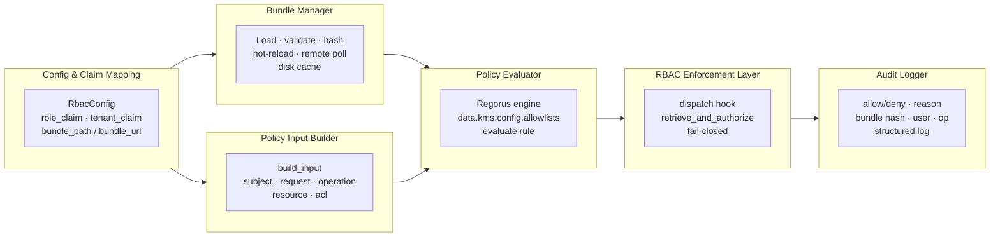
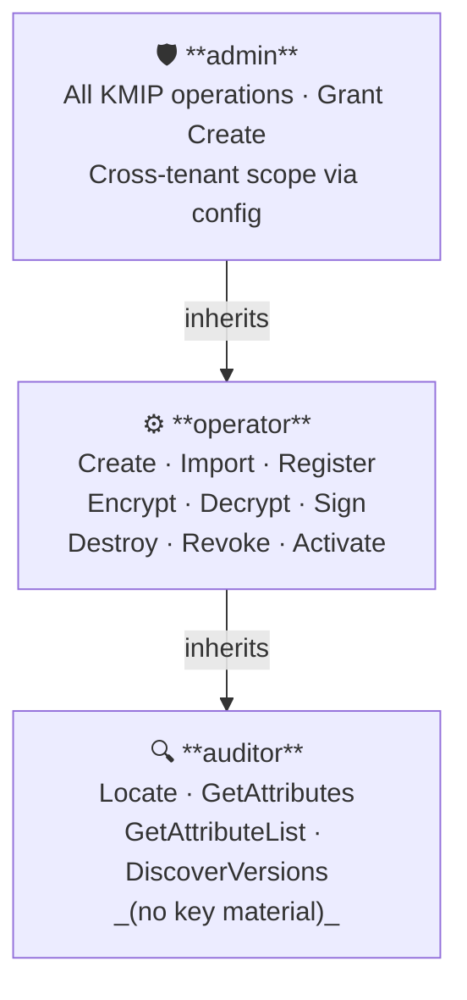
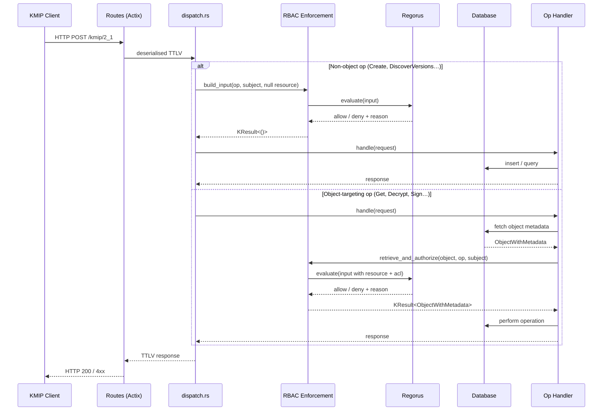
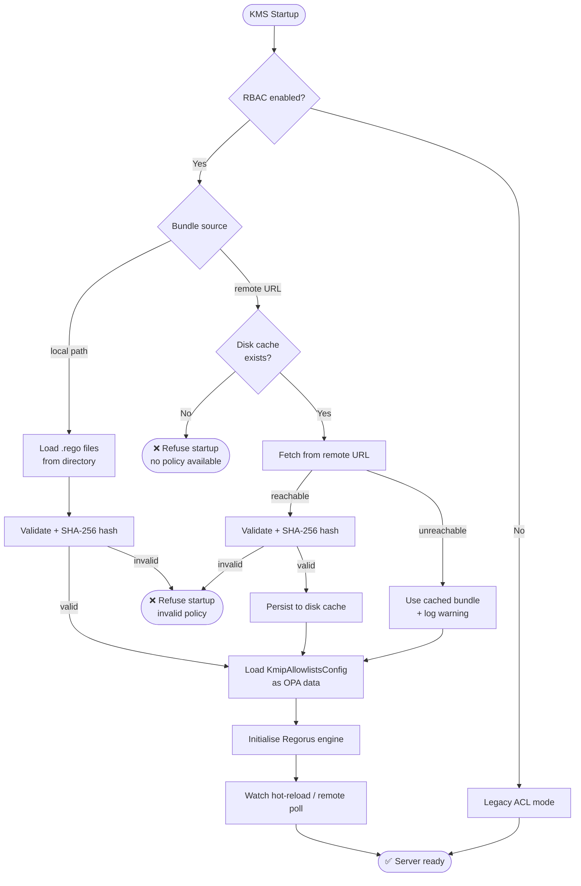

## Introduction

### Role-Based Access Control (RBAC)

Role-Based Access Control is a security model in which permissions are assigned to
**roles** rather than to individual users. Users acquire permissions by being assigned to
roles, and roles can be organised into hierarchies so that senior roles inherit all
permissions of junior roles.

The NIST RBAC reference model (documented in **NIST IR 7316** and standardised as
**ANSI INCITS 359-2004**) defines three cumulative feature sets:

| Level | Name | Description |
|---|---|---|
| RC-0 | **Core RBAC** | Users, roles, permissions, sessions. Every role is a flat collection of permissions. |
| RC-1 | **Hierarchical RBAC** | Role inheritance graph. A senior role implicitly holds all permissions of junior roles. |
| RC-2 | **Constrained RBAC** | Separation of duty (SoD). Mutually exclusive roles prevent privilege escalation. |

This design implements **RC-1 (Hierarchical RBAC)** with the default hierarchy
`admin ⊇ operator ⊇ auditor`. RC-2 (SoD constraints) is explicitly out of scope for
this version.

RBAC has two key compliance advantages over discretionary ACL systems:

1. **Least privilege by default** — a user has exactly the permissions of their assigned
   roles, nothing more. No permission inheritance from object ownership.
2. **Centralised policy** — adding or removing a permission from a role immediately
   affects all users in that role, without touching individual user records.

These properties are required by standards such as **NIST SP 800-53 AC-2/AC-3** and the
**ANSSI RGS** for systems that handle cryptographic key material.

### Key Management Interoperability Protocol (KMIP)

KMIP is an OASIS standard communication protocol between **key management clients** and
**key management servers**. It defines a rich set of **Managed Object** types —
Symmetric Keys, Asymmetric Key Pairs, Certificates, Secret Data, Opaque Data — and the
lifecycle operations that act on them:

| Operation group | Examples |
|---|---|
| Provisioning | Create, CreateKeyPair, Register, Import, DeriveKey |
| Retrieval | Get, Export, Locate, GetAttributes, GetAttributeList |
| Lifecycle | Activate, Revoke, Destroy, Archive |
| Cryptographic | Encrypt, Decrypt, Sign, SignatureVerify, MAC, Hash |
| Administrative | DiscoverVersions, Query, SetAttribute, DeleteAttribute |

KMIP 2.1 (the primary version implemented here) is defined in
**OASIS Standard kmip-spec-v2.1** and referenced in the local submodule at
`kmip/v2.1/kmip-spec-v2.1-os.html`. The server also supports KMIP 1.x for
backward compatibility with legacy clients.

A critical property of KMIP is that **operations are orthogonal**: a client that can
`Get` a key cannot necessarily `Export` it, `Encrypt` with it, or `Destroy` it. Each
operation requires an independent authorisation grant. This maps naturally onto RBAC
role definitions, where roles enumerate exactly which operations are permitted.

### Why RBAC + KMIP?

A KMS without centralised access control presents three operational risks:

1. **Permission sprawl** — individual ACL grants accumulate over time, with no
   systematic way to audit or revoke them at scale.
2. **Algorithm drift** — key usage restrictions are hardcoded in the server binary;
   updating them requires a software deployment rather than a policy change.
3. **Audit gaps** — per-request authorisation decisions are implicit and not
   systematically recorded with the policy version that produced them.

RBAC with **Open Policy Agent (OPA) / Rego** policy addresses all three:

- Roles replace ad-hoc grants. Changing a role definition immediately affects every
  member, with no per-user database surgery.
- Algorithm allowlists move into Rego policy (`data.kms.config.allowlists`), updatable
  without redeployment.
- Every allow *and* deny decision is emitted as an audit log entry carrying the
  **SHA-256 hash of the active policy bundle**, making decisions attributable to a
  specific policy version.

The Rego policy engine used is **Regorus** — a pure-Rust, in-process Rego evaluator
that requires no external sidecar, no WASM compilation step, and adds no network
round-trip to the authorisation path.

---

## Problem Statement

KMIP users need NIST-compatible RBAC that can be centrally managed and audited without hardwiring permissions into the KMS. 
They want policy to be expressed and updated through Open Policy Agent, support role hierarchies, enforce tenant boundaries, and apply consistently across KMIP and access-management APIs.

## Solution

Add an opt-in RBAC/OPA authorization layer for KMIP and access-management operations. 
Roles come from IdP claims, are expanded by Rego policy evaluated by **Regorus** (pure-Rust Rego engine). 
Decisions are fail-closed, auditable, and based on a well-defined input contract that includes subject, tenant, request context, resource, and operation parameters. 
A default, NIST-aligned policy bundle (separate for FIPS and non-FIPS) ships with the system.

## User Stories

1. As a security admin, I want RBAC to be NIST-compatible with role hierarchies, so that compliance requirements are met.
2. As a security admin, I want RBAC/OPA to be opt-in, so that upgrades do not change behavior unexpectedly.
3. As a security admin, I want OPA policy to replace built-in KMIP allowlists in RBAC mode, so that authorization is centralized.
4. As a security admin, I want in-process Rego evaluation via Regorus, so that there is no external dependency for authorization.
5. As a security admin, I want policy bundles to load from a local path with hot-reload, so that policy updates are fast.
6. As a security admin, I want policy bundles to load from a remote bundle URL on a polling interval, so that centralized policy distribution works.
7. As a security admin, I want KMS to refuse startup when RBAC is enabled but policy is invalid or missing, so that misconfiguration is detected early.
8. As a security admin, I want policy validation to reject invalid bundles, so that enforcement is reliable.
9. As a security admin, I want default policy bundles for FIPS and non-FIPS builds, so that algorithms match build capabilities.
10. As a security admin, I want the default policy to include admin/operator/auditor roles, so that baseline deployments are usable.
11. As a security admin, I want admin > operator > auditor as the default hierarchy, so that inheritance is predictable.
12. As an operator, I want to create and import keys, so that I can provision key material.
13. As an operator, I want to perform cryptographic operations on objects I can access, so that I can run encryption and signing workflows.
14. As an operator, I want to destroy or revoke objects, so that I can handle lifecycle management.
15. As an auditor, I want read-only access to locate, list, get, and get attributes, so that I can review inventory.
16. As an auditor, I do not want export of key material, so that audit access stays read-only.
17. As an object owner, I want to grant and revoke ACLs on my objects, so that I can delegate access.
18. As a user, I want to view my own access lists, so that I understand what I can access.
19. As a user, I want to check my create/privileged permissions, so that I can self-serve basic access status.
20. As a tenant admin, I want admin permissions scoped to my tenant, so that tenants remain isolated.
21. As a security admin, I want tenant and role claims to be configurable, so that different IdPs integrate cleanly.
22. As a security admin, I want to pass request context (IP, TLS subject, user-agent) to policy, so that decisions can use environment signals.
23. As a security admin, I want policy decisions to be cached for external OPA calls, so that latency stays low.
24. As a security admin, I want OPA timeouts to fail closed, so that authorization never hangs open.
25. As a security admin, I want the decision and reason paths to be well-defined, so that policy authors have a stable contract.
26. As a security admin, I want audit logs for both allow and deny decisions, so that I can trace access.
27. As a security admin, I want audit entries to include the policy bundle hash, so that decisions are attributable to policy versions.
28. As a policy author, I want OPA input to include resource attributes and operation parameters, so that I can enforce fine-grained rules.
29. As a policy author, I want create/import inputs bounded by a configurable allowlist of requested attributes, so that sensitive data is not overexposed.
30. As a policy author, I want locate/list inputs to include query filters, so that query-level authorization is possible.
31. As a security admin, I want wildcard ACL grants deprecated under RBAC, so that global grants do not bypass policy intent.
32. As a security admin, I want ACL grants to be additive allows, so that explicit grants can permit access without roles.
33. As a developer, I want object ownership modeled as a role that policy can still deny, so that policy remains authoritative.
34. As a developer, I want multi-object operations authorized against each involved object, so that composite operations are safe.
35. As a developer, I want server-wide operations authorized as global resources, so that non-object operations are governed consistently.
36. As an integration admin, I want enterprise integration routes to keep existing auth, so that RBAC rollout does not break integrations.

## Module Architecture



## Role Hierarchy



## Request Authorization Flow



## Bundle Loading & Startup



## Implementation Decisions

- Build/modify six modules: Policy Input Builder, Policy Evaluator, Policy Bundle Manager, RBAC Enforcement Layer, Audit Logger, and Config & Claim Mapping.
- RBAC/OPA is opt-in; legacy ACL behavior remains default when disabled.
- **Rego Engine**: Regorus (pure-Rust Rego evaluator, `regorus` crate) is the sole policy evaluation engine; no OPA WASM, no wasmtime, no external OPA service dependency.
- **Enforcement insertion points**: two-tier — `dispatch.rs` for non-object operations (Create, DiscoverVersions, etc.); a `retrieve_and_authorize` wrapper around `retrieve_object_utils.rs` for object-targeting operations. No extra DB round-trip for object metadata.
- **ACL semantics in RBAC mode**: OPA/Regorus is the single gatekeeper. DB ACL state (owner, per-object grants) is passed as input fields to the policy; existing DB-level ACL enforcement code is bypassed when RBAC mode is active. Legacy DB ACL enforcement is preserved unchanged when RBAC is disabled.
- External OPA calls support configurable mTLS, bearer token, or no auth, with a short configurable timeout and fail-closed behavior. (**Not in scope — Regorus only.**)
- Authorization Surface includes KMIP operations and access-management endpoints; enterprise integration routes are excluded.
- Authorization decisions use the OPA Decision Path `data.kms.authz.allow` and Reason Path `data.kms.authz.reason`.
- OPA Decision Output is allow/deny with optional reason; reasons are logged/audited only and not returned to clients.
- Policy Bundle Loading supports local bundles with hot-reload and remote bundles via polling; invalid bundles are rejected and prevent startup when RBAC is enabled.
- Default Policy Bundle ships with baseline roles (admin/operator/auditor), default hierarchy (admin > operator > auditor), and conservative NIST/ANSSI allowlists; separate bundles for FIPS and non-FIPS.
- Policy Precedence: when RBAC/OPA is enabled, OPA policy replaces KMIP algorithm allowlists.
- Role Assignment Source is IdP JWT role/group claims; Role Claim Mapping and Tenant Claim Mapping are configurable claim paths; Role Expansion is performed in policy.
- Tenant Boundary is enforced in all decisions; Admin Tenant Scope is tenant-scoped by default.
- Operation Authorization Rule requires explicit authorization per KMIP operation; Get does not imply other operations.
- Owner Role is automatic but policy can still deny; Owner ACL Management and Owner ACL Visibility are allowed for owners.
- ACL Semantics are additive allows; Wildcard ACL Grants are deprecated under RBAC.
- Global Operation Resource model is used for Create and server-wide operations, with requested attributes supplied via a configurable allowlist.
- OPA Resource Input for object operations includes object id, owner, type, state, and tags; Operation Parameter Input includes algorithm/mode/padding for crypto ops; Attribute Operation Input includes attribute names; Locate Query Input includes query filters.
- Access-Management Input includes target user, object id, and operation list; Endpoint Input includes route identifiers.
- **Locate/List in RBAC mode**: DB-level user filter (`find()`) is parameterized; when OPA grants a Locate query for a role with global read scope (admin/auditor), the caller passes a wildcard user to `find()` to bypass the per-user DB filter. User-scoped Locate (operators, object owners) retains the normal user filter.
- Authorization Audit records allow and deny decisions with the policy bundle hash.
- Privileged Users Mapping treats privileged users as implicit admin role membership.
- Self Access Views and Self Permission Checks are permitted for users.
- **Missing tenant claim**: when the configured JWT tenant-claim path is absent, `input.subject.tenant_id` is `null`. Policy is authoritative — the default bundle denies on null tenant; custom bundles can override (e.g. for service accounts). No server-level fallback.
- **Auditor role operations**: Locate, GetAttributes, GetAttributeList, DiscoverVersions only — no KMIP `Get` (returns key material), no Export. User story 15's "get" refers to GetAttributes, not the KMIP Get operation. `KmipAllowlistsConfig` is loaded as OPA data (engine-level, not per-request) at engine initialization, accessible as `data.kms.config.allowlists.*` in Rego. The default bundle replicates the current ANSSI/NIST/FIPS conservative allowlists.
- **Create-grant privilege invariant**: The default policy bundle must explicitly encode that only admins can grant the `Create` operation to others, replicating the `privileged_users` guard that is bypassed in RBAC mode. A test vector confirms a non-admin cannot delegate `Create` grants.
- **Policy bundle format**: a directory of `.rego` files; the entry point must be `authz.rego` defining `data.kms.authz.allow`. Hot-reload watches the directory with `inotify`; remote polling downloads an archive and unpacks to a local temp directory. Bundle hash for audit is SHA-256 over sorted `filename:content` concatenation of all `.rego` files in the bundle.
- **Multi-object operations**: one Regorus evaluation call per involved object; input schema is consistent across all operations. All involved objects must be individually authorized (all must allow).
- **RBAC code is always compiled in** — no feature flag; runtime opt-in via config (`--rbac-enabled` / `kms.toml`).

## OPA Input Contract (stable API)

The input document passed to `data.kms.authz.allow` on every authorization call:

```json
{
  "subject": {
    "user_id":   "alice@example.com",
    "roles":     ["operator"],
    "tenant_id": "acme-corp"
  },
  "request": {
    "ip":          "192.168.1.1",
    "tls_subject": "CN=alice,O=Acme",
    "user_agent":  "ckms/1.0"
  },
  "operation": {
    "kmip_op":   "Get",
    "algorithm": "AES",
    "mode":      "GCM",
    "padding":   null
  },
  "resource": {
    "id":        "3fa85f64-5717-4562-b3fc-2c963f66afa6",
    "owner":     "bob@example.com",
    "type":      "SymmetricKey",
    "state":     "Active",
    "tags":      ["env:prod", "project:alpha"],
    "tenant_id": "acme-corp"
  },
  "acl": {
    "is_owner":    false,
    "granted_ops": ["Get", "Encrypt"]
  }
}
```

- For non-object operations (Create, DiscoverVersions, server-wide): `resource` and `acl` are `null`.
- For Locate/List: `resource` is `null`; `operation.query_filters` carries the Locate attributes.
- For access-management endpoints: `operation.target_user` and `operation.grant_ops` are present.

**Decision paths** (must be defined in every policy bundle):

- `data.kms.authz.allow` → `boolean` — true = allow, false or undefined = deny (fail-closed)
- `data.kms.authz.reason` → `string` (optional) — logged/audited only, never returned to the client

**Static data** (loaded at engine init, not per-request):

- `data.kms.config.allowlists` — the `KmipAllowlistsConfig` for the build (algorithms, hashes, curves, etc.)

## Example Default Policy Skeleton (Rego)

```rego
package kms.authz

import rego.v1

# Role hierarchy: admin inherits all operator permissions; operator inherits auditor
role_inherits := {
    "admin":    {"operator", "auditor"},
    "operator": {"auditor"},
}

# Expand roles transitively
effective_roles(user_roles) := roles if {
    roles := {r | some base in user_roles; some r in ({base} | role_inherits[base])}
}

roles := effective_roles(input.subject.roles)

# Auditor: metadata-only (no Get/key material, no Export)
auditor_ops := {"Locate", "GetAttributes", "GetAttributeList", "DiscoverVersions"}

# Operator: create, import, crypto, destroy, revoke (on accessible objects)
operator_ops := auditor_ops | {"Create", "CreateKeyPair", "Import", "Register",
                               "Encrypt", "Decrypt", "Sign", "SignatureVerify",
                               "Destroy", "Revoke", "Activate"}

# Admin: all operations
admin_ops := operator_ops | {"Grant", "Revoke", "DiscoverVersions", "Query"}

# Algorithm allowlist check (uses static data loaded at engine init)
algorithm_allowed if {
    input.operation.algorithm == null  # non-crypto op
}
algorithm_allowed if {
    input.operation.algorithm in data.kms.config.allowlists.algorithms
}

# Tenant boundary: resource and subject must share tenant
same_tenant if { input.resource == null }
same_tenant if { input.resource.tenant_id == input.subject.tenant_id }

# Main allow rule
allow if {
    "admin" in roles
    same_tenant
    algorithm_allowed
}
allow if {
    "operator" in roles
    input.operation.kmip_op in operator_ops
    same_tenant
    algorithm_allowed
    # For object ops: user must own object or have an explicit ACL grant
    object_accessible
}
allow if {
    "auditor" in roles
    input.operation.kmip_op in auditor_ops
    same_tenant
}

object_accessible if { input.resource == null }
object_accessible if { input.acl.is_owner }
object_accessible if { input.operation.kmip_op in input.acl.granted_ops }

# Only admins can delegate Create grants
allow if {
    input.operation.kmip_op == "Grant"
    "Create" in input.operation.grant_ops
    "admin" in roles
}

reason := "allowed by role policy"
```


- Good tests assert observable authorization behavior (allow/deny outcomes, audit entries, and error paths) without relying on internal policy evaluation details.
- All modules above should have tests, with emphasis on input construction, policy evaluation modes, bundle validation/reload, enforcement across KMIP and access endpoints, and audit logging.
- Prior art includes existing KMIP policy and access control test suites, plus database permission tests; new tests should mirror their style and focus on end-to-end authorization behavior.

## Out of Scope

- Constrained RBAC (e.g., separation of duty) beyond core + hierarchical RBAC.
- UI changes for policy management.
- Reworking enterprise integration authentication flows.
- Per-object filtering of Locate/List results.

## Further Notes

- ADRs: OPA replaces KMIP allowlists when RBAC is enabled; hybrid OPA evaluation mode is supported.
- Default policies should be documented as baseline examples, not hard constraints for deployments.

---

## References

### RBAC & Access Control

| Reference | Title | URL |
|-----------|-------|-----|
| NIST IR 7316 | Assessment of Access Control Systems — covers Core RBAC, Hierarchical RBAC, and Constrained RBAC models | https://csrc.nist.gov/pubs/ir/7316/final |
| NIST SP 800-162 Upd2 | Guide to Attribute Based Access Control (ABAC) Definition and Considerations (Jan 2014, updated Aug 2019) | https://csrc.nist.gov/pubs/sp/800/162/upd2/final |
| NIST SP 800-207 | Zero Trust Architecture (Aug 2020) | https://csrc.nist.gov/pubs/sp/800/207/final |

### Key Management

| Reference | Title | URL |
|-----------|-------|-----|
| NIST SP 800-57 Pt1 Rev 5 | Recommendation for Key Management — Part 1: General (May 2020) | https://csrc.nist.gov/pubs/sp/800/57/pt1/r5/final |
| NIST SP 800-131A Rev 2 | Transitioning the Use of Cryptographic Algorithms and Key Lengths (Mar 2019) — Rev 3 IPD posted Oct 2024 | https://csrc.nist.gov/pubs/sp/800/131/a/r2/final |

### Cryptographic Algorithm Standards

| Reference | Title | URL |
|-----------|-------|-----|
| FIPS 140-3 | Security Requirements for Cryptographic Modules (Mar 2019) | https://csrc.nist.gov/pubs/fips/140-3/final |
| FIPS 197 | Advanced Encryption Standard (AES) — updated May 2023, no algorithm changes | https://csrc.nist.gov/pubs/fips/197/final |
| FIPS 203 | Module-Lattice-Based Key-Encapsulation Mechanism Standard (ML-KEM / Kyber) (Aug 2024) | https://csrc.nist.gov/pubs/fips/203/final |
| FIPS 204 | Module-Lattice-Based Digital Signature Standard (ML-DSA / Dilithium) (Aug 2024) | https://csrc.nist.gov/pubs/fips/204/final |
| FIPS 205 | Stateless Hash-Based Digital Signature Standard (SLH-DSA / SPHINCS+) (Aug 2024) | https://csrc.nist.gov/pubs/fips/205/final |
| ANSSI | Recommandations de sécurité relatives aux mécanismes cryptographiques (RGS B1 / DAT-NT-028) — defines conservative algorithm and key-size baselines used in `KmipAllowlistsConfig::conservative()` | https://www.ssi.gouv.fr/uploads/2021/03/anssi-guide-mecanismes_crypto-2.04.pdf |

### KMIP Specifications (OASIS)

The KMS implements KMIP 1.x and 2.x. Local copies of all specs are in `kmip/` (git submodule).

| Version | Status | Local path | Online |
|---------|--------|-----------|--------|
| KMIP 1.0 | OASIS Standard | `kmip/v1.0/kmip-spec-1.0-os.html` | https://docs.oasis-open.org/kmip/spec/v1.0/os/kmip-spec-1.0-os.html |
| KMIP 1.1 | OASIS Standard | `kmip/v1.1/kmip-spec-v1.1-os.html` | https://docs.oasis-open.org/kmip/spec/v1.1/os/kmip-spec-v1.1-os.html |
| KMIP 1.2 | OASIS Standard | `kmip/v1.2/kmip-spec-v1.2-os.html` | https://docs.oasis-open.org/kmip/spec/v1.2/os/kmip-spec-v1.2-os.html |
| KMIP 1.3 | OASIS Standard | `kmip/v1.3/kmip-spec-v1.3-os.html` | https://docs.oasis-open.org/kmip/spec/v1.3/os/kmip-spec-v1.3-os.html |
| KMIP 1.4 | OASIS Standard + Errata 01 | `kmip/v1.4/kmip-spec-v1.4-os.html` | https://docs.oasis-open.org/kmip/spec/v1.4/errata01/os/ |
| KMIP 2.0 | OASIS Standard | `kmip/v2.0/kmip-spec-v2.0-os.html` | https://docs.oasis-open.org/kmip/kmip-spec/v2.0/os/kmip-spec-v2.0-os.html |
| KMIP 2.1 | OASIS Standard (**primary**) | `kmip/v2.1/kmip-spec-v2.1-os.html` | https://docs.oasis-open.org/kmip/kmip-spec/v2.1/os/kmip-spec-v2.1-os.html |
| KMIP 3.0 | CSD 01 (draft) | `kmip/v3.0/kmip-spec-v3.0-csd01.html` | — |

> **AI agent rule**: always verify section numbers, operation names, and tag values against
> the local spec files (or the online canonical version above) before writing KMIP-related code.
> Never rely on recalled knowledge of a specification.
