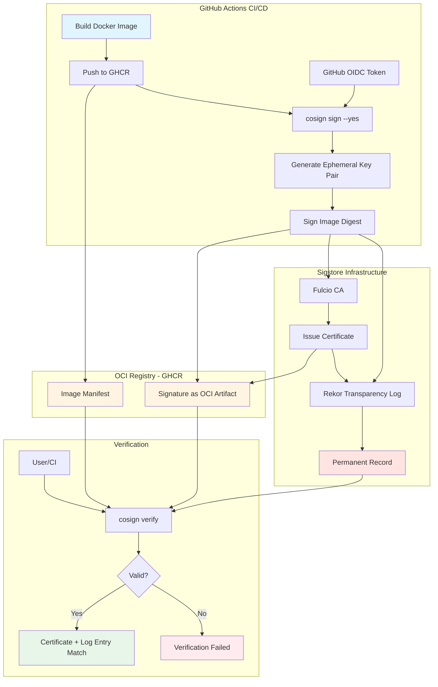
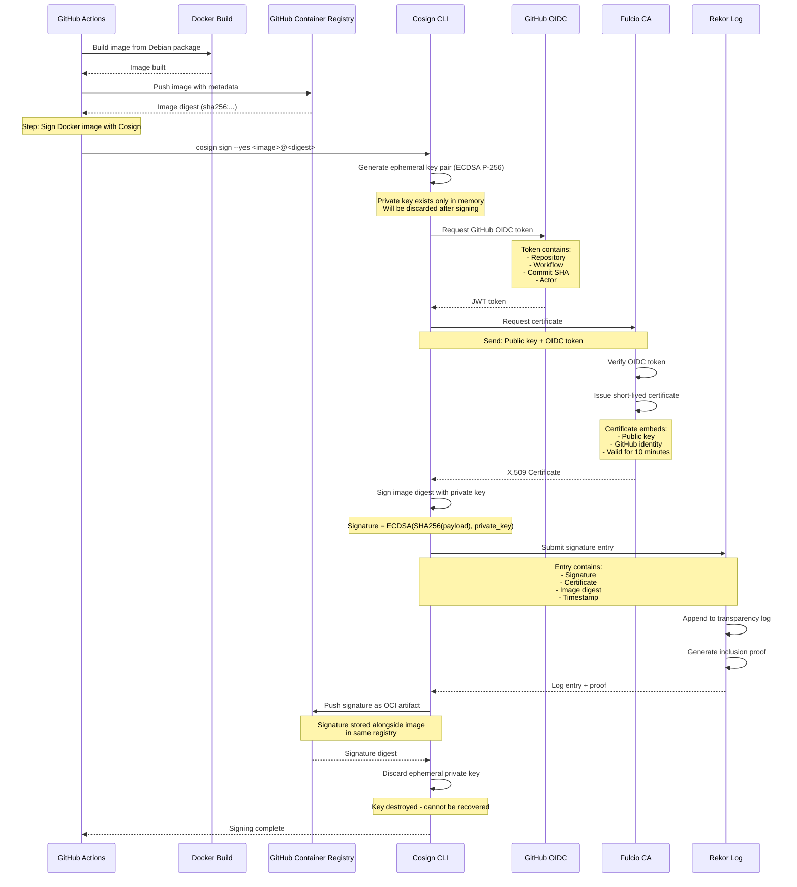
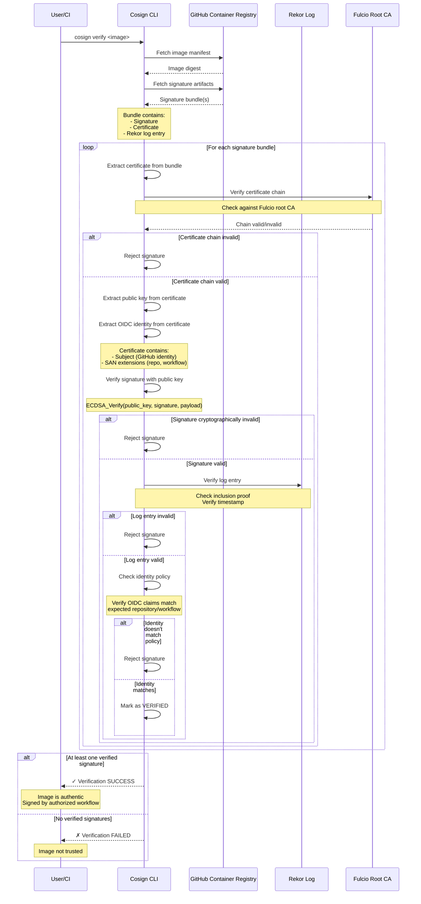

# Docker Image Signing with Cosign

This document provides a comprehensive guide to signing and verifying Docker images using cosign in the Cosmian KMS project.

---

## Table of Contents

- [Overview](#overview)
- [Current Implementation: Keyless Signing](#current-implementation-keyless-signing)
- [Architecture](#architecture)
- [Signing Workflow](#signing-workflow)
- [Verification Workflow](#verification-workflow)
- [Cryptographic Details](#cryptographic-details)
- [Usage Examples](#usage-examples)

---

## Overview

Cosign is a container signing, verification, and storage tool developed by Sigstore. The Cosmian KMS project uses **keyless signing** with Sigstore's transparency log (Rekor) for signing Docker images in the CI/CD pipeline.

### Is Cosign the Standard?

**No single standard exists** for container image signing, but several mechanisms are widely used:

| Tool/Method | Pros ✅ | Cons ❌ | Use Cases | Adoption |
|-------------|---------|---------|-----------|----------|
| **Cosign (Sigstore)** | • Keyless signing (no key management)<br>• Public transparency log<br>• OIDC-based identity<br>• Growing ecosystem<br>• Simple CLI | • Requires internet for verification<br>• Depends on Sigstore infrastructure<br>• Newer (less mature than Notary) | CI/CD pipelines, Public projects, Cloud-native apps | High (GitHub, Google, Red Hat) |
| **Docker Content Trust (Notary v1)** | • Docker native integration<br>• Mature and stable<br>• Offline capable<br>• TUF-based security | • Complex key management<br>• Being deprecated for Notary v2<br>• Limited to Docker registry v2<br>• Poor user experience | Legacy Docker deployments, Enterprise | Medium (declining) |
| **Notary v2** | • Modern TUF implementation<br>• OCI artifact support<br>• Supply chain metadata<br>• Flexible key management | • Still maturing<br>• Complex setup<br>• Smaller ecosystem<br>• Manual key management required | Enterprise with custom PKI, Regulated industries | Low (emerging) |
| **Red Hat Simple Signing** | • Simple format<br>• Used by Red Hat/Fedora<br>• GPG-based<br>• Well-documented | • Not widely adopted outside Red Hat<br>• GPG key management overhead<br>• Limited tooling | Red Hat ecosystem, RPM-based systems | Low (niche) |
| **In-toto + SLSA** | • Full supply chain attestation<br>• Verifies build process<br>• Complements image signing<br>• Framework for provenance | • Not a standalone signing tool<br>• Requires additional tooling<br>• Complex to implement | Supply chain security, Compliance-heavy orgs | Medium (growing) |
| **Custom GPG/PGP Signing** | • Complete control<br>• Offline capable<br>• Well-understood crypto | • Manual process<br>• No standardization<br>• Complex key distribution<br>• No tooling integration | Air-gapped environments, Custom solutions | Low (legacy) |

### Market Landscape (2025)

**Current Trends:**

- **Cosign is becoming the de facto standard** for cloud-native environments
- Docker Content Trust (Notary v1) is being phased out
- Notary v2 development is active but slow adoption
- CNCF and major vendors (GitHub, Google, Microsoft) backing Sigstore
- Kubernetes ecosystem heavily favors Cosign

**Why Cosmian KMS chose Cosign:**

1. ✅ **No key management burden** - keyless signing eliminates private key storage/rotation
2. ✅ **GitHub Actions integration** - native OIDC support
3. ✅ **Transparency** - public Rekor log provides audit trail
4. ✅ **Industry momentum** - backed by CNCF, Linux Foundation
5. ✅ **Simple UX** - easy for users to verify images

### Current Implementation: Keyless Signing

The GitHub Actions workflow uses:

- **Signing Method**: Keyless signing with OIDC tokens
- **Signature Storage**: Sigstore's Rekor transparency log + OCI registry
- **Identity Verification**: GitHub OIDC token from GitHub Actions
- **No Private Keys**: Ephemeral keys generated per signing operation

**Benefits:**

- No need to manage long-term private keys
- Cryptographic proof of identity via OIDC
- Public transparency log for auditability
- Automatic key rotation (ephemeral keys)
- Tamper-evident signature storage

## Architecture

### Keyless Signing Architecture



### Component Roles

| Component | Purpose | Location |
|-----------|---------|----------|
| **Fulcio** | Certificate Authority - issues short-lived certificates based on OIDC identity | Sigstore Public Instance |
| **Rekor** | Transparency Log - immutable record of all signatures | Sigstore Public Instance |
| **GHCR** | OCI Registry - stores images and signature artifacts | GitHub Container Registry |
| **OIDC Token** | Identity assertion from GitHub Actions | GitHub Infrastructure |
| **Ephemeral Keys** | Short-lived signing keys (discarded after use) | Generated in CI runner |

## Signing Workflow

### Current CI/CD Signing Process



### Detailed Signing Steps

1. **Image Build and Push**
   - GitHub Actions builds Docker image from Debian package
   - Image is pushed to GHCR with tags (branch, PR, version)
   - Digest is captured: `sha256:abc123...`

2. **OIDC Token Acquisition**
   - Cosign requests GitHub OIDC token via ambient credentials
   - GitHub issues JWT containing workflow identity:

     ```json
     {
       "iss": "https://token.actions.githubusercontent.com",
       "sub": "repo:Cosmian/kms:ref:refs/heads/main",
       "repository": "Cosmian/kms",
       "workflow": "Docker build",
       "sha": "abc123...",
       "actor": "github-actor"
     }
     ```

3. **Ephemeral Key Generation**
   - Cosign generates ECDSA P-256 key pair
   - Private key stored only in memory
   - Public key will be certified by Fulcio

4. **Certificate Issuance**
   - Cosign sends public key + OIDC token to Fulcio
   - Fulcio verifies OIDC token signature and claims
   - Fulcio issues X.509 certificate with:
     - Subject: Email or GitHub identity from OIDC
     - Public key from ephemeral pair
     - X.509 v3 extensions with OIDC claims
     - Validity: ~10 minutes (short-lived)

5. **Signature Creation**
   - Cosign creates signature payload:

     ```json
     {
       "critical": {
         "identity": {
           "docker-reference": "ghcr.io/cosmian/kms"
         },
         "image": {
           "docker-manifest-digest": "sha256:..."
         },
         "type": "cosign container image signature"
       },
       "optional": {
         "Bundle": {
           "SignedEntryTimestamp": "...",
           "Payload": {...}
         }
       }
     }
     ```

   - Signs with ephemeral private key
   - Signature algorithm: ECDSA-SHA256

6. **Transparency Log Entry**
   - Signature + certificate submitted to Rekor
   - Rekor creates immutable log entry
   - Entry includes:
     - Image digest
     - Signature
     - Certificate
     - Timestamp (from Rekor)
   - Generates cryptographic inclusion proof

7. **OCI Artifact Upload**
   - Signature bundled with certificate and Rekor entry
   - Pushed to GHCR as OCI artifact attached to image
   - Tag format: `sha256-<digest>.sig`

8. **Key Destruction**
   - Ephemeral private key discarded from memory
   - Only certificate and signature remain
   - Private key cannot be recovered

## Verification Workflow

### Keyless Verification Process



### Detailed Verification Steps

1. **Image and Signature Retrieval**
   - Fetch image manifest to get canonical digest
   - Query GHCR for signature artifacts associated with digest
   - Download signature bundles (may be multiple)

2. **Certificate Chain Validation**
   - Extract X.509 certificate from signature bundle
   - Verify certificate chain up to Fulcio root CA
   - Check certificate validity period (was it valid at signing time?)
   - Verify certificate has not been revoked

3. **Identity Extraction**
   - Parse OIDC claims from certificate extensions:
     - Subject: `repo:Cosmian/kms:ref:refs/heads/main`
     - Issuer: `https://token.actions.githubusercontent.com`
     - Repository: `Cosmian/kms`
     - Workflow: `Docker build`
     - SHA: Commit hash
   - Extract public key from certificate

4. **Cryptographic Signature Verification**
   - Reconstruct the signed payload from image digest
   - Verify ECDSA signature using public key from certificate
   - Ensure signature algorithm matches (ECDSA-SHA256)

5. **Transparency Log Verification**
   - Extract Rekor log entry from bundle
   - Verify inclusion proof (Merkle tree proof)
   - Check log entry timestamp is consistent
   - Confirm log entry data matches signature and certificate

6. **Policy Enforcement**
   - Verify OIDC identity matches expected values:
     - Repository matches `Cosmian/kms`
     - Workflow is from trusted workflow file
     - Can check specific commit, branch, or actor
   - Custom policies can enforce additional constraints

7. **Result Determination**
   - If all checks pass → **Verification SUCCESS**
   - If any check fails → **Verification FAILED**
   - Returns details of verified identities

## Cryptographic Details

### Keyless Signing Cryptography

#### Ephemeral Key Generation

Each signing operation generates a fresh ECDSA key pair:

- **Algorithm**: ECDSA with P-256 curve (secp256r1 / NIST P-256)
- **Curve Parameters**:
    - Prime field: p = 2^256 - 2^224 + 2^192 + 2^96 - 1
    - Curve equation: y² = x³ - 3x + b (mod p)
    - Generator point G with order n
- **Private Key**: Random scalar d ∈ [1, n-1]
- **Public Key**: Point Q = d·G on the curve
- **Security Level**: 128-bit (equivalent to AES-128)

**Key Lifecycle:**

```text
1. Generate random d (32 bytes from CSPRNG)
2. Compute Q = d·G
3. Use d for signing
4. Obtain certificate for Q
5. Sign image
6. Discard d (zeroed from memory)
7. Public key Q preserved only in certificate
```

#### Certificate Structure

Fulcio issues X.509 v3 certificates with:

```text
Certificate:
    Version: 3 (0x2)
    Serial Number: <unique>
    Signature Algorithm: ecdsa-with-SHA384
    Issuer: O=sigstore.dev, CN=sigstore-intermediate
    Validity:
        Not Before: <signing time>
        Not After:  <signing time + 10 minutes>
    Subject: <empty or email from OIDC>
    Subject Public Key Info:
        Public Key Algorithm: id-ecPublicKey
            Public-Key: (256 bit)
            <ephemeral public key>
    X509v3 extensions:
        X509v3 Key Usage: critical
            Digital Signature
        X509v3 Extended Key Usage:
            Code Signing
        X509v3 Subject Alternative Name: critical
            URI:https://github.com/Cosmian/kms/.github/workflows/build_docker_image.yml@refs/heads/main
        X509v3 Issuer Alternative Name:
            URI:https://token.actions.githubusercontent.com
        OIDC Issuer (custom extension):
            https://token.actions.githubusercontent.com
        GitHub Workflow Trigger (custom extension):
            push
        GitHub Workflow SHA (custom extension):
            <commit sha>
        GitHub Workflow Repository (custom extension):
            Cosmian/kms
```

**Key Certificate Extensions:**

- SAN (Subject Alternative Name): Contains workflow identity
- Custom extensions: Embed OIDC claims for policy enforcement
- Short validity period: Prevents long-term key compromise

### Signature Format and Computation

#### Signature Payload

```json
{
  "critical": {
    "identity": {
      "docker-reference": "ghcr.io/cosmian/kms:5.13.0-amd64"
    },
    "image": {
      "docker-manifest-digest": "sha256:abc123..."
    },
    "type": "cosign container image signature"
  },
  "optional": {
    "Bundle": {
      "SignedEntryTimestamp": "MEQCIB...",
      "Payload": {
        "body": "eyJh...",
        "integratedTime": 1732464000,
        "logIndex": 123456,
        "logID": "c0d2..."
      }
    }
  }
}
```

**Security Properties:**

| Property | Description |
|----------|-------------|
| **Unforgeability** | Cannot create valid signature without private key |
| **Collision Resistance** | SHA-256 ensures unique hashes for different inputs |
| **Deterministic Nonce** | RFC 6979 prevents nonce reuse attacks |
| **Curve Security** | P-256 provides 128-bit security level |

### Transparency Log (Rekor)

#### Merkle Tree Structure

Rekor maintains an append-only Merkle tree:

```text
                    Root Hash
                   /         \
                  /           \
              H(H1,H2)      H(H3,H4)
              /     \        /     \
            H1      H2      H3      H4
            |       |       |       |
         Entry1  Entry2  Entry3  Entry4
```

**Properties:**

- **Append-only**: Entries cannot be deleted or modified
- **Verifiable**: Inclusion proofs demonstrate entry presence
- **Timestamped**: Each entry has cryptographic timestamp
- **Public**: Anyone can verify log consistency

#### Log Entry Structure

```json
{
  "body": "base64-encoded entry body",
  "integratedTime": 1732464000,
  "logID": "c0d23d6ad406973f9559f3ba2d1ca01f84147d8ffc5b8445c224f98b9591801d",
  "logIndex": 123456789,
  "verification": {
    "signedEntryTimestamp": "MEUCIQD...",
    "inclusionProof": {
      "hashes": ["abc...", "def...", ...],
      "logIndex": 123456789,
      "rootHash": "xyz...",
      "treeSize": 123456790
    }
  }
}
```

### OIDC Token Authentication

#### GitHub OIDC Token Structure

```json
{
  "jti": "unique-token-id",
  "sub": "repo:Cosmian/kms:ref:refs/heads/main",
  "aud": "sigstore",
  "ref": "refs/heads/main",
  "sha": "abc123...",
  "repository": "Cosmian/kms",
  "repository_owner": "Cosmian",
  "repository_owner_id": "12345",
  "run_id": "123456789",
  "run_number": "42",
  "run_attempt": "1",
  "actor": "github-actor",
  "workflow": "Docker build",
  "head_ref": "",
  "base_ref": "",
  "event_name": "push",
  "iss": "https://token.actions.githubusercontent.com",
  "iat": 1732464000,
  "exp": 1732464900,
  "nbf": 1732463995
}
```

**Verification by Fulcio:**

1. Verify JWT signature using GitHub's public keys (JWKS)
2. Check token hasn't expired (`exp` claim)
3. Validate issuer is `https://token.actions.githubusercontent.com`
4. Confirm audience includes `sigstore`
5. Extract identity claims for certificate embedding

### Security Model

#### Trust Chain

```text
GitHub (OIDC Issuer)
    ↓ (issues JWT)
OIDC Token (identity proof)
    ↓ (presented to)
Fulcio CA (certificate authority)
    ↓ (issues)
X.509 Certificate (binds identity to public key)
    ↓ (used to verify)
ECDSA Signature (proves image authenticity)
    ↓ (recorded in)
Rekor Log (immutable timestamp proof)
```

**Trust Assumptions:**

1. **GitHub OIDC**: Trust GitHub to issue authentic tokens
2. **Fulcio CA**: Trust Sigstore's certificate authority
3. **Rekor Log**: Trust transparency log is append-only
4. **Cryptography**: Trust ECDSA P-256 and SHA-256

#### Threat Model

**Protects Against:**

- ✅ Unauthorized image signatures (only GitHub Actions can sign)
- ✅ Image tampering (signature invalidated by any change)
- ✅ Signature replay attacks (Rekor timestamp)
- ✅ Certificate forgery (Fulcio CA chain verification)
- ✅ Man-in-the-middle attacks (cryptographic signatures)

**Does NOT Protect Against:**

- ❌ Compromised GitHub Actions workflow
- ❌ Malicious code in signed images
- ❌ Vulnerabilities in dependencies
- ❌ Compromise of GitHub OIDC infrastructure
- ❌ Compromise of Sigstore infrastructure

**Keyless Advantages:**

- No long-term private keys to protect
- Automatic key rotation (new key per signing)
- Cannot extract or steal signing keys
- Identity tied to OIDC, not key material

**Keyless Limitations:**

- Requires trust in Sigstore infrastructure
- Verification needs internet access (to check Rekor)
- Dependent on GitHub OIDC availability

## Usage Examples

### Verifying Cosmian KMS Images on Linux

This section provides practical, copy-paste ready commands for Linux users to verify Cosmian KMS Docker images.

#### Quick Start: Install Cosign

```bash
# Method 1: Download official binary (recommended)
wget "https://github.com/sigstore/cosign/releases/download/v2.2.4/cosign-linux-amd64"
sudo mv cosign-linux-amd64 /usr/local/bin/cosign
sudo chmod +x /usr/local/bin/cosign

# Verify installation
cosign version
```

```bash
# Method 2: Using package managers

# Debian/Ubuntu (via DEB package)
wget "https://github.com/sigstore/cosign/releases/download/v2.2.4/cosign_2.2.4_amd64.deb"
sudo dpkg -i cosign_2.2.4_amd64.deb

# Arch Linux
sudo pacman -S cosign

# Homebrew (if available on Linux)
brew install cosign

# Nix
nix-env -iA nixpkgs.cosign
```

#### Verify Before Running (Recommended Workflow)

```bash
#!/bin/bash
# verify-kms.sh - Verify and run Cosmian KMS

set -euo pipefail

IMAGE="${1:-ghcr.io/cosmian/kms:latest}"

echo "🔍 Verifying Cosmian KMS image: ${IMAGE}"

# Pull image first
docker pull "${IMAGE}"

# Verify signature
if cosign verify \
  --certificate-identity-regexp "^https://github.com/Cosmian/kms/" \
  --certificate-oidc-issuer "https://token.actions.githubusercontent.com" \
  "${IMAGE}" > /dev/null 2>&1; then

  echo "✅ Signature verification PASSED"
  echo "✅ Image signed by official Cosmian KMS workflow"
  echo ""
  echo "🚀 Safe to run. Starting container..."

  docker run -d \
    --name kms \
    -p 9998:9998 \
    -v kms-data:/root/cosmian-kms \
    "${IMAGE}"

  echo "✅ KMS server started on http://localhost:9998"

else
  echo "❌ Signature verification FAILED"
  echo "⚠️  DO NOT RUN this image!"
  echo "⚠️  It may not be from the official Cosmian source"
  exit 1
fi
```

Make it executable and use:

```bash
chmod +x verify-kms.sh
./verify-kms.sh ghcr.io/cosmian/kms:5.13.0-amd64
```

#### Manual Verification Steps

##### Step 1: Pull the image

```bash
docker pull ghcr.io/cosmian/kms:5.13.0-amd64
```

##### Step 2: Verify with full output

```bash
cosign verify \
  --certificate-identity-regexp "^https://github.com/Cosmian/kms/" \
  --certificate-oidc-issuer "https://token.actions.githubusercontent.com" \
  ghcr.io/cosmian/kms:5.13.0-amd64
```

**Expected output:**

```text
Verification for ghcr.io/cosmian/kms:5.13.0-amd64 --
The following checks were performed on each of these signatures:
  - The cosign claims were validated
  - Existence of the claims in the transparency log was verified offline
  - The code-signing certificate was verified using trusted certificate authority certificates

[{"critical":{"identity":{"docker-reference":"ghcr.io/cosmian/kms"},"image":{"docker-manifest-digest":"sha256:..."},"type":"cosign container image signature"},"optional":{"Bundle":...}}]
```

##### Step 3: Inspect the certificate details

```bash
cosign verify \
  --certificate-identity-regexp "^https://github.com/Cosmian/kms/" \
  --certificate-oidc-issuer "https://token.actions.githubusercontent.com" \
  --output json \
  ghcr.io/cosmian/kms:5.13.0-amd64 | jq -r '.[0].optional.Subject'
```

**Expected output:**

```text
https://github.com/Cosmian/kms/.github/workflows/build_docker_image.yml@refs/heads/main
```

This confirms the image was signed by the official Cosmian KMS GitHub Actions workflow.

#### Verify Specific Version or Tag

```bash
# Verify latest tag
cosign verify \
  --certificate-identity-regexp "^https://github.com/Cosmian/kms/" \
  --certificate-oidc-issuer "https://token.actions.githubusercontent.com" \
  ghcr.io/cosmian/kms:latest

# Verify specific version
cosign verify \
  --certificate-identity-regexp "^https://github.com/Cosmian/kms/" \
  --certificate-oidc-issuer "https://token.actions.githubusercontent.com" \
  ghcr.io/cosmian/kms:5.13.0

# Verify by exact digest (most secure)
cosign verify \
  --certificate-identity-regexp "^https://github.com/Cosmian/kms/" \
  --certificate-oidc-issuer "https://token.actions.githubusercontent.com" \
  ghcr.io/cosmian/kms@sha256:abc123...
```

## References

### Official Documentation

#### Sigstore & Cosign

- **Cosign Official Documentation**: <https://docs.sigstore.dev/cosign/overview/>
- **Cosign GitHub Repository**: <https://github.com/sigstore/cosign>
- **Cosign Installation Guide**: <https://docs.sigstore.dev/cosign/installation/>
- **Cosign CLI Reference**: <https://docs.sigstore.dev/cosign/cli/>
- **Sigstore Architecture**: <https://docs.sigstore.dev/about/overview/>
- **Sigstore Security Model**: <https://docs.sigstore.dev/about/security/>
- **Keyless Signing**: <https://docs.sigstore.dev/cosign/keyless/>

#### Sigstore Components

- **Fulcio Certificate Authority**: <https://github.com/sigstore/fulcio>
    - Documentation: <https://docs.sigstore.dev/fulcio/overview/>
- **Rekor Transparency Log**: <https://github.com/sigstore/rekor>
    - Documentation: <https://docs.sigstore.dev/rekor/overview/>
    - Public Instance: <https://rekor.sigstore.dev/>
    - Status Page: <https://status.sigstore.dev/>
- **Sigstore Trust Root**: <https://github.com/sigstore/root-signing>

#### GitHub Actions & OIDC

- **GitHub OIDC for Actions**: <https://docs.github.com/en/actions/deployment/security-hardening-your-deployments/about-security-hardening-with-openid-connect>
- **Configuring OIDC in GitHub Actions**: <https://docs.github.com/en/actions/deployment/security-hardening-your-deployments/configuring-openid-connect-in-cloud-providers>
- **GitHub Actions Security**: <https://docs.github.com/en/actions/security-guides/security-hardening-for-github-actions>
- **GitHub Container Registry**: <https://docs.github.com/en/packages/working-with-a-github-packages-registry/working-with-the-container-registry>

#### OCI & Container Standards

- **OCI Image Specification**: <https://github.com/opencontainers/image-spec>
- **OCI Image Layout**: <https://github.com/opencontainers/image-spec/blob/main/image-layout.md>
- **OCI Image Manifest**: <https://github.com/opencontainers/image-spec/blob/main/manifest.md>
- **OCI Distribution Specification**: <https://github.com/opencontainers/distribution-spec>
- **Simple Signing Specification**: <https://github.com/containers/image/blob/main/docs/containers-signature.5.md>

### Cryptography Specifications

#### Elliptic Curve Cryptography

- **NIST FIPS 186-5 (ECDSA)**: <https://nvlpubs.nist.gov/nistpubs/FIPS/NIST.FIPS.186-5.pdf>
- **SEC 2: Recommended Elliptic Curve Domain Parameters**: <https://www.secg.org/sec2-v2.pdf>
- **RFC 6979 - Deterministic ECDSA**: <https://datatracker.ietf.org/doc/html/rfc6979>
- **ECDSA on Wikipedia**: <https://en.wikipedia.org/wiki/Elliptic_Curve_Digital_Signature_Algorithm>

#### Hash Functions

- **NIST FIPS 180-4 (SHA-256)**: <https://nvlpubs.nist.gov/nistpubs/FIPS/NIST.FIPS.180-4.pdf>
- **SHA-2 on Wikipedia**: <https://en.wikipedia.org/wiki/SHA-2>

#### X.509 Certificates

- **RFC 5280 - X.509 Public Key Infrastructure**: <https://datatracker.ietf.org/doc/html/rfc5280>
- **RFC 5758 - Algorithms for X.509 Certificates**: <https://datatracker.ietf.org/doc/html/rfc5758>
- **X.509 on Wikipedia**: <https://en.wikipedia.org/wiki/X.509>

#### Merkle Trees & Transparency Logs

- **Merkle Tree**: <https://en.wikipedia.org/wiki/Merkle_tree>
- **Certificate Transparency (RFC 6962)**: <https://datatracker.ietf.org/doc/html/rfc6962>
- **Verifiable Data Structures**: <https://transparency.dev/>

### OIDC & Authentication

- **OpenID Connect Core Specification**: <https://openid.net/specs/openid-connect-core-1_0.html>
- **OAuth 2.0 (RFC 6749)**: <https://datatracker.ietf.org/doc/html/rfc6749>
- **JWT (JSON Web Tokens - RFC 7519)**: <https://datatracker.ietf.org/doc/html/rfc7519>
- **JWKS (JSON Web Key Sets)**: <https://datatracker.ietf.org/doc/html/rfc7517>

### Tools & CLIs

- **Cosign Releases**: <https://github.com/sigstore/cosign/releases>
- **Crane (OCI Registry Tool)**: <https://github.com/google/go-containerregistry/tree/main/cmd/crane>
- **Skopeo**: <https://github.com/containers/skopeo>
- **Dive (Image Layer Analysis)**: <https://github.com/wagoodman/dive>
- **Syft (SBOM Generation)**: <https://github.com/anchore/syft>
- **Grype (Vulnerability Scanner)**: <https://github.com/anchore/grype>

### Policy & Compliance

- **Sigstore Policy Controller**: <https://docs.sigstore.dev/policy-controller/overview/>
- **Kyverno**: <https://kyverno.io/>
- **OPA (Open Policy Agent)**: <https://www.openpolicyagent.org/>
- **Gatekeeper**: <https://open-policy-agent.github.io/gatekeeper/>

### Security & Best Practices

- **CNCF Security TAG**: <https://github.com/cncf/tag-security>
- **CIS Kubernetes Benchmark**: <https://www.cisecurity.org/benchmark/kubernetes>
- **NSA Kubernetes Hardening Guide**: <https://www.nsa.gov/Press-Room/News-Highlights/Article/Article/2716980/nsa-cisa-release-kubernetes-hardening-guidance/>
- **NIST Container Security Guide**: <https://nvlpubs.nist.gov/nistpubs/SpecialPublications/NIST.SP.800-190.pdf>

### Cosmian Resources

- **Cosmian KMS GitHub Repository**: <https://github.com/Cosmian/kms>
- **Cosmian KMS Documentation**: <https://docs.cosmian.com/>
- **Cosmian KMS Container Registry**: <https://github.com/Cosmian/kms/pkgs/container/kms>
- **Cosmian Website**: <https://cosmian.com/>
- **Cosmian GitHub Organization**: <https://github.com/Cosmian>

### Community & Support

- **Sigstore Slack**: <https://sigstore.slack.com/> (get invite: <https://links.sigstore.dev/slack-invite>)
- **Sigstore Mailing List**: <https://groups.google.com/g/sigstore-dev>
- **CNCF Slack #sigstore**: <https://cloud-native.slack.com/>
- **GitHub Discussions - Cosign**: <https://github.com/sigstore/cosign/discussions>
- **Stack Overflow - Cosign Tag**: <https://stackoverflow.com/questions/tagged/cosign>

### Academic & Research Papers

- **Sigstore: Software Signing for Everybody** (2022): <https://arxiv.org/abs/2206.11184>
- **Certificate Transparency**: <https://certificate.transparency.dev/>
- **TUF: A Framework for Securing Software Update Systems**: <https://theupdateframework.github.io/papers/protect-community-repositories-nsdi2016.pdf>

### Related Projects

- **SBOM (Software Bill of Materials)**: <https://www.ntia.gov/page/software-bill-materials>
- **VEX (Vulnerability Exploitability eXchange)**: <https://www.cisa.gov/resources-tools/resources/minimum-requirements-vulnerability-exploitability-exchange-vex>
- **GUAC (Graph for Understanding Artifact Composition)**: <https://guac.sh/>
- **Chains (Tekton Supply Chain Security)**: <https://tekton.dev/docs/chains/>

---

**Document Version:** 2.0
**Last Updated:** 2025-11-24
**Maintainer:** Cosmian KMS Team
**Implementation:** Keyless signing with Sigstore

### Quick Links Summary

| Resource | Link |
|----------|------|
| 📖 Install Cosign | <https://docs.sigstore.dev/cosign/installation/> |
| 🔐 Verify KMS Images | See "Verifying Cosmian KMS Images on Linux" section above |
| 📦 KMS Container Registry | <https://github.com/Cosmian/kms/pkgs/container/kms> |
| 🐙 KMS GitHub | <https://github.com/Cosmian/kms> |
| 📚 KMS Documentation | <https://docs.cosmian.com/> |
| 🔍 Rekor Search | <https://search.sigstore.dev/> |
| 📊 Sigstore Status | <https://status.sigstore.dev/> |
| 💬 Get Help | <https://github.com/Cosmian/kms/issues> |
