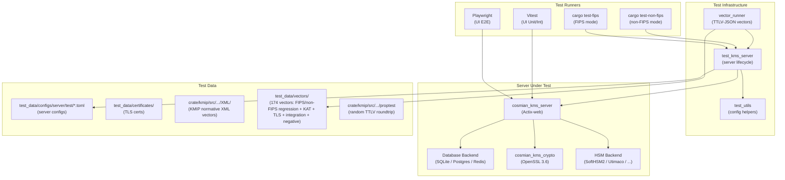
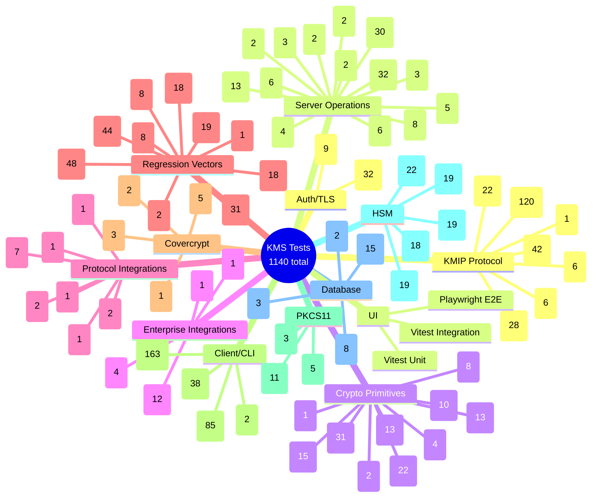
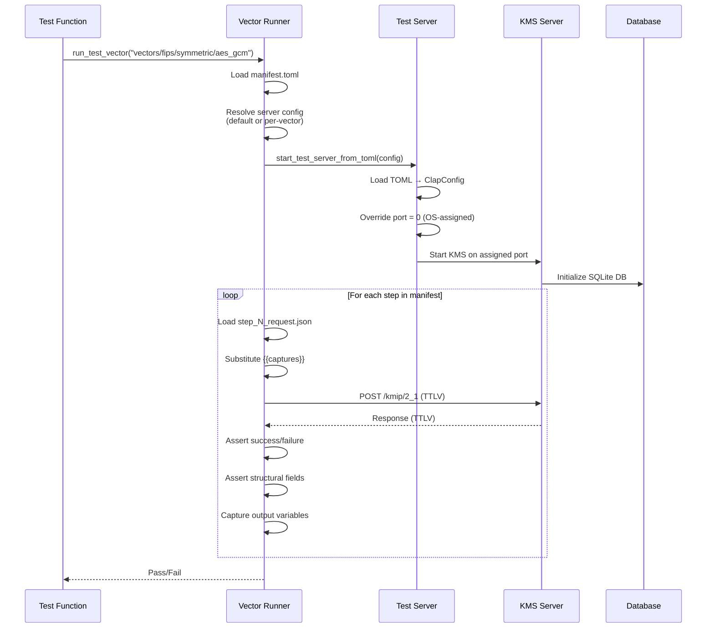

# Cosmian KMS — Test Architecture

> **1210 tests** across 8 crates · 133 `#[ignore]` · 191 `#[cfg(feature = "non-fips")]`

---

## 1. Test Infrastructure Overview



---

## 2. Test Categories



---

## 3. Test Vector Execution Flow



---

## 4. Test Inventory by Crate

### 4.1 `cosmian_kms_server` — 218 tests (200 pass · 18 ignored)

| Module | Tests | Feature Gate | Description |
|--------|-------|-------------|-------------|
| **Config & Startup** | | | |
| `config/command_line/clap_config` | 11 | — | Precedence chain, file loading, env fallback, error cases |
| `config/command_line/db` | 10 | — | URL validation, password masking (PostgreSQL, MySQL) |
| `config/command_line/idp_auth_config` | 1 | — | IDP configuration extraction |
| `config/wizard` | 6 | — | TOML round-trip, self-signed PKI generation, cert validation |
| `start_kms_server` | 2 | — | Session key derivation determinism |
| **Core Operations** | | | |
| `core/kms` | 4 | — | OTLP HTTPS/HTTP acceptance and rejection |
| `core/operations/certify` | 2 | — | Serial number length validation |
| `core/operations/hash` | 2 | — | SHA-256 hash with and without correlation |
| `core/operations/mac` | 2 | — | HMAC computation and limit cases |
| `core/operations/rng_retrieve` | 1 | — | RNG returns requested length |
| `core/operations/signature_verify` | 2 | — | CS-AC-M-2-21 normative verify (KMS + OpenSSL paths) |
| `core/operations/state_utils` | 4 | — | Effective state: active, pre-active ± activation date |
| `core/otel_metrics` | 5 | — | Active users, operation recording, duration, permissions |
| `error` | 1 | — | KMS error interpolation |
| **Middleware & Routes** | | | |
| `middlewares/jwt/jwks` | 6 | — | JWKS redirect safety, key parsing, skip-invalid-keys |
| `routes/google_cse/jwt` | 1 | — | Wrap auth (ignored: requires credentials) |
| `routes/kmip` | 3 | — | Error response serialization (TTLV, binary, message) |
| `routes/ms_dke` | 2 | — | BigUint and date format parsing |
| **Integration Tests** | | | |
| `azure_ekm/integration_tests` | 4 | — | Azure EKM wrap/unwrap roundtrips (AES-KW, AES-KWP, RSA-OAEP) |
| `bulk_encrypt_decrypt_tests` | 2 | non-fips | Bulk AES encrypt/decrypt, single CBC mode |
| `cover_crypt_tests/integration_tests` | 2 | non-fips | Covercrypt lifecycle with IDs, access policy parsing |
| `cover_crypt_tests/integration_tests_bulk` | 1 | non-fips | Covercrypt bulk operations |
| `cover_crypt_tests/integration_tests_tags` | 2 | non-fips | Covercrypt re-key, tag-based tests |
| `cover_crypt_tests/unit_tests` | 5 | non-fips | Covercrypt key creation, encrypt/decrypt, JSON access, import |
| `curve_25519_tests` | 2 | non-fips | Curve25519 keypair, multiple operations |
| `derive_key_tests` | 8 | — | PBKDF2, HKDF, error cases, missing params |
| `google_cse` | 12 | mixed | Google CSE signing, encryption, JWT (8 ignored: require OAuth) |
| `health_endpoint` | 2 | — | `/health` OK, root redirect to `/ui` |
| `hsm` | 1 | — | HSM full test (ignored: requires hardware) |
| `kmip_endpoints` | 1 | non-fips | KMIP endpoint validation |
| `kmip_messages` | 3 | non-fips | MAC, encrypt, full KMIP message tests |
| `kmip_policy/basic` | 18 | non-fips | Algorithm/key-size/mode policy (11 unit + 7 E2E) |
| `kmip_policy/e2e_ecies` | 5 | non-fips | ECIES curve allowlist enforcement |
| `kmip_policy/e2e_export_wrapping` | 6 | non-fips | Key wrapping suite enforcement (AES-GCM/KW/KWP, RSA-OAEP) |
| `kmip_policy/e2e_signature` | 1 | non-fips | Signature algorithm allowlist enforcement |
| `kmip_policy/overrides` | 2 | non-fips | Policy override tightening (unit + E2E) |
| `kmip_server_tests` | 5 | non-fips | Curve25519 pairs, wrapped import, transparent keys, tenants, register |
| `locate` | 3 | — | Object location, keypair+sym, filter by ObjectType AND semantics |
| `migrate/redis_tests` | 1 | non-fips | Redis Findex migration (ignored) |
| `ms_dke` | 1 | — | MS DKE decrypt (ignored: requires external service) |
| `mtls_db` | 9 | mixed | PostgreSQL/MySQL mTLS URL parsing and connections |
| `secret_data_tests` | 3 | — | Secret data CRUD, wrapping, KEK import/export |
| `security_regression` | 4 | — | Verify no plaintext/ciphertext leaks in traces |
| `test_modify_attribute` | 1 | — | Attribute modification |
| `test_set_attribute` | 1 | — | Attribute setting |
| `test_sign` | 6 | non-fips | RSA, ECDSA (P-256/P-384/P-521/K-256), EdDSA signing |
| `test_validate` | 2 | — | Certificate validation (ignored: requires network) |
| `ttlv_tests/*` | 40 | non-fips | TTLV wire protocol: create, get, encrypt, decrypt, import, register, locate, discover versions, query, DSA, normative tests, integrations |

### 4.2 `cosmian_kms_crypto` — 148 tests

| Module | Tests | Feature Gate | Description |
|--------|-------|-------------|-------------|
| `crypto/elliptic_curves/ecies` | 1 | non-fips | ECIES encrypt/decrypt P-curves |
| `crypto/elliptic_curves/operation` | 23 | non-fips | EC key generation, mask flags, algorithm checks |
| `crypto/elliptic_curves/sign` | 6 | non-fips | Ed25519, Ed448, ECDSA determinism, prehashed |
| `crypto/elliptic_curves/verify` | 1 | non-fips | EC signature verification |
| `crypto/password_derivation` | 2 | non-fips | PBKDF2 derivation |
| `crypto/pqc/hybrid_kem` | 8 | — | Hybrid KEM roundtrips, key creation |
| `crypto/pqc/ml_dsa` | 4 | — | ML-DSA-44/65/87 sign/verify |
| `crypto/pqc/ml_kem` | 13 | — | ML-KEM roundtrips, error cases |
| `crypto/pqc/mod` | 7 | — | PQC serialization, key loading |
| `crypto/pqc/slh_dsa` | 13 | — | SLH-DSA all variants + key creation |
| `crypto/rsa/ckm_rsa_aes_key_wrap` | 5 | non-fips | RSA-AES key wrapping |
| `crypto/rsa/ckm_rsa_pkcs` | 1 | non-fips | PKCS#1 v1.5 |
| `crypto/rsa/ckm_rsa_pkcs_oaep` | 1 | non-fips | RSA-OAEP |
| `crypto/rsa/operation` | 3 | non-fips | RSA key operations |
| `crypto/rsa/sign` | 5 | mixed | RSA signatures (PSS variants non-fips) |
| `crypto/symmetric/rfc3394` | 4 | — | AES key wrap (RFC 3394) |
| `crypto/symmetric/rfc5649` | 8 | — | AES key wrap with padding (RFC 5649) |
| `crypto/symmetric/symmetric_ciphers` | 1 | non-fips | ChaCha20 |
| `crypto/symmetric/tests` | 13 | non-fips | AES-GCM, AES-XTS, AES-CBC, ChaCha20, GCM-SIV |
| `crypto/wrap/tests` | 6 | non-fips | Key wrapping operations |
| `error/mod` | 1 | — | Error handling |
| `openssl/certificate` | 1 | — | Certificate operations |
| `openssl/private_key` | 11 | mixed | Private key parsing (P-192, K-256, X25519, X448 are non-fips) |
| `openssl/public_key` | 11 | mixed | Public key parsing (same non-fips variants) |
| `openssl/x509_extensions` | 3 | — | X.509 extension parsing |

### 4.3 `cosmian_kmip` — 218 tests

| Module | Tests | Description |
|--------|-------|-------------|
| `ttlv/tests/kmip_2_1_tests` | 42 | KMIP 2.1 serialization roundtrips |
| `ttlv/tests/kmip_1_4_tests` | 6 | KMIP 1.4 serialization roundtrips |
| `ttlv/tests/wire_edge_cases` | 27 | Binary TTLV edge cases |
| `ttlv/tests/serialize_deserialize` | 14 | Generic TTLV serde |
| `ttlv/tests/serializer_deserializer` | 16 | TTLV serializer/deserializer pairs |
| `ttlv/tests/xml_edge_cases` | 18 | XML parsing edge cases |
| `ttlv/tests/ttlv_wire` | 2 | TTLV wire format |
| `ttlv/tests/vmware` | 7 | VMware KMIP interop |
| `ttlv/tests/mongodb` | 1 | MongoDB KMIP interop |
| `ttlv/tests/mysql` | 2 | MySQL KMIP interop |
| `ttlv/tests/covercrypt_serialize` | 1 | Covercrypt TTLV serialization |
| `ttlv/wire/ttlv_bytes_serializer` | 16 | Binary wire serialization |
| `ttlv/wire/ttlv_bytes_deserializer` | 13 | Binary wire deserialization |
| `ttlv/normalize` | 22 | TTLV normalization rules |
| `ttlv/xml/tests/` | 6 | XML mandatory/optional test vectors (KMIP 1.0/1.4/2.1) |
| `ttlv/xml/parser` | 1 | XML parser |
| `ttlv/xml/tests/ser_deser` | 2 | XML serde roundtrips |
| `ttlv/xml/tests/cs_bc_m_gcm_all` | 2 | GCM conformance suite |
| `ttlv/tests/proptest_roundtrip` | 1 | Property-based TTLV binary roundtrip (256 random cases) |
| `kmip_big_int` | 4 | BigInteger operations |
| `data_to_encrypt` | 1 | Encryption data struct |
| `kmip_2_1/extra/bulk_data` | 1 | Bulk data structures |
| `kmip_1_4/kmip_types` | 3 | KMIP 1.4 type tests |
| `kmip_1_4/kmip_attributes` | 1 | KMIP 1.4 attribute tests |
| `error/mod` | 1 | Error handling |
| `time_utils` | 1 | Time utility tests |

### 4.4 `cosmian_kms_server_database` — 28 tests

| Module | Tests | Feature Gate | Description |
|--------|-------|-------------|-------------|
| `core/main_db_params` | 8 | non-fips | Connection string redaction |
| `core/unwrapped_cache` | 3 | — | LRU cache, garbage collection |
| `stores/redis/permissions` | 1 | — | Redis permission store |
| `stores/redis/redis_with_findex` | 1 | — | Redis Findex store |
| `stores/sql/pgsql` | 15 | — | PostgreSQL URL parsing, retry logic |

### 4.5 `clients` — 317 tests

| Crate | Tests | Description |
|-------|-------|-------------|
| `ckms` (CLI binary) | 85 | Symmetric, RSA, EC, certificates, Covercrypt, PQC, shared ops, Google CSE, HSM, config |
| `clap` (CLI actions) | 163 | Same as ckms + AWS/Azure BYOK, XML KMIP conformance, error messages, metrics |
| `client` (HTTP client) | 38 | TLS, PKCS#12, cipher suites, OAuth, custom headers |
| `client_utils` | 2 | Vendor extension tag filtering |
| `pkcs11/module` | 11 | PKCS#11 interface, Oracle TDE |
| `pkcs11/loader` | 3 | OIDC login, migration (non-fips) |
| `pkcs11/provider` | 5 | KMS backend, key generation, SSH signing |

### 4.6 `test_kms_server` — 204 tests (non-FIPS)

| Module | Tests | Feature Gate | Description |
|--------|-------|-------------|-------------|
| `test_server` | 2 | non-fips | Server startup smoke tests (default + TOML config) |
| `vector_runner` (unit) | 6 | — | Manifest parsing, placeholder substitution, assertions, capture |
| `vector_runner` (integration) | 196 | mixed | TTLV-JSON regression + KAT + TLS + negative + non-fips symmetric + binary TTLV integration replays (see §5) |

### 4.7 HSM crates — 97 tests (all `#[ignore]`)

| Backend | Tests | Description |
|---------|-------|-------------|
| `softhsm2` | 22 | Full suite: AES, RSA, sign, multi-threaded, metadata |
| `utimaco` | 19 | Same suite for Utimaco HSM |
| `proteccio` | 19 | Same suite for Proteccio HSM |
| `smartcardhsm` | 18 | Same suite for SmartCard HSM |
| `crypt2pay` | 19 | Same suite for Crypt2Pay HSM |

### 4.8 `cosmian_kms_access` — 0 tests

No test functions.

---

## 5. Regression Test Vectors (TTLV-JSON)

All regression vectors use a uniform **TTLV-JSON** format. Each vector is a directory
under `test_data/vectors/fips/` containing a `manifest.toml` and one JSON step file
per KMIP operation. The vector runner (`crate/test_kms_server/src/vector_runner.rs`)
starts an isolated KMS server per test and replays the steps sequentially.

| Category | Vector Directory Name | KMIP Operations | Steps |
|----------|-----------------------|-----------------|-------|
| **Symmetric** | | | |
| Symmetric | `aes_create_get` | Create, Get | 2 |
| Symmetric | `aes_encrypt_decrypt` | Create, Encrypt, Decrypt, Revoke, Destroy | 5 |
| Symmetric | `aes128_encrypt_decrypt` | Create, Encrypt (AES-128-GCM), Decrypt | 3 |
| Symmetric | `aes256_cbc_encrypt_decrypt` | Create, Encrypt (AES-256-CBC), Decrypt | 3 |
| Symmetric | `aes128_cbc_encrypt_decrypt` | Create, Encrypt (AES-128-CBC), Decrypt | 3 |
| Symmetric | `aes192_gcm_encrypt_decrypt` | Create, Encrypt (AES-192-GCM), Decrypt | 3 |
| Symmetric | `aes192_cbc_encrypt_decrypt` | Create, Encrypt (AES-192-CBC), Decrypt | 3 |
| Symmetric | `aes128_ecb_encrypt_decrypt` | Create, Encrypt (AES-128-ECB, no padding, no nonce), Decrypt | 3 |
| Symmetric | `aes256_ecb_encrypt_decrypt` | Create, Encrypt (AES-256-ECB, no padding, no nonce), Decrypt | 3 |
| Symmetric | `aes256_gcm_aad_encrypt_decrypt` | Create, Encrypt (AES-256-GCM + AAD), Decrypt | 3 |
| Symmetric | `aes256_gcm_siv_encrypt_decrypt` | Create, Encrypt (AES-256-GCM-SIV), Decrypt | 3 |
| Symmetric | `aes128_gcm_siv_encrypt_decrypt` | Create, Encrypt (AES-128-GCM-SIV), Decrypt | 3 |
| Symmetric | `aes192_ecb_encrypt_decrypt` | Create, Encrypt (AES-192-ECB, no padding), Decrypt | 3 |
| Symmetric | `aes256_cbc_no_padding_encrypt_decrypt` | Create, Encrypt (AES-256-CBC, no padding), Decrypt | 3 |
| Symmetric | `aes128_xts_encrypt_decrypt` | Create, Encrypt (AES-128-XTS), Decrypt | 3 |
| Symmetric | `aes256_xts_encrypt_decrypt` | Create, Encrypt (AES-256-XTS), Decrypt | 3 |
| Symmetric | `chacha20_encrypt_decrypt` | Create, Encrypt (ChaCha20 pure stream), Decrypt | 3 |
| **Asymmetric** | | | |
| Asymmetric | `rsa_create_encrypt_decrypt` | CreateKeyPair (RSA-2048), Encrypt (OAEP/SHA-256), Decrypt | 3 |
| Asymmetric | `rsa4096_encrypt_decrypt` | CreateKeyPair (RSA-4096), Encrypt (OAEP/SHA-256), Decrypt | 3 |
| Asymmetric | `rsa2048_oaep_sha384_encrypt_decrypt` | CreateKeyPair (RSA-2048), Encrypt (OAEP/SHA-384), Decrypt | 3 |
| Asymmetric | `rsa2048_oaep_sha512_encrypt_decrypt` | CreateKeyPair (RSA-2048), Encrypt (OAEP/SHA-512), Decrypt | 3 |
| Asymmetric | `rsa2048_pkcs1v15_encrypt_decrypt` | CreateKeyPair (RSA-2048), Encrypt (PKCS#1 v1.5), Decrypt | 3 |
| Asymmetric | `ec_p256_sign_verify` | CreateKeyPair (P-256), Sign (ECDSA), SignatureVerify | 3 |
| Asymmetric | `ec_p384_sign_verify` | CreateKeyPair (P-384), Sign (ECDSA), SignatureVerify | 3 |
| Asymmetric | `ec_p521_sign_verify` | CreateKeyPair (P-521), Sign (ECDSA), SignatureVerify | 3 |
| Asymmetric | `rsa2048_pkcs1v15_sha256_sign` | CreateKeyPair (RSA-2048), Sign (PKCS#1 v1.5 SHA-256), SignatureVerify | 3 |
| Asymmetric | `rsa2048_pss_sha256_sign` | CreateKeyPair (RSA-2048), Sign (PSS-SHA256), SignatureVerify | 3 |
| Asymmetric | `rsa2048_pss_sha384_sign` | CreateKeyPair (RSA-2048), Sign (PSS-SHA384), SignatureVerify | 3 |
| Asymmetric | `rsa2048_pss_sha512_sign` | CreateKeyPair (RSA-2048), Sign (PSS-SHA512), SignatureVerify | 3 |
| Asymmetric | `eddsa_ed25519_sign` | CreateKeyPair (Ed25519), Sign (EdDSA), SignatureVerify | 3 |
| Asymmetric | `eddsa_ed448_sign` | CreateKeyPair (Ed448), Sign (EdDSA), SignatureVerify | 3 |
| Asymmetric | `ec_k256_sign_verify` | CreateKeyPair (secp256k1), Sign (ECDSA), SignatureVerify | 3 |
| Asymmetric | `rsa4096_pss_sha256_sign` | CreateKeyPair (RSA-4096), Sign (PSS-SHA256), SignatureVerify | 3 |
| Asymmetric | `rsa2048_pss_sha1_sign` | CreateKeyPair (RSA-2048), Sign (PSS-SHA1), SignatureVerify | 3 |
| Asymmetric | `ec_p256_ecies_encrypt_decrypt` | CreateKeyPair (P-256), Encrypt (ECIES), Decrypt | 3 |
| Asymmetric | `rsa2048_aes_key_wrap` | CreateKeyPair (RSA-2048), Encrypt (RSA-AES key wrap), Decrypt | 3 |
| **PQC** | | | |
| PQC | `ml_dsa_44_sign_verify` | CreateKeyPair (ML-DSA-44), Sign, SignatureVerify | 3 |
| PQC | `ml_dsa_65_sign_verify` | CreateKeyPair (ML-DSA-65), Sign, SignatureVerify | 3 |
| PQC | `ml_dsa_87_sign_verify` | CreateKeyPair (ML-DSA-87), Sign, SignatureVerify | 3 |
| PQC | `ml_kem_512_encap_decap` | CreateKeyPair (ML-KEM-512), Encrypt (encapsulate), Decrypt (decapsulate) | 3 |
| PQC | `ml_kem_768_encap_decap` | CreateKeyPair (ML-KEM-768), Encrypt (encapsulate), Decrypt (decapsulate) | 3 |
| PQC | `ml_kem_1024_encap_decap` | CreateKeyPair (ML-KEM-1024), Encrypt (encapsulate), Decrypt (decapsulate) | 3 |
| PQC | `slh_dsa_sha2_128s_sign_verify` | CreateKeyPair (SLH-DSA-SHA2-128s), Sign, SignatureVerify | 3 |
| PQC | `slh_dsa_sha2_128f_sign_verify` | CreateKeyPair (SLH-DSA-SHA2-128f), Sign, SignatureVerify | 3 |
| PQC | `slh_dsa_sha2_192s_sign_verify` | CreateKeyPair (SLH-DSA-SHA2-192s), Sign, SignatureVerify | 3 |
| PQC | `slh_dsa_sha2_192f_sign_verify` | CreateKeyPair (SLH-DSA-SHA2-192f), Sign, SignatureVerify | 3 |
| PQC | `slh_dsa_sha2_256s_sign_verify` | CreateKeyPair (SLH-DSA-SHA2-256s), Sign, SignatureVerify | 3 |
| PQC | `slh_dsa_sha2_256f_sign_verify` | CreateKeyPair (SLH-DSA-SHA2-256f), Sign, SignatureVerify | 3 |
| PQC | `slh_dsa_shake_128s_sign_verify` | CreateKeyPair (SLH-DSA-SHAKE-128s), Sign, SignatureVerify | 3 |
| PQC | `slh_dsa_shake_128f_sign_verify` | CreateKeyPair (SLH-DSA-SHAKE-128f), Sign, SignatureVerify | 3 |
| PQC | `slh_dsa_shake_192s_sign_verify` | CreateKeyPair (SLH-DSA-SHAKE-192s), Sign, SignatureVerify | 3 |
| PQC | `slh_dsa_shake_192f_sign_verify` | CreateKeyPair (SLH-DSA-SHAKE-192f), Sign, SignatureVerify | 3 |
| PQC | `slh_dsa_shake_256s_sign_verify` | CreateKeyPair (SLH-DSA-SHAKE-256s), Sign, SignatureVerify | 3 |
| PQC | `slh_dsa_shake_256f_sign_verify` | CreateKeyPair (SLH-DSA-SHAKE-256f), Sign, SignatureVerify | 3 |
| **KMIP Operations** | | | |
| KMIP Operations | `activate` | Create, Check, Activate, Check, Encrypt, Destroy | 6 |
| KMIP Operations | `attribute_management` | Create, GetAttributes, SetAttribute, AddAttribute, DeleteAttribute, ModifyAttribute, GetAttributeList | 7 |
| KMIP Operations | `certify_validate` | CreateKeyPair, Certify, Validate, Destroy ×3 | 6 |
| KMIP Operations | `check` | Create, Check, Activate, Check | 4 |
| KMIP Operations | `derive_key_pbkdf2` | Create, DeriveKey (PBKDF2-SHA256), Get | 3 |
| KMIP Operations | `destroy` | Create, Revoke, Destroy, Get (fail) | 4 |
| KMIP Operations | `discover_versions` | DiscoverVersions | 1 |
| KMIP Operations | `get_attribute_list` | Create, GetAttributeList, Revoke, Destroy | 4 |
| KMIP Operations | `get_attributes` | Create, GetAttributes, Revoke, Destroy | 4 |
| KMIP Operations | `hash_sha256` | Hash (SHA-256) | 2 |
| KMIP Operations | `hash_sha384` | Hash (SHA-384) | 2 |
| KMIP Operations | `hash_sha512` | Hash (SHA-512) | 2 |
| KMIP Operations | `hash_sha3_256` | Hash (SHA3-256) | 2 |
| KMIP Operations | `hash_sha3_384` | Hash (SHA3-384) | 2 |
| KMIP Operations | `hash_sha3_512` | Hash (SHA3-512) | 2 |
| KMIP Operations | `import_key` | Import, Get, Revoke, Destroy | 4 |
| KMIP Operations | `locate` | Create ×2, Locate | 3 |
| KMIP Operations | `mac_and_verify` | Create, MAC, MACVerify, MACVerify (fail) | 4 |
| KMIP Operations | `mac_hmac_sha384` | Create, MAC (HMAC-SHA384) | 2 |
| KMIP Operations | `mac_hmac_sha512` | Create, MAC (HMAC-SHA512) | 2 |
| KMIP Operations | `mac_hmac_sha3_256` | Import, MAC (HMAC-SHA3-256) | 2 |
| KMIP Operations | `derive_key_hkdf` | Create, DeriveKey (HKDF-SHA256), Get | 3 |
| KMIP Operations | `derive_key_pbkdf2` | Create, DeriveKey (PBKDF2-SHA256), Get | 3 |
| KMIP Operations | `derive_key_pbkdf2_sha512` | Create, DeriveKey (PBKDF2-SHA512), Get | 3 |
| KMIP Operations | `opaque_data` | Import, Get, Revoke, Destroy | 4 |
| KMIP Operations | `query` | Query | 1 |
| KMIP Operations | `register_export` | Register, Get, Export, Destroy | 4 |
| KMIP Operations | `rekey` | Create, ReKey, Encrypt | 3 |
| KMIP Operations | `rng_retrieve` | RNGRetrieve | 1 |
| KMIP Operations | `rng_seed` | RNGSeed | 1 |
| KMIP Operations | `secret_data` | Register, Get, Activate, Revoke, Destroy | 5 |
| **Access Control** | | | |
| Access Control | `revoke` | Create, Revoke, Encrypt (fail) | 3 |
| **Integrations** | | | |
| Integrations | `fips/integrations/synology_dsm` | Query ×4, Locate (empty), Register, ModifyAttribute, Locate (find), Activate, Revoke, Destroy (binary TTLV / KMIP 1.2) | 11 |
| Integrations | `fips/integrations/veeam` | CreateKeyPair, Get (public), Get (private), Destroy ×2 (binary TTLV / KMIP 1.4) | 5 |
| Integrations | `fips/integrations/vmware_vcenter` | DiscoverVersions, Query, Create, GetAttributes, AddAttribute ×3, GetAttributes, Get (binary TTLV / KMIP 1.1) | 9 |
| Integrations | `fips/integrations/mysql` | Create, Activate, Get, Revoke, Destroy (binary TTLV / KMIP 1.1) | 5 |
| Integrations | `fips/integrations/percona` | Register, Locate, Get, Revoke, Destroy (binary TTLV / KMIP 1.4) | 5 |
| Integrations | `fips/integrations/fortigate` | Create, Locate, Get, Activate, Revoke, Destroy (binary TTLV / KMIP 1.0) | 6 |
| Integrations | `non-fips/integrations/mongodb` | Create, Locate, Get, Destroy (binary TTLV / KMIP 1.0) | 4 |
| Integrations | `non-fips/integrations/pykmip` | DiscoverVersions, Create, CreateKeyPair, GetAttributes, Locate, Activate, Revoke, Destroy ×3 (binary TTLV / KMIP 1.2) | 11 |
| **TLS Transport** | | | |
| TLS | `tls/server_tls` | Create, Revoke, Destroy (HTTPS server TLS) | 3 |
| TLS | `tls/mtls` | Create, Revoke, Destroy (mTLS client certificate auth) | 3 |
| **Negative** | | | |
| Negative / Protocol | `negative/empty_request` | Empty body → error | 1 |
| Negative / Protocol | `negative/missing_data_encrypt` | Encrypt without Data → error | 2 |
| Negative / Protocol | `negative/missing_data_decrypt` | Decrypt without Data → error | 2 |
| Negative / Protocol | `negative/missing_uid_encrypt` | Encrypt without UniqueIdentifier → error | 1 |
| Negative / Protocol | `negative/nonexistent_key_encrypt` | Encrypt with unknown key ID → error | 1 |
| Negative / Protocol | `negative/nonexistent_key_decrypt` | Decrypt with unknown key ID → error | 1 |
| Negative / Protocol | `negative/wrong_key_type_encrypt` | Encrypt with RSA key for AES cipher → error | 2 |
| Negative / Protocol | `negative/destroy_then_encrypt` | Destroy key then encrypt → error | 3 |
| Negative / Protocol | `negative/empty_data_encrypt` | Encrypt with empty plaintext → success (server accepts) | 2 |
| Negative / Protocol | `negative/invalid_iv_length` | Encrypt with wrong-length IV → error | 2 |
| Negative / Protocol | `negative/sign_with_encrypt_key` | Sign with Encrypt-mask-only key → error | 2 |
| Negative / CryptoParams | `negative/crypto_params/encrypt_unsupported_mode` | Unsupported BlockCipherMode → success (GCM ignores unsupported padding) | 2 |
| Negative / CryptoParams | `negative/crypto_params/encrypt_unsupported_padding` | Unsupported PaddingMethod with GCM → success (GCM ignores padding) | 2 |
| Negative / CryptoParams | `negative/crypto_params/encrypt_mode_algo_mismatch` | ChaCha20 key + AES CryptographicParameters → success (key type wins) | 2 |
| Negative / CryptoParams | `negative/crypto_params/encrypt_gcm_invalid_tag_length` | Invalid TagLength for GCM → error | 2 |
| Negative / CryptoParams | `negative/crypto_params/sign_invalid_hash` | RSA-PSS with MD5 hash → success in non-FIPS | 2 |
| Negative / CryptoParams | `negative/crypto_params/sign_rsa_with_ecdsa_algo` | RSA key + ECDSA algorithm → error | 2 |
| Negative / CryptoParams | `negative/crypto_params/decrypt_wrong_mode` | Encrypt GCM then Decrypt CBC → error | 3 |
| Negative / CryptoParams | `negative/crypto_params/encrypt_chacha20_with_gcm_mode` | ChaCha20 key + GCM mode → success (routes to AES-GCM) | 2 |
| Negative / CryptoParams | `negative/crypto_params/hash_unsupported_algo` | Hash with MD5 → success in non-FIPS | 1 |
| Negative / CryptoParams | `negative/crypto_params/mac_unsupported_algo` | MAC with MD5 → success in non-FIPS | 2 |
| Negative / Decrypt | `negative/decrypt/decrypt_missing_iv_cbc` | AES-CBC decrypt without IV → error | 2 |
| Negative / Decrypt | `negative/decrypt/decrypt_empty_tag_gcm` | AES-GCM decrypt with empty auth tag → error | 2 |
| Negative / Decrypt | `negative/decrypt/decrypt_truncated_ciphertext` | AES-GCM decrypt truncated ciphertext → error | 2 |
| Negative / Decrypt | `negative/decrypt/decrypt_wrong_key` | Decrypt with wrong key → error | 3 |
| Negative / Decrypt | `negative/decrypt/decrypt_corrupted_ciphertext` | AES-GCM decrypt with corrupted ciphertext+tag → error | 3 |
| Negative / RSA | `negative/rsa/rsa_encrypt_oversized_data` | RSA-OAEP encrypt data too large → error | 2 |
| Negative / RSA | `negative/rsa/rsa_decrypt_with_public_key` | RSA decrypt using public key → error | 2 |
| Negative / RSA | `negative/rsa/rsa_decrypt_garbage` | RSA decrypt random bytes → error | 2 |
| Negative / Sign | `negative/sign_verify/verify_corrupted_signature` | Verify with bit-flipped signature → error | 3 |
| Negative / Sign | `negative/sign_verify/verify_wrong_key` | Verify with wrong keypair → error | 4 |
| Negative / Sign | `negative/sign_verify/sign_with_public_key` | Sign with public key → error | 2 |
| Negative / MAC | `negative/mac/mac_with_non_hmac_key` | MAC with AES key (not HMAC) → error | 2 |
| Negative / MAC | `negative/mac/mac_verify_wrong_data` | MACVerify with tampered data → error | 3 |
| Negative / Hash | `negative/hash/hash_missing_algorithm` | Hash without HashingAlgorithm → error | 1 |
| Negative / Hash | `negative/hash/hash_init_and_final_both_true` | Hash with InitIndicator=true AND FinalIndicator=true → error | 1 |
| Negative / DeriveKey | `negative/derive_key/derive_key_pbkdf2_no_salt` | PBKDF2 without Salt → error | 2 |
| Negative / DeriveKey | `negative/derive_key/derive_key_negative_iterations` | PBKDF2 with negative iteration count → error | 2 |
| Negative / Lifecycle | `negative/lifecycle/encrypt_pre_active_key` | Encrypt with pre-active key → error | 2 |
| Negative / Lifecycle | `negative/lifecycle/create_invalid_algorithm` | Create with unknown algorithm → error | 1 |
| Negative / Lifecycle | `negative/lifecycle/create_zero_length_key` | Create with CryptographicLength=0 → error | 1 |
| Negative / TypeMismatch | `negative/type_mismatch/import_malformed_key` | Import TransparentSymmetricKey with raw bytes → error | 1 |
| Negative / TypeMismatch | `negative/type_mismatch/encrypt_with_secret_data` | Encrypt using SecretData object → error | 2 |
| Negative / TypeMismatch | `negative/type_mismatch/revoke_already_destroyed` | Revoke a destroyed key → success (server accepts) | 3 |
| **non-FIPS CryptographicParameters** | | | |
| non-FIPS / GCM-SIV | `non-fips/aes128_gcm_siv_with_explicit_nonce` | Create (AES-128), Encrypt (client 12-B nonce), Decrypt | 3 |
| non-FIPS / GCM-SIV | `non-fips/aes256_gcm_siv_with_explicit_nonce` | Create (AES-256), Encrypt (client 12-B nonce), Decrypt | 3 |
| non-FIPS / GCM-SIV | `non-fips/aes128_gcm_siv_with_aad` | Create (AES-128), Encrypt (AAD + server nonce), Decrypt | 3 |
| non-FIPS / GCM-SIV | `non-fips/aes256_gcm_siv_with_aad` | Create (AES-256), Encrypt (AAD + server nonce), Decrypt | 3 |
| non-FIPS / ChaCha20 | `non-fips/chacha20_server_generated_nonce` | Create, Encrypt (no nonce → server generates 8-B nonce), Decrypt | 3 |
| non-FIPS / ChaCha20 | `non-fips/chacha20_with_explicit_cryptographic_params` | Create, Encrypt (CryptographicParameters{ChaCha20} + 8-B nonce), Decrypt | 3 |
| non-FIPS / Poly1305 | `non-fips/chacha20_poly1305_with_explicit_nonce` | Create, Encrypt (AEAD + client 12-B nonce), Decrypt | 3 |
| non-FIPS / Poly1305 | `non-fips/chacha20_poly1305_with_aad` | Create, Encrypt (AEAD + AAD + server nonce), Decrypt | 3 |

### 5.1 Known-Answer Test (KAT) Vectors (`test_data/vectors/kat/`)

KAT vectors use **published reference values** from NIST FIPS and RFC specifications to
verify bit-exact outputs. Each vector imports a known key and asserts exact ciphertext,
MAC, or derived-key values.

| Category | Vector Directory | Reference | Operations | Assert Field |
|----------|-----------------|-----------|------------|--------------|
| **Hash** | | NIST FIPS 180-4 / FIPS 202 ("abc") | | |
| Hash | `kat/hash/sha256` | FIPS 180-4 | Hash (SHA-256) | `Data` |
| Hash | `kat/hash/sha384` | FIPS 180-4 | Hash (SHA-384) | `Data` |
| Hash | `kat/hash/sha512` | FIPS 180-4 | Hash (SHA-512) | `Data` |
| Hash | `kat/hash/sha3_256` | FIPS 202 | Hash (SHA3-256) | `Data` |
| Hash | `kat/hash/sha3_384` | FIPS 202 | Hash (SHA3-384) | `Data` |
| Hash | `kat/hash/sha3_512` | FIPS 202 | Hash (SHA3-512) | `Data` |
| **MAC** | | RFC 4231 §4.2 ("Hi There", key=0x0B×32) | | |
| MAC | `kat/mac/hmac_sha256` | RFC 4231 §4.2 | Import, MAC (HMAC-SHA256) | `MACData` |
| MAC | `kat/mac/hmac_sha384` | RFC 4231 §4.2 | Import, MAC (HMAC-SHA384) | `MACData` |
| MAC | `kat/mac/hmac_sha512` | RFC 4231 §4.2 | Import, MAC (HMAC-SHA512) | `MACData` |
| MAC | `kat/mac/hmac_sha3_256` | NIST HMAC-SHA3 | Import, MAC (HMAC-SHA3-256) | `MACData` |
| MAC | `kat/mac/hmac_sha3_384` | NIST HMAC-SHA3 | Import, MAC (HMAC-SHA3-384) | `MACData` |
| MAC | `kat/mac/hmac_sha3_512` | NIST HMAC-SHA3 | Import, MAC (HMAC-SHA3-512) | `MACData` |
| MAC | `kat/mac/hmac_sha1` | RFC 2202 §3 | Import, MAC (HMAC-SHA1) | `MACData` |
| **Symmetric** | | NIST SP 800-38A / SP 800-38D | | |
| Symmetric | `kat/symmetric/aes128_ecb` | SP 800-38A F.1.1 | Import, Encrypt (AES-128-ECB) | `Data` |
| Symmetric | `kat/symmetric/aes192_ecb` | SP 800-38A F.1.3 | Import, Encrypt (AES-192-ECB) | `Data` |
| Symmetric | `kat/symmetric/aes256_ecb` | SP 800-38A F.1.5 | Import, Encrypt (AES-256-ECB) | `Data` |
| Symmetric | `kat/symmetric/aes128_cbc` | SP 800-38A F.2.1 | Import, Encrypt (AES-128-CBC, no padding) | `Data` |
| Symmetric | `kat/symmetric/aes192_cbc` | SP 800-38A F.2.3 | Import, Encrypt (AES-192-CBC, no padding) | `Data` |
| Symmetric | `kat/symmetric/aes256_cbc` | SP 800-38A F.2.5 | Import, Encrypt (AES-256-CBC, no padding) | `Data` |
| Symmetric | `kat/symmetric/aes128_gcm` | SP 800-38D TC7 | Import, Encrypt (AES-128-GCM + AAD) | `Data`, `AuthenticatedEncryptionTag` |
| Symmetric | `kat/symmetric/aes256_gcm` | SP 800-38D TC7 | Import, Encrypt (AES-256-GCM + AAD) | `Data`, `AuthenticatedEncryptionTag` |
| Symmetric | `kat/symmetric/chacha20_poly1305` | RFC 8439 §2.8 | Import, Encrypt (ChaCha20-Poly1305) | `Data`, `AuthenticatedEncryptionTag` |
| Symmetric | `kat/symmetric/chacha20_pure` | RFC 7539 §2.1 | Import, Encrypt (ChaCha20 pure stream) | `Data` |
| Symmetric | `kat/symmetric/aes128_xts` | IEEE 1619-2007 | Import, Encrypt (AES-128-XTS) | `Data` |
| Symmetric | `kat/symmetric/aes256_xts` | IEEE 1619-2007 | Import, Encrypt (AES-256-XTS) | `Data` |
| Symmetric | `kat/symmetric/aes192_gcm` | SP 800-38D TC7 | Import, Encrypt (AES-192-GCM + AAD) | `Data`, `AuthenticatedEncryptionTag` |
| Symmetric | `kat/symmetric/rfc3394_aes128_kek` | RFC 3394 §2.2.3 | Import KEK, Import key, Encrypt (AES-128 key wrap), Decrypt | `Data` |
| Symmetric | `kat/symmetric/rfc3394_aes192_kek` | RFC 3394 §2.2.3 | Import KEK, Import key, Encrypt (AES-192 key wrap), Decrypt | `Data` |
| Symmetric | `kat/symmetric/rfc3394_aes256_kek` | RFC 3394 §2.2.3 | Import KEK, Import key, Encrypt (AES-256 key wrap), Decrypt | `Data` |
| Symmetric | `kat/symmetric/rfc5649_aes128_kek` | RFC 5649 §6 | Import KEK, Encrypt (AES-128 key wrap with padding), Decrypt | `Data` |
| Symmetric | `kat/symmetric/rfc5649_aes192_kek` | RFC 5649 §6 | Import KEK, Encrypt (AES-192 key wrap with padding), Decrypt | `Data` |
| Symmetric | `kat/symmetric/rfc5649_aes256_kek` | RFC 5649 §6 | Import KEK, Encrypt (AES-256 key wrap with padding), Decrypt | `Data` |
| **Derive Key** | | RFC 5869 / RFC 8018 | | |
| Derive Key | `kat/derive_key/hkdf_sha256` | RFC 5869 §A.1 | Import, DeriveKey (HKDF-SHA256), Get | `KeyMaterial` |
| Derive Key | `kat/derive_key/pbkdf2_sha256` | RFC 8018 §5.2 | Import, DeriveKey (PBKDF2-SHA256), Get | `KeyMaterial` |
| Derive Key | `kat/derive_key/hkdf_sha384` | RFC 5869 §A.1 | Import, DeriveKey (HKDF-SHA384), Get | `KeyMaterial` |
| Derive Key | `kat/derive_key/hkdf_sha512` | RFC 5869 §A.1 | Import, DeriveKey (HKDF-SHA512), Get | `KeyMaterial` |
| Derive Key | `kat/derive_key/pbkdf2_sha384` | RFC 8018 §5.2 | Import, DeriveKey (PBKDF2-SHA384), Get | `KeyMaterial` |
| Derive Key | `kat/derive_key/pbkdf2_sha512` | RFC 8018 §5.2 | Import, DeriveKey (PBKDF2-SHA512), Get | `KeyMaterial` |
| **Asymmetric** | | | | |
| Asymmetric | `kat/asymmetric/ed25519_eddsa_sign` | RFC 8032 §7.1 Test 2 | Import Ed25519 private key, Sign (EdDSA) | `SignatureData` |
| Asymmetric | `kat/asymmetric/rsa2048_oaep_sha256_decrypt` | NIST PKCS#1 v2.2 | Import RSA-2048 private key, Decrypt (OAEP-SHA256) | `Data` |
| **Non-FIPS Symmetric** | | RFC 8452 (AES-GCM-SIV) | | |
| Symmetric (non-FIPS) | `kat/symmetric/aes128_gcm_siv` | RFC 8452 §C.1 | Import, Encrypt (AES-128-GCM-SIV) | `Data`, `AuthenticatedEncryptionTag` |
| Symmetric (non-FIPS) | `kat/symmetric/aes256_gcm_siv` | RFC 8452 §C.1 | Import, Encrypt (AES-256-GCM-SIV) | `Data`, `AuthenticatedEncryptionTag` |
| **Non-FIPS Asymmetric** | | RFC 8032 / RFC 6979 | | |
| Asymmetric (non-FIPS) | `kat/asymmetric/ed448_eddsa_sign` | RFC 8032 §7.4 Test 1 | Import Ed448 private key, Sign (EdDSA) | `SignatureData` |
| Asymmetric (non-FIPS) | `kat/asymmetric/secp256k1_ecdsa_sign` | RFC 6979 §A.2.5 | Import secp256k1 private key, Sign (ECDSA-SHA256) | `SignatureData` |
| **Non-FIPS Covercrypt** | | Cosmian Covercrypt v16 | | |
| Covercrypt (non-FIPS) | `kat/covercrypt_decrypt` | Self-generated USK | Import USK, Decrypt (Covercrypt single-decrypt) | `Data` |

### 5.2 Manifest Schema (`manifest.toml`)

```toml
# Required metadata
name = "AES-256 Create and Get"
description = "Creates an AES-256 symmetric key and retrieves it via Get"

# Optional: override default server config (defaults to auth_plain.toml)
# server_config = "test_data/configs/server/test/cert_auth.toml"

# Optional: wire format — "json" (default) or "binary"
# "json" sends TTLV-JSON to /kmip/2_1
# "binary" serializes to binary TTLV and POSTs to /kmip (application/octet-stream)
# wire_format = "binary"

# Optional: KMIP protocol version (default [2, 1])
# Used to set the RequestHeader version and select KMIP 1.x vs 2.x serialization
# kmip_version = [1, 4]

# Steps executed sequentially against the KMS server
[[steps]]
operation = "Create"
request = "step1_request.json"
assert_success = true                   # HTTP 200 + ResultStatus check

[steps.capture]
key_id = "UniqueIdentifier"             # capture tag value for use in later steps

[[steps]]
operation = "Get"
request = "step2_request.json"          # contains {{key_id}} placeholder
assert_success = true

[steps.assert_fields]
ObjectType = "SymmetricKey"             # assert specific TTLV tags in response

# Error testing: assert failure and inspect reason
[[steps]]
operation = "Encrypt"
request = "step3_encrypt_after_revoke.json"
assert_success = false
assert_error_reason = "PermissionDenied"           # match ResultReason tag
# assert_error_contains = "partial message match"  # alternative: substring in ResultMessage

# Negative assertions: verify fields are absent from response
[steps.assert_fields_absent]
fields = ["SensitiveField"]
```

### 5.3 Request Payloads (TTLV-JSON)

Request files are TTLV-JSON payloads. By default (`wire_format = "json"`), they
are sent directly to the `/kmip/2_1` endpoint. When `wire_format = "binary"`, the
JSON is wrapped in a `RequestMessage` envelope, serialized to binary TTLV, and
POSTed to `/kmip` with `Content-Type: application/octet-stream`.

Binary-mode integration vectors use KMIP 1.4 `TemplateAttribute` format:

```json
{
  "tag": "Create",
  "value": [
    { "tag": "ObjectType", "type": "Enumeration", "value": "SymmetricKey" },
    { "tag": "TemplateAttribute", "value": [
      { "tag": "Attribute", "value": [
        { "tag": "AttributeName", "type": "TextString", "value": "Cryptographic Algorithm" },
        { "tag": "AttributeValue", "type": "Enumeration", "value": "AES" }
      ]},
      { "tag": "Attribute", "value": [
        { "tag": "AttributeName", "type": "TextString", "value": "Cryptographic Length" },
        { "tag": "AttributeValue", "type": "Integer", "value": 256 }
      ]}
    ]}
  ]
}
```

JSON-mode vectors use KMIP 2.1 `Attributes` format:

```json
{
  "tag": "Create",
  "value": [
    { "tag": "ObjectType", "type": "Enumeration", "value": "SymmetricKey" },
    { "tag": "Attributes", "value": [
      { "tag": "CryptographicAlgorithm", "type": "Enumeration", "value": "AES" },
      { "tag": "CryptographicLength", "type": "Integer", "value": 256 }
    ]}
  ]
}
```

Placeholders use `{{variable_name}}` syntax and are substituted from captured values:

```json
{
  "tag": "Get",
  "value": [
    { "tag": "UniqueIdentifier", "type": "TextString", "value": "{{key_id}}" }
  ]
}
```

---

## 6. Server Configurations for Tests

30 TOML config files in `test_data/configs/server/test/`:

| Config File | Port | Auth | DB | TLS | Description |
|-------------|------|------|-----|-----|-------------|
| `auth_plain.toml` | 12001 | none | SQLite | no | Default for most tests |
| `cert_auth.toml` | 9999 | mTLS | SQLite | PEM | Client certificate auth |
| `auth_plain_jwt.toml` | — | JWT | SQLite | no | JWT authentication |
| `auth_https.toml` | — | none | SQLite | yes | HTTPS no auth |
| `auth_https_jwt.toml` | — | JWT | SQLite | yes | HTTPS + JWT |
| `hsm.toml` | 10001 | none | SQLite | no | Utimaco HSM |
| `kek.toml` | — | none | SQLite | no | Key encryption key |
| `privileged_users.toml` | — | none | SQLite | no | Privileged user list |
| `non_revocable.toml` | — | none | SQLite | no | Non-revocable key IDs |
| `postgres.toml` | — | none | PostgreSQL | no | PostgreSQL backend |
| `mysql.toml` | — | none | MySQL | no | MySQL backend |
| `redis_findex.toml` | — | none | Redis | no | Redis Findex backend |
| `ui.toml` | — | none | SQLite | no | UI test server |
| `smtp_notifications.toml` | — | none | SQLite | no | SMTP notifications |
| `*_mysql.toml` | — | varies | MySQL | varies | MySQL variants |
| `*_postgres.toml` | — | varies | PostgreSQL | varies | PostgreSQL variants |
| `*_redis_findex.toml` | — | varies | Redis | varies | Redis variants |

---

## 7. Feature Flag Matrix

| Feature | Tests Gated | Effect |
|---------|-------------|--------|
| `non-fips` | 184 | Enables Covercrypt, Curve25519, PQC CLI, AES-XTS, legacy OpenSSL |
| `interop` | on by default | Enables extra KMIP interop test operations |
| `insecure` | dev/test only | Skips OAuth token expiry, allows self-signed TLS |

Tests requiring `non-fips` are gated with `#[cfg(feature = "non-fips")]` on the test module or function.

---

## 8. Running Tests

```bash
# All FIPS tests
cargo test-fips

# All non-FIPS tests (includes FIPS + non-FIPS-only)
cargo test-non-fips

# Single crate
cargo test -p cosmian_kms_server --features non-fips

# Single test
cargo test -p cosmian_kms_server --features non-fips -- test_derive_key_pbkdf2_default

# Regression test vectors (in test_kms_server crate)
cargo test -p test_kms_server --features non-fips --lib vector_runner

# Single vector
cargo test -p test_kms_server --features non-fips --lib -- test_vec_aes_create_get

# Run vectors with response recording (writes step*_response.json files)
RECORD_VECTORS=1 cargo test -p test_kms_server --features non-fips --lib vector_runner

# UI E2E tests
cd ui && CI=true PLAYWRIGHT_BASE_URL="http://127.0.0.1:5173" pnpm run test:e2e

# HSM tests (require hardware)
HSM_USER_PASSWORD=1234567 HSM_SLOT_ID=0 cargo test -p softhsm2_pkcs11_loader --features softhsm2 -- --ignored
```
