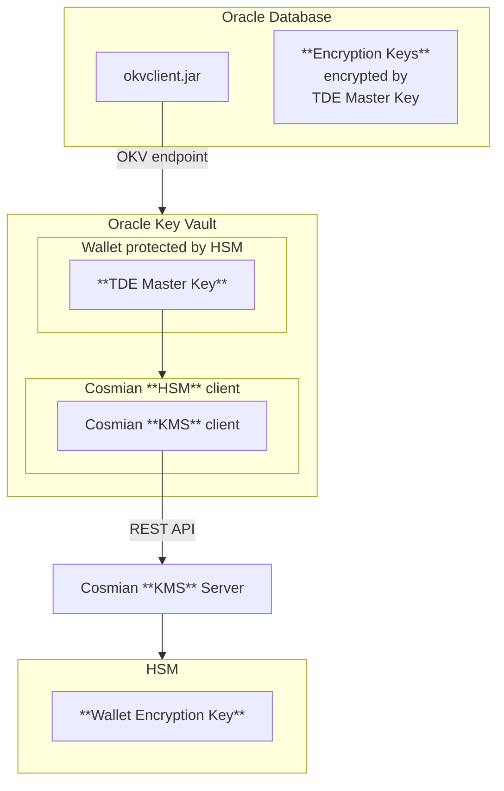
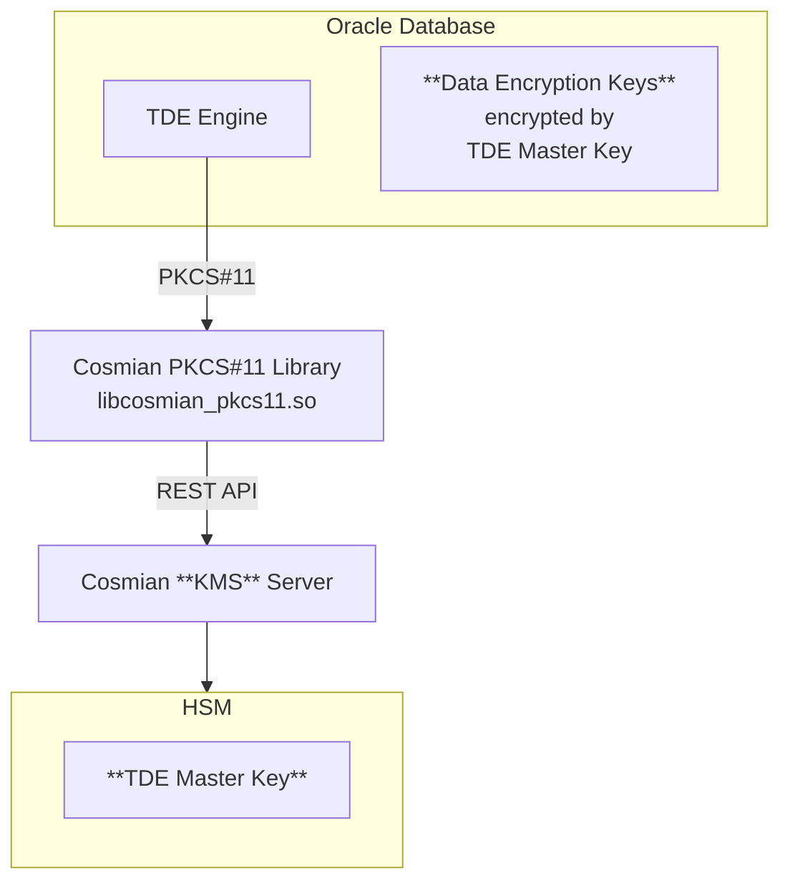

# Oracle Database Transparent Data Encryption (TDE)

**Oracle Database** [Transparent Data Encryption (TDE)](https://docs.oracle.com/en/database/oracle/oracle-database/23/dbtde/introduction-to-transparent-data-encryption.html) enables automatic encryption of data at rest in Oracle databases. Users can execute SQL queries normally while TDE handles encryption transparently in the background. Encryption keys are stored directly in the database but can be encrypted using **Oracle Key Vault** or directly with **Hardware Security Modules (HSM)** via PKCS#11.

Cosmian provides two deployment modes for Oracle TDE integration:

1. **Oracle Key Vault + HSM Mode**: Uses Oracle Key Vault as an intermediary with HSM as Root-of-Trust
2. **Direct HSM Mode**: Direct communication between Oracle Database and HSM via PKCS#11 interface

## Mode 1: Oracle Key Vault + HSM Integration

**Oracle Key Vault** centralizes encryption key management, offering secure storage and distribution for Oracle databases and enterprise applications. It uses `wallets` to the crucial TDE `master key` which acts as the `Key-Encryption-Key (KEK)` for TDE. The `master key` is stored in a `wallet` that is protected by a password. This `wallet` provides a secure and centralized location for managing encryption keys.

For enhanced security, **Hardware Security Modules (HSM)** can be integrated with Oracle Key Vault to provide additional protection for these `wallets`. This configuration establishes a [Root-of-Trust (RoT)](https://docs.oracle.com/en/database/oracle/key-vault/18.5/okvhm/getting-started-hsm.html#GUID-DADA7E20-82E2-40C9-A63A-4A159EBD5F09): when an HSM is deployed with Oracle Key Vault, the RoT remains in the HSM. The HSM RoT protects the Transparent Data Encryption (TDE) wallet password, which protects the TDE master key, which in turn protects all the encryption keys, certificates, and other security artifacts managed by the Oracle Key Vault server. Note that the HSM in this RoT usage scenario does not store any customer encryption keys. The customer keys are stored and managed directly by the Oracle Key Vault server.

Using HSM as a RoT is intended to mitigate attempts to recover keys from an Oracle Key Vault server which has been started in an unauthorized environment.
Physical loss of an Oracle Key Vault server from a facility is one example of such a scenario.

When an **Oracle Key Vault server** is HSM-enabled, Oracle Key Vault contacts the HSM every five minutes (or whatever you have set the monitoring interval to) to ensure that the Root of Trust key is available and the TDE wallet password can be decrypted.

What Cosmian provides is:

- **a HSM client**: this is a PKCS#11 provider library that make the Oracle Key Vault a HSM client itself. **It enables the Root-of-Trust** by protecting the Oracle Key Vault wallets passwords. That library also provides a KMS client to communicate with the KMS server.
- **a KMS server** that is interrogated by the KMS client. The KMS server can either front a HSM or act as a HSM but deployed in a secure environment.

<div align="center">



</div>

### Oracle Key Vault Configuration

Before configuring a HSM such as described in [Oracle Key Vault](https://docs.oracle.com/en/database/oracle/key-vault/21.10/okvhm/index.html), some steps are needed:

For Oracle Database OS, the PKCS#11 library is available here: [cosmian-pkcs11](https://package.cosmian.com/cli/5.16.1/debian10-release.zip).

- Extract debian10-release.zip (debian 10 Buster is used for Glibc compatibility)
- Copy the PKCS#11 provider library to the Oracle Key Vault server to `/usr/local/okv/hsm/generic/libcosmian_pkcs11.so`
- Copy the configuration of the PKCS#11 provider library to `/usr/local/okv/hsm/generic/cosmian.toml`
- Override the OKV generic HSM configuration files:

    - `/usr/local/okv/hsm/generic/okv_hsm_env`

    ```bash
    COSMIAN_PKCS11_LOGGING_LEVEL="trace"
    CKMS_CONF="/usr/local/okv/hsm/generic/cosmian.toml"
    COSMIAN_PKCS11_LOGGING_FOLDER="/var/okv/log/hsm"
    ```

    - `/usr/local/okv/hsm/generic/okv_hsm_conf`

    ```bash
    # Oracle Key Vault HSM vendor configuration file
    # Lines must be shorter than 4096 characters.

    # The vendor name, to be displayed on the HSM page on the management console.
    VENDOR_NAME="Cosmian"

    # The location of the PKCS#11 library. This file must be preserved on upgrade.
    PKCS11_LIB_LOC="/usr/local/okv/hsm/generic/libcosmian_pkcs11.so"

    # A colon-separated list of the full paths of files and directories that must
    # be preserved on upgrade. All of these files and directories should have been
    # created by the HSM client software setup; none should have existed on Oracle
    # Key Vault by default. These will be necessary when upgrading to a version
    # of Oracle Key Vault that is running on a higher major OS version.
    # Do not use wildcards.
    PRESERVED_FILES=""
    ```

- At this point, the symmetric key labeled `OKV 18.1 HSM Root Key` has been created in KMS server by Oracle Key Vault.
- Then you can follow the official [HSM-Enabling in a Standalone Oracle Key Vault Deployment](https://docs.oracle.com/en/database/oracle/key-vault/21.10/okvhm/configuring-hsm-oracle-key-vault1.html#GUID-5645696A-3F19-4CF9-AE79-105569529182).

## Mode 2: Direct HSM Integration

For simplified deployments or environments where Oracle Key Vault is not available, Oracle Database can communicate directly with HSM via PKCS#11. In this mode, the Cosmian PKCS#11 library (`libcosmian_pkcs11.so`) provides direct access to the Cosmian KMS server, which manages the TDE master keys in the HSM.

This approach eliminates Oracle Key Vault from the architecture, reducing complexity while maintaining the security benefits of HSM-protected keys.

<div align="center">



</div>

### Direct HSM Configuration

1. **Install Cosmian PKCS#11 Library**

   For Oracle Database OS, the PKCS#11 library is available here: [cosmian-pkcs11](https://package.cosmian.com/cli/5.16.1/debian10-release.zip).

   ```bash
   # Extract library from debian10-release.zip.
   unzip debian10-release.zip

   # Copy to Oracle's HSM directory
   mkdir -p /opt/oracle/extapi/64/hsm/Cosmian/
   cp libcosmian_pkcs11.so /opt/oracle/extapi/64/hsm/Cosmian/
   chown oracle:oinstall /opt/oracle/extapi/64/hsm/Cosmian/libcosmian_pkcs11.so
   ```

2. **Configure Cosmian PKCS#11 Library**

   Create the configuration file `/home/oracle/.cosmian/cosmian.toml`:

   ```toml
   [kms_config.http_config]
   server_url = "http://kms:9998"
   ```

   Set proper ownership:

   ```bash
   mkdir -p /home/oracle/.cosmian/
   chown oracle:oinstall /home/oracle/.cosmian/cosmian.toml
   ```

3. **Prepare Oracle Directory Structure**

   ```bash
   # Create keystore directories
   mkdir -p /etc/ORACLE/KEYSTORES/FREE
   chown -R oracle:oinstall /etc/ORACLE/KEYSTORES/FREE

   # Setup logging
   chown -R oracle:oinstall /var/log
   ```

4. **Configure Oracle Database for PKCS#11**

   Set up TDE to use the HSM via PKCS#11:

   ```sql
   -- Set WALLET_ROOT to point to the PKCS#11 library
   ALTER SYSTEM SET WALLET_ROOT='/opt/oracle/extapi/64/hsm/Cosmian/libcosmian_pkcs11.so' SCOPE=SPFILE;
   SHUTDOWN IMMEDIATE;
   STARTUP;

   -- Configure TDE to use HSM keystore
   ALTER SYSTEM SET TDE_CONFIGURATION='KEYSTORE_CONFIGURATION=HSM' SCOPE=BOTH SID='*';
   SHUTDOWN IMMEDIATE;
   STARTUP;
   ```

5. **Create and Configure HSM Keystore**

   ```sql
   -- Open the HSM keystore
   ADMINISTER KEY MANAGEMENT SET KEYSTORE OPEN IDENTIFIED BY hsm_identity_pass;

   -- Create TDE master key in HSM with backup
   ADMINISTER KEY MANAGEMENT SET KEY IDENTIFIED BY hsm_identity_pass WITH BACKUP;
   ```

6. **Verify Configuration**

   ```sql
   -- Check keystore status
   COLUMN WRL_PARAMETER FORMAT A50;
   SET LINES 200;
   SELECT WRL_TYPE, WRL_PARAMETER, WALLET_TYPE, STATUS FROM V$ENCRYPTION_WALLET;

   -- Verify keys are stored in HSM
   COLUMN NAME FORMAT A40;
   SET LINES 400;
   SELECT KEY_ID, KEYSTORE_TYPE, CREATOR_DBNAME, ACTIVATION_TIME, KEY_USE, ORIGIN
   FROM V$ENCRYPTION_KEYS;
   ```

7. **Optional: Create Test Encrypted Table**

   ```sql
   -- Create a table with encrypted columns to verify TDE is working
   CREATE TABLE test_tde (something CHAR(32) ENCRYPT);
   ```

### HSM Identity and Authentication

The `hsm_identity_pass` used in the SQL commands represents the PKCS#11 PIN that authenticates access to the HSM. This should be configured in your Cosmian KMS setup and corresponds to the authentication mechanism for accessing keys stored in the HSM.
