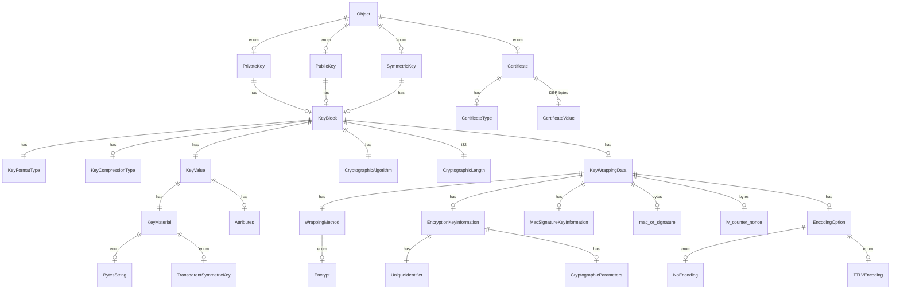

# Cosmian KMIP

The `cosmian_kmip` library implements the KMIP standard such as operations, objects, types, etc.
It also implements the TTLV serialization format.

Using feature `openssl` it provides conversions from KMIP objects to OpenSSL objects.

For specific Cosmian crypto-systems, you can use the [cosmian_kmip](https://github.com/Cosmian/kms/tree/main/crate/kmip) to generate KMIP data with an abstraction level.

## Supported KMIP Objects

<!--

    Unsupported WrappingMethods

    WrappingMethod ||--o| MACSign : enum
    WrappingMethod ||--o| EncryptThenMACSign : enum
    WrappingMethod ||--o| MACSignThenEncrypt : enum
    WrappingMethod ||--o| TR31 : enum

-->
