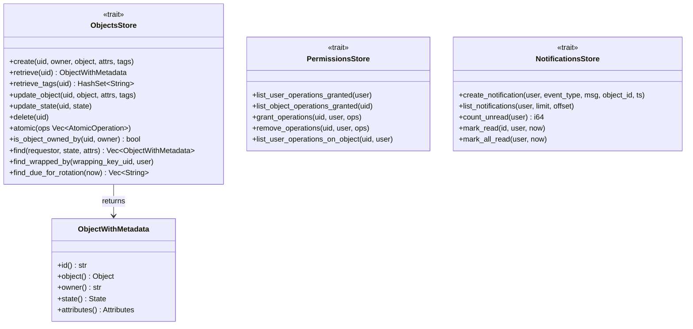
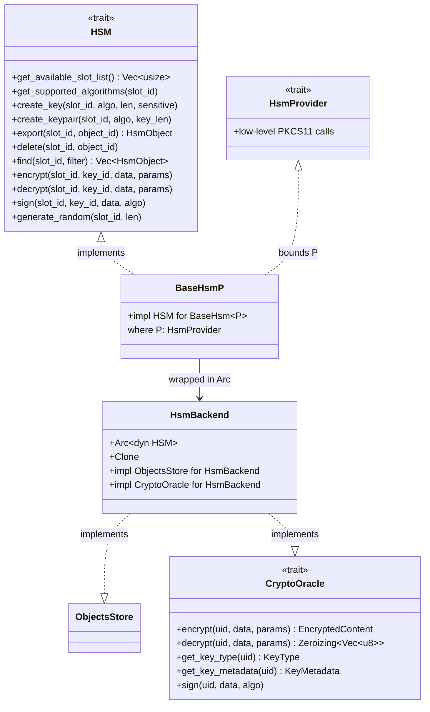
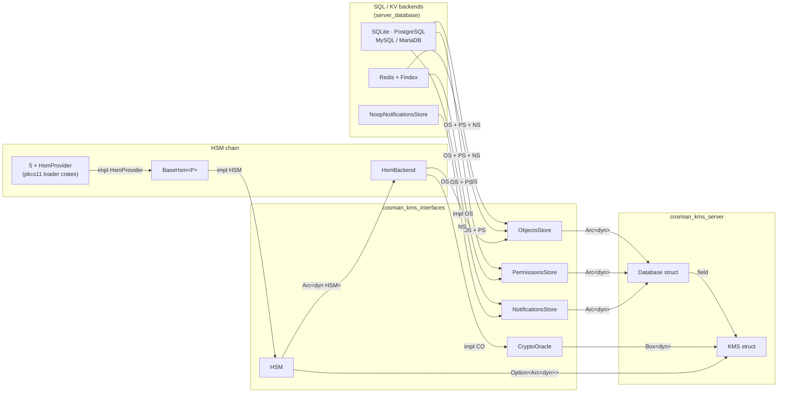
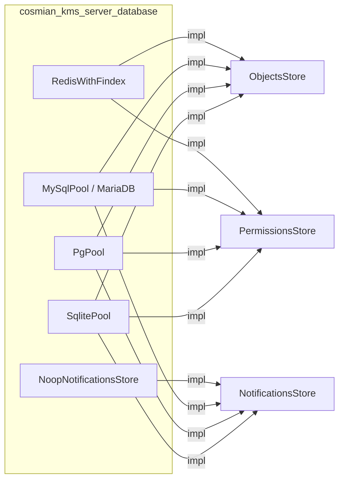
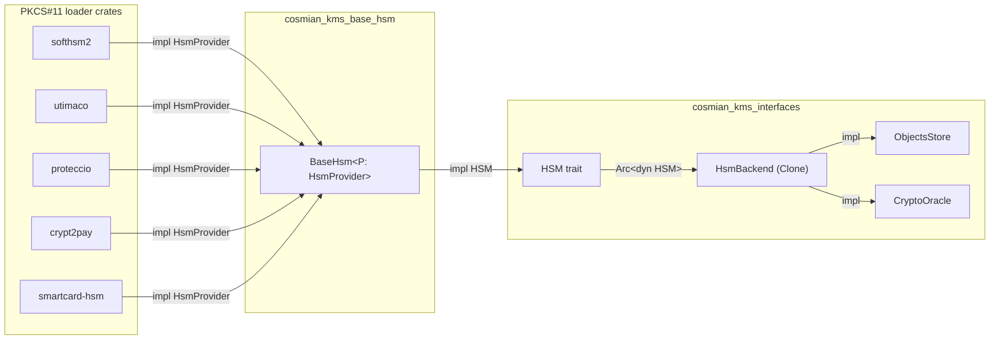
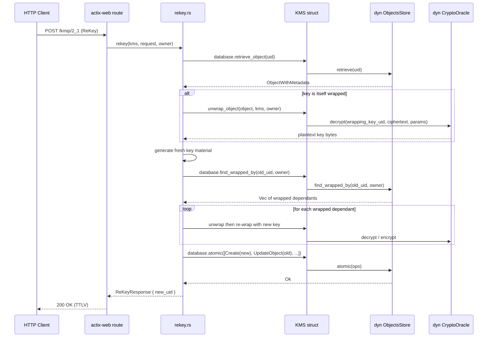

# `cosmian_kms_interfaces` — Plugin & Store Abstractions

This crate defines the **trait boundaries** between the KMS server core and every
pluggable backend: SQL/Redis databases, HSMs, and software crypto oracles.

Nothing in this crate performs I/O; it only declares types and async trait
signatures that other crates must implement.

---

## Module map

```text
cosmian_kms_interfaces
├── stores/
│   ├── ObjectsStore        — CRUD + search for KMIP objects
│   ├── PermissionsStore    — grant / revoke / query access rights
│   ├── NotificationsStore  — create / list / mark-read rotation notifications
│   └── ObjectWithMetadata  — thin wrapper: Object + owner + State + Attributes
├── hsm/
│   ├── HSM                 — raw PKCS#11-level interface (create, encrypt, sign …)
│   └── HsmBackend          — ObjectsStore + CryptoOracle adapter backed by an HSM
└── CryptoOracle            — software/HSM encryption, decryption, signing by key prefix
```

---

## Trait overview

### Store traits



### HSM & crypto-oracle traits



---

## Global overview — who implements and who consumes

The diagram reads left-to-right: *implementors* on the left drive through the
*trait layer* (centre) into the *consumers* on the right.



---

## Store backends

All SQL engines implement the three store traits. Redis implements only the two
persistence traits; `NoopNotificationsStore` fills the notifications gap.



---

## HSM chain

Five provider crates each implement `HsmProvider`. `BaseHsm<P>` uses that bound
to satisfy `HSM`. A single `HsmBackend` wraps the resulting `Arc<dyn HSM>` and
is `Clone`d to fill both the object-store map and the crypto-oracle map in
`KMS::instantiate()`.



---

## Request flow — ReKey using store abstractions

The sequence below shows how the `ReKey` operation uses each store trait during
symmetric key rotation (including wrapping-key rewrap).



---

## Key types

| Type | Source file | Description |
|---|---|---|
| `ObjectWithMetadata` | `stores/object_with_metadata.rs` | KMIP `Object` + owner + `State` + `Attributes` |
| `AtomicOperation` | `stores/objects_store.rs` | `Create`, `Upsert`, `UpdateObject`, `UpdateState`, `Delete` |
| `Notification` | `stores/notifications_store.rs` | Rotation/renewal event record with read status |
| `HsmObject` | `hsm/interface.rs` | Raw key material exported from an HSM slot |
| `KeyMetadata` | `crypto_oracle.rs` | Algorithm, length, sensitivity, and ID of a key |
| `EncryptedContent` | `crypto_oracle.rs` | Ciphertext + optional IV / authentication tag |
| `InterfaceError` | `error/mod.rs` | Unified error type for all interface operations |

---

## Adding a new backend

1. Add a crate dependency on `cosmian_kms_interfaces`.
2. Implement `ObjectsStore` and `PermissionsStore` (required for SQL/KV stores).
3. Optionally implement `NotificationsStore` (or use `NoopNotificationsStore`).
4. For HSM backends: implement `HsmProvider` in a new `*_pkcs11_loader` crate;
   `BaseHsm<YourProvider>` then automatically satisfies `HSM`, and `HsmBackend::new()
   becomes usable as both`ObjectsStore` and `CryptoOracle` without further code.
5. Register the backend in `cosmian_kms_server_database` (SQL) or
   `KMS::instantiate()` (HSM / crypto oracle).
