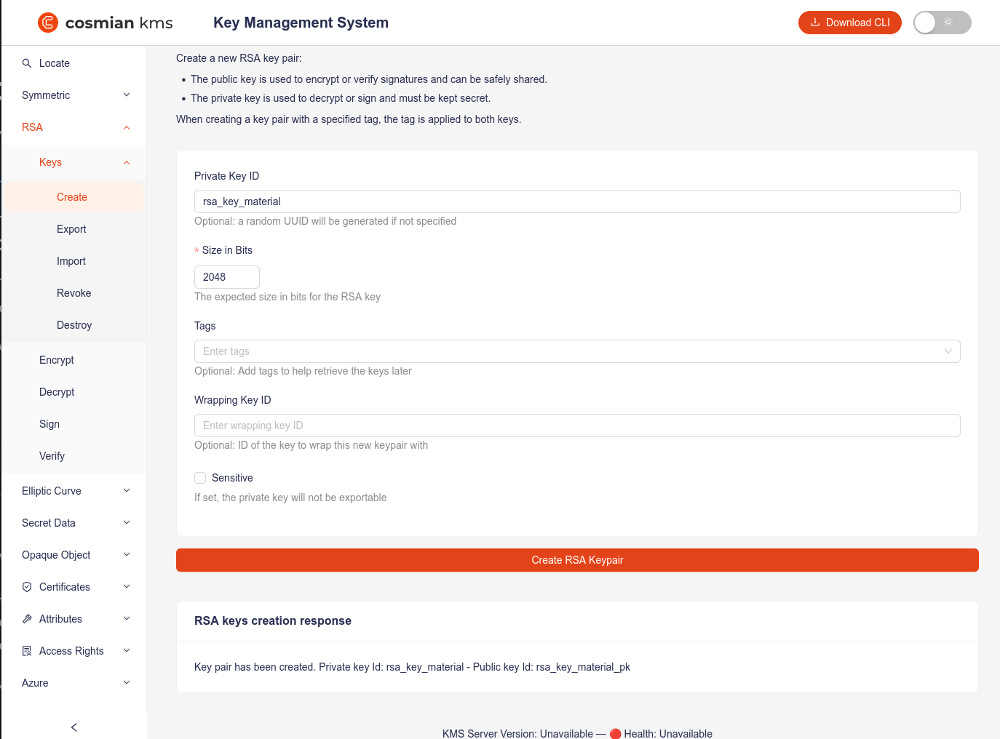
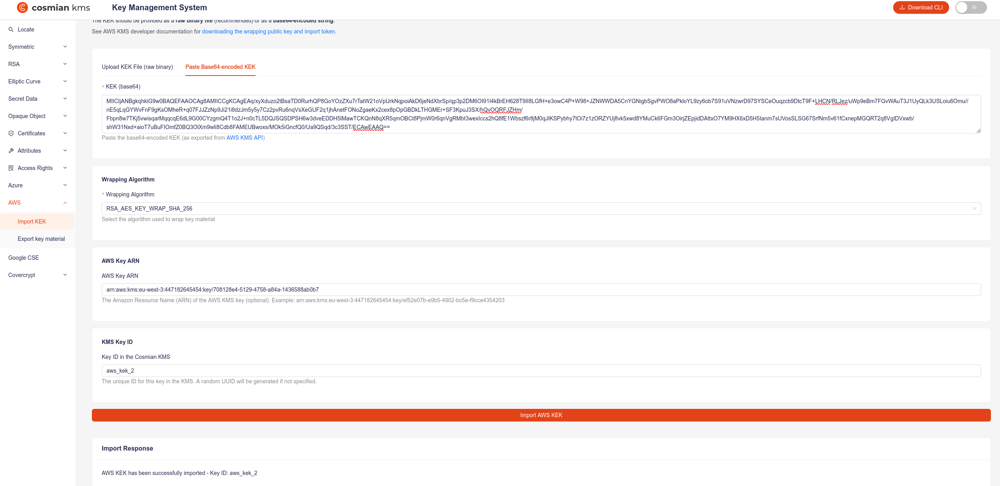
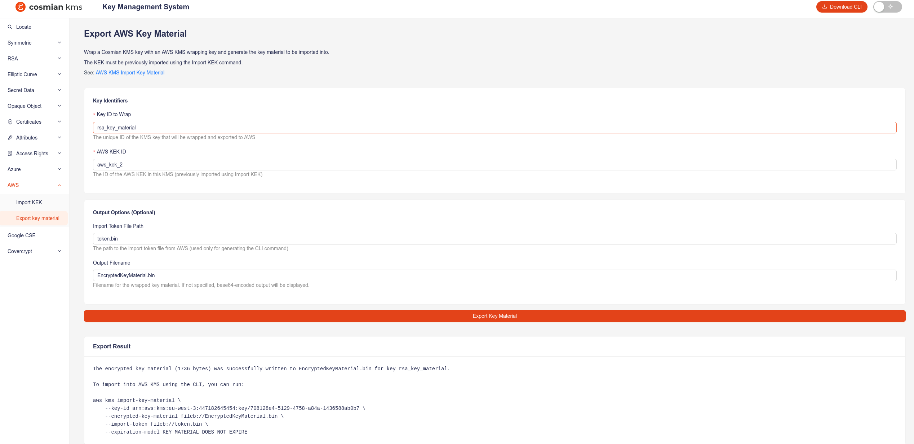

# AWS KMS - Bring Your Own Key (BYOK)

Cosmian KMS provides an `aws byok` command in its CLI (also available in the ui) to facilitate the import of an AWS wrapping key (KEK) in Cosmian KMS, and the export of the wrapped keys for direct import in AWS KMS. To use the AWS KMS terminology, the key that will be created in the [Cosmian KMS](https://cosmian.com/data-protection-suite/cosmian-kms/) will be called the _external key material_ as stated in the [AWS KMS docs](https://docs.aws.amazon.com/kms/latest/developerguide/importing-keys-conceptual.html).

The **key material** refers to the actual cryptographic key bytes that form the basis of a KMS key. While AWS KMS keys include additional metadata, policies, and access controls, the BYOK process allows Cosmian KMS users to maintain full control over key generation while leveraging AWS KMS's infrastructure for other usages.

## Table of Contents

[TOC]

## Overview

Since AWS KMS is a managed service where private key material never leaves AWS HSMs. The key import process requires:

1. Creating a KMS key with `EXTERNAL` origin (no key material)
2. Download the wrapping public key and import token from AWS
3. Wrap your key material using Cosmian KMS
4. Import the wrapped key material into AWS KMS

Supported wrapping algorithms:

| Wrapping Algorithm | Description | Supported Key Material Types |
|-------------------|-------------|------------------------------|
| **RSAES_OAEP_SHA_256**<br>**RSAES_OAEP_SHA_1** | The RSA encryption algorithm with Optimal Asymmetric Encryption Padding (OAEP) with SHA-256 or SHA-1 hash function. | • 256-bit AES Symmetric keys<br>• HMAC keys<br>• Asymmetric ECC private keys* |
| **RSA_AES_KEY_WRAP_SHA_256**<br>**RSA_AES_KEY_WRAP_SHA_1** | Hybrid wrapping (RSA + AES Key Wrap) with SHA-256 or SHA-1 hash function. | • Asymmetric RSA private keys<br>• Asymmetric ECC private keys |

**Wrapping Key Specs :**

- RSA_2048 (***Note**: cannot be used to wrap _ECC_NIST_P521_ keys with _RSAES_OAEP_SHA_*_ )
- RSA_3072
- RSA_4096

⚠️ **WARNING:** Invalid combinations of wrapping algorithms, key material types may lead to errors. Ensure that your selected key material type is supported by the chosen wrapping algorithm and that the wrapping key spec is compatible with both.


## Prerequisites

- An active AWS account
- Either : AWS CLI installed and configured on your machine (**recommended**) or an access to AWS Management Console and open the AWS Key Management Service (AWS KMS) console at [https://console.aws.amazon.com/kms](https://console.aws.amazon.com/kms).
- A running [Cosmian KMS](https://docs.cosmian.com/key_management_system/quick_start/) instance.
- Either : [Cosmian KMS CLI](https://docs.cosmian.com/cosmian_cli/installation/) installed and configured on your machine or an access to the [Cosmian KMS UI](../ui.md) of your deployed KMS instance.
- Any tool to convert base64 values to their binary counterparts (e.g. [openssl](https://openssl.org/), python, etc).

## Creating an AES key and importing it using the AWS CLI and the Cosmian CLI :

### 1. Create a KMS key with `EXTERNAL` origin

To use the AWS KMS API to create a symmetric encryption KMS key with no key material, send a CreateKey request with the Origin parameter set to EXTERNAL :

```bash
    aws kms create-key --origin EXTERNAL
```

If successful, the output should look like :

```json
{
    "KeyMetadata": {
        "AWSAccountId": "447182645454",
        "KeyId": "350e35ef-ac51-4dbb-82a4-9bc50b0ea42b",
        "Arn": "arn:aws:kms:eu-west-3:447182645454:key/350e35ef-ac51-4dbb-82a4-9bc50b0ea42b",
        "CreationDate": "2026-02-18T15:05:59.358000+01:00",
        "Enabled": false,
        "Description": "",
        "KeyUsage": "ENCRYPT_DECRYPT",
        "KeyState": "PendingImport",
        "Origin": "EXTERNAL",
        "KeyManager": "CUSTOMER",
        "CustomerMasterKeySpec": "SYMMETRIC_DEFAULT",
        "KeySpec": "SYMMETRIC_DEFAULT",
        "EncryptionAlgorithms": [
            "SYMMETRIC_DEFAULT"
        ],
        "MultiRegion": false
    }
}
```

> **Copy the key ARN, you will need it in the next step.** In this example, the key ARN is `arn:aws:kms:eu-west-3:447182645454:key/350e35ef-ac51-4dbb-82a4-9bc50b0ea42b`.

**Note**: If no key spec is specified, a symmetric key is created by default. To create a different key, pass the `key-spec` argument like below for an _ECC_NIST_P384_ key :

```bash
    aws kms create-key \
        --origin EXTERNAL \
        --key-spec ECC_NIST_P384 \
        --description "External NIST-P384 key for signing"
```

### 2. Create a symmetric key in Cosmian KMS

```bash
./cosmian kms sym keys create symmetric_key_test1
```

**Response:**
```
The symmetric key was successfully generated.
        Unique identifier: symmetric_key_test1
```

### 3. Download wrapping public key and import token from AWS

After you create a AWS KMS key with no key material, download a wrapping public key and an import token for that KMS key by using the AWS KMS console or the GetParametersForImport API. The wrapping public key and import token are an indivisible set that must be used together.

A very detailed example on how to do this is [detailed on this page, please refer to it for more info](https://docs.aws.amazon.com/kms/latest/developerguide/importing-keys-get-public-key-and-token.html).

The command you should use is the following :

```bash
aws kms get-parameters-for-import \
    --key-id arn:aws:kms:eu-west-3:447182645454:key/350e35ef-ac51-4dbb-82a4-9bc50b0ea42b \
    --wrapping-algorithm RSAES_OAEP_SHA_256 \
    --wrapping-key-spec RSA_4096
```

**Response:**
```json
{
    "KeyId": "arn:aws:kms:eu-west-3:447182645454:key/350e35ef-ac51-4dbb-82a4-9bc50b0ea42b",
    "ImportToken": "<YourBase64EncodedToken>",
    "PublicKey": "<YourBase64EncodedPublicKey>",
    "ParametersValidTo": "2026-02-19T15:07:13.227000+01:00"
}
```

As mentioned in the [AWS documentation for importing key material](https://docs.aws.amazon.com/kms/latest/developerguide/importing-keys-get-public-key-and-token.html#importing-keys-get-public-key-and-token-api), you will have to convert the base64 values to their binary counterparts before importing them. This can be done with the method of your choice, the most straightforward method (If you have [openssl](https://openssl.org/) on your cli), would be to copy the token and paste it with the following command to get the file `token.bin` :

```bash
echo -n "<YourBase64EncodedToken>" | openssl enc -d -base64 -A -out token.bin
```

In a similar manner, you can use the command if you want to keep your public key as a binary blob :

```bash
echo -n "<YourBase64EncodedPublicKey>" | openssl enc -d -base64 -A -out kek.bin
```

### 4. Import the AWS KEK into Cosmian KMS

```bash
./cosmian kms aws byok import \
    --kek-base64 "<YourBase64EncodedPublicKey>" \
    --wrapping-algorithm RSAES_OAEP_SHA_256 \
    --key-arn "<YourKeyArn>" \
    --key-id aws_kek_1
```

Feel free to change the key id to whatever you want, we will call the kek `aws_kek_1` in this example.

#### Alternative : importing the kek as file


```bash
./cosmian kms aws byok import \
    --kek-file kek.bin \
    --wrapping-algorithm RSAES_OAEP_SHA_256 \
    --key-arn arn:aws:kms:eu-west-3:447182645454:key/350e35ef-ac51-4dbb-82a4-9bc50b0ea42b \
    --key-id aws_kek_1
```

**Response:**
```
The PublicKey in file /tmp/ca9f45ad-8596-45a6-bc57-5591e662cb61 was successfully imported with id: aws_kek_1.
        Unique identifier: aws_kek_1
        Tags:
                - aws
                - wrapping_algorithm:RsaesOaepSha256
                - key_arn:arn:aws:kms:eu-west-3:447182645454:key/350e35ef-ac51-4dbb-82a4-9bc50b0ea42b
```


### 5. Export the wrapped key material from Cosmian KMS

```bash
./cosmian kms aws byok export \
    symmetric_key_test1 \
    kek_test1 \
    token.bin \ # optional, does not need the actual token, only uses the path to display the aws command
    EncryptedKeyMaterial.bin # optional, but if not specified, the cli will return the base64 encoded encrypted key material
```

**Response:**
```
The encrypted key material was successfully written to 512 for key symmetric_key_test1.

To import into AWS KMS using the API, run:
aws kms import-key-material \
--key-id arn:aws:kms:eu-west-3:447182645454:key/350e35ef-ac51-4dbb-82a4-9bc50b0ea42b \
--encrypted-key-material fileb://EncryptedKeyMaterial.bin \
--import-token fileb://token.bin \
--expiration-model KEY_MATERIAL_DOES_NOT_EXPIRE
```

### 6. Import the wrapped key material into AWS KMS

If you have filled all the for the fields on the previous step, you can directly use the command that the cosmian cli automatically generated for you :

```bash
aws kms import-key-material \
    --key-id arn:aws:kms:eu-west-3:447182645454:key/350e35ef-ac51-4dbb-82a4-9bc50b0ea42b \
    --encrypted-key-material fileb://EncryptedKeyMaterial.bin \
    --import-token fileb://token.bin \
    --expiration-model KEY_MATERIAL_DOES_NOT_EXPIRE
```

**Response:**
```json
{
    "KeyId": "arn:aws:kms:eu-west-3:447182645454:key/350e35ef-ac51-4dbb-82a4-9bc50b0ea42b",
    "KeyMaterialId": "60a5374a2457941eaf5c26b75fea0236bcdc5ddbe70c4aa15046e6fdda49e334"
}
```

Receiving this response means that the key material has been successfully imported into AWS KMS.

## Creating an AES key and importing it using the AWS CLI and the Cosmian CLI :

For this example, we will create an 2048 bits RSA key material, wrapped using a 4096 kek with RSAES_OAEP_SHA_256.

First, Sign in to the AWS Management Console and open the AWS Key Management Service (AWS KMS) console at [https://console.aws.amazon.com/kms](https://console.aws.amazon.com/kms) and complete the neccessary steps to [create a KMS key with external key material](). Be mindful to provide the correct [key spec](https://docs.aws.amazon.com/kms/latest/developerguide/symm-asymm-choose-key-spec.html) - otherwise the console will expect a symmetric key by default. For this example, we will use `RSA_2048`.

The next step is to [download the wrapping public key and import token](https://docs.aws.amazon.com/kms/latest/developerguide/importing-keys-get-public-key-and-token.html#importing-keys-get-public-key-and-token-console). **Be mindful that an RSA_AES_KEY_WRAP_SHA_* wrapping algorithm is required for wrapping RSA private key material (except in China Regions).** Chosing `RSAES_OAEP_SHA_256` will work for this example.

Once this is done, create your key on the cosmian KMS like follow, we call it `rsa_key_material` :



Then, navigate to the **AWS** - **Import Kek** section and fill with the adequate data. In this example, we paste the kek in the base64 format for convenience, and call it `aws_kek_2`.



Finally, export the wrapped key material from Cosmian KMS to import it into AWS KMS.



We named the file to export `EncryptedKeyMaterial.bin`. You can import the wrapped key material using the AWS CLI or the AWS Management Console.

An in depth explanation of the import process can be found in the [AWS documentation to Import key material (console)](https://docs.aws.amazon.com/kms/latest/developerguide/importing-keys-import-key-material.html#importing-keys-import-key-material-console).
