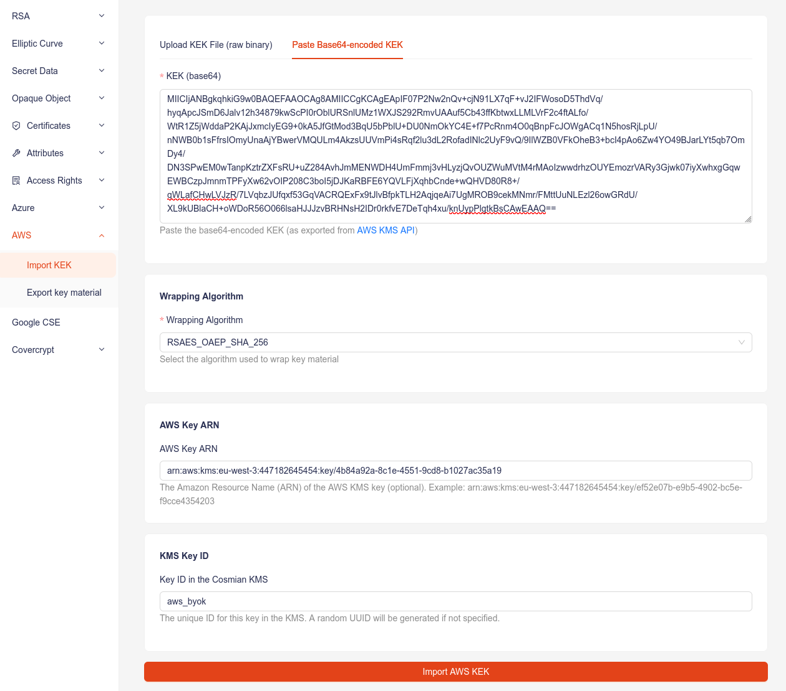

# AWS KMS - Bring Your Own Key (BYOK)

Cosmian KMS provides an `aws byok` command in its CLI (also available in the ui) to facilitate the import of an AWS wrapping key (KEK) in Cosmian KMS, and the export of the wrapped keys for direct import in AWS KMS. To use the AWS KMS terminology, the key that will be created in the [Cosmian KMS](https://cosmian.com/data-protection-suite/cosmian-kms/) will be called the _external key material_ as stated in the [AWS KMS docs](https://docs.aws.amazon.com/kms/latest/developerguide/importing-keys-conceptual.html).

The **key material** refers to the actual cryptographic key bytes that form the basis of a KMS key. While AWS KMS keys include additional metadata, policies, and access controls, the BYOK process allows Cosmian KMS users to maintain full control over key generation while leveraging AWS KMS's infrastructure for other usages.

## Overview

Since AWS KMS is a managed service where private key material never leaves AWS HSMs. The key import process requires:

1. Creating a KMS key with `EXTERNAL` origin (no key material)
2. Download the wrapping public key and import token from AWS
3. Wrap your key material using Cosmian KMS
4. Import the wrapped key material into AWS KMS

Supported wrapping algorithms:

| Wrapping Algorithm | Description | Supported Key Material Types |
|-------------------|-------------|------------------------------|
| **RSAES_OAEP_SHA_256**<br>**RSAES_OAEP_SHA_1** | The RSA encryption algorithm with Optimal Asymmetric Encryption Padding (OAEP) with SHA-256 or SHA-1 hash function. | • 256-bit AES Symmetric keys<br>• HMAC keys<br>• Asymmetric ECC private keys* |
| **RSA_AES_KEY_WRAP_SHA_256**<br>**RSA_AES_KEY_WRAP_SHA_1** | Hybrid wrapping (RSA + AES Key Wrap) with SHA-256 or SHA-1 hash function. | • Asymmetric RSA private keys<br>• Asymmetric ECC private keys |

**Wrapping Key Specs :**
- RSA_2048 (***Note**: cannot be used to wrap _ECC_NIST_P521_ keys with _RSAES_OAEP_SHA_*_ )
- RSA_3072
- RSA_4096

> ⚠️ **WARNING:** Invalid combinations of wrapping algorithms, key material types may lead to errors. Ensure that your selected key material type is supported by the chosen wrapping algorithm and that the wrapping key spec is compatible with both.

The following guide will detail how to export a symmetric key material wrapped using _RSAES_OAEP_SHA_256_ and the **[AWS KMS API](https://docs.aws.amazon.com/kms/latest/APIReference/Welcome.html)**.

## 1. Create a KMS key with `EXTERNAL` origin

To use the AWS KMS API to create a symmetric encryption KMS key with no key material, send a CreateKey request with the Origin parameter set to EXTERNAL :

```bash
    aws kms create-key --origin EXTERNAL
```

If successful, the output should look like :

```
{
    "KeyMetadata": {
        "AWSAccountId": "447182645454",
        "KeyId": "4b84a92a-8c1e-4551-9cd8-b1027ac35a19",
        "Arn": "arn:aws:kms:eu-west-3:447182645454:key/4b84a92a-8c1e-4551-9cd8-b1027ac35a19",
        "CreationDate": "2026-01-25T22:00:14.906000+01:00",
        "Enabled": false,
        "Description": "",
        "KeyUsage": "ENCRYPT_DECRYPT",
        "KeyState": "PendingImport",
        "Origin": "EXTERNAL",
        "KeyManager": "CUSTOMER",
        "CustomerMasterKeySpec": "SYMMETRIC_DEFAULT",
        "KeySpec": "SYMMETRIC_DEFAULT",
        "EncryptionAlgorithms": [
            "SYMMETRIC_DEFAULT"
        ],
        "MultiRegion": false
    }
}

```

> **Copy the key ARN, you will need it in the next step.**

#### Note :

If no key spec is specified, a symmetric key is created by default. To create a different key, pass the `key-spec` argument like below for an _ECC_NIST_P384_ key :

```bash
    aws kms create-key \
        --origin EXTERNAL \
        --key-spec ECC_NIST_P384 \
        --description "External NIST-P384 key for signing"
```

## 2. Generate a symmetric key in the Cosmian KMS

Navigate to the [Create a symmetric key](https://demo-kms.cosmian.dev/ui/sym/keys/create) tab and generate your key material. In this example, we will use **symmetric_key_material** as the ID for the sake of simplicity.

You should have the following response :

```
symmetric_key_material has been created.
```
arn:aws:kms:eu-west-3:447182645454:key/a68f40da-85e6-4798-b147-2bf096d29a70

{
    "KeyId": "arn:aws:kms:eu-west-3:447182645454:key/a68f40da-85e6-4798-b147-2bf096d29a70",
    "ImportToken": "AQECAHjI9wyV8duc1PbnNnvRgoPixtls559v7PxIfCjrbMLOIwAADWAwgg1cBgkqhkiG9w0BBwaggg1NMIINSQIBADCCDUIGCSqGSIb3DQEHATAeBglghkgBZQMEAS4wEQQM3po3vWPBNbl6XyxiAgEQgIINE1lEvcHaqU43Mdo1AXknT+Cg+97tXATY3iPcNaqsmuA595X71HVufoCNo1VjkTOzspa5LVrKh954A+BtYA7oowH15lO+KnSVZ6AkFCyw30LqVeCH0daUxgPmDy6nqQOSu8TBSFp003GEFBrYqYg89SpCdesndIoGjxNN1/3ug/kN/ESDVCCGOG7WqOxgrAux1s/H76YrzaESEts1M9zrgLymXKCoSAcihL45O2n3u6ohs5nQhMQOfai+kA6UrTKSpHmEbYcm4C0cTRDPG3FfEUOPx0luNyJDqqOcHlCTU1U+2ur41FSXHFg4VLNCLLL/mmxzya4SL1hDnO93E5a2nPwC6ybAVnhEEDh24c7sR2IvqNsUmBNu2NfrpP6KU8/vA0vCM0s1/YzG43xsDrTdFbqZwg8+SWiPNzmJwwKh70GuPcF81xy4U+C+rVumzXVcEw/nf4DzpcrQ5vE9PpXfZVgXhyg2tSjVq+R1vMHkNPONkFrvX6NL/cpbh+OxlH2+LlGUoN/AoAzUtpqkrvYqsiNi5vcfm9LIJk0JSbjufvoe1udZ3mZR5ZX8+cBci5Ga8gmeGjpPxmEtni+EBSBA2Wln5NVTcHPq42p2ecUhzmxAyokJNQfH6WbV0IOwUifRVBmmuavRW5k5w/U4/S2fIgMhLo4dBHTTHX76voR+u0QdnDOIyF5SdWLb0LVbSAaAq0c3JiNbYPUqpVHLxZDg6N2pJKzl385HmaD3GjufNodXdsUCWkf+kMbL3jUt8pg7yz643iWiyX958SfHmODZ/IldCv1BUKViW9iY7ak5L6CtFz6IbbTL2lcLxAPTMjoRnB6aS0gVCzSdstRbtOCd3mKeC2SCdvPxBF996+FhRXFZ92jpKw/p6xWDqK4eluQCRqysNqzYMzW3a64qnehe3URa7WmE35lpv4Rxz8bIqz7zPXkhc0MiNKKD15l0EjfBmkQiNLyKS5Kuuy/LqoJRwRUpDayyIY7vMOG8j4PFiuCCrOn0YSfznNvpruHewCmu/MsXXzvQY/gezmZ7Bu7pM8E8DfKnuOp7D6jOhF2d5RkztKkESVBKhNQP0MCpS0PcoX8wwdmFli5Ciou95Qy5XLRUc+YBb3FBK01fVWgC06zGkhPi+SwZmACcl+8tPKLUaOfWlUCVGISovlfL2hjJYE1BaOPfz2+KnozJknRoIucr+DmC0aYdw01t2dezV6T4X9WDfXnelsdr6zKw2c0QhQQRZj/SoehNPBW9YcFkwR9ZrRcHFP+unRe+jFuun4/eqtSjcAj1wu4x7rwcnSjYHQPWyM+vNd4YZFTh7ZzkHakYoeet7zbiNIemgigwNUsnpH099nrPe/HZyzj2wj6PZWnNKZCSzVNLTBg+7xqi/qvuYgPGKC13+dckV3DCFAUSDUkuxn/+FQp/bmNYK3us0y57AMwiAtv06quS4TnAMLJpvkAaW0BW13cjLJNdS9UafcwXqr/NwWM1rVI7Zmi6CGgAXRGyybYxZFs9BBoemo2N4X0+X6nf/j4zJ8BF2ZaKetSb+k6lCqot7KigBI7sNTcwmZg/53I1gD/enD+aHww8Jiq9iEsMV8T94rDLRiXcrE+R8Fw4SD9PIIO0cddmXFShtVr2b2CQpmpivrOu0YnPtVCdyj35qP10LHlX7PmalnjXuU0S1HC34Lzla1evMmU6xBF/cyn0zzr60xa17JquomWeGkb1nEL4slsgVaeAW7flPFm77woAIFecwgZzNyHIBFdbb7inO1TVjBbGZFrLwLdg/aTDnf2r1kfqS+phHJ6Ejuvpr9wj2wPI/EuIVmLW+v9NKQ/pAuYfJJtGWk0RIV+ffTMgcId+RiB6x0Ys31ADATBX33qWfQEj3qhnd6qAJvW9+vUgq9o4YhzAxU2d9afljfJVImfLQLtLCs9j0R6YwJ2CrsmQ6wmhQe8UOp3AxxhTFPvq5OuizI1HvEIpqXf8qsmN8bJKy2kU1wq2rtRyFU+tG0OZ/CXPbx/fmZHc7vdPNZitDOJWC+FBWxT9WvnexvFSEVTpSu7+4xXUqbJu9LYq6fxFMIDsxrTjqJMeDMdZPHizmnhZJVjvpQWcOeDx8VTUJokG9Ex+19LCBPBDHaMkSeLnPVcSaVFEidwVPjA2rUxXMP+hlhiDtqHGgEdUE3apALQU0y63kdsPs0nQfprlOON5WcOotCu9Ui337g4T6Bu/XFYzGqkrbI8rHolqi/9E0nlXzzIGwCAgzdeBBQAPOi0wJzIrBSEBrXax4yYpCIt2YHTHpgO7LkIVxAGxSA8RsP0nxmOhhWiX2guaIwM/BtindXdPieDcCrYhtNpcEqn6dO1YQ/kB8dYJtfNYkI6Z2mwGLbUmv8i57vVYZIF2MOrOEdUTH5rd8IUicD+SuUZwo/ykJqg2dU3nJczFotmLMaXtojH29uqz4tYdSRdq+/Fgs5UZvuOckp0Rhi6Lv1gkj1pT4EnScOasUObvXzbim515uZE/ShN5BJ0gd6tkEb9HY6ED46G3QYdskyAX9Xpfj82sgrYKnPCrgOivNSZfXqLutqc66ZPrU+a4hiTUYaDhvg+3tW1YlI4x5FHj3P8u7lNRNhCPIvrA5B9tpOMbdCQ+0OycclWYgnlsVMRm/yzpLIxZGATzyMcUpshwmm45oxrVjwMvJTq2onTCl1tW6v3xt0fVkiwjFmemHDvRKdGjdq5KmZD4NDUrBf2vt4aboSApIvkiyVLb6rLjWAOkcJxkmF8iEA7v1ThJQqytKrEfv5vqW8ra8y5wrUF5lO8PiFN+w0FOjEBgqjmtJQ7pWUtSDNNfd3+t/X7x/cQNWlltXrIFp5YMLZ/rReux3UfGMr+c1g9ByxKpQjmPn3oeQbtKj6L8MeS3sk/CP9vUrWHKCOP5GyWVEnWKWxqAEyjovh2SXjRdEBaz3aum+TaKpynkts0z4A9qABFJ4JaxLoirVbAwfLaAs9lqhvgnzk19Fn8wDk12/gl/aLFYXYdxRZfGLhFgrmCKMHjtYohw0cwe0NKj2+bIyjuMydzHNq1w1wuYRekmp5KhUP9ex9O/UNPW82TZ2/rOb9gt5NsuaH9LAeZEAsPONvU44nhJMF2B26BiMtiAJTrT6dK6RRAnrWnPQLTkpV4dfw9ABmiqD2Ie5WlT8uBAPDyEdRCWiWbfjp194gccqg1/L0GZGW2iSZRTjPGtehyk9N7x2uXEF1U7jX+uhaG7f1W7Iki4OTFUj04UsUNaX/Ab5oTf4Ksk9RCDl+waEaCGY1omiBfrRJX8YEM2nombG21n2GwkzmeCi5oGHGLXXzgF7x8gILoasAfSCJZnXZC8o/ASXw2HAwXOM67C7Sdk2zqnt9y5hDpzzR3XXIpyT1SV9yZ/JRR+MP4liZFjwEJ6Ofv/GrqW9BEXpd0RddcwvnbMt6R1QV2sXcIBWF0SDxMZN47mVk/jepu6RFUUAYdVlOKBpogq6w8AGPaWWJwd/ZkPWGM+6951XFKGOiSKR2aHwTZ5xEYMG69pVsA/Lu5mt4yarBP2ZXAPlcDyP3tgedIhH3kr9CMR69GybzdWbAJPqC2zH8aM9hI1c8JRvhRMUHTbqZPurD8nws7WPB2Q1S5/u+2Go6xdHBHMAeIIoC/5nJhKCbhsgFLMvlP7MseHPOLVHYjEjy1v8EszaC+MuSvoBI29JKtZNGCw2gpNvbzX5/Cswayt9OdoAMZgGXJ3DKAjH98T0vUN8tmaU3kfSKea436q4w06Vus7NygaSrQXPiPcuH7V1I3qLmu2lm/SGjS1/5sWWWLjajFOJv5AGTge7xk42biLHw94NBYeXDgIFk9M19YGPO/9wxDa62C3pkpnvBqNfgImb+noKzbVo786y1KLQV6pSmPM9O2CcmpR7Ooe2st6rPEoF2d1MUjYcWjBM+VgkLpQeL68Hf+o1dNfjYG489FEqYLTwdXMTrT4HThVdcZra+L2GBG9SBDnpqc8rV6D931uOqhkERabxjmp2N67wCK7A+bL2NgUC/10iu+PDkgiJXpxdb2mEpTV0nhwDfVQkyw4POBgoFw9LVJCLepnqHoH0EfJH/hXMidF81RjSVi6DcYBrEkI0ZiaXi7WDmfC8zbS1Vw7FwCoVEZxszlk9uBvbhFVKqMtewRfB5e9r+F58NFBc/YZX15zxP5UeYcaHcKmgbTR73jr8MSq1dPHRHbzqS9ngLAwaaS2QBf0xX4OQ5Ieingm1hQxZSB2XGyGFSkWKk8g3I7ePfEF+CP4QeZj+77SHrrENm3stLywDQk93BQaTMZRS75iANpSknmtvMd1o+saoE5VnYddLK0xcr6TkjxBUxRxTafAEZmqqn+h9RyOKWxiLrOq05caD8zu1n4cm8O6QcKWplPncdby9ntMvd0yLuJNNX63lWNauWMHBnCTzIttusEmJ61AJEcRP9KbU7/Skng29jPEZklJw12gmT9uKamH2HVscKnd",
    "PublicKey": "MIICIjANBgkqhkiG9w0BAQEFAAOCAg8AMIICCgKCAgEAtsNt+rdszE71mmBzRXTO+izYjup03vlga1a0/QpbjxkOWEppjVMeblh4MyQAD8HKLxyEabnnlRFcGFUxXfdWDX94mqjeW27Eu8mFVS+tnm0UZDQvLCEHcGRtOfuvGNjOAYmUd7I+7tRsnnG578r3o2DEp/WYqqBzKeMS2KgTooEfnLEgoca/ferFxOvjsJ7wJqahkh+zKSx6enSeJNh/R+XjxkT4MQFSCX0UkPCv7hzK7w+VaBC+KugaiPo+uVSL+LEbB2DIhBCXZoA6eeZzQ3gpiOPb9MNWtOAGdnhVhhobyYgH/Zlg0misZVy4h33hlUfXuh4JvNPhV1xYB8SFY/J/mwKkWbkB+8nGkEhfIL6fJbgD/+Oj5p9boGUTdVb1NAymbFk5wmGyHttOHPi3hDpc2GhouCG9KzNqVW1QNPYwHfFnaXeDVOG92dqNxSqxRN/p/3QEnW6KtO+x31ZnPa7OvDXxDAIkrIVB5ETB02NTLDX18Ri/4v5zBNNwudL0+jO5v53+JxtP3C+A8f7nxjJijUDAebmNVziDyfFrHA5m4+E5/qWDZhY/zygCKs+b4dMKk0iaS5SFqRKu79PKkz2+QIPKcmUZHEeXVA7PmE5yoYHODID0r44gcXZqthFxKxzWW9XE5WcCVRgN8VLoaQidA7MaWVtm+qIimw/Mt40CAwEAAQ==",
    "ParametersValidTo": "2026-02-13T18:39:25.085000+01:00"
}
~
~
~
~
(END)


## 3. Download the wrapping public key and import token from AWS

After you create a AWS KMS key with no key material, download a wrapping public key and an import token for that KMS key by using the AWS KMS console or the GetParametersForImport API. The wrapping public key and import token are an indivisible set that must be used together.

A very detailed example on how to do this is [detailed on this page, please refer to it for more info](https://docs.aws.amazon.com/kms/latest/developerguide/importing-keys-get-public-key-and-token.html).

If you use the AWS CLI, the command should look like :

```bash
aws kms get-parameters-for-import \
    --key-id arn:aws:kms:eu-west-3:447182645454:key/4b84a92a-8c1e-4551-9cd8-b1027ac35a19 \
    --wrapping-algorithm RSAES_OAEP_SHA_256 \
    --wrapping-key-spec RSA_4096
```

And have an output like this :

```
{
    "KeyId": "arn:aws:kms:eu-west-3:447182645454:key/4b84a92a-8c1e-4551-9cd8-b1027ac35a19",
    "ImportToken": "<YourBase64EncodedToken>",
      "PublicKey": "<YourBase64EncodedKey>",
    "ParametersValidTo": "2026-01-26T22:07:07.717000+01:00"
}
~
~
~
(END)
```

As mentioned in the [AWS documentation for importing key material](https://docs.aws.amazon.com/kms/latest/developerguide/importing-keys-get-public-key-and-token.html#importing-keys-get-public-key-and-token-api), you will have to convert the base64 values to their binary counterparts before importing them. This can be done with the method of your choice, the most straightforward method (If you have [openssl](https://openssl.org/) on your cli), would be to copy the token and paste it with the following command to get the file `token.bin` :

```bash
echo -n "<YourBase64EncodedToken>" | openssl enc -d -base64 -A -out token.bin
```

Then, navigate to **[Import AWS Key Encryption Key (KEK)](https://demo-kms.cosmian.dev/ui/aws/import-kek)** option of the **AWS** tab, on Cosmian KMS ui, fill the key arn you saved from the previous steps and the base64 key in the form like shown below then select the _RSAES_OAEP_SHA_256_ algorithm :



> we will call the kek _aws_byok_ in this example

You

## References

- [AWS KMS Developer Guide – Importing Key Material](https://docs.aws.amazon.com/kms/latest/developerguide/importing-keys.html)
- [AWS KMS – Requirements for Imported Key Material](https://docs.aws.amazon.com/kms/latest/developerguide/importing-keys-conceptual.html#importing-keys-material-requirements)
- [AWS KMS – Get Public Key and Import Token](https://docs.aws.amazon.com/kms/latest/developerguide/importing-keys-get-public-key-and-token.html)
- [RFC 3447 – PKCS #1: RSA Cryptography Specifications](https://tools.ietf.org/html/rfc3447)
- [RFC 5208 – PKCS #8: Private-Key Information Syntax](https://tools.ietf.org/html/rfc5208)
- [RFC 5649 – AES Key Wrap with Padding](https://tools.ietf.org/html/rfc5649)
