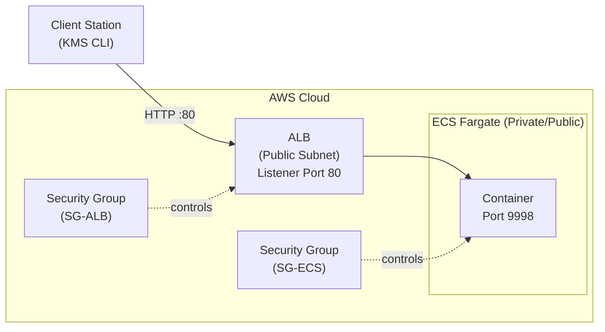
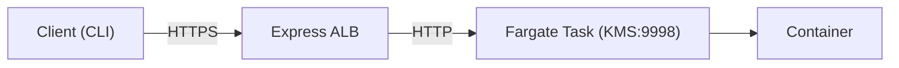

# Cosmian KMS on AWS ECS

Deploy Cosmian KMS on AWS ECS (Fargate) using either a production-ready setup with an Application Load Balancer (ALB) or a fast, fully managed Express Mode deployment.

---

[TOC]

## Overview

This repository documents two supported ways to run Cosmian KMS on AWS ECS.

Mode          | Use case
--------------| -------
Fargate + ALB | Production, custom networking, HTTPS, persistence
Express Mode  | PoC, demos, quick testing

## Prerequisites

- AWS account with access to:
    - ECS
    - EC2 (Security Groups)
    - Elastic Load Balancing
- A VPC with at least two subnets
- Docker image: `ghcr.io/cosmian/kms:latest`
- KMS CLI installed
  <https://docs.cosmian.com/kms_clients/installation/>

---

## Standard Deployment (Fargate + ALB)

## 1. Architecture

Traffic flows from the client to the ALB on the public HTTP port, which then routes requests to the private Fargate container on the application port.



## 2. Deployment Steps

### Networking

- ALB runs in public subnets
- ECS tasks can run in public or private subnets
- NAT Gateway is required if tasks run in private subnets

---

### Security Groups

ALB Security Group

- Inbound: 80/TCP (and 443/TCP if HTTPS is enabled)
- Outbound: all traffic

ECS Task Security Group

- Inbound: 9998/TCP
- Source: ALB security group only
- Outbound: as required (database, external services)

---

### Application Load Balancer

- Type: Internet-facing ALB
- Listener: HTTP on port 80

Target Group

- Target type: IP
- Protocol and port: HTTP / 9998

Health Check

- Path: **/ui**
- Success codes: 200
- Interval: 30 seconds
- Timeout: 10 seconds

---

### ECS Task Definition

- Image: ghcr.io/cosmian/kms:latest
- Container port: 9998
- Environment variables:
    - KMS configuration
    - Database connection (if persistence is enabled)

---

### ECS Service

- Attach the target group to container port 9998
- Health check grace period: minimum 60–120 seconds

---

## 3. Client Setup (KMS CLI)

[install KMS CLI](https://docs.cosmian.com/kms_clients/installation/)

Run: ckms configure

```bash
KMS URL example:
http(s)://<ALB-DNS-NAME>
```

---

## 4. Validation & Testing

Connectivity Test
Verify that the ALB is correctly routing traffic to a healthy container.

```bash
curl http(s)://<YOUR-ALB-DNS-NAME>/ui
# Expected response: 200 OK with a JSON payload containing the version.
```

Create a symmetric key:

```bash
ckms sym keys create --tag test --algorithm aes --number-of-bits 256
# Expected response:
The symmetric key was successfully generated.
      Unique identifier: xxxxxxx_xxxxxxx

  Tags:
    - test

```

---

## 5. Troubleshooting

503 Service Unavailable usually means:

- No running ECS tasks
- No healthy targets in the target group
- Health checks failing

Actions:

- Check ECS Service events
- Verify target group target health
- Increase health check grace period

Unhealthy targets:

- Ensure port 9998 is exposed
- Ensure ECS SG allows traffic from ALB SG
- Confirm /ui endpoint is reachable

---

## 6. Production Recommendations

- Enable HTTPS using ACM certificates
- Redirect HTTP to HTTPS
- Use an external database (e.g. RDS PostgreSQL) for persistence
- Configure Route53 DNS pointing to the ALB

---

## Express Mode Deployment

## Express Mode Architecture



---

## Express Mode Deployment Steps

AWS Console → ECS → Express Mode

- Image: ghcr.io/cosmian/kms:latest
- Service name: kms-express
- Container port: 9998
- Desired tasks: 1
- healthcheck path : **/ui**

Wait until service status is Active.

---

## Express Mode Client Setup

[install KMS CLI](https://docs.cosmian.com/kms_clients/installation/)

Run:

```bash
ckms configure
```

```bash
KMS URL example:
https://ex-xxxxxxxx.ecs.<region>.on.aws
```

---

## Express Mode Validation

Connectivity test:

```bash
curl https://ex-xxxxxxxx.ecs.<region>.on.aws/ui
# Expected response: 200 OK with a JSON payload containing the version.
```

Create a symmetric key:

```bash
ckms sym keys create --tag test-express --algorithm aes --number-of-bits 256
# Expected response:
The symmetric key was successfully generated.
      Unique identifier: xxxxxxx_xxxxxxx

  Tags:
    - test-express
```

---

## Production Notes

- Express Mode is suitable for development, demos, and PoCs
- HTTPS is included by default
- Storage is ephemeral
- Use an external database for persistence
- Deleting the service removes all associated resources

---

## License

Refer to Cosmian documentation for licensing and support details.
