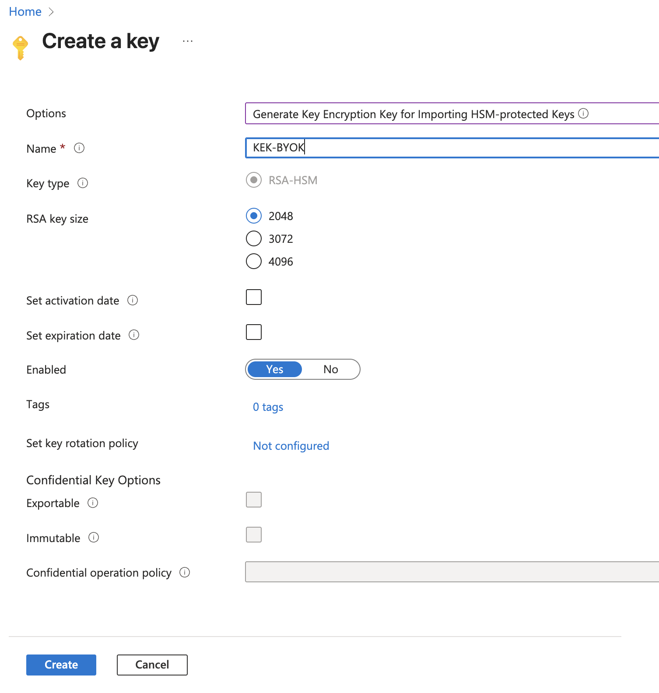
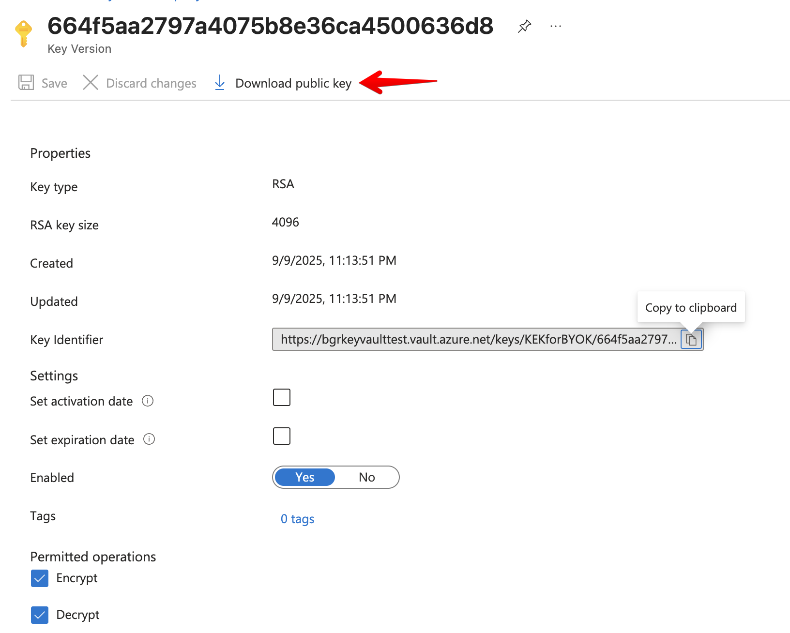
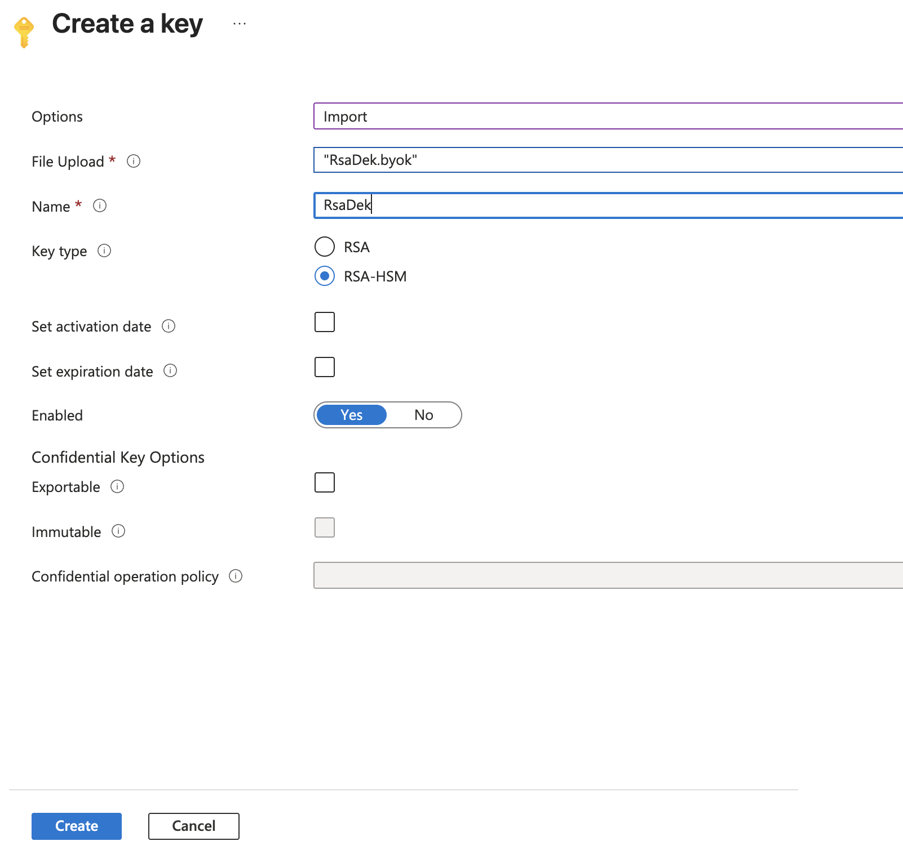

Cosmian KMS provides a `azure byok` command in its CLI to facilitate the import of an Azure wrapping key (KEK) in
Cosmian KMS, and the export of the wrapped keys in the `.byok` format for easy import in Azure Key Vault.

Follow this [Azure documentation](https://learn.microsoft.com/en-us/azure/key-vault/keys/byok-specification), for a
description of Bring Your Own Key (BYOK) in Azure Key Vault,

The vault must be a `premium` Azure Key Vault, and the user performing the operations
must have the role of `Crypto Officer`.

<!-- TOC -->
- [Create two test keys in the Cosmian KMS](#create-two-test-keys-in-the-cosmian-kms)
    - [Create an RSA Key](#create-an-rsa-key)
    - [Create an Elliptic Curve Key](#create-an-elliptic-curve-key)
- [Create an Azure Key Encryption Key (KEK)](#create-an-azure-key-encryption-key-kek)
- [Export the Key Encryption (Public) Key](#export-the-key-encryption-public-key)
- [Import the key encryption key in Cosmian KMS](#import-the-key-encryption-key-in-cosmian-kms)
- [Export the wrapped keys from the Cosmian KMS](#export-the-wrapped-keys-from-the-cosmian-kms)
    - [Export the RSA key](#export-the-rsa-key)
    - [Export the EC key](#export-the-ec-key)
- [Upload the byok transfer blob in Azure Key Vault](#upload-the-byok-transfer-blob-in-azure-key-vault)
    - [For an RSA Private Key](#for-an-rsa-private-key)
    - [For an EC Private Key](#for-an-ec-private-key)
<!-- TOC -->

## Create two test keys in the Cosmian KMS

These keys will later be exported wrapped by the Azure (KEK) key,
and imported into Azure Key Vault.

### Create an RSA Key

The key will be a 4096-bit key.

````shell
cosmian kms rsa keys create --size_in_bits 4096 TestRSAKey

   Public key unique identifier: TestRSAKey_pk
   Private key unique identifier: TestRSAKey
````

### Create an Elliptic Curve Key

The key will be created on the `NIST P-256` curve.

```shell
cosmian kms ec keys create --curve nist-p256 TestECKey

   Public key unique identifier: TestECKey_pk
   Private key unique identifier: TestECKey
```

## Create an Azure Key Encryption Key (KEK)

This key will be used to wrap the KMS RSA and EC private keys on export.

**Using the Azure console**:

Navigate to the Key Vault (say `MyPremiumKeyVault`) and create a 4096-bit RSA key.

Make sure to select `Generate Key Encryption Key for importing HSM-protected Keys`.



**Using the `az` CLI**:

The supported operations must be restricted to `import`.

```shell
az keyvault key create --kty RSA-HSM --size 4096 --name KEK-BYOK --ops import --vault-name MyPremiumKeyVault
```

In the `az`output, the key identifier (kid) will be something like:
"<https://mypremiumkeyvault.vault.azure.net/keys/KEK-BYOK/664f5aa2797a4075b8e36ca4500636d8>"

Please take note of the `kid` for next steps.

## Export the Key Encryption (Public) Key

The KEK public key must be exported, then imported into the KMS.

**Using the Azure console**:

Edit the KEK by double-clicking on it.

Please take note of the key identifier (kid), which will be required later.

Download the public key and rename the file `KEK-BYOK.public.pem`.



**Using the `az` CLI**:

```shell
az keyvault key download --name KEK-BYOK --vault-name MyPremiumKeyVault --file KEK-BYOK.public.pem
```

## Import the key encryption key in Cosmian KMS

The Cosmian CLI provides an `azure byok` command to facilitate both the import of the key encryption key in Cosmian KMS,
and the export of the wrapped keys in the `.byok` format for easy import in Azure Key Vault.

```shell
cosmian kms azure byok import KEK-BYOK.public.pem \
https://hsmbackedkeyvault.vault.azure.net/keys/BYOK_KEK/5e617a4d39c74f47b0b7d345f6a49d1b \
BYOK_KEK

The PublicKey in file KEK-BYOK.public.pem was imported with id: BYOK_KEK
          Unique identifier: BYOK_KEK

  Tags:
    - azure
    - kid:https://hsmbackedkeyvault.vault.azure.net/keys/BYOK_KEK/5e617a4d39c74f47b0b7d345f6a49d1b
```

Please note the presence of the `azure` and `kid:` tags on the key.
These identify the key as an Azure Key Encryption Key (KEK) in the Cosmian KMS.

## Export the wrapped keys from the Cosmian KMS

The Cosmian CLI `azure byok export` command will generate a `.byok` file
containing the wrapped private key, which can be directly imported into Azure Key Vault.

### Export the RSA key

```shell
cosmian kms azure byok export TestRSAKey BYOK_KEK

The byok file was written to "TestRSAKey.byok" for key TestRSAKey
```

### Export the EC key

```shell
cosmian kms azure byok export TestECKey BYOK_KEK

The byok file was written to "TestECKey.byok" for key TestECKey
```

## Upload the byok transfer blob in Azure Key Vault

Wrapped private RSA keys can be imported using either the console or the `az`  LI.
Elliptic curve keys can only be imported using the `az` CLI.

### For an RSA Private Key

**Using the Azure console**:



**Using the `az` CLI**:

```shell
az keyvault key import --vault-name MyPremiumKeyVault --name TestRSAKey --byok-file TestRSAKey.byok \
--ops sign verify
```

### For an EC Private Key

The key type and curve must be specified on import for elliptic curve keys.

```shell
az keyvault key import --vault-name MyPremiumKeyVault --name TestECKey --byok-file TestECKey.byok \
--kty EC --curve P-256  --ops sign verify
```
