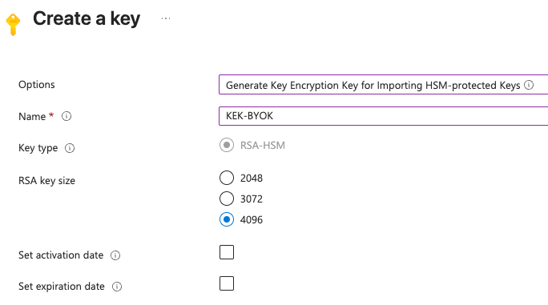

To Bring Your Own Key (BYOK) in Azure Key Vault, 
follow this [Azure documentation](https://learn.microsoft.com/en-us/azure/key-vault/keys/byok-specification)

The vault must be `premium`, backed by an HSM and the use perform the operations
must have the role of `Crypto Officer`.

## Create a Key Encryption Key using the console

Create a 4096 bit RSA key.
Make sure to select `Generate Key Encryption Key for importing HSM-protected Keys`.



## Export the Key Encryption (Public) Key

Once the key encryption key is created, edit it.
Download the public key.

The key identifier will be required later.


## Create a symmetric key in Cosmian KMS

This is the symmetric key that will be wrapped by the KEK and imported in the Azure Key Vault.

```shell
cosmian kms sym keys create  --number-of-bits 256 BYOK_Sym_Key

The symmetric key was successfully generated.
          Unique identifier: BYOK_Sym_Key
```

## Import the wrapping key in Cosmian KMS

```shell
cosmian kms rsa keys import --key-format pem --key-usage encrypt --key-usage wrap-key KEKforBYOK-pubkey.pem BYOK_KEK

The PublicKey in file KEKforBYOK-pubkey.pem was imported with id: BYOK_KEK
          Unique identifier: BYOK_KEK
```

## Export the symmetric key wrapped by the wrapping key from Cosmian KMS

```shell
cosmian kms sym keys export --key-id BYOK_Sym_Key --wrap-key-id BYOK_KEK \
 --key-format raw --wrapping-algorithm rsa-aes-key-wrap-sha1 wrapped_key.bin

The key BYOK_Sym_Key of type SymmetricKey was exported to "wrapped_key.bin"
          Unique identifier: BYOK_Sym_Key
```

Note 1: the `rsa-aes-key-wrap-sha1` algorithm is the CKM_RSA_AES_KEY_WRAP 
key wrapping algorithm with the SHA1 digest.

Note 2: the wrapped key should be 552 bytes (4416 bits) long:

- 4096 bits (RSA key length) +
- 256 bits (Symmetric key length) +
- 64 bits of AES KWP overhead).

## Recover the base64 of the wrapped key

```shell
cat wrapped_key.bin | base64

ezzWzwWV6OUuMb...smeL1
```

## Generate the JSON the transfer blob

```json
{
  "schema_version": "1.0.0",
  "header":
  {
    "kid": "https://bgrkeyvaulttest.vault.azure.net/keys/KEKforBYOK/664f5aa2797a4075b8e36ca4500636d8",
    "alg": "dir",
    "enc": "CKM_RSA_AES_KEY_WRAP"
  },
  "ciphertext":"BASE64URL(ezzWzwWV6OUuMb...smeL1)",
  "generator": "Cosmian KMS v5"
}
```