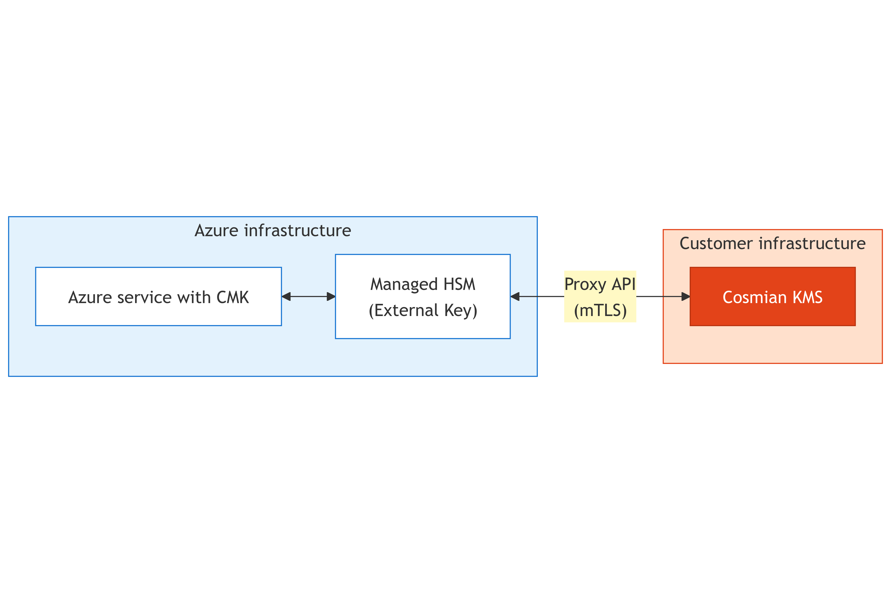

Cosmian KMS implements the Azure External Key Manager (EKM) Proxy API, enabling it to serve as an external key management service for an Azure Managed HSM.

This integration allows organizations to maintain complete physical control over their encryption keys outside of Azure infrastructure while seamlessly integrating with Azure services that support **Customer Managed Keys** (CMK).

The Cosmian KMS implementation follows and implements the Microsoft EKM Proxy API Specification for v0.1-preview.

<!-- TOC -->
- [High level architecture](#high-level-architecture)
- [Api specification](#api-specification)
  - [URL format](#url-format)
  - [Endpoints](#endpoints)
  - [Supported algorithms](#supported-algorithms)
- [Getting started](#getting-started)
  - [Azure Managed HSM Setup](#azure-managed-hsm-setup)
  - [Cosmian KMS setup](#cosmian-kms-setup)
    - [mTLS Configuration](#mtls-configuration)
    - [Azure EKM Configuration](#azure-ekm-configuration)
- [Testing the integration](#testing-the-integration)
<!-- TOC -->

## High level architecture


<!-- 
Mermaid chart of high level architecture diagram

%%{init: {'themeVariables': { 'edgeLabelBackground': '#fff9c4' } }}%%
flowchart LR
  subgraph AZ["Azure infrastructure"]
    direction LR
    A["Azure service with CMK"]
    B["Managed HSM<br/>(External Key)"]
    A <-> B
  end

  subgraph DC["Customer infrastructure"]
    direction TB
    P["Cosmian KMS"]
  end

  B <->|"Proxy API<br>(mTLS)"| P
  
  style AZ fill:#e3f2fd,stroke:#1976d2
  style DC fill:#ffe0cc,stroke:#e34319
  style P fill:#e34319,stroke:#b8330f,color:#fff
  style A fill:#fff,stroke:#1976d2
  style B fill:#fff,stroke:#1976d2
-->

The customer's Azure services (configured with Customer Managed Keys) communicate with Azure Managed HSM to perform encryption/decryption operations. A full list of Azure services that support CMK [can be consulted on this page](https://learn.microsoft.com/en-us/azure/security/fundamentals/encryption-customer-managed-keys-support).

With this integration, your protected secrets remain under your complete control while maintaining compatibility with Azure's managed services.

The following diagram illustrates a possible use case where Cosmian KMS acts as the EKM Proxy :


<!--
Mermaid chart of sequence diagram

sequenceDiagram
    participant Azure as Azure Service -<br/>(must support CMK)
    participant MHSM as Azure Managed HSM
    participant KMS as Cosmian KMS
    
    Note over Azure: Has encrypted data<br/>protected by DEK
    Note over Azure: DEK needs to be<br/>wrapped/unwrapped
    
    Azure->>MHSM: Encrypt/Decrypt data<br/>using External Key "mykey"
    
    MHSM->>KMS: POST /mykey/wrapkey<br/>{"value": "DEK_plaintext"}
    Note over KMS: KEK NEVER leaves here!<br/>Wrapping happens locally
    KMS->>MHSM: {"value": "DEK_wrapped"}
    
    MHSM->>Azure: Here's your wrapped DEK
    
    Note over Azure: Stores wrapped DEK
-->

## Api specification

### URL format

All requests and responses for Azure EKM APIs are sent as JSON objects over HTTPS. Each request includes context information to associate Azure Managed HSM logs and audits with Cosmian KMS logs.

The URI format for EKM Proxy API calls is:

```
https://{public-KMS-URI}/azureekm/[path-prefix]/{api-specific-paths}?api-version={client-api-version}
```

The parameters between brackets {} can be edited on the KMS configuration and must follow the following constraints :

**Path Prefix:**
- Maximum 64 characters  
- Allowed characters: letters (a-z, A-Z), numbers (0-9), slashes (/), and dashes (-)

**External Key ID:**
- Referenced as `{key-name}` in the endpoints below  
- Maximum 64 characters  
- Allowed characters: letters (a-z, A-Z), numbers (0-9), and dashes (-)

### Endpoints

| Endpoint         | Method | Path                                             | Description                                       |
| ---------------- | ------ | ------------------------------------------------ | ------------------------------------------------- |
| Get Proxy Info   | POST   | /azureekm/[path-prefix]/info                     | Health check and proxy details                    |
| Get Key Metadata | POST   | /azureekm/[path-prefix]/{key-name}/metadata      | Retrieve key type, size, and supported operations |
| Wrap Key         | POST   | /azureekm/[path-prefix]/{key-name}/wrapkey       | Wrap (encrypt) a DEK with a KEK                   |
| Unwrap Key       | POST   | /azureekm/[path-prefix]/{key-name}/unwrapkey     | Unwrap (decrypt) a previously wrapped DEK         |


### Supported algorithms

| Algorithm    | Key Type | Description                          |
| ------------ | -------- | ------------------------------------ |
| A256KW       | AES-256  | AES Key Wrap (RFC 3394)              |
| A256KWP      | AES-256  | AES Key Wrap with Padding (RFC 5649) |
| RSA-OAEP-256 | RSA      | RSA-OAEP using SHA-256 and MGF1      |

> **⚠️ Notice:** For RSA operations, always use the **private key reference** as `{key-name}` in **all** endpoints, including wrap operations. The KMS will automatically derive and use the associated public key for encryption (wrap) operations. Passing the public key ID might lead to errors.

## Getting started

### Azure Managed HSM Setup

You must have an Azure Managed HSM Pool already created and activated in your Azure subscription. Refer to the [Azure Managed HSM documentation](https://learn.microsoft.com/en-us/azure/key-vault/managed-hsm/) for setup instructions.

Once the configuration is done, you will need the root CA certificate that the Azure Managed HSM uses for client authentication. This certificate will be configured in Cosmian KMS to validate incoming mTLS connections.

Let's save the root CA as **`mhsm-root-ca.pem`** - We will need it in the next step.

### Cosmian KMS setup

Follow the [Cosmian KMS installation guide](../../installation/installation_getting_started.md) to install the KMS server on your infrastructure. The KMS server typically uses the configuration file located at `/etc/cosmian/kms.toml` when installed manually with default parameters.

Alternatively, you can deploy a pre-configured Cosmian Confidential VM [like explained in this guide.](../../installation/marketplace_guide.md). For confidential VMs, the KMS configuration file is located in the encrypted LUKS container at `/var/lib/cosmian_vm/data/app.conf`.

Environment variables can also be used for all the configurations below.

**The following guide will consider running Cosmian KMS on confidential VM in non-FIPS mode.**

#### mTLS Configuration
Configure mutual TLS authentication to accept connections from Azure Managed HSM by adding of editing to following lines in your configuration file:
For detailed information about TLS client certificate authentication, see the [TLS Client Certificate configuration guide](../../configurations.md#tls-client-cert).

```toml
[tls]
# Your server certificate and private key (PKCS#12 format)
tls_p12_file = "/etc/cosmian/server-cert.p12"
tls_p12_password = "your-secure-password"

# The certificate downloaded in the previous section
# This validates the client certificate presented by Azure MHSM
clients_ca_cert_file = "/etc/cosmian/mhsm-root-ca.pem"
```

**Note** : If you have a server's key and certificate files, you can convert them to PKCS#12 format using [`openssl`](https://docs.openssl.org/master/man1/openssl/):

```bash
openssl pkcs12 -export \
  -in server.crt \
  -inkey server.key \
  -out server-cert.p12 \
  -name "cosmian-kms-server" \
  -passout pass:your-secure-password
```

#### Azure EKM Configuration

```toml
[azure_ekm_config]
# Enable Azure EKM endpoints
azure_ekm_enable = true

# Optional: Path prefix for multi-tenant isolation (max 64 chars: a-z, A-Z, 0-9, /, -)
azure_ekm_path_prefix = "cosmian0"

# The fields below will be reported in the /info endpoint, edit according to your needs
azure_ekm_proxy_vendor = "Cosmian"
azure_ekm_proxy_name = "EKM Proxy Service v0.1-preview"
azure_ekm_ekm_vendor = "Cosmian"
azure_ekm_ekm_product = "Cosmian KMS"

# WARNING: Only set to true for testing! Never in production.
azure_ekm_disable_client_auth = false
```

**Configuration Parameters:**

| Parameter | Type | Default | Description |
|-----------|------|---------|-------------|
| `azure_ekm_enable` | boolean | `false` | Enable/disable Azure EKM API endpoints. |
| `azure_ekm_path_prefix` | string | none | Optional path prefix for routing and multi-tenant isolation. Max 64 chars: `a-z`, `A-Z`, `0-9`, `/`, `-`. Example: `"cosmian0"`, `"customer-a/prod"` |
| `azure_ekm_proxy_vendor` | string | `"Cosmian"` | Proxy vendor name reported in `/info` endpoint. |
| `azure_ekm_proxy_name` | string | `"EKM Proxy Service v{version}"` | Proxy name and version reported in `/info` endpoint. Auto-inserts API version by default. |
| `azure_ekm_ekm_vendor` | string | `"Cosmian"` | EKMS vendor name reported in `/info` endpoint.|
| `azure_ekm_ekm_product` | string | `"Cosmian KMS v{CARGO_PKG_VERSION}"` | EKMS product name and version reported in `/info` endpoint. |
| `azure_ekm_disable_client_auth` | boolean | `false` | ⚠️ Bypasses mTLS authentication. Only use for testing. |


## Testing the integration

For testing purposes or for debugging, you can temporarily disable client authentication by commenting out the following configuration fields:

```toml
[tls]
# Comment this field to disable client auth and allow upcoming requests from anyone
# clients_ca_cert_file = "/etc/cosmian/mhsm-root-ca.pem"

[azure_ekm_config]
# change to false
# azure_ekm_disable_client_auth = false
```

Restart the KMS server:

```bash
sudo systemctl restart cosmian-kms
```

Test the `/info` endpoint:

```bash
curl -X POST "https://ekm.yourdomain.com/azureekm/cosmian0/info?api-version=0.1-preview" \
  -H "Content-Type: application/json" \
  -d '{
    "request_context": {
      "request_id": "test-request-123",
      "correlation_id": "test-correlation-456",
      "pool_name": "test-pool"
    }
  }'
```

Expected response (if you used the config above):

```json
{
  "api_version": "0.1-preview",
  "proxy_vendor": "Cosmian",
  "proxy_name": "EKM Proxy Service v=0.1-preview",
  "ekm_vendor": "Cosmian",
  "ekm_product": "Cosmian KMS v5.15.0"
}
```
