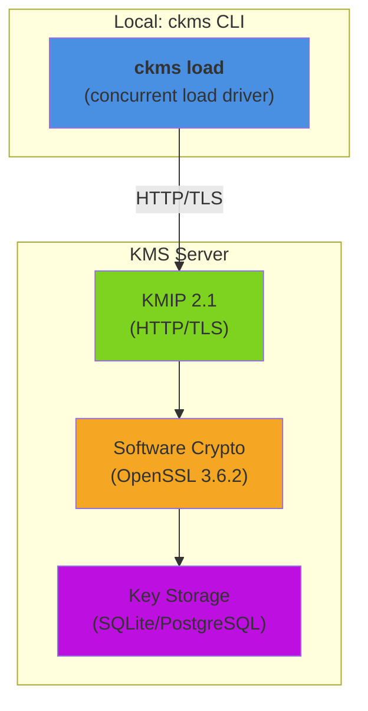
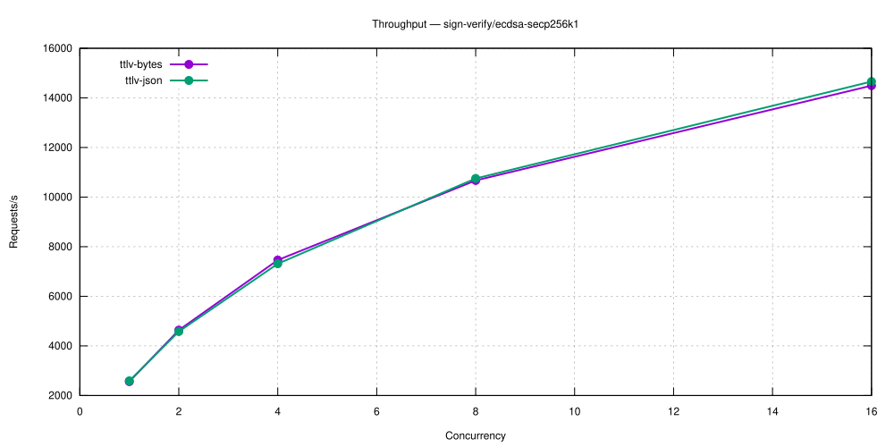

# KMS Performance Comparison

**Versions**: `v5.27.1`
**Generated**: 2026-09-25

---

## Benchmark Environment

| Field | Value |
|---|---|
| Date | 2026-09-24 23:09:32 UTC |
| Build | release / non-fips |
| Database | SQLite (temporary, single benchmark run) |
| CPU | Intel(R) Core(TM) i9-14900T @ 800 MHz |
| CPU cores | 24 physical / 32 logical (HT) |
| RAM | 31.1 GB |
| OS | Ubuntu 24.04.5 LTS |
| Kernel | 6.8.0-142-generic |

### Load test parameters

| Parameter | Value |
|---|---|
| Mode | all |
| Protocols | all |
| Measurement window | 20 s per concurrency level |
| Concurrency levels | 1,2,4,8,16 |
| Warm-up | 5 s |
| Cooldown between levels | 2 s |

### CPU detail (`lscpu`)

```text
Architecture:                            x86_64
CPU op-mode(s):                          32-bit, 64-bit
Address sizes:                           46 bits physical, 48 bits virtual
Byte Order:                              Little Endian
CPU(s):                                  32
On-line CPU(s) list:                     0-31
Vendor ID:                               GenuineIntel
Model name:                              Intel(R) Core(TM) i9-14900T
CPU family:                              6
Model:                                   183
Thread(s) per core:                      2
Core(s) per socket:                      24
Socket(s):                               1
Stepping:                                1
CPU(s) scaling MHz:                      29%
CPU max MHz:                             5500,0000
CPU min MHz:                             800,0000
BogoMIPS:                                2227,20
Flags:                                   fpu vme de pse tsc msr pae mce cx8 apic sep mtrr pge mca cmov pat pse36 clflush dts acpi mmx fxsr sse sse2 ss ht tm pbe syscall nx pdpe1gb rdtscp lm constant_tsc art arch_perfmon pebs bts rep_good nopl xtopology nonstop_tsc cpuid aperfmperf tsc_known_freq pni pclmulqdq dtes64 monitor ds_cpl vmx smx est tm2 ssse3 sdbg fma cx16 xtpr pdcm pcid sse4_1 sse4_2 x2apic movbe popcnt tsc_deadline_timer aes xsave avx f16c rdrand lahf_lm abm 3dnowprefetch cpuid_fault epb ssbd ibrs ibpb stibp ibrs_enhanced tpr_shadow flexpriority ept vpid ept_ad fsgsbase tsc_adjust bmi1 avx2 smep bmi2 erms invpcid rdseed adx smap clflushopt clwb intel_pt sha_ni xsaveopt xsavec xgetbv1 xsaves split_lock_detect user_shstk avx_vnni dtherm ida arat pln pts hwp hwp_notify hwp_act_window hwp_epp hwp_pkg_req hfi vnmi umip pku ospke waitpkg gfni vaes vpclmulqdq tme rdpid movdiri movdir64b fsrm md_clear serialize pconfig arch_lbr ibt flush_l1d arch_capabilities ibpb_exit_to_user
Virtualization:                          VT-x
L1d cache:                               896 KiB (24 instances)
L1i cache:                               1,3 MiB (24 instances)
L2 cache:                                32 MiB (12 instances)
L3 cache:                                36 MiB (1 instance)
NUMA node(s):                            1
NUMA node0 CPU(s):                       0-31
Vulnerability Gather data sampling:      Not affected
Vulnerability Indirect target selection: Not affected
Vulnerability Itlb multihit:             Not affected
Vulnerability L1tf:                      Not affected
Vulnerability Mds:                       Not affected
Vulnerability Meltdown:                  Not affected
Vulnerability Mmio stale data:           Not affected
Vulnerability Reg file data sampling:    Mitigation; Clear Register File
Vulnerability Retbleed:                  Not affected
Vulnerability Spec rstack overflow:      Not affected
Vulnerability Spec store bypass:         Mitigation; Speculative Store Bypass disabled via prctl
Vulnerability Spectre v1:                Mitigation; usercopy/swapgs barriers and __user pointer sanitization
Vulnerability Spectre v2:                Mitigation; Enhanced / Automatic IBRS; IBPB conditional; PBRSB-eIBRS SW sequence; BHI BHI_DIS_S
Vulnerability Srbds:                     Not affected
Vulnerability Tsa:                       Not affected
Vulnerability Tsx async abort:           Not affected
Vulnerability Vmscape:                   Mitigation; IBPB before exit to userspace
```

---

## Architecture



**Components**:

- **ckms**: Configurable concurrent load generator (ops/sec sweep)
- **KMIP Endpoint**: Protocol handler for request/response marshaling
- **Software Crypto**: AES-GCM, RSA-PKCS, ECDSA-P256, EdDSA-Ed25519 via OpenSSL 3.6.2
- **Key Storage**: Key material persistence (SQLite or PostgreSQL)

---

## Protocols

The KMS server was exercised over three distinct wire protocols.
Each benchmark column is labelled with the protocol name it used.

| Protocol | Transport | Encoding | Endpoint | Description |
|---|---|---|---|---|
| **ttlv-json** | HTTP/1.1 | KMIP 2.1 JSON-TTLV | `POST /kmip/2_1` | Primary interoperability protocol — any KMIP 2.1 compliant client can use it |
| **ttlv-bytes** | HTTP/1.1 | KMIP 2.1 binary TTLV | `POST /kmip` | Binary wire format; eliminates JSON parsing overhead — typically 10–30 % faster |
| **jose** | HTTP/1.1 | JWE / JWS (JOSE) | `POST /v1/crypto/` | REST API for OAuth2/OIDC workloads that prefer JWA algorithm identifiers over KMIP |

**KMIP TTLV** (Tag-Type-Length-Value) is the native encoding of the KMIP 2.1 standard (OASIS KMIP Spec v2.1, §9.1). The **JSON** variant wraps every field in a `{"tag": …, "type": …, "value": …}` JSON object and base64-encodes binary values. The **binary** variant uses a compact 8-byte fixed header (3-byte tag, 1-byte type, 4-byte length) per value, removing JSON tokenisation, base64, and UTF-8 overhead entirely.

**JOSE** (JSON Object Signing and Encryption, RFC 7516 / RFC 7515) exposes KMS key material through `/v1/crypto/` REST endpoints. It is used by cloud integrations (Google CSE, Microsoft DKE, Azure EKM) and any workload that speaks JWA algorithm identifiers (A256GCM, RS256, ES384 …) rather than KMIP semantics.

---

## Benchmark Methodology

### Plaintext / payload sizes

All encrypt/decrypt benchmarks use a **fixed-size random payload**. Sizes represent a realistic key-wrapping or small-message encryption workload without introducing significant data-transfer overhead on a loopback connection.

| Algorithm / category | Plaintext size | Notes |
|---|---|---|
| AES-GCM (128 / 192 / 256-bit key) | 64 bytes | FIPS 140-3 |
| AES-GCM-SIV (128 / 256-bit key) | 64 bytes | Non-FIPS |
| AES-XTS (128 / 256-bit AES = 256 / 512-bit key) | 64 bytes | FIPS 140-3; requires 16-byte IV |
| ChaCha20-Poly1305 (256-bit key) | 64 bytes | Non-FIPS |
| ECIES — P-256 / P-384 / P-521 | 64 bytes | Non-FIPS; EC public-key encryption |
| Salsa Sealed Box (X25519) | 64 bytes | Non-FIPS |
| Covercrypt (attribute-based encryption) | 64 bytes | Non-FIPS |
| JOSE JWE — `dir` + AES-GCM (A128GCM / A192GCM / A256GCM) | 64 bytes | Symmetric (direct key agreement) |
| JOSE JWE — RSA-OAEP + AES-GCM (2048 / 4096-bit) | 64 bytes | Asymmetric (RSA-OAEP CEK wrapping) |
| RSA-OAEP (2048 / 3072 / 4096-bit) | 32 bytes | Limited by RSA block size |
| RSA-PKCS#1 v1.5 (2048 / 3072 / 4096-bit) | 32 bytes | Non-FIPS |
| RSA-AES Key Wrap — KWP (2048 / 3072 / 4096-bit) | 32 bytes | FIPS 140-3 |
| Sign / Verify — all algorithms | 32 bytes | Message is hashed internally |
| JOSE JWS / MAC | 32 bytes | |

### Load test (`ckms bench --load`)

The load test sweeps a configurable list of concurrency levels. At each level *N* concurrent async tasks send pre-serialised requests in tight loops for a fixed **measurement window** (default: 20 s), preceded by a **warm-up phase** (default: 5 s) that is excluded from measurements. Pre-serialisation happens once at setup time and the same bytes are reused on every iteration, isolating server-side KMS latency from client-side encoding overhead.
Recorded metrics per *(protocol, operation, concurrency)* triple:

- **Throughput** — requests per second (req/s)
- **p50 / p95 / p99** — round-trip latency percentiles (ms)

### Criterion micro-benchmarks (`ckms bench`)

Criterion (Rust, v0.5) measures the **round-trip latency of a single request** from the ckms client library through the KMS server and back over a loopback TCP connection. The server is started once and kept alive across all benchmarks in the suite.
The reported value is the **mean ± 95 % confidence interval** over a configurable number of samples (preset `quick`: 3 s warm-up + 5 s measurement per benchmark).

> **Infrastructure note:** Both test types use a **local SQLite** backend (temporary, discarded after the run). This isolates pure cryptographic and KMIP serialisation overhead from database I/O. Throughput figures will differ on a production deployment backed by PostgreSQL or Redis-Findex.

---

## Load Tests

### encrypt/aes-gcm

| Concurrency | ttlv-json (req/s) | ttlv-bytes (req/s) | jose (req/s) |
|---|---|---|---|
| 1 | 3,226 | 3,772 | 22,576 |
| 2 | 5,707 | 6,729 | 40,122 |
| 4 | 9,122 | 10,676 | 62,114 |
| 8 | 12,991 | 15,546 | 79,680 |
| 16 | 18,125 | 21,479 | 99,594 |


---

### sign-verify/ecdsa-p256

| Concurrency | ttlv-json (req/s) | ttlv-bytes (req/s) | jose (req/s) |
|---|---|---|---|
| 1 | 2,363 | 2,330 | 2,455 |
| 2 | 4,188 | 4,111 | 4,440 |
| 4 | 6,865 | 6,598 | 7,257 |
| 8 | 10,138 | 10,129 | 10,785 |
| 16 | 14,496 | 14,480 | 15,500 |


---

### sign-verify/eddsa-ed25519

| Concurrency | ttlv-json (req/s) | ttlv-bytes (req/s) | jose (req/s) |
|---|---|---|---|
| 1 | 10,242 | 10,090 | 13,266 |
| 2 | 14,508 | 17,702 | 24,412 |
| 4 | 22,430 | 29,138 | 38,797 |
| 8 | 37,356 | 40,981 | 53,780 |
| 16 | 57,627 | 56,222 | 74,838 |


---

### sign-verify/ecdsa-secp256k1

| Concurrency | ttlv-json (req/s) | ttlv-bytes (req/s) |
|---|---|---|
| 1 | 2,591 | 2,561 |
| 2 | 4,580 | 4,635 |
| 4 | 7,313 | 7,461 |
| 8 | 10,752 | 10,672 |
| 16 | 14,659 | 14,494 |



---

### key-creation/aes-sym

| Concurrency | ttlv-json (req/s) |
|---|---|
| 1 | 4,734 |
| 2 | 2,981 |
| 4 | 5,307 |
| 8 | 4,351 |
| 16 | 7,658 |


---

### batch/aes-gcm-10

| Concurrency | ttlv-json (req/s) |
|---|---|
| 1 | 350 |
| 2 | 637 |
| 4 | 1,037 |
| 8 | 1,587 |
| 16 | 2,156 |


---

## Criterion Benchmarks

### Symmetric Encryption

| Benchmark | ttlv-json | ttlv-bytes | jose |
|---|---|---|---|
| aes-gcm-siv/decrypt/128 | 88.4 µs | 478.4 µs | — |
| aes-gcm-siv/decrypt/256 | 72.7 µs | 102.6 µs | — |
| aes-gcm-siv/encrypt/128 | 80.1 µs | 458.9 µs | — |
| aes-gcm-siv/encrypt/256 | 68.8 µs | 115.4 µs | — |
| aes-gcm/decrypt/128 | 66.1 µs | 465.1 µs | 43.7 µs |
| aes-gcm/decrypt/192 | 75.0 µs | 202.8 µs | 37.6 µs |
| aes-gcm/decrypt/256 | 73.1 µs | — | 38.6 µs |
| aes-gcm/encrypt/128 | 77.4 µs | 463.2 µs | 51.0 µs |
| aes-gcm/encrypt/192 | 85.7 µs | 478.3 µs | 36.9 µs |
| aes-gcm/encrypt/256 | 100.9 µs | 204.3 µs | 35.6 µs |
| aes-xts/decrypt/128 | 71.0 µs | 123.5 µs | — |
| aes-xts/decrypt/256 | 72.6 µs | 412.8 µs | — |
| aes-xts/encrypt/128 | 75.2 µs | 203.0 µs | — |
| aes-xts/encrypt/256 | 84.1 µs | 166.2 µs | — |
| chacha20-poly1305/decrypt/256 | 84.0 µs | 82.5 µs | — |
| chacha20-poly1305/encrypt/256 | 79.5 µs | 72.0 µs | — |
| salsa-sealed-box/decrypt | 147.0 µs | 202.9 µs | — |
| salsa-sealed-box/encrypt | 135.7 µs | 130.6 µs | — |

---

### Asymmetric Encryption

| Benchmark | ttlv-json | ttlv-bytes | jose |
|---|---|---|---|
| covercrypt/decrypt | 12.33 ms | 12.03 ms | — |
| covercrypt/encrypt | 5.10 ms | 4.98 ms | — |
| ecies/decrypt/P-256 | 171.0 µs | 144.7 µs | — |
| ecies/decrypt/P-384 | 1.27 ms | 1.02 ms | — |
| ecies/decrypt/P-521 | 2.46 ms | 2.68 ms | — |
| ecies/encrypt/P-256 | 160.2 µs | 183.4 µs | — |
| ecies/encrypt/P-384 | 954.8 µs | 1.32 ms | — |
| ecies/encrypt/P-521 | 2.28 ms | 2.24 ms | — |
| rsa-aes-kwp/decrypt/4096 | 167.01 ms | 173.39 ms | — |
| rsa-aes-kwp/encrypt/4096 | 153.2 µs | 143.7 µs | — |
| rsa-oaep/decrypt/2048 | — | — | 23.03 ms |
| rsa-oaep/decrypt/4096 | 171.04 ms | 175.95 ms | 162.70 ms |
| rsa-oaep/encrypt/2048 | — | — | 141.5 µs |
| rsa-oaep/encrypt/4096 | 162.2 µs | 143.1 µs | 186.4 µs |
| rsa-pkcs1v15/decrypt/4096 | 168.15 ms | 168.84 ms | — |
| rsa-pkcs1v15/encrypt/4096 | 146.1 µs | 148.0 µs | — |

---

### Key Encapsulation (KEM)

| Benchmark | ttlv-json | ttlv-bytes |
|---|---|---|
| configurable/decapsulate/ML-KEM-512 | 128.3 µs | 120.4 µs |
| configurable/decapsulate/ML-KEM-512/P-256 | 164.2 µs | 139.0 µs |
| configurable/decapsulate/ML-KEM-768 | 155.4 µs | 146.8 µs |
| configurable/encapsulate/ML-KEM-512 | 169.5 µs | 175.4 µs |
| configurable/encapsulate/ML-KEM-512/P-256 | 322.2 µs | 304.3 µs |
| configurable/encapsulate/ML-KEM-768 | 223.1 µs | 208.8 µs |
| pqc/decapsulate/ML-KEM-1024 | 236.9 µs | 213.7 µs |
| pqc/decapsulate/ML-KEM-512 | 150.0 µs | 161.4 µs |
| pqc/decapsulate/ML-KEM-768 | 196.8 µs | 180.5 µs |
| pqc/encapsulate/ML-KEM-1024 | 160.9 µs | 123.8 µs |
| pqc/encapsulate/ML-KEM-512 | 95.1 µs | 182.4 µs |
| pqc/encapsulate/ML-KEM-768 | 183.4 µs | 101.7 µs |
| pqc/encapsulate/X25519MLKEM768 | 155.7 µs | — |

---

### Key Creation

| Benchmark | ttlv-json |
|---|---|
| EC/ES256 | — |
| EC/ES384 | — |
| RSA/2048 | — |
| aes-gcm/oct/128 | — |
| aes-gcm/oct/256 | — |
| covercrypt/master-keypair | 22.44 ms |
| ec/ed25519 | 648.6 µs |
| ec/ed448 | 641.2 µs |
| ec/p256 | 778.0 µs |
| ec/p384 | 1.23 ms |
| ec/p521 | 1.86 ms |
| ec/secp256k1 | 626.8 µs |
| kem/ML-KEM-512 | 627.5 µs |
| kem/ML-KEM-512/P-256 | 546.8 µs |
| kem/ML-KEM-512/X25519 | 2.14 ms |
| kem/ML-KEM-768 | 1.15 ms |
| kem/ML-KEM-768/P-256 | 555.1 µs |
| kem/ML-KEM-768/X25519 | 2.44 ms |
| pqc/ML-DSA-44 | 689.5 µs |
| pqc/ML-DSA-65 | 699.0 µs |
| pqc/ML-DSA-87 | 746.7 µs |
| pqc/ML-KEM-1024 | 542.7 µs |
| pqc/ML-KEM-512 | 667.8 µs |
| pqc/ML-KEM-768 | 459.1 µs |
| pqc/X25519MLKEM768 | 399.2 µs |
| pqc/X448MLKEM1024 | 561.7 µs |
| rsa/rsa-4096 | 478.24 ms |
| symmetric/aes-128 | 375.9 µs |
| symmetric/aes-192 | 514.9 µs |
| symmetric/aes-256 | 454.9 µs |
| symmetric/chacha20-256 | 496.6 µs |

---

### Sign / Verify

| Benchmark | ttlv-json | ttlv-bytes | jose |
|---|---|---|---|
| ecdsa-p256/sign | 467.6 µs | 534.9 µs | 440.7 µs |
| ecdsa-p256/verify | 333.1 µs | 312.0 µs | 222.1 µs |
| ecdsa-p384/sign | 1.16 ms | 1.25 ms | 971.2 µs |
| ecdsa-p384/verify | 657.2 µs | 692.8 µs | 489.4 µs |
| ecdsa-p521/sign | 2.58 ms | 2.47 ms | — |
| ecdsa-p521/verify | 1.14 ms | 1.26 ms | — |
| ecdsa-secp256k1/sign | 429.9 µs | 540.4 µs | — |
| ecdsa-secp256k1/verify | 489.3 µs | 406.6 µs | — |
| eddsa-ed25519/sign | 119.5 µs | 135.8 µs | 91.6 µs |
| eddsa-ed25519/verify | 379.0 µs | 356.5 µs | 291.2 µs |
| eddsa-ed448/sign | 318.8 µs | 294.2 µs | — |
| eddsa-ed448/verify | 348.5 µs | 253.0 µs | — |
| ml-dsa/sign/44 | 604.4 µs | 566.4 µs | — |
| ml-dsa/sign/65 | 919.2 µs | 737.7 µs | — |
| ml-dsa/sign/87 | 1.31 ms | 1.21 ms | — |
| ml-dsa/verify/44 | 406.3 µs | 331.6 µs | — |
| ml-dsa/verify/65 | 552.8 µs | 380.2 µs | — |
| ml-dsa/verify/87 | 628.0 µs | 501.8 µs | — |
| rsa-pkcs1v15/sign | — | — | 23.59 ms |
| rsa-pkcs1v15/verify | — | — | 383.1 µs |
| rsa-pss/sign | — | — | 24.17 ms |
| rsa-pss/sign/4096 | 165.05 ms | 165.77 ms | — |
| rsa-pss/verify | — | — | 224.7 µs |
| rsa-pss/verify/4096 | 260.4 µs | 437.8 µs | — |
| slh-dsa/sign/SHA2-128f | 10.42 ms | 9.47 ms | — |
| slh-dsa/sign/SHA2-256f | 35.83 ms | 35.49 ms | — |
| slh-dsa/sign/SHAKE-128f | 25.82 ms | 24.33 ms | — |
| slh-dsa/sign/SHAKE-256f | 80.73 ms | 81.71 ms | — |
| slh-dsa/verify/SHA2-128f | 1.78 ms | 1.77 ms | — |
| slh-dsa/verify/SHA2-256f | 3.87 ms | 3.48 ms | — |
| slh-dsa/verify/SHAKE-128f | 2.62 ms | 2.48 ms | — |
| slh-dsa/verify/SHAKE-256f | 5.08 ms | 4.57 ms | — |

---
