# KMS Performance Comparison

**Versions**: `v5.27.1`
**Generated**: 2026-09-25

---

## Benchmark Environment

| Field | Value |
|---|---|
| Date | 2026-09-25 00:30:55 UTC |
| Build | release / non-fips |
| HTTP workers (Actix-web) | 32 |
| Database | SQLite (temporary, single benchmark run) |
| CPU | Intel(R) Core(TM) i9-14900T @ 862 MHz |
| CPU cores | 24 physical / 32 logical (HT) |
| RAM | 31.1 GB |
| OS | Ubuntu 24.04.5 LTS |
| Kernel | 6.8.0-142-generic |

### Load test parameters

| Parameter | Value |
|---|---|
| Mode | all |
| Protocols | all |
| Measurement window | 20 s per concurrency level |
| Concurrency levels | 1,2,4,8,16 |
| Warm-up | 5 s |
| Cooldown between levels | 2 s |

### CPU detail (`lscpu`)

```text
Architecture:                            x86_64
CPU op-mode(s):                          32-bit, 64-bit
Address sizes:                           46 bits physical, 48 bits virtual
Byte Order:                              Little Endian
CPU(s):                                  32
On-line CPU(s) list:                     0-31
Vendor ID:                               GenuineIntel
Model name:                              Intel(R) Core(TM) i9-14900T
CPU family:                              6
Model:                                   183
Thread(s) per core:                      2
Core(s) per socket:                      24
Socket(s):                               1
Stepping:                                1
CPU(s) scaling MHz:                      24%
CPU max MHz:                             5500,0000
CPU min MHz:                             800,0000
BogoMIPS:                                2227,20
Flags:                                   fpu vme de pse tsc msr pae mce cx8 apic sep mtrr pge mca cmov pat pse36 clflush dts acpi mmx fxsr sse sse2 ss ht tm pbe syscall nx pdpe1gb rdtscp lm constant_tsc art arch_perfmon pebs bts rep_good nopl xtopology nonstop_tsc cpuid aperfmperf tsc_known_freq pni pclmulqdq dtes64 monitor ds_cpl vmx smx est tm2 ssse3 sdbg fma cx16 xtpr pdcm pcid sse4_1 sse4_2 x2apic movbe popcnt tsc_deadline_timer aes xsave avx f16c rdrand lahf_lm abm 3dnowprefetch cpuid_fault epb ssbd ibrs ibpb stibp ibrs_enhanced tpr_shadow flexpriority ept vpid ept_ad fsgsbase tsc_adjust bmi1 avx2 smep bmi2 erms invpcid rdseed adx smap clflushopt clwb intel_pt sha_ni xsaveopt xsavec xgetbv1 xsaves split_lock_detect user_shstk avx_vnni dtherm ida arat pln pts hwp hwp_notify hwp_act_window hwp_epp hwp_pkg_req hfi vnmi umip pku ospke waitpkg gfni vaes vpclmulqdq tme rdpid movdiri movdir64b fsrm md_clear serialize pconfig arch_lbr ibt flush_l1d arch_capabilities ibpb_exit_to_user
Virtualization:                          VT-x
L1d cache:                               896 KiB (24 instances)
L1i cache:                               1,3 MiB (24 instances)
L2 cache:                                32 MiB (12 instances)
L3 cache:                                36 MiB (1 instance)
NUMA node(s):                            1
NUMA node0 CPU(s):                       0-31
Vulnerability Gather data sampling:      Not affected
Vulnerability Indirect target selection: Not affected
Vulnerability Itlb multihit:             Not affected
Vulnerability L1tf:                      Not affected
Vulnerability Mds:                       Not affected
Vulnerability Meltdown:                  Not affected
Vulnerability Mmio stale data:           Not affected
Vulnerability Reg file data sampling:    Mitigation; Clear Register File
Vulnerability Retbleed:                  Not affected
Vulnerability Spec rstack overflow:      Not affected
Vulnerability Spec store bypass:         Mitigation; Speculative Store Bypass disabled via prctl
Vulnerability Spectre v1:                Mitigation; usercopy/swapgs barriers and __user pointer sanitization
Vulnerability Spectre v2:                Mitigation; Enhanced / Automatic IBRS; IBPB conditional; PBRSB-eIBRS SW sequence; BHI BHI_DIS_S
Vulnerability Srbds:                     Not affected
Vulnerability Tsa:                       Not affected
Vulnerability Tsx async abort:           Not affected
Vulnerability Vmscape:                   Mitigation; IBPB before exit to userspace
```

---

## Architecture

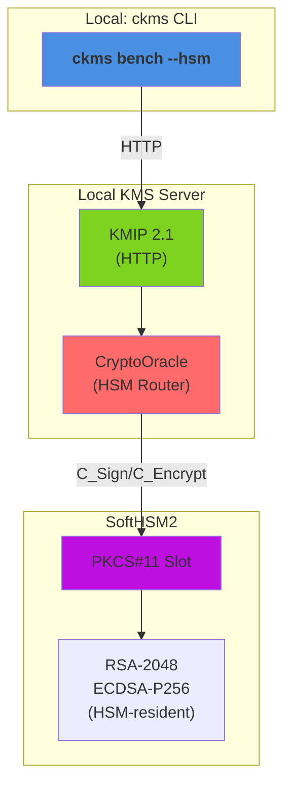

**Components**:

- **ckms**: Concurrent load generator
- **KMIP Endpoint**: HTTP protocol handler
- **CryptoOracle**: Routes crypto ops directly to HSM (no software fallback)
- **PKCS#11 Slot**: HSM engine for sign/encrypt operations
- **HSM-Resident Keys**: Keys generated on and never leave hardware

---

## Protocols

This report benchmarks cryptographic operations delegated to an HSM (PKCS#11) via the KMS `CryptoOracle`, exercised over a single wire protocol: **ttlv-json**.

| Protocol | Transport | Encoding | Endpoint | Description |
|---|---|---|---|---|
| **ttlv-json** | HTTP/1.1 | KMIP 2.1 JSON-TTLV | `POST /kmip/2_1` | Primary interoperability protocol — any KMIP 2.1 compliant client can use it |

**KMIP TTLV** (Tag-Type-Length-Value) is the native encoding of the KMIP 2.1 standard (OASIS KMIP Spec v2.1, §9.1). The **JSON** variant wraps every field in a `{"tag": …, "type": …, "value": …}` JSON object and base64-encodes binary values.

**ttlv-bytes is not benchmarked here.** Measuring it would require running it either against the same HSM-resident key/token as the ttlv-json sweep (strictly after it completes) or on a fresh token started specifically for that purpose. The former was tried first and rejected: cumulative SoftHSM2 token load from the preceding ttlv-json sweep contaminated every ttlv-bytes measurement, making ttlv-json appear *faster* than ttlv-bytes in every single operation — the opposite of the software baseline (where ttlv-bytes is consistently faster, as expected, since it skips JSON parsing). Rather than publish numbers that are measurement artefacts of test ordering, ttlv-bytes is omitted from this report until the harness can measure both protocols under equivalent conditions (e.g. independent tokens per protocol).

**JOSE is not benchmarked here.** The JOSE REST key-creation endpoint (`POST /v1/crypto/keys`) has no parameter to request a caller-chosen `kid`, and HSM-resident key delegation requires the client to choose the `hsm::<slot>::<uuid>` unique identifier up front (the HSM has no server-assigned ID scheme) — so an HSM-resident key cannot be created through the JOSE endpoints at all.

---

## Benchmark Methodology

### HSM delegation model

Every operation in this report is executed against an `hsm::<slot>::<uuid>` unique identifier. The KMS server routes both key generation (`Create`/`CreateKeyPair`) and cryptographic operations (`Encrypt`/`Sign`) for such keys to the HSM's `CryptoOracle` (PKCS#11) instead of executing them in KMS software — the benchmarked latency/throughput is therefore dominated by the PKCS#11 round-trip to the HSM, not by in-process OpenSSL. `Verify` is not implemented for HSM-resident keys at all yet, for any algorithm, and is intentionally excluded from this report.

> **Reference HSM:** SoftHSM2 (a software PKCS#11 simulator), single SoftHSM2 token per benchmark run. A hardware HSM will exhibit different absolute numbers (typically bound by the HSM's own internal parallelism and network/PCIe transport latency rather than loopback TCP), but the same operations and request shapes apply unchanged.

### Algorithm coverage and SoftHSM2-specific constraints

Every algorithm variant of the KMS's `CryptoAlgorithm` (encrypt) and `SigningAlgorithm` (sign) oracle enums reachable via an ordinary (non-prehashed-digest-only) KMIP request is covered:

| Category | Algorithms covered | Notes |
|---|---|---|
| Encrypt | AES-GCM, AES-CBC, RSA-OAEP-SHA256, RSA-OAEP-SHA1, RSA-PKCS1v15 | 2048-bit RSA, 256-bit AES |
| Sign | RSA-PSS, RSA-PKCS1v15 (SHA1/256/384/512 hash-and-sign) | 2048-bit RSA |
| Sign | ECDSA P-256 / P-384 | **Prehashed only** (`digested_data`): SoftHSM2 2.6.1 implements only the raw `CKM_ECDSA` mechanism, not the combined `CKM_ECDSA_SHA*` hash-and-sign mechanisms |
| Sign | EdDSA Ed25519 / Ed448 | Non-FIPS only; pure, un-hashed `CKM_EDDSA` — the full message is sent, never a digest |
| Key creation | AES-256, RSA-2048, EC P-256, Ed25519, Ed448 | P-521 excluded — see below |

Two gaps are **not** HSM-delegation limitations and are excluded for unrelated reasons:

- **P-521 key creation**: `crate/crypto/src/crypto/elliptic_curves/operation.rs` derives the KMIP `CryptographicLength` from the generated private scalar's serialized byte length rather than the curve's nominal bit length, which can under-count P-521 keys by one byte and makes `HSM::create_keypair` reject the result — a pre-existing bug unrelated to HSM delegation, tracked as a follow-up.
- **Bare `SigningAlgorithm::RsaPkcsV15`** (a raw `CKM_RSA_PKCS` sign over a caller-supplied `DigestInfo` blob) has no ordinary KMIP request shape that reaches it — `padding_method: PKCS1v15` without an explicit digest always resolves to one of the hash-and-sign variants above, which exercise the same PKCS#11 mechanism family end-to-end.

### Payload sizes

All encrypt benchmarks use a **64-byte** fixed-size random payload (128 bytes for AES-CBC/PKCS1v15, which pad to a whole block); all sign benchmarks use a **32-byte** fixed-size message (or, for prehashed ECDSA, a 32-byte SHA-256 digest of that same message) — small enough that the RSA-2048 modulus bounds every RSA variant without truncation.

### SoftHSM2 per-token degradation (key creation only)

Concurrent/cumulative RSA and EC key **generation** against a single SoftHSM2 token progressively degrades that token — later PKCS#11 operations, even unrelated `Encrypt`/`Sign` calls against different keys, can slow from milliseconds to *minutes* per request. This is a SoftHSM2 limitation (a software simulator, not built for heavy concurrent/cumulative key generation on one token), not a KMS defect. Mitigations applied to keep this report reproducible:

- Load-test key-creation concurrency is capped at 4 regardless of the requested sweep (`PreparedLoadOp::max_concurrency`).
- The `bench/load-hsm --delegated` task runs `key-creation`, `encrypt`, and `sign-verify` as three separate SoftHSM2 sessions (each with its own fresh token) when `--mode all` (the default), so key-creation load never contaminates the encrypt/sign token; results are merged into this single report afterward.

### Why ttlv-json only (no ttlv-bytes)

An earlier version of this report benchmarked both `ttlv-json` and `ttlv-bytes` for every HSM-delegated operation, sharing one HSM-resident key between the two protocol variants and measuring `ttlv-json`'s full concurrency sweep before `ttlv-bytes`'s. Every single result inverted the expected direction — `ttlv-json` appeared *faster* than `ttlv-bytes`, the opposite of the software baseline (where binary TTLV is consistently faster, since it skips JSON parsing). Root cause: the `ttlv-bytes` sweep always ran second against the same already-active HSM session/token, so it inherited whatever cumulative SoftHSM2 degradation the `ttlv-json` sweep had already caused (the same class of per-token degradation described above, triggered here by sustained Encrypt/Sign call volume rather than key generation) — a test-ordering artefact, not a real protocol difference. This report therefore benchmarks `ttlv-json` only, until the harness can measure both protocols under equivalent conditions (e.g. independent SoftHSM2 tokens per protocol).

### Load test (`ckms bench --load --hsm`)

The load test sweeps a configurable list of concurrency levels. At each level *N* concurrent async tasks send pre-serialised requests in tight loops for a fixed **measurement window** (default: 20 s), preceded by a **warm-up phase** (default: 5 s) that is excluded from measurements. Pre-serialisation happens once at setup time and the same bytes are reused on every iteration, isolating server-side (and HSM-side) latency from client-side encoding overhead. Key **creation** cannot be pre-serialised the same way — the HSM has no auto-generated ID, so each iteration builds a fresh request with a distinct `hsm::` unique identifier.
Recorded metrics per *(protocol, operation, concurrency)* triple:

- **Throughput** — requests per second (req/s)
- **p50 / p95 / p99** — round-trip latency percentiles (ms)

### Criterion micro-benchmarks (`ckms bench --hsm`)

Criterion (Rust, v0.5) measures the **round-trip latency of a single request** from the ckms client library through the KMS server (and, for these benchmarks, onward to the HSM) and back over a loopback TCP connection. The server is started once and kept alive across all benchmarks in the suite.
The reported value is the **mean ± 95 % confidence interval** over a configurable number of samples (preset `quick`: 3 s warm-up + 5 s measurement per benchmark).

> **Infrastructure note:** The load test and criterion benchmarks both use a **local SQLite** backend (temporary, discarded after the run) for the KMS server's own metadata store — the key material itself resides on the HSM, never in SQLite. Throughput figures will differ on a production deployment backed by PostgreSQL or Redis-Findex, and even more so against a hardware HSM instead of SoftHSM2.

---

## Load Tests

### hsm/key-creation/aes-256

| Concurrency | ttlv-json (req/s) |
|---|---|
| 1 | 52 |
| 2 | 39 |
| 4 | 27 |

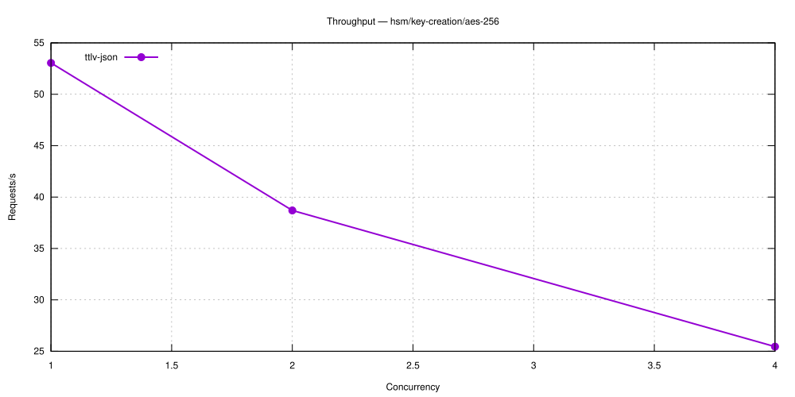

---

### hsm/key-creation/rsa-2048

| Concurrency | ttlv-json (req/s) |
|---|---|
| 1 | 3 |
| 2 | 6 |
| 4 | 6 |

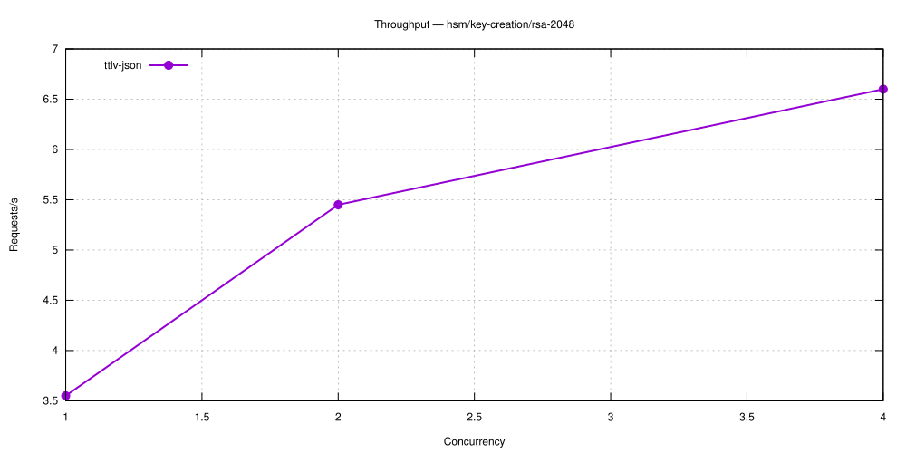

---

### hsm/encrypt/aes-gcm

| Concurrency | ttlv-json (req/s) |
|---|---|
| 1 | 2,812 |
| 2 | 4,897 |
| 4 | 8,039 |
| 8 | 11,038 |
| 16 | 15,300 |

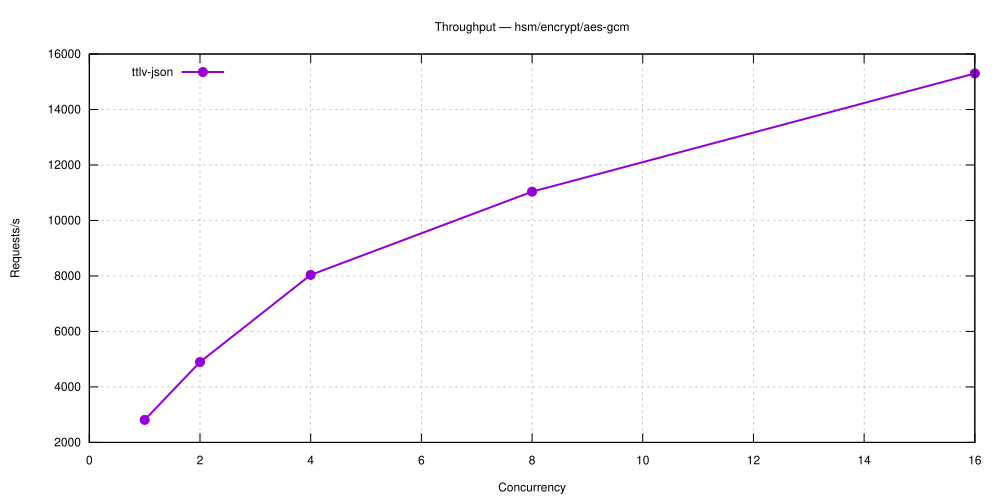

---

### hsm/encrypt/rsa-oaep

| Concurrency | ttlv-json (req/s) |
|---|---|
| 1 | 11,550 |
| 2 | 19,811 |
| 4 | 29,271 |
| 8 | 38,946 |
| 16 | 45,708 |

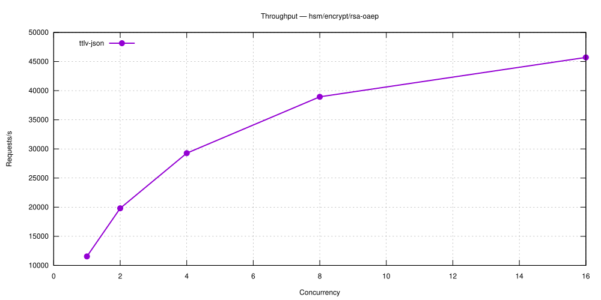

---

### hsm/encrypt/rsa-oaep-sha1

| Concurrency | ttlv-json (req/s) |
|---|---|
| 1 | 8,661 |
| 2 | 15,937 |
| 4 | 23,932 |
| 8 | 29,374 |
| 16 | 26,421 |

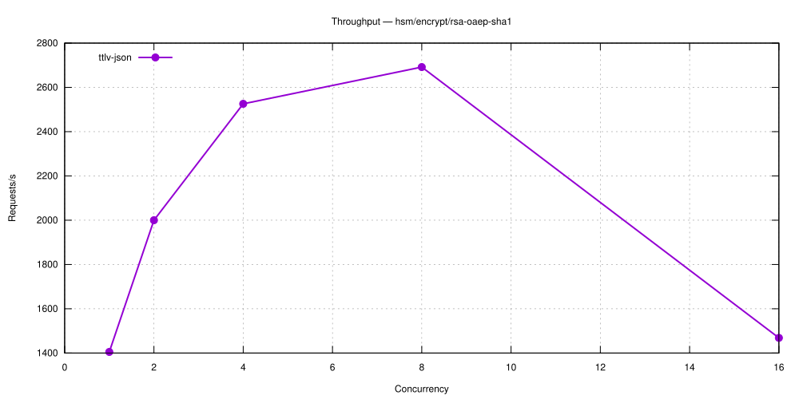

---

### hsm/encrypt/rsa-pkcs1v15

| Concurrency | ttlv-json (req/s) |
|---|---|
| 1 | 9,688 |
| 2 | 16,331 |
| 4 | 24,457 |
| 8 | 30,465 |
| 16 | 24,622 |

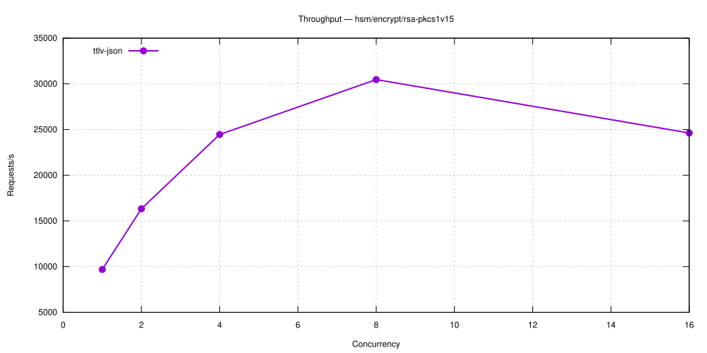

---

### hsm/encrypt/aes-cbc

| Concurrency | ttlv-json (req/s) |
|---|---|
| 1 | 2,811 |
| 2 | 5,059 |
| 4 | 7,980 |
| 8 | 11,156 |
| 16 | 15,349 |

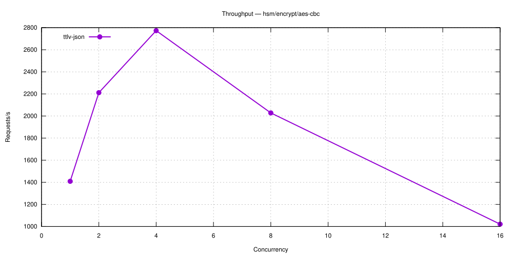

---

### hsm/sign-verify/rsa-pss

| Concurrency | ttlv-json (req/s) |
|---|---|
| 1 | 1,304 |
| 2 | 2,219 |
| 4 | 3,555 |
| 8 | 4,739 |
| 16 | 4,953 |

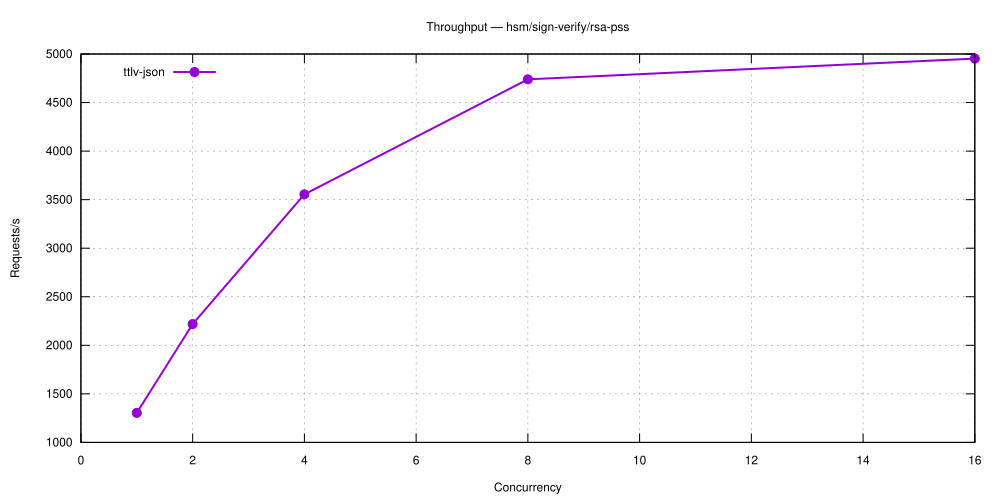

---

### hsm/sign-verify/rsa-pkcs1v15-sha1

| Concurrency | ttlv-json (req/s) |
|---|---|
| 1 | 1,296 |
| 2 | 2,255 |
| 4 | 3,503 |
| 8 | 4,835 |
| 16 | 5,105 |

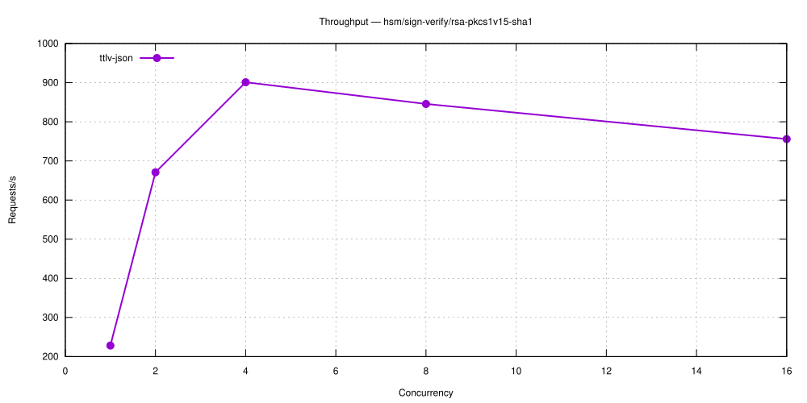

---

### hsm/sign-verify/rsa-pkcs1v15-sha256

| Concurrency | ttlv-json (req/s) |
|---|---|
| 1 | 1,287 |
| 2 | 2,235 |
| 4 | 3,364 |
| 8 | 4,502 |
| 16 | 4,991 |

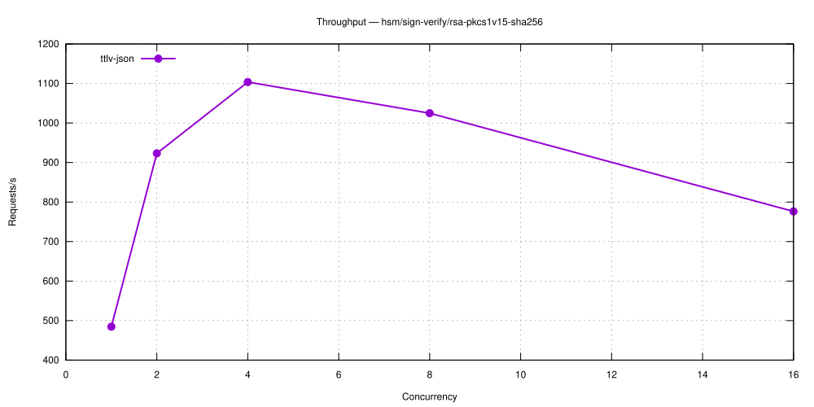

---

### hsm/sign-verify/rsa-pkcs1v15-sha384

| Concurrency | ttlv-json (req/s) |
|---|---|
| 1 | 1,324 |
| 2 | 2,146 |
| 4 | 3,386 |
| 8 | 4,845 |
| 16 | 5,015 |

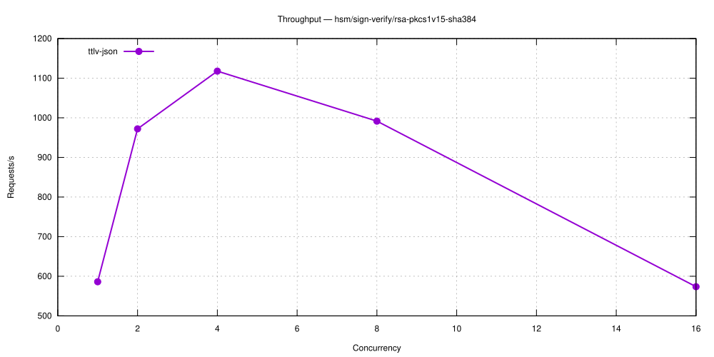

---

### hsm/sign-verify/rsa-pkcs1v15-sha512

| Concurrency | ttlv-json (req/s) |
|---|---|
| 1 | 1,289 |
| 2 | 2,247 |
| 4 | 3,566 |
| 8 | 4,946 |
| 16 | 5,014 |

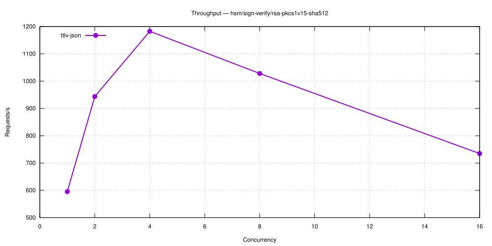

---

### hsm/sign-verify/ecdsa-p256

| Concurrency | ttlv-json (req/s) |
|---|---|
| 1 | 5,266 |
| 2 | 7,945 |
| 4 | 8,338 |
| 8 | 7,195 |
| 16 | 2,241 |

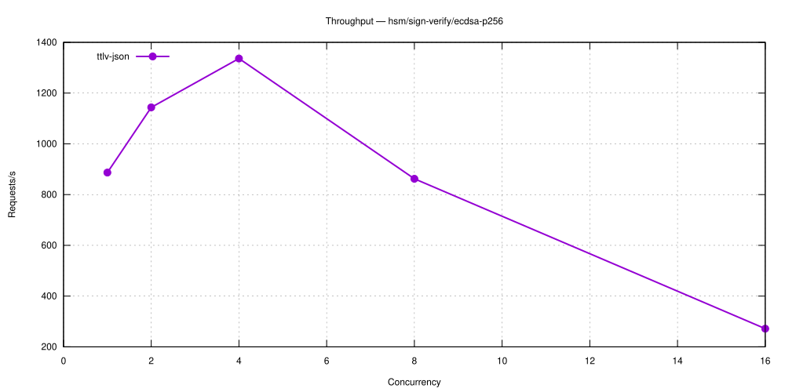

---

### hsm/sign-verify/eddsa-ed25519

| Concurrency | ttlv-json (req/s) |
|---|---|
| 1 | 3,729 |
| 2 | 5,503 |
| 4 | 7,088 |
| 8 | 6,856 |
| 16 | 3,086 |

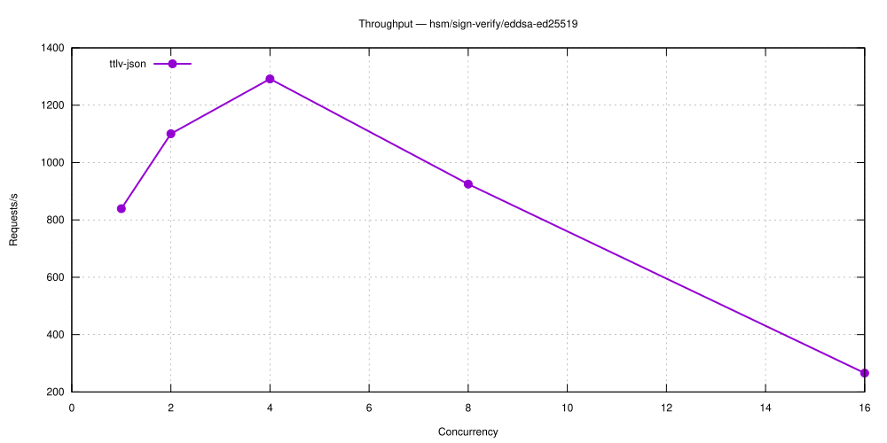

---

### hsm/sign-verify/eddsa-ed448

| Concurrency | ttlv-json (req/s) |
|---|---|
| 1 | 2,236 |
| 2 | 3,607 |
| 4 | 5,438 |
| 8 | 6,266 |
| 16 | 5,750 |

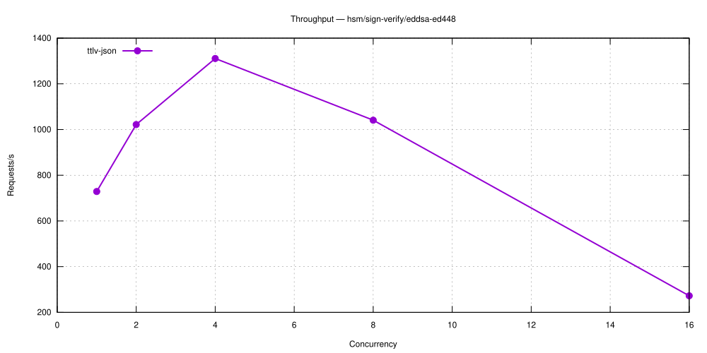

---

## Criterion Benchmarks

### Symmetric Encryption

| Benchmark | ttlv-json |
|---|---|
| hsm-aes-cbc/encrypt/256 | 200.6 µs |
| hsm-aes-gcm/encrypt/256 | 177.7 µs |

---

### Asymmetric Encryption

| Benchmark | ttlv-json |
|---|---|
| hsm-rsa-oaep-sha1/encrypt/2048 | 138.2 µs |
| hsm-rsa-oaep/encrypt/2048 | 100.7 µs |
| hsm-rsa-pkcs1v15/encrypt/2048 | 326.1 µs |

---

### Key Creation

| Benchmark | ttlv-json |
|---|---|
| hsm-aes-256/create | 66.71 ms |
| hsm-ec-p256/create | 189.15 ms |
| hsm-ed25519/create | 194.01 ms |
| hsm-ed448/create | 205.61 ms |
| hsm-rsa-2048/create | 346.04 ms |

---

### Sign / Verify

| Benchmark | ttlv-json |
|---|---|
| hsm-ecdsa-p256/sign | 298.8 µs |
| hsm-ecdsa-p384/sign | 676.3 µs |
| hsm-eddsa-ed25519/sign | 285.1 µs |
| hsm-eddsa-ed448/sign | 485.0 µs |
| hsm-rsa-pkcs1v15-sha1/sign/2048 | 762.8 µs |
| hsm-rsa-pkcs1v15-sha256/sign/2048 | 755.2 µs |
| hsm-rsa-pkcs1v15-sha384/sign/2048 | 805.6 µs |
| hsm-rsa-pkcs1v15-sha512/sign/2048 | 789.5 µs |
| hsm-rsa-pss/sign/2048 | 859.0 µs |

---
