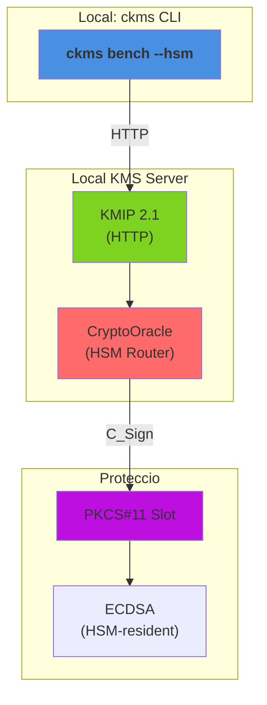

# KMS Performance Comparison

**Versions**: `v5.28.0`
**Generated**: 2026-10-09

---

## Benchmark Environment

| Field | Value |
|---|---|
| Date | 2026-10-09 14:53:15 UTC |
| HSM backend | Proteccio |
| Command | `mise run bench:hsm --delegated --hsm-model proteccio` |
| Build | release / non-fips |
| HTTP workers (Actix-web) | 32 |
| Database | SQLite (temporary, single benchmark run) |
| CPU | Intel(R) Xeon(R) Silver 4210R CPU @ 2.40GHz @ 2,400 MHz |
| CPU cores | 8 physical / 8 logical (HT) |
| RAM | 15.6 GB |
| OS | Debian GNU/Linux 13 (trixie) |
| Kernel | 6.12.111+deb13-amd64 |

### Load test parameters

| Parameter | Value |
|---|---|
| Mode | sign-verify |
| Protocols | all |
| Measurement window | 20 s per concurrency level |
| Concurrency levels | 1,8,16,32,64,96 |
| Warm-up | 5 s |
| Cooldown between levels | 2 s |

### CPU detail (`lscpu`)

```text
Architecture:                            x86_64
CPU op-mode(s):                          32-bit, 64-bit
Address sizes:                           45 bits physical, 48 bits virtual
Byte Order:                              Little Endian
CPU(s):                                  8
On-line CPU(s) list:                     0-7
Vendor ID:                               GenuineIntel
Model name:                              Intel(R) Xeon(R) Silver 4210R CPU @ 2.40GHz
CPU family:                              6
Model:                                   85
Thread(s) per core:                      1
Core(s) per socket:                      8
Socket(s):                               1
Stepping:                                7
BogoMIPS:                                4800.00
Flags:                                   fpu vme de pse tsc msr pae mce cx8 apic sep mtrr pge mca cmov pat pse36 clflush mmx fxsr sse sse2 ss ht syscall nx pdpe1gb rdtscp lm constant_tsc arch_perfmon nopl xtopology tsc_reliable nonstop_tsc cpuid tsc_known_freq pni pclmulqdq ssse3 fma cx16 pcid sse4_1 sse4_2 x2apic movbe popcnt tsc_deadline_timer aes xsave avx f16c rdrand hypervisor lahf_lm abm 3dnowprefetch ssbd ibrs ibpb stibp ibrs_enhanced fsgsbase tsc_adjust bmi1 avx2 smep bmi2 invpcid avx512f avx512dq rdseed adx smap clflushopt clwb avx512cd avx512bw avx512vl xsaveopt xsavec xgetbv1 xsaves arat pku ospke avx512_vnni md_clear flush_l1d arch_capabilities
Hypervisor vendor:                       VMware
Virtualization type:                     full
L1d cache:                               256 KiB (8 instances)
L1i cache:                               256 KiB (8 instances)
L2 cache:                                8 MiB (8 instances)
L3 cache:                                13.8 MiB (1 instance)
NUMA node(s):                            1
NUMA node0 CPU(s):                       0-7
Vulnerability Gather data sampling:      Unknown: Dependent on hypervisor status
Vulnerability Indirect target selection: Mitigation; Aligned branch/return thunks
Vulnerability Itlb multihit:             KVM: Mitigation: VMX unsupported
Vulnerability L1tf:                      Not affected
Vulnerability Mds:                       Not affected
Vulnerability Meltdown:                  Not affected
Vulnerability Mmio stale data:           Vulnerable: Clear CPU buffers attempted, no microcode; SMT Host state unknown
Vulnerability Reg file data sampling:    Not affected
Vulnerability Retbleed:                  Mitigation; Enhanced IBRS
Vulnerability Spec rstack overflow:      Not affected
Vulnerability Spec store bypass:         Mitigation; Speculative Store Bypass disabled via prctl
Vulnerability Spectre v1:                Mitigation; usercopy/swapgs barriers and __user pointer sanitization
Vulnerability Spectre v2:                Mitigation; Enhanced / Automatic IBRS; IBPB conditional; PBRSB-eIBRS SW sequence; BHI SW loop, KVM SW loop
Vulnerability Srbds:                     Not affected
Vulnerability Tsa:                       Not affected
Vulnerability Tsx async abort:           Not affected
Vulnerability Vmscape:                   Not affected
```

---

## Architecture



**Components**:

- **ckms**: Concurrent load generator (`mise run bench:hsm --delegated --hsm-model proteccio`)
- **KMIP Endpoint**: HTTP protocol handler
- **CryptoOracle**: Routes crypto ops directly to Proteccio (no software fallback)
- **PKCS#11 Slot**: Proteccio engine for C_Sign operations
- **HSM-Resident Keys**: Keys generated on and never leave hardware

---

## Protocols

This report benchmarks cryptographic operations delegated to an HSM (Proteccio) via the KMS `CryptoOracle`, exercised over a single wire protocol: **ttlv-json**.

| Protocol | Transport | Encoding | Endpoint | Description |
|---|---|---|---|---|
| **ttlv-json** | HTTP/1.1 | KMIP 2.1 JSON-TTLV | `POST /kmip/2_1` | Primary interoperability protocol — any KMIP 2.1 compliant client can use it |

**KMIP TTLV** (Tag-Type-Length-Value) is the native encoding of the KMIP 2.1 standard (OASIS KMIP Spec v2.1, §9.1). The **JSON** variant wraps every field in a `{"tag": …, "type": …, "value": …}` JSON object and base64-encodes binary values.

**ttlv-bytes is not benchmarked here.** Measuring it would require running it either against the same HSM-resident key/token as the ttlv-json sweep (strictly after it completes) or on a fresh token started specifically for that purpose. The former was tried first and rejected: cumulative Proteccio token load from the preceding ttlv-json sweep contaminated every ttlv-bytes measurement, making ttlv-json appear *faster* than ttlv-bytes in every single operation — the opposite of the software baseline (where ttlv-bytes is consistently faster, as expected, since it skips JSON parsing). Rather than publish numbers that are measurement artefacts of test ordering, ttlv-bytes is omitted from this report until the harness can measure both protocols under equivalent conditions (e.g. independent tokens per protocol).

**JOSE is not benchmarked here.** The JOSE REST key-creation endpoint (`POST /v1/crypto/keys`) has no parameter to request a caller-chosen `kid`, and HSM-resident key delegation requires the client to choose the `hsm::<slot>::<uuid>` unique identifier up front (the HSM has no server-assigned ID scheme) — so an HSM-resident key cannot be created through the JOSE endpoints at all.

---

## Benchmark Methodology

### HSM delegation model

Every operation in this report is executed against an `hsm::<slot>::<uuid>` unique identifier. The KMS server routes both key generation (`Create`/`CreateKeyPair`) and cryptographic operations (`Encrypt`/`Sign`) for such keys to the HSM's `CryptoOracle` (PKCS#11) on Proteccio instead of executing them in KMS software — the benchmarked latency/throughput is therefore dominated by the PKCS#11 round-trip to the HSM, not by in-process OpenSSL.

> **HSM Backend:** Proteccio (hardware/appliance HSM backend).

### Algorithm coverage and Proteccio constraints

Operations benchmarked in this scenario:

| Category | Algorithms covered | Notes |
|---|---|---|
| Sign | ECDSA P-256 | Prehashed message digest |

### Payload sizes

All encrypt benchmarks use a **64-byte** fixed-size random payload (128 bytes for AES-CBC/PKCS1v15, which pad to a whole block); all sign benchmarks use a **32-byte** fixed-size message (or, for prehashed ECDSA, a 32-byte SHA-256 digest of that same message).

### Why ttlv-json only (no ttlv-bytes)

An earlier version of this report benchmarked both `ttlv-json` and `ttlv-bytes` for every HSM-delegated operation, sharing one HSM-resident key between the two protocol variants and measuring `ttlv-json`'s full concurrency sweep before `ttlv-bytes`'s. Every single result inverted the expected direction — `ttlv-json` appeared *faster* than `ttlv-bytes`, the opposite of the software baseline (where binary TTLV is consistently faster, since it skips JSON parsing). This report therefore benchmarks `ttlv-json` only, until the harness can measure both protocols under equivalent conditions.

### Load test (`mise run bench:hsm --delegated --hsm-model proteccio`)

The load test sweeps a configurable list of concurrency levels. At each level *N* concurrent async tasks send pre-serialised requests in tight loops for a fixed **measurement window** (default: 20 s), preceded by a **warm-up phase** (default: 5 s) that is excluded from measurements. Pre-serialisation happens once at setup time and the same bytes are reused on every iteration, isolating server-side (and HSM-side) latency from client-side encoding overhead. Recorded metrics per *(protocol, operation, concurrency)* triple:

- **Throughput** — requests per second (req/s)
- **p50 / p95 / p99** — round-trip latency percentiles (ms)

### Criterion micro-benchmarks (`ckms bench --hsm`)

Criterion (Rust, v0.5) measures the **round-trip latency of a single request** from the ckms client library through the KMS server (and onward to the HSM) and back over a loopback TCP connection.
 The reported value is the **mean ± 95 % confidence interval** over a configurable number of samples.

> **Infrastructure note:** The load test and criterion benchmarks both use a **local SQLite** backend (temporary, discarded after the run) for the KMS server metadata store — key material resides on Proteccio.

---

## Load Tests

### hsm/sign-verify/ecdsa-p256

| Concurrency | ttlv-json (req/s) |
|---|---|
| 1 | 173 |
| 8 | 1,417 |
| 16 | 2,489 |
| 32 | 2,494 |
| 64 | 2,496 |
| 96 | 2,505 |

---
