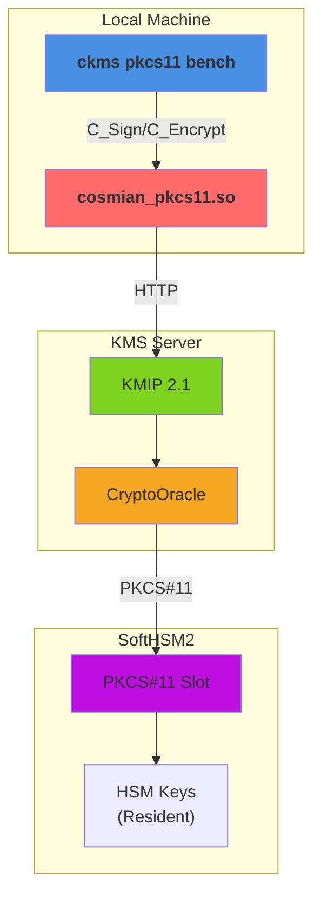
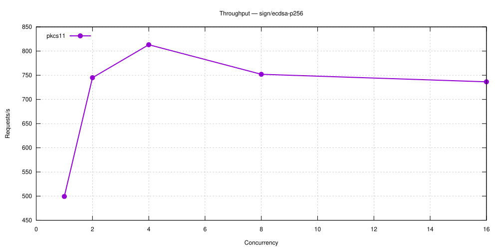
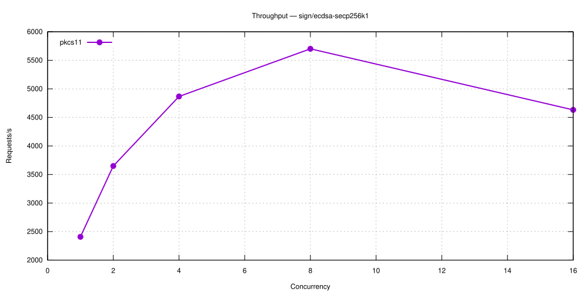
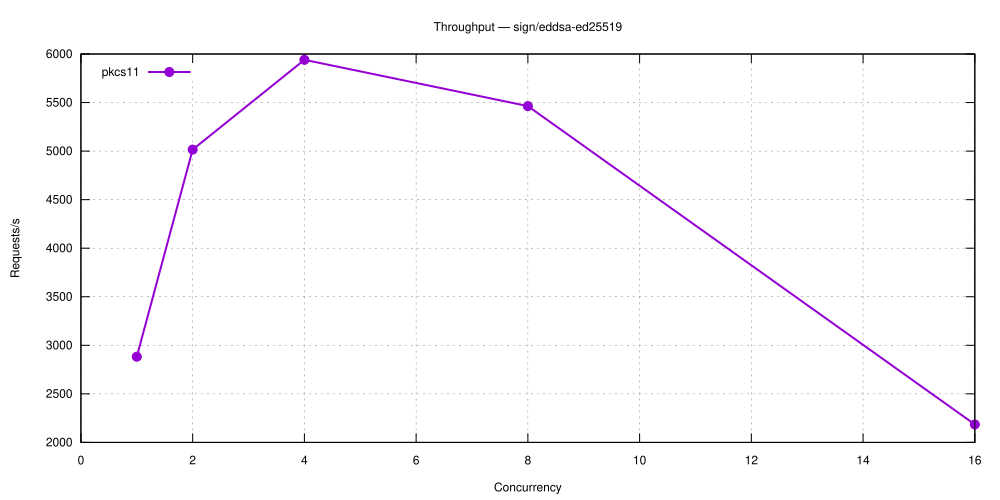
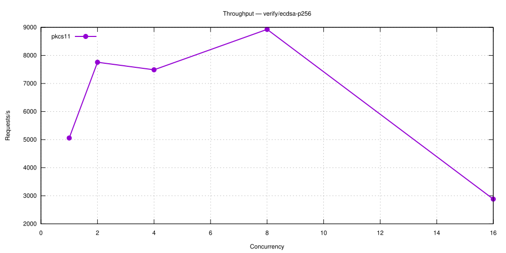
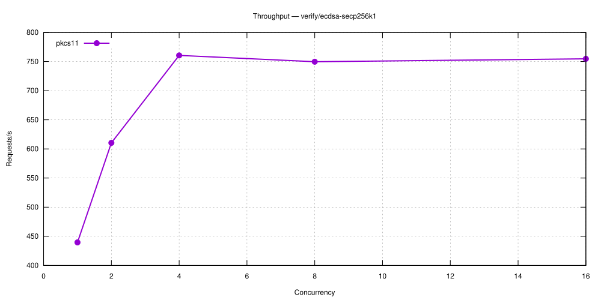
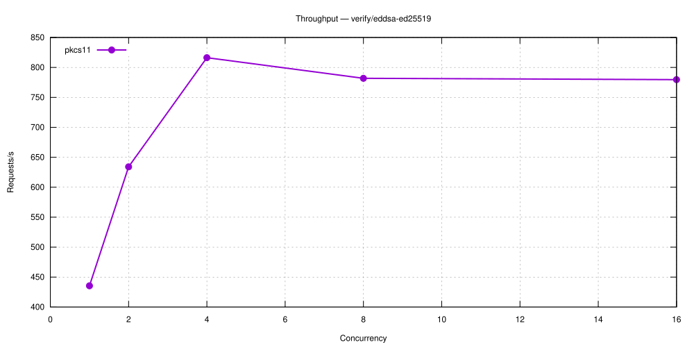

# KMS Performance Comparison

**Versions**: `v5.27.1`
**Generated**: 2026-09-24

---

## Benchmark Environment

| Field | Value |
|---|---|
| Date | 2026-09-24 12:07:24 UTC |
| Build | bench / non-fips |
| Database | SQLite (temporary, single benchmark run) |
| CPU | Intel(R) Core(TM) i9-14900T @ 2,061 MHz |
| CPU cores | 24 physical / 32 logical (HT) |
| RAM | 31.1 GB |
| OS | Ubuntu 24.04.5 LTS |
| Kernel | 6.8.0-142-generic |

### Load test parameters

| Parameter | Value |
|---|---|
| Mode | sign-verify |
| Protocols | pkcs11 |
| Measurement window | 5 s per concurrency level |
| Concurrency levels | 1,2,4,8,16 |
| Warm-up | 1 s |
| Cooldown between levels | 1 s |

### CPU detail (`lscpu`)

```text
Architecture:                            x86_64
CPU op-mode(s):                          32-bit, 64-bit
Address sizes:                           46 bits physical, 48 bits virtual
Byte Order:                              Little Endian
CPU(s):                                  32
On-line CPU(s) list:                     0-31
Vendor ID:                               GenuineIntel
Model name:                              Intel(R) Core(TM) i9-14900T
CPU family:                              6
Model:                                   183
Thread(s) per core:                      2
Core(s) per socket:                      24
Socket(s):                               1
Stepping:                                1
CPU(s) scaling MHz:                      43%
CPU max MHz:                             5500,0000
CPU min MHz:                             800,0000
BogoMIPS:                                2227,20
Flags:                                   fpu vme de pse tsc msr pae mce cx8 apic sep mtrr pge mca cmov pat pse36 clflush dts acpi mmx fxsr sse sse2 ss ht tm pbe syscall nx pdpe1gb rdtscp lm constant_tsc art arch_perfmon pebs bts rep_good nopl xtopology nonstop_tsc cpuid aperfmperf tsc_known_freq pni pclmulqdq dtes64 monitor ds_cpl vmx smx est tm2 ssse3 sdbg fma cx16 xtpr pdcm pcid sse4_1 sse4_2 x2apic movbe popcnt tsc_deadline_timer aes xsave avx f16c rdrand lahf_lm abm 3dnowprefetch cpuid_fault epb ssbd ibrs ibpb stibp ibrs_enhanced tpr_shadow flexpriority ept vpid ept_ad fsgsbase tsc_adjust bmi1 avx2 smep bmi2 erms invpcid rdseed adx smap clflushopt clwb intel_pt sha_ni xsaveopt xsavec xgetbv1 xsaves split_lock_detect user_shstk avx_vnni dtherm ida arat pln pts hwp hwp_notify hwp_act_window hwp_epp hwp_pkg_req hfi vnmi umip pku ospke waitpkg gfni vaes vpclmulqdq tme rdpid movdiri movdir64b fsrm md_clear serialize pconfig arch_lbr ibt flush_l1d arch_capabilities ibpb_exit_to_user
Virtualization:                          VT-x
L1d cache:                               896 KiB (24 instances)
L1i cache:                               1,3 MiB (24 instances)
L2 cache:                                32 MiB (12 instances)
L3 cache:                                36 MiB (1 instance)
NUMA node(s):                            1
NUMA node0 CPU(s):                       0-31
Vulnerability Gather data sampling:      Not affected
Vulnerability Indirect target selection: Not affected
Vulnerability Itlb multihit:             Not affected
Vulnerability L1tf:                      Not affected
Vulnerability Mds:                       Not affected
Vulnerability Meltdown:                  Not affected
Vulnerability Mmio stale data:           Not affected
Vulnerability Reg file data sampling:    Mitigation; Clear Register File
Vulnerability Retbleed:                  Not affected
Vulnerability Spec rstack overflow:      Not affected
Vulnerability Spec store bypass:         Mitigation; Speculative Store Bypass disabled via prctl
Vulnerability Spectre v1:                Mitigation; usercopy/swapgs barriers and __user pointer sanitization
Vulnerability Spectre v2:                Mitigation; Enhanced / Automatic IBRS; IBPB conditional; PBRSB-eIBRS SW sequence; BHI BHI_DIS_S
Vulnerability Srbds:                     Not affected
Vulnerability Tsa:                       Not affected
Vulnerability Tsx async abort:           Not affected
Vulnerability Vmscape:                   Mitigation; IBPB before exit to userspace
```

---

## Architecture



**Components**:

- **ckms**: PKCS#11 load test driver
- **cosmian_pkcs11.so**: PKCS#11 provider bridge
- **KMIP Endpoint**: Server-side protocol handler
- **CryptoOracle**: Routes operations to HSM-resident keys (C_Sign, C_Encrypt directly on hardware)
- **PKCS#11 Slot**: HSM backend for key storage and cryptographic ops

---

## Protocols

The caller-facing protocol benchmarked here is the `cosmian_pkcs11` provider's real PKCS#11 v3.1 Cryptoki C ABI: the benchmark `dlopen()`s the built shared library (`libcosmian_pkcs11.{so,dylib}`) and resolves its standard interface through `C_GetInterface` — the same call path v3-aware PKCS#11 consumers (Oracle TDE, OpenSSH, disk-encryption tools) use. For remote Sign, the provider wraps the KMIP operation in a KMIP 2.1 `RequestMessage`, serializes binary TTLV, and sends `application/octet-stream` to `POST /kmip`; the binary TTLV response is fully deserialized before `C_SignMessage` returns.

This delegated variant provisions `hsm::<slot>::...` keys. After the provider sends each KMIP request, KMS routes the key to its `CryptoOracle`; the cryptographic operation executes through the server-side SoftHSM2 PKCS#11 backend rather than software crypto.

| Interface | Transport | Description |
|---|---|---|
| **PKCS#11 (Cryptoki v3.1)** | `C_GetInterface` + C ABI | `C_Initialize`, `C_OpenSession`, `C_EncryptInit`/`C_Encrypt`, `C_DecryptInit`/`C_Decrypt`, `C_MessageSignInit`/`C_SignMessage`, `C_VerifyInit`/`C_Verify`, `C_GenerateKey` |
| **Provider → KMS Sign** | KMIP 2.1 binary TTLV over HTTP | `POST /kmip`, `application/octet-stream` |
| **KMS → HSM** | PKCS#11 via `CryptoOracle` | HSM-resident key generation and cryptographic operations |

---

## Benchmark Methodology

### Real Cryptoki C ABI, one session per worker

The benchmark subcommand `ckms pkcs11 bench` (driven by `mise bench:load-pkcs11 --delegated`) `dlopen()`s the built `cosmian_pkcs11` shared library, resolves the v3.1 function table through `C_GetInterface`, and calls it directly — the same code path a real PKCS#11 consumer application uses, as opposed to `mise bench:load`, which drives the KMIP REST API directly through the `ckms` client library.

By default each worker thread owns a dedicated `C_OpenSession` handle. The provider looks the handle up in its session map and serializes only access to that individual session with a per-session lock, so unrelated worker sessions can progress independently. `--shared-session` is an opt-in comparison mode that reproduces the former single-session contention model; it is not the default methodology.

For the Ed25519 Sign path measured in this report, `C_MessageSignInit` runs once during setup and each `C_SignMessage` crosses the synchronous PKCS#11 boundary, builds a KMIP 2.1 `RequestMessage`, serializes it as binary TTLV, sends it to the `/kmip` octet-stream endpoint, and parses the binary TTLV response before copying the signature into the caller-owned buffer.

### HSM-resident key execution

With `--delegated`, provisioning assigns `hsm::<slot>::...` UIDs and persists discovery tags in a versioned PKCS#11 `CKA_LABEL` envelope while retaining the raw key ID in `CKA_ID`. The provider locates those tagged keys through KMS, while Encrypt, Decrypt, Sign, Verify, and key generation are executed by the KMS `CryptoOracle` on the SoftHSM2 token. For `--mode all`, key-creation, encrypt, sign, and verify run against separate fresh tokens so cumulative SoftHSM2 key generation does not contaminate later measurements.

### Independent operations

Unlike the software/HSM reports above, where `encrypt` and `sign-verify` each measure a single named request, this report measures every Cryptoki operation **independently**: `encrypt` (`C_EncryptInit`/`C_Encrypt`), `decrypt` (`C_DecryptInit`/`C_Decrypt`, against ciphertext produced once during setup — not timed), Ed25519 `sign` (`C_MessageSignInit` once + `C_SignMessage` per message), RSA `sign` (`C_SignInit`/`C_Sign`), `verify` (`C_VerifyInit`/`C_Verify`), and `key-creation` (`C_GenerateKey`+`C_DestroyObject`, ephemeral AES key per iteration) each get their own concurrency sweep and their own row/chart below.

`C_VerifyInit`/`C_Verify` are implemented and benchmarked through the same real Cryptoki function table. Verify rows are therefore ordinary measured operations, not placeholders or unsupported-operation probes.

`C_GenerateKeyPair` is not implemented either (asymmetric keys are always created through the KMS REST API, not PKCS#11), so `key-creation` only covers the one Cryptoki key-creation path the provider does support: symmetric `C_GenerateKey`.

### Load test (`mise bench:load-pkcs11 --delegated`)

The load test sweeps a configurable list of concurrency levels, mirroring `mise bench:load`'s own sweep mechanics exactly: at each level *N* concurrent OS threads call the target Cryptoki function in a tight loop for a fixed **measurement window** (default: 20 s), preceded by a **warm-up phase** (default: 5 s) that is excluded from measurements, followed by a **cooldown** (default: 2 s) before the next level.
Recorded metrics per *(operation, concurrency)* pair:

- **Throughput** — Cryptoki calls per second
- **p50 / p95 / p99** — per-call latency percentiles (ms)

> **Infrastructure note:** The benchmark server uses a **local SQLite** backend (temporary, discarded after the run). Throughput figures will differ on a production deployment backed by PostgreSQL or Redis-Findex.

---

## Load Tests

### sign/ecdsa-p256

| Concurrency | pkcs11 (req/s) |
|---|---|
| 1 | 499 |
| 2 | 745 |
| 4 | 813 |
| 8 | 752 |
| 16 | 736 |



---

### sign/ecdsa-secp256k1

| Concurrency | pkcs11 (req/s) |
|---|---|
| 1 | 419 |
| 2 | 503 |
| 4 | 781 |
| 8 | 736 |
| 16 | 714 |



---

### sign/eddsa-ed25519

| Concurrency | pkcs11 (req/s) |
|---|---|
| 1 | 451 |
| 2 | 644 |
| 4 | 742 |
| 8 | 737 |
| 16 | 706 |



---

### verify/ecdsa-p256

| Concurrency | pkcs11 (req/s) |
|---|---|
| 1 | 493 |
| 2 | 593 |
| 4 | 756 |
| 8 | 788 |
| 16 | 749 |



---

### verify/ecdsa-secp256k1

| Concurrency | pkcs11 (req/s) |
|---|---|
| 1 | 440 |
| 2 | 610 |
| 4 | 761 |
| 8 | 750 |
| 16 | 755 |



---

### verify/eddsa-ed25519

| Concurrency | pkcs11 (req/s) |
|---|---|
| 1 | 435 |
| 2 | 634 |
| 4 | 816 |
| 8 | 782 |
| 16 | 780 |



---
