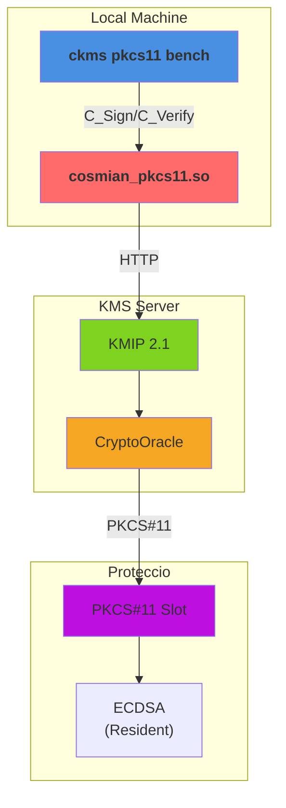

# KMS Performance Comparison

**Versions**: `v5.28.0`
**Generated**: 2026-10-09

---

## Benchmark Environment

| Field | Value |
|---|---|
| Date | 2026-10-09 14:42:29 UTC |
| HSM backend | Proteccio |
| Command | `mise run bench:pkcs11 --delegated --hsm-model proteccio` |
| Build | bench / non-fips |
| Database | SQLite (temporary, single benchmark run) |
| CPU | Intel(R) Xeon(R) Silver 4210R CPU @ 2.40GHz @ 2,400 MHz |
| CPU cores | 8 physical / 8 logical (HT) |
| RAM | 15.6 GB |
| OS | Debian GNU/Linux 13 (trixie) |
| Kernel | 6.12.111+deb13-amd64 |

### Load test parameters

| Parameter | Value |
|---|---|
| Mode | sign-verify |
| Protocols | pkcs11 |
| Measurement window | 20 s per concurrency level |
| Concurrency levels | 1 |
| Warm-up | 5 s |
| Cooldown between levels | 2 s |

### CPU detail (`lscpu`)

```text
Architecture:                            x86_64
CPU op-mode(s):                          32-bit, 64-bit
Address sizes:                           45 bits physical, 48 bits virtual
Byte Order:                              Little Endian
CPU(s):                                  8
On-line CPU(s) list:                     0-7
Vendor ID:                               GenuineIntel
Model name:                              Intel(R) Xeon(R) Silver 4210R CPU @ 2.40GHz
CPU family:                              6
Model:                                   85
Thread(s) per core:                      1
Core(s) per socket:                      8
Socket(s):                               1
Stepping:                                7
BogoMIPS:                                4800.00
Flags:                                   fpu vme de pse tsc msr pae mce cx8 apic sep mtrr pge mca cmov pat pse36 clflush mmx fxsr sse sse2 ss ht syscall nx pdpe1gb rdtscp lm constant_tsc arch_perfmon nopl xtopology tsc_reliable nonstop_tsc cpuid tsc_known_freq pni pclmulqdq ssse3 fma cx16 pcid sse4_1 sse4_2 x2apic movbe popcnt tsc_deadline_timer aes xsave avx f16c rdrand hypervisor lahf_lm abm 3dnowprefetch ssbd ibrs ibpb stibp ibrs_enhanced fsgsbase tsc_adjust bmi1 avx2 smep bmi2 invpcid avx512f avx512dq rdseed adx smap clflushopt clwb avx512cd avx512bw avx512vl xsaveopt xsavec xgetbv1 xsaves arat pku ospke avx512_vnni md_clear flush_l1d arch_capabilities
Hypervisor vendor:                       VMware
Virtualization type:                     full
L1d cache:                               256 KiB (8 instances)
L1i cache:                               256 KiB (8 instances)
L2 cache:                                8 MiB (8 instances)
L3 cache:                                13.8 MiB (1 instance)
NUMA node(s):                            1
NUMA node0 CPU(s):                       0-7
Vulnerability Gather data sampling:      Unknown: Dependent on hypervisor status
Vulnerability Indirect target selection: Mitigation; Aligned branch/return thunks
Vulnerability Itlb multihit:             KVM: Mitigation: VMX unsupported
Vulnerability L1tf:                      Not affected
Vulnerability Mds:                       Not affected
Vulnerability Meltdown:                  Not affected
Vulnerability Mmio stale data:           Vulnerable: Clear CPU buffers attempted, no microcode; SMT Host state unknown
Vulnerability Reg file data sampling:    Not affected
Vulnerability Retbleed:                  Mitigation; Enhanced IBRS
Vulnerability Spec rstack overflow:      Not affected
Vulnerability Spec store bypass:         Mitigation; Speculative Store Bypass disabled via prctl
Vulnerability Spectre v1:                Mitigation; usercopy/swapgs barriers and __user pointer sanitization
Vulnerability Spectre v2:                Mitigation; Enhanced / Automatic IBRS; IBPB conditional; PBRSB-eIBRS SW sequence; BHI SW loop, KVM SW loop
Vulnerability Srbds:                     Not affected
Vulnerability Tsa:                       Not affected
Vulnerability Tsx async abort:           Not affected
Vulnerability Vmscape:                   Not affected
```

---

## Architecture



**Components**:

- **ckms**: PKCS#11 load test driver (`mise run bench:pkcs11 --delegated --hsm-model proteccio`)
- **cosmian_pkcs11.so**: PKCS#11 provider bridge
- **KMIP Endpoint**: Server-side protocol handler
- **CryptoOracle**: Routes operations to HSM-resident keys (C_Sign/C_Verify on Proteccio)
- **PKCS#11 Slot**: Proteccio backend for key storage and cryptographic ops

---

## Protocols

The caller-facing protocol benchmarked here is the `cosmian_pkcs11` provider's real PKCS#11 v3.1 Cryptoki C ABI: the benchmark `dlopen()`s the built shared library (`libcosmian_pkcs11.{so,dylib}`) and resolves its standard interface through `C_GetInterface` — the same call path v3-aware PKCS#11 consumers (Oracle TDE, OpenSSH, disk-encryption tools) use. For remote Sign, the provider wraps the KMIP operation in a KMIP 2.1 `RequestMessage`, serializes binary TTLV, and sends `application/octet-stream` to `POST /kmip`; the binary TTLV response is fully deserialized before `C_SignMessage` returns.

This delegated variant provisions `hsm::<slot>::...` keys. After the provider sends each KMIP request, KMS routes the key to its `CryptoOracle`; the cryptographic operation executes through the server-side Proteccio PKCS#11 backend rather than software crypto.

| Interface | Transport | Description |
|---|---|---|
| **PKCS#11 (Cryptoki v3.1)** | `C_GetInterface` + C ABI | `C_Initialize`, `C_OpenSession`, `C_EncryptInit`/`C_Encrypt`, `C_DecryptInit`/`C_Decrypt`, `C_MessageSignInit`/`C_SignMessage`, `C_VerifyInit`/`C_Verify`, `C_GenerateKey` |
| **Provider → KMS Sign** | KMIP 2.1 binary TTLV over HTTP | `POST /kmip`, `application/octet-stream` |
| **KMS → HSM** | PKCS#11 via `CryptoOracle` | HSM-resident key generation and cryptographic operations |

---

## Benchmark Methodology

### Real Cryptoki C ABI, one session per worker

The benchmark subcommand `ckms pkcs11 bench` (driven by `mise run bench:pkcs11 --delegated --hsm-model proteccio`) `dlopen()`s the built `cosmian_pkcs11` shared library, resolves the v3.1 function table through `C_GetInterface`, and calls it directly — the same code path a real PKCS#11 consumer application uses, as opposed to `mise bench:load`, which drives the KMIP REST API directly through the `ckms` client library.

By default each worker thread owns a dedicated `C_OpenSession` handle. The provider looks the handle up in its session map and serializes only access to that individual session with a per-session lock, so unrelated worker sessions can progress independently. `--shared-session` is an opt-in comparison mode that reproduces the former single-session contention model; it is not the default methodology.

### HSM-resident key execution

With `--delegated`, provisioning assigns `hsm::<slot>::...` UIDs and persists discovery tags in a versioned PKCS#11 `CKA_LABEL` envelope while retaining the raw key ID in `CKA_ID`. The provider locates those tagged keys through KMS, while operations are executed by the KMS `CryptoOracle` on the Proteccio backend. For full test suites on simulator tokens, submodes run against separate fresh tokens so cumulative key generation does not contaminate later measurements.

### Independent operations

Unlike the software/HSM reports where requests may be bundled, this report measures each Cryptoki operation **independently**:

- **Sign**: `C_SignInit`/`C_Sign` (or `C_MessageSignInit`/`C_SignMessage` for Ed25519) crossing the synchronous PKCS#11 boundary
- **Verify**: `C_VerifyInit`/`C_Verify` implemented and benchmarked through the real Cryptoki function table

### Load test (`mise run bench:pkcs11 --delegated --hsm-model proteccio`)

The load test sweeps a configurable list of concurrency levels, mirroring `mise bench:load`'s own sweep mechanics exactly: at each level *N* concurrent OS threads call the target Cryptoki function in a tight loop for a fixed **measurement window** (default: 20 s), preceded by a **warm-up phase** (default: 5 s) that is excluded from measurements, followed by a **cooldown** (default: 2 s) before the next level.
Recorded metrics per *(operation, concurrency)* pair:

- **Throughput** — Cryptoki calls per second
- **p50 / p95 / p99** — per-call latency percentiles (ms)

> **Infrastructure note:** The benchmark server uses a **local SQLite** backend (temporary, discarded after the run). Throughput figures will differ on a production deployment backed by PostgreSQL or Redis-Findex.

---

## Load Tests

### sign/ecdsa-p256

| Concurrency | pkcs11 (req/s) |
|---|---|
| 1 | 175 |

---

### verify/ecdsa-p256

| Concurrency | pkcs11 (req/s) |
|---|---|
| 1 | 101 |

---
