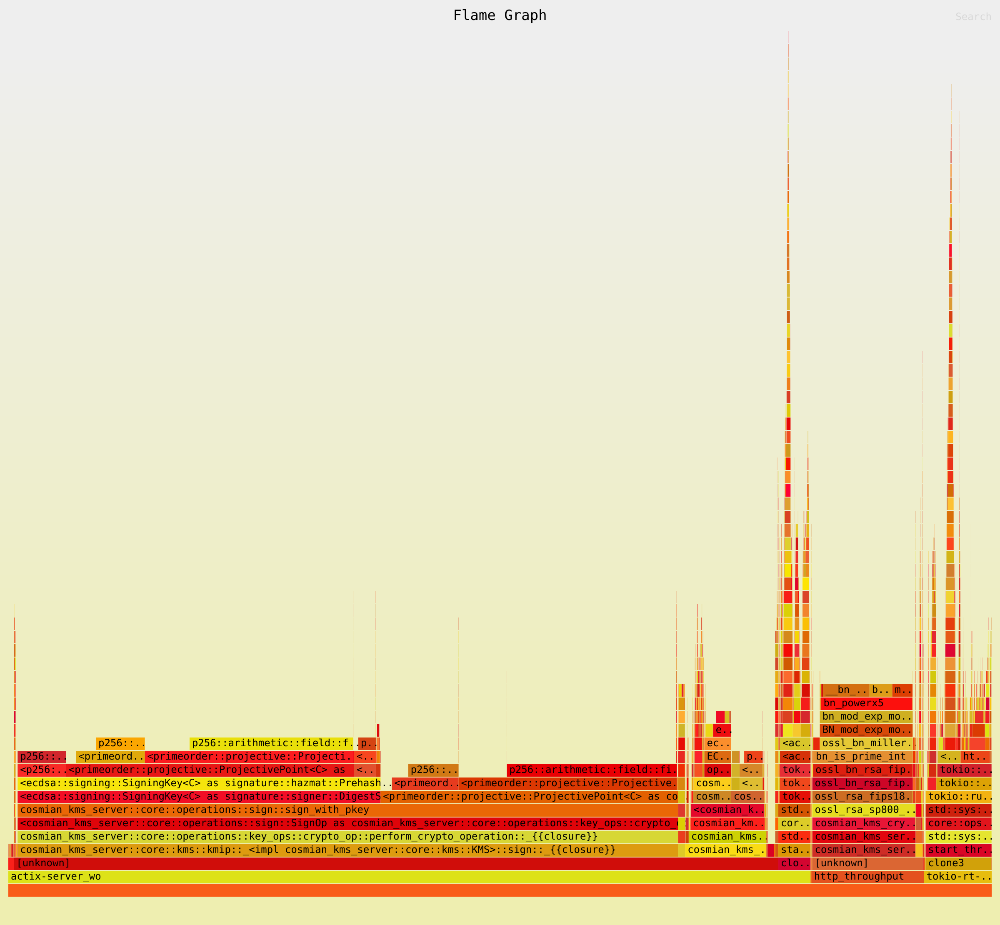
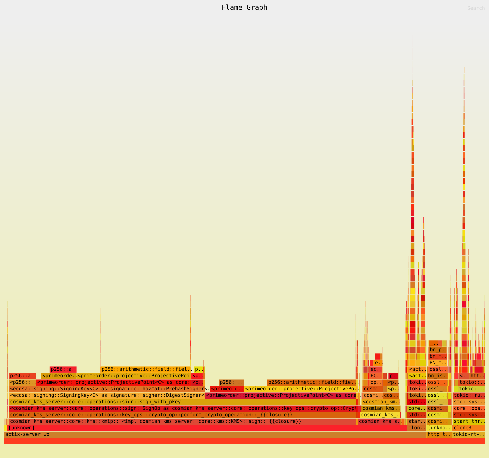
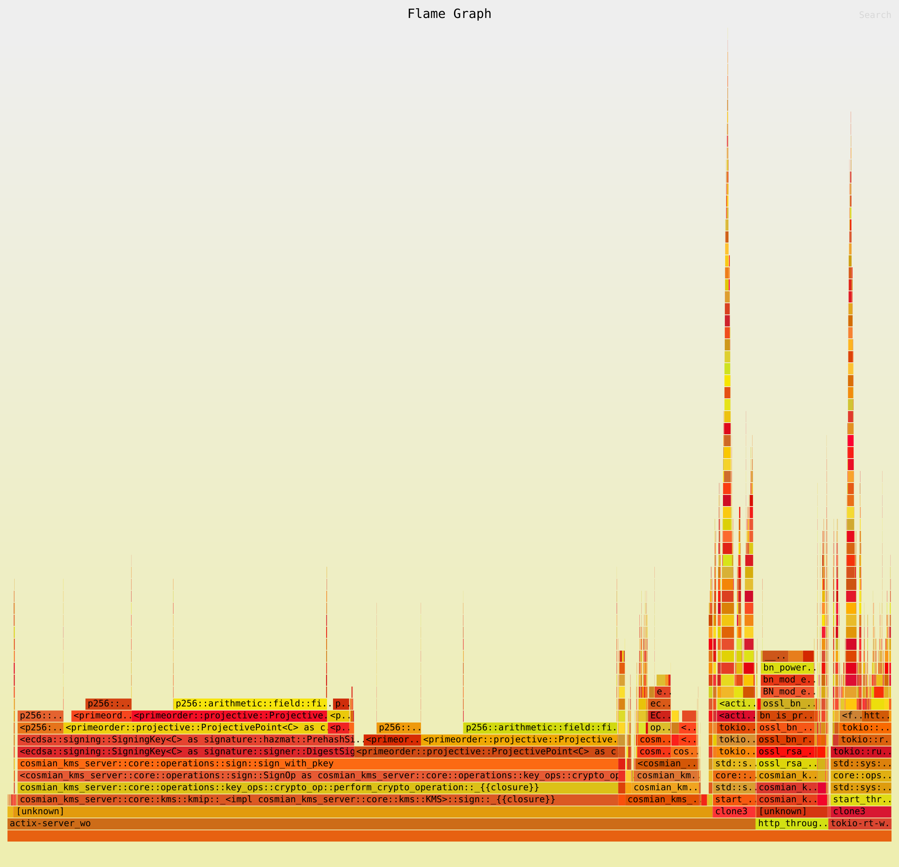
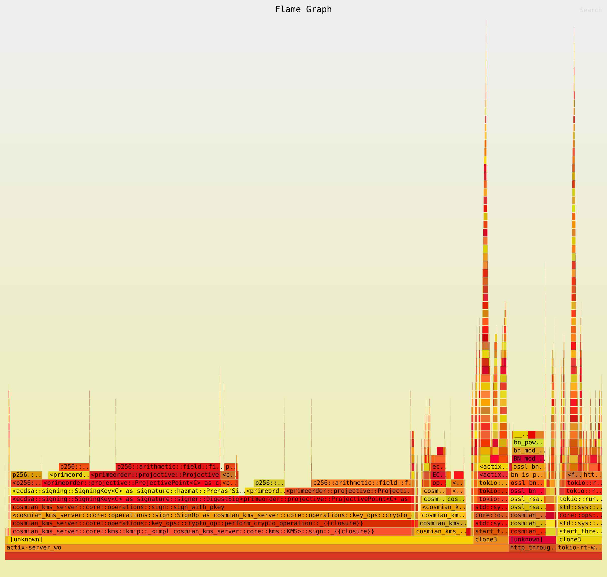

# CPU Scaling & Flamegraph Analysis

This page documents the multi-CPU scaling characteristics of the Cosmian KMS and explains how to
reproduce the results and generate flamegraphs yourself.

## Why this matters

A KMS deployed in production must handle concurrent cryptographic requests from many clients at the
same time. To justify a multi-core deployment (and to rule out serialisation bottlenecks such as
global mutexes or single-threaded database queues), we measure:

1. **Throughput scaling** – how req/s grows as the number of actix-web worker threads increases
   from 1 → 2 → 4 → 8.
2. **CPU hotspot profile** – a flamegraph confirming that the dominant cost is the cryptographic
   operation itself, not infrastructure overhead (routing, serialisation, database, locks).

## Methodology

### Server worker count

The KMS exposes a `--server-workers N` / `KMS_SERVER_WORKERS` configuration option that pins
the number of actix-web OS threads. Setting it explicitly makes the bench deterministic regardless
of the host's logical CPU count.

```toml
# kms.toml  – leave unset to default to one thread per logical CPU
# server_workers = 8
```

### Benchmark design

The `http_throughput` Criterion bench (located at
`crate/test_kms_server/benches/http_throughput.rs`) exercises three representative KMIP operations:

| Operation | Why chosen |
|-----------|-----------|
| AES-256-GCM encrypt | Lightweight, high-frequency – reveals OS-thread dispatch overhead |
| RSA-2048 OAEP decrypt | CPU-heavy asymmetric – shows scaling of the OpenSSL thread pool |
| ECDSA P-256 sign | CPU-heavy, short messages – reveals lock contention on key material |

For each worker count in `{1, 2, 4, 8}`:

1. A fresh in-process KMS is started with `server_workers = N` and SQLite on `/dev/shm` (tmpfs).
2. Cryptographic keys are pre-created (not timed).
3. **16 concurrent** `reqwest` HTTP tasks are dispatched per Criterion iteration via
   `iter_custom + join_all`, so the server is always saturated.
4. Criterion reports wall-clock throughput in **elements/s** (= concurrent requests per second).

### Flamegraph generation

Flamegraphs are recorded with
[`cargo-flamegraph`](https://github.com/flamegraph-rs/flamegraph) (Linux `perf` back-end) and
rendered to PNG with [`rsvg-convert`](https://gitlab.gnome.org/GNOME/librsvg) (part of
`librsvg2-bin`). They are generated for all three operations above at 1, 2, 4, and 8 workers.

> **Why `rsvg-convert` and not `convert`/ImageMagick?** ImageMagick delegates SVG rasterisation
> to `rsvg-convert` internally; if that binary is missing, `convert` silently falls back to a
> blank canvas, producing fully-black PNGs. Always invoke `rsvg-convert` directly.

To reproduce locally (Linux only, requires `perf` and `rsvg-convert`):

```bash
# Install cargo-flamegraph and rsvg-convert once
cargo install flamegraph --locked
sudo apt-get install -y librsvg2-bin

# Allow perf for unprivileged processes (revert after benchmarking)
echo -1 | sudo tee /proc/sys/kernel/perf_event_paranoid
echo 0   | sudo tee /proc/sys/kernel/kptr_restrict

# Build and profile – SVG lands next to this file
CARGO_PROFILE_BENCH_DEBUG=true \
cargo flamegraph \
  --bench http_throughput \
  -p test_kms_server \
  --features non-fips \
  --output documentation/docs/benchmarks/flamegraph/ecdsa_sign/w8/ecdsa_sign_w8.svg \
  -- \
  --bench \
  "ecdsa_sign/w8" \
  --profile-time 15

# Render the interactive SVG to a static PNG for the docs page
rsvg-convert --output documentation/docs/benchmarks/flamegraph/ecdsa_sign/w8/ecdsa_sign_w8.png \
  documentation/docs/benchmarks/flamegraph/ecdsa_sign/w8/ecdsa_sign_w8.svg
```

## Running the throughput benchmark

```bash
# Non-FIPS mode (all three operations)
cargo bench --bench http_throughput -p test_kms_server --features non-fips

# FIPS mode
cargo bench --bench http_throughput -p test_kms_server
```

Criterion writes an HTML report to `target/criterion/kms_bench/` (also copied to `flamegraph/` here).

## Interpreting the results

### What near-linear scaling looks like

If the KMS scales well, throughput doubles when the worker count doubles:

| Workers | Expected throughput (relative) |
|---------|-------------------------------|
| 1       | 1× baseline                    |
| 2       | ~1.9×                          |
| 4       | ~3.6×                          |
| 8       | ~6–7× (NUMA / HT effects)      |

Sub-linear but monotonically increasing throughput is normal and expected:

- HTTP keep-alive and connection pooling overhead does not scale perfectly.
- SQLite WAL mode serialises writes but allows concurrent reads.
- OpenSSL's FIPS provider has per-context locking.

Flat or decreasing throughput would indicate a bottleneck worth investigating.

### Reading a flamegraph

A flamegraph shows where CPU time is spent, stacked by call depth.

- **Wide frames at the top** = the dominant cost; you want to see `openssl` / `ring` /
  `cosmian_kms_crypto` here.
- **Wide frames in the middle** = infrastructure cost; `actix-rt`, `tokio`, `serde_json`,
  `sqlx` are expected but should be narrow compared to crypto.
- **Wide frames at the bottom** = system calls; `syscall`, `epoll_wait` width grows with
  I/O wait (not CPU saturation).

If `std::sync::Mutex` or `parking_lot::Mutex` frames appear wide, that signals lock contention
and is a regression signal worth investigating.

## CI integration

The `flamegraph.yml` GitHub Actions workflow runs:

- **On demand** via `workflow_dispatch` (configurable worker counts and profile time).
- **Weekly** (Monday 03:00 UTC) against the default branch.
- **On pull requests** that touch `http_config.rs`, `start_kms_server.rs`, or the bench itself.

Artifacts uploaded per run:

| Artifact | Contents |
|----------|----------|
| `criterion-http-throughput-<run_id>` | Criterion HTML report with throughput charts |
| `flamegraph-svgs-<run_id>` | SVG flamegraphs per worker count |
| `http-throughput-output-<run_id>` | Raw bench output (bencher format) |

---

## Results

> Generated: 2026-07-02 09:27:46 UTC
> KMS version: 5.24.0 (commit: a099a06e1)
> Variant: non-fips

## Machine Info

```text
Architecture:                            x86_64
CPU op-mode(s):                          32-bit, 64-bit
Address sizes:                           46 bits physical, 48 bits virtual
Byte Order:                              Little Endian
CPU(s):                                  32
On-line CPU(s) list:                     0-31
Vendor ID:                               GenuineIntel
Model name:                              Intel(R) Core(TM) i9-14900T
CPU family:                              6
Model:                                   183
Thread(s) per core:                      2
Core(s) per socket:                      24
Socket(s):                               1
Stepping:                                1
CPU(s) scaling MHz:                      32%
CPU max MHz:                             5500,0000
CPU min MHz:                             800,0000
BogoMIPS:                                2227,20
Flags:                                   fpu vme de pse tsc msr pae mce cx8 apic sep mtrr pge mca cmov pat pse36 clflush dts acpi mmx fxsr sse sse2 ss ht tm pbe syscall nx pdpe1gb rdtscp lm constant_tsc art arch_perfmon pebs bts rep_good nopl xtopology nonstop_tsc cpuid aperfmperf tsc_known_freq pni pclmulqdq dtes64 monitor ds_cpl vmx smx est tm2 ssse3 sdbg fma cx16 xtpr pdcm pcid sse4_1 sse4_2 x2apic movbe popcnt tsc_deadline_timer aes xsave avx f16c rdrand lahf_lm abm 3dnowprefetch cpuid_fault epb ssbd ibrs ibpb stibp ibrs_enhanced tpr_shadow flexpriority ept vpid ept_ad fsgsbase tsc_adjust bmi1 avx2 smep bmi2 erms invpcid rdseed adx smap clflushopt clwb intel_pt sha_ni xsaveopt xsavec xgetbv1 xsaves split_lock_detect user_shstk avx_vnni dtherm ida arat pln pts hwp hwp_notify hwp_act_window hwp_epp hwp_pkg_req hfi vnmi umip pku ospke waitpkg gfni vaes vpclmulqdq tme rdpid movdiri movdir64b fsrm md_clear serialize pconfig arch_lbr ibt flush_l1d arch_capabilities ibpb_exit_to_user
Virtualization:                          VT-x
L1d cache:                               896 KiB (24 instances)
L1i cache:                               1,3 MiB (24 instances)
L2 cache:                                32 MiB (12 instances)
L3 cache:                                36 MiB (1 instance)
NUMA node(s):                            1
NUMA node0 CPU(s):                       0-31
Vulnerability Gather data sampling:      Not affected
Vulnerability Indirect target selection: Not affected
Vulnerability Itlb multihit:             Not affected
Vulnerability L1tf:                      Not affected
Vulnerability Mds:                       Not affected
Vulnerability Meltdown:                  Not affected
Vulnerability Mmio stale data:           Not affected
Vulnerability Reg file data sampling:    Mitigation; Clear Register File
Vulnerability Retbleed:                  Not affected
Vulnerability Spec rstack overflow:      Not affected
Vulnerability Spec store bypass:         Mitigation; Speculative Store Bypass disabled via prctl
Vulnerability Spectre v1:                Mitigation; usercopy/swapgs barriers and __user pointer sanitization
Vulnerability Spectre v2:                Mitigation; Enhanced / Automatic IBRS; IBPB conditional; PBRSB-eIBRS SW sequence; BHI BHI_DIS_S
Vulnerability Srbds:                     Not affected
Vulnerability Tsa:                       Not affected
Vulnerability Tsx async abort:           Not affected
Vulnerability Vmscape:                   Mitigation; IBPB before exit to userspace
```

<details>
<summary>/proc/cpuinfo (first core)</summary>

```text
processor : 0
vendor_id : GenuineIntel
cpu family : 6
model  : 183
model name : Intel(R) Core(TM) i9-14900T
stepping : 1
microcode : 0x133
cpu MHz  : 3453.279
cache size : 36864 KB
physical id : 0
siblings : 32
core id  : 0
cpu cores : 24
apicid  : 0
initial apicid : 0
fpu  : yes
fpu_exception : yes
cpuid level : 32
wp  : yes
flags  : fpu vme de pse tsc msr pae mce cx8 apic sep mtrr pge mca cmov pat pse36 clflush dts acpi mmx fxsr sse sse2 ss ht tm pbe syscall nx pdpe1gb rdtscp lm constant_tsc art arch_perfmon pebs bts rep_good nopl xtopology nonstop_tsc cpuid aperfmperf tsc_known_freq pni pclmulqdq dtes64 monitor ds_cpl vmx smx est tm2 ssse3 sdbg fma cx16 xtpr pdcm pcid sse4_1 sse4_2 x2apic movbe popcnt tsc_deadline_timer aes xsave avx f16c rdrand lahf_lm abm 3dnowprefetch cpuid_fault epb ssbd ibrs ibpb stibp ibrs_enhanced tpr_shadow flexpriority ept vpid ept_ad fsgsbase tsc_adjust bmi1 avx2 smep bmi2 erms invpcid rdseed adx smap clflushopt clwb intel_pt sha_ni xsaveopt xsavec xgetbv1 xsaves split_lock_detect user_shstk avx_vnni dtherm ida arat pln pts hwp hwp_notify hwp_act_window hwp_epp hwp_pkg_req hfi vnmi umip pku ospke waitpkg gfni vaes vpclmulqdq tme rdpid movdiri movdir64b fsrm md_clear serialize pconfig arch_lbr ibt flush_l1d arch_capabilities ibpb_exit_to_user
vmx flags : vnmi preemption_timer posted_intr invvpid ept_x_only ept_ad ept_1gb flexpriority apicv tsc_offset vtpr mtf vapic ept vpid unrestricted_guest vapic_reg vid ple shadow_vmcs ept_mode_based_exec tsc_scaling usr_wait_pause
bugs  : spectre_v1 spectre_v2 spec_store_bypass swapgs eibrs_pbrsb rfds bhi vmscape
bogomips : 2227.20
clflush size : 64
cache_alignment : 64
address sizes : 46 bits physical, 48 bits virtual
power management:

processor : 1
vendor_id : GenuineIntel
cpu family : 6
model  : 183
model name : Intel(R) Core(TM) i9-14900T
stepping : 1
microcode : 0x133
cpu MHz  : 800.000
cache size : 36864 KB
physical id : 0
siblings : 32
core id  : 0
cpu cores : 24
apicid  : 1
initial apicid : 1
fpu  : yes
fpu_exception : yes
cpuid level : 32
wp  : yes
flags  : fpu vme de pse tsc msr pae mce cx8 apic sep mtrr pge mca cmov pat pse36 clflush dts acpi mmx fxsr sse sse2 ss ht tm pbe syscall nx pdpe1gb rdtscp lm constant_tsc art arch_perfmon pebs bts rep_good nopl xtopology nonstop_tsc cpuid aperfmperf tsc_known_freq pni pclmulqdq dtes64 monitor ds_cpl vmx smx est tm2 ssse3 sdbg fma cx16 xtpr pdcm pcid sse4_1 sse4_2 x2apic movbe popcnt tsc_deadline_timer aes xsave avx f16c rdrand lahf_lm abm 3dnowprefetch cpuid_fault epb ssbd ibrs ibpb stibp ibrs_enhanced tpr_shadow flexpriority ept vpid ept_ad fsgsbase tsc_adjust bmi1 avx2 smep bmi2 erms invpcid rdseed adx smap clflushopt clwb intel_pt sha_ni xsaveopt xsavec xgetbv1 xsaves split_lock_detect user_shstk avx_vnni dtherm ida arat pln pts hwp hwp_notify hwp_act_window hwp_epp hwp_pkg_req hfi vnmi umip pku ospke waitpkg gfni vaes vpclmulqdq tme rdpid movdiri movdir64b fsrm md_clear serialize pconfig arch_lbr ibt flush_l1d arch_capabilities ibpb_exit_to_user
vmx flags : vnmi preemption_timer posted_intr invvpid ept_x_only ept_ad ept_1gb flexpriority apicv tsc_offset vtpr mtf vapic ept vpid unrestricted_guest vapic_reg vid ple shadow_vmcs ept_mode_based_exec tsc_scaling usr_wait_pause
bugs  : spectre_v1 spectre_v2 spec_store_bypass swapgs eibrs_pbrsb rfds bhi vmscape
bogomips : 2227.20
clflush size : 64
cache_alignment : 64
address sizes : 46 bits physical, 48 bits virtual
power management:
```

</details>

## Throughput Results

Benchmark: `http_throughput` Criterion bench, 16 concurrent tasks per iteration,
worker sweep: `1 2 4 8`.

| Benchmark | ~req/s |
|-----------|--------|
| kms_bench/aes_gcm_enc/w1 | 60964 |
| kms_bench/rsa_oaep_dec/w1 | 39 |
| kms_bench/ecdsa_sign/w1 | 4962 |
| kms_bench/aes_gcm_enc/w2 | 34604 |
| kms_bench/rsa_oaep_dec/w2 | 74 |
| kms_bench/ecdsa_sign/w2 | 7575 |
| kms_bench/aes_gcm_enc/w4 | 23583 |
| kms_bench/rsa_oaep_dec/w4 | 126 |
| kms_bench/ecdsa_sign/w4 | 8273 |
| kms_bench/aes_gcm_enc/w8 | 82561 |
| kms_bench/rsa_oaep_dec/w8 | 153 |
| kms_bench/ecdsa_sign/w8 | 13805 |

## How to Reproduce

```bash
# Full run (throughput + flamegraphs for the default worker sweep)
mise bench:flamegraph

# Throughput only (no perf/flamegraph)
mise bench:flamegraph --skip-flamegraph

# Flamegraph for 8 workers only (skip throughput bench)
mise bench:flamegraph --workers 8 --skip-throughput

# Choose variant
mise bench:flamegraph --variant non-fips
```

## Flamegraphs

Generated by `cargo-flamegraph` / Linux `perf` during a `15`-second profiling window,
for each operation and worker count. Click a PNG's caption link to open the interactive SVG
(zoom, search) in a browser.

### `aes_gcm_enc`

> **Flamegraphs not yet regenerated.** Criterion throughput data is available in the
> [Criterion report](flamegraph/aes_gcm_enc/report/index.html). Run `mise bench:flamegraph`
> to populate flamegraphs here.

### `rsa_oaep_dec`

> **Flamegraphs not yet regenerated.** Criterion throughput data is available in the
> [Criterion report](flamegraph/rsa_oaep_dec/report/index.html). Run `mise bench:flamegraph`
> to populate flamegraphs here.

### `ecdsa_sign`

#### 1 worker(s)



[Open interactive SVG](flamegraph/ecdsa_sign/w1/ecdsa_sign_w1.svg)

#### 2 worker(s)



[Open interactive SVG](flamegraph/ecdsa_sign/w2/ecdsa_sign_w2.svg)

#### 4 worker(s)



[Open interactive SVG](flamegraph/ecdsa_sign/w4/ecdsa_sign_w4.svg)

#### 8 worker(s)



[Open interactive SVG](flamegraph/ecdsa_sign/w8/ecdsa_sign_w8.svg)

## Criterion Report

The full interactive Criterion HTML report is in [`flamegraph/`](flamegraph/report/index.html).
It is structured in four levels:

| Path | Contents |
|------|----------|
| `flamegraph/report/` | Group overview — all 3 operations × 4 worker counts |
| `flamegraph/<operation>/report/` | Per-operation summary — throughput curve across worker counts |
| `flamegraph/<operation>/<workers>/report/` | Individual benchmark — timing distribution, regression analysis |
| `flamegraph/<operation>/<workers>/` | Flamegraph SVG + PNG — CPU hotspot profile for this operation at this concurrency |

Each `<operation>/<workers>/` directory contains:

- `base/` / `new/` — Criterion raw measurement data (JSON)
- `report/` — Criterion HTML report (timing distribution, regression analysis)
- `*.svg` / `*.png` — flamegraph (generated by `cargo-flamegraph`)
