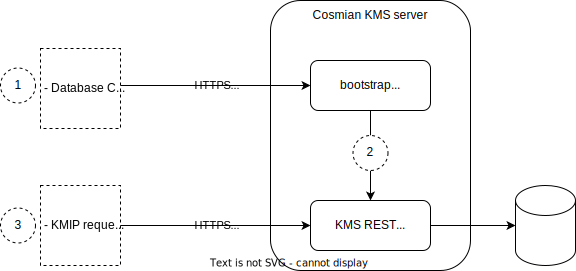

It is possible to bootstrap the KMS server start, to avoid specifying sensitive information in plain text on the command line.

When bootstrapped, the KMS server will first expose a TLS connection allowing configuration of the database and provision of the PKCS#12 configuring the KMS server HTTPS port. Once done, the KMS server will start with the supplied configuration.

When [running in a zero-trust environment](./zero_trust.md) inside a confidential VM, the bootstrap server provides the ability to configure the KMS without ever exposing sensitive configuration information in plain text to the environment administrators.



#### Starting in bootstrap mode

To start the KMS server in bootstrap mode, use the `--use-bootstrap-server` option:

```sh
docker run -p 9998:9998 --name kms ghcr.io/cosmian/kms:4.9.1 \
  --use-bootstrap-server
```

This will start an initial *bootstrap server* exposing a TLS connection on port 9998. The TLS connection is configured with a self-signed certificate.
Two options can be used to further configure the bootstrap server TLS connection:

- `--bootstrap-server-common-name <BOOTSTRAP_SERVER_COMMON_NAME>` to specify the common name of the bootstrap server self-signed certificate. The default value is `cosmian.kms`.

- `--bootstrap-server-port <BOOTSTRAP_SERVER_PORT>` to specify the bootstrap server TLS port. The default value is `9998`. When changed, the docker port mapping must be updated accordingly.

##### Running inside a confidential VM

When [running in a zero-trust environment](./zero_trust.md) inside a confidential VM, the bootstrap server should be started with the `--ensure-ra-tls` option. This will ensure that the bootstrap server self-signed TLS certificate contains information (a `quote`) that will enable the `ckms` client to verify the correctness of the environment (correct confidential hardware and correct KMS server code). Such server certificate is called an "RA TLS certificate" where RA stands for "Remote Attestation".

If the `ensure-ra-tls` option is enabled on a machine that does not have a confidential CPU, the bootstrap server will fail to start.

#### Available configurations

- Database: A database must be configured for the KMS server to start. If parameters have been passed on the command line, they will be overridden by those passed to the bootstrap server.

- HTTPS port: The HTTPS port of the KMS server can be configured using a PKCS#12 file containing the certificate and private key to use for the HTTPS port. If parameters have been passed on the command line, they will be overridden by those passed to the bootstrap server. Specifying a PKCS#12 file is not mandatory. If none is specified, the KMS server will start in plain HTTP mode. When [running in a zero-trust environment](./zero_trust.md), a PKCS#12 file should always be provided to start the KMS in HTTPS mode, *inside* the confidential VM.

#### Configuring using the `ckms` CLI

Using the `ckms` CLI, both the database and KMS server HTTPS port can be configured in a single instruction using the `ckms bootstrap-start` command.

For example:

```sh
ckms bootstrap-start \
  --database-type redis-findex \
  --database-url redis://redis-server:6379 \
  --redis-master-password master-password \
  --redis-findex-label label \
  --https-p12-file ./crate/cli/test_data/certificates/kmserver.acme.com.p12 -\
  --https-p12-password p12-password
```

To contact the bootstrap server, `ckms` uses the `bootstrap_server_url` value configured in the `~/.cosmian/kms.json` configuration file. If the URL is not specified, the `kms_server_url` is used, replacing `http` with `https` if need be.

Check the [`ckms` documentation](./cli/main_commands.md#bootstrap-start) for details.

#### Configuring using HTTPS POSTs

The configuration can be passed to the bootstrap server using successive HTTPS POSTs followed by a final POST on the `/start` endpoint to start the KMS server.

!!!info  "Using curl to POST to the bootstrap server"

    The following examples use `curl` to POST to the bootstrap server. When using `curl` to POST to the bootstrap server, the `-k` option must be used to disable certificate validation since the bootstrap server TLS certificate is self-signed.

##### DB: Redis (with Findex)

To use Redis with Findex as the database, a JSON POST of

- the database URL
- the Redis master password
- the Findex label

to the `/redis-findex` endpoint must be performed:

```sh
 curl -k -X POST -H "Content-Type: application/json" \
   -d '{"url": "redis://redis-server:6379", "master_password":"password","findex_label":"label"}' \
   https://kms-server:9998/redis-findex
```

##### DB: PostgreSQL

To use PostgreSQL as the database, a JSON POST of the database URL to the `/postgresql` endpoint must be performed:

```sh
curl -k -X POST -H "Content-Type: application/json" -d '{"url": "postgresql://postgres-server:5432"}' https://kms-server:9998/postgresql
```

##### DB: Mysql or MariaDB

To use Mysql or MariaDB as the database, a JSON POST of the database URL to the `/mysql` endpoint must be performed:

```sh
curl -k -X POST -H "Content-Type: application/json" -d '{"url": "mysql://mysql-server:3306"}' https://kms-server:9998/mysql
```

##### DB: SQLite

To use SQLite as the database, a JSON POST of the database file path to the `/sqlite` endpoint must be performed:

```sh
curl -k -X POST -H "Content-Type: application/json" -d '{"path": "/cosmian-kms/sqlite-data"}' https://kms-server:9998/sqlite
```

##### DB: SQLite - client-side encrypted

To use client-side encrypted SQLite databases, a JSON POST of the database directory path to the `/sqlite-ec` endpoint must be performed:

```sh
curl -k -X POST -H "Content-Type: application/json" -d '{"path": "/cosmian-kms/sqlite-data"}' https://kms-server:9998/sqlite-enc
```

###### PKCS#12: File

To start a KMS with an HTTPS port, the PKCS#12 file containing the certificate and private key to use must be uploaded to the `/pkcs12` endpoint.
The PKCS#12 file must be uploaded using a `multipart/form-data` POST request with the `file` field containing the PKCS#12 file and a `content-type` header with value `application/octet-stream`.

```sh
curl -k -F name=pkcs12 -F file=@kms-server.p12 https://kms-server:9998/pkcs12
```

###### PKCS#12: password

If the PKCS#12 file is password protected (i.e. has a non-empty password), the password must be uploaded to the `/pkcs12-password` endpoint.

```sh
curl -k -X POST -H "Content-Type: application/json" -d '{"password": "PKCS12password"}' https://kms-server:9998/pkcs12-password
```

###### Start the KMS server

Once the database and PKCS#12 file have been configured, the KMS server can be started by sending a JSON POST to the `/start` endpoint:

```sh
 curl -k -X POST -H "Content-Type: application/json" -d '{"clear_database": false}' https://localhost:9998/start
```

The `clear_database` parameter is optional and defaults to `false`. When set to `true`, the database will be cleared before starting the KMS server.

If the configuration is invalid (missing database parameters, invalid PKCS#12 password), the bootstrap server will return a `400` error with a JSON body containing the error message and wait for a new configuration to be POSTed.
