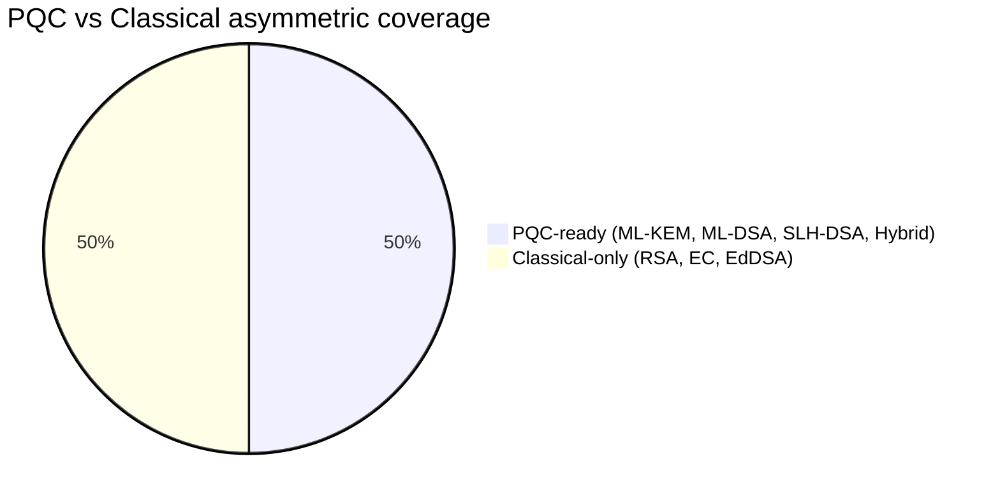
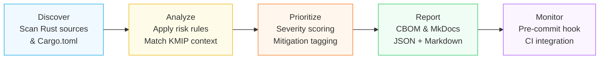

<!-- AUTO-GENERATED by .github/scripts/audit/crypto_sensor.sh -->
<!-- Do not edit by hand — run the sensor to regenerate this file.     -->
<!-- commit: 959a4414  -->

# 🔐 Cosmian KMS — Cryptographic Posture Report

???+ info "ℹ️ Auto-generated report — do not edit by hand"
    Last commit: `959a4414`

    To regenerate:
    ```bash
    bash .github/scripts/audit/crypto_sensor.sh --repo-root .
    ```

---

## 🎯 Security Posture Scorecard

<div style="display:grid;grid-template-columns:repeat(auto-fit,minmax(175px,1fr));gap:1rem;margin:1.5rem 0">
<div style="padding:1.25rem 1rem;border-radius:0.75rem;border:2px solid #22c55e;background:#f0fdf4;text-align:center">
<div style="font-size:2rem;font-weight:800;color:#16a34a">✅ None</div>
<div style="font-size:0.8rem;font-weight:700;color:#16a34a;text-transform:uppercase;letter-spacing:0.05em">Unmitigated CRITICAL</div>
<div style="font-size:0.7rem;color:#6b7280;margin-top:0.25rem">21 total CRITICAL</div>
</div>
<div style="padding:1.25rem 1rem;border-radius:0.75rem;border:2px solid #22c55e;background:#f0fdf4;text-align:center">
<div style="font-size:2rem;font-weight:800;color:#16a34a">✅ None</div>
<div style="font-size:0.8rem;font-weight:700;color:#16a34a;text-transform:uppercase;letter-spacing:0.05em">Unmitigated HIGH</div>
<div style="font-size:0.7rem;color:#6b7280;margin-top:0.25rem">40 total HIGH</div>
</div>
<div style="padding:1.25rem 1rem;border-radius:0.75rem;border:2px solid #8b5cf6;background:#f5f3ff;text-align:center">
<div style="font-size:2rem;font-weight:800;color:#7c3aed">50%</div>
<div style="font-size:0.8rem;font-weight:700;color:#7c3aed;text-transform:uppercase;letter-spacing:0.05em">PQC Readiness</div>
<div style="font-size:0.7rem;color:#6b7280;margin-top:0.25rem">asymmetric ops with PQC alternative</div>
</div>
<div style="padding:1.25rem 1rem;border-radius:0.75rem;border:2px solid #9ca3af;background:#f9fafb;text-align:center">
<div style="font-size:2rem;font-weight:800;color:#6b7280">43%</div>
<div style="font-size:0.8rem;font-weight:700;color:#6b7280;text-transform:uppercase;letter-spacing:0.05em">FIPS Coverage</div>
<div style="font-size:0.7rem;color:#6b7280;margin-top:0.25rem">FIPS 140-3 approved algorithm refs</div>
</div>
<div style="padding:1.25rem 1rem;border-radius:0.75rem;border:2px solid #0ea5e9;background:#f0f9ff;text-align:center">
<div style="font-size:2rem;font-weight:800;color:#0284c7">180</div>
<div style="font-size:0.8rem;font-weight:700;color:#0284c7;text-transform:uppercase;letter-spacing:0.05em">Zeroize References</div>
<div style="font-size:0.7rem;color:#6b7280;margin-top:0.25rem">key material cleared on drop</div>
</div>
</div>

!!! success "✅ No unmitigated CRITICAL or HIGH findings"
    All CRITICAL/HIGH hits are KMIP spec enum definitions (blocked at runtime
    by `algorithm_policy.rs`) or known-acceptable technical context.
    **No immediate remediation required.**


---

## 📊 Discovery Overview

=== "📈 Risk Summary"

    | Severity | Count | Context |
    |----------|------:|---------|
    | 🔴 CRITICAL | **21** | Broken algorithms (DES·MD5·RC4) — all KMIP spec enums, blocked at runtime |
    | 🟠 HIGH | **40** | Weak key sizes (RSA-1024·EC-P192) and deprecated SHA-1 |
    | 🟡 MEDIUM | **0** | Medium-severity issues |
    | 🔵 LOW / ⚪ INFO | **2185** | Informational algorithm usage references |

    ```mermaid
    pie title Sensor findings by severity
    "CRITICAL" : 21
    "HIGH" : 40
    "INFO" : 2185
    ```

=== "🔬 Algorithm Profile"

    Reference counts = source lines matching each algorithm pattern.

    | Algorithm | Category | FIPS 140-3 | PQC | Refs |
    |-----------|----------|:----------:|:---:|-----:|
    | PKCS#11/HSM | HSM interface | ❌ | — | 571 |
    | RSA | Asymmetric | ✅ | ❌ | 246 |
    | Covercrypt (ABE) | Attribute-Based Encryption | ❌ | — | 226 |
    | X.509 certificate | PKI / TLS | ✅ | — | 203 |
    | ML-KEM (FIPS 203) | Post-Quantum KEM | ✅ | ✅ | 167 |
    | SLH-DSA (FIPS 205) | Post-Quantum Signature | ✅ | — | 158 |
    | EdDSA (Ed25519/Ed448) | Asymmetric | ✅ | ❌ | 107 |
    | AES-GCM/GCM-SIV | Symmetric | ✅ | — | 93 |
    | ML-DSA (FIPS 204) | Post-Quantum Signature | ✅ | — | 50 |
    | Hybrid KEM | Classical + PQC | ✅ | ✅ | 26 |
    | EC-P192 | Asymmetric — WEAK KEY | ❌ | ❌ | 19 |
    | EC (ECDSA/ECDH) | Asymmetric | ✅ | ❌ | 15 |
    | DES/3DES | Symmetric — DEPRECATED | ❌ | — | 15 |
    | SHA-1 | Hash — deprecated for signing | ❌ | — | 13 |
    | ChaCha20-Poly1305 | Symmetric (non-FIPS) | ❌ | — | 10 |
    | RSA-1024 | Asymmetric — WEAK KEY | ❌ | ❌ | 8 |
    | Argon2 | KDF | ❌ | — | 5 |
    | RC4 | Symmetric — BROKEN | ❌ | — | 5 |
    | MD5 | Hash — BROKEN | ❌ | — | 1 |

    > Deprecated entries in `kmip_1_4/` are KMIP spec enum definitions — **not active operations**.
    > Blocked at runtime by `algorithm_policy.rs`.

    ```mermaid
    pie title Algorithm usage by category
    "PKCS#11 / HSM" : 571
    "Asymmetric (RSA)" : 246
    "ABE (Covercrypt)" : 226
    "TLS / X.509" : 203
    "PQC (ML-KEM)" : 167
    "PQC (SLH-DSA)" : 158
    "Asymmetric (EdDSA)" : 107
    "Symmetric (AES)" : 93
    "PQC (ML-DSA)" : 50
    "Asymmetric — weak" : 27
    "PQC (Hybrid KEM)" : 26
    "Asymmetric (EC)" : 15
    "Symmetric (deprecated)" : 15
    "Hash (deprecated)" : 13
    "Symmetric (ChaCha20)" : 10
    "KDF (Argon2)" : 5
    "Symmetric (RC4)" : 5
    "Hash (MD5)" : 1
    ```

=== "📦 Dependencies"

    | Dependency | Description | Standard | Cargo.toml refs |
    |------------|-------------|----------|----------------:|
    | `openssl (FIPS provider)` | openssl (FIPS provider) |  | 76 |
    | `openssl` | OpenSSL 3.6 (FIPS provider) | FIPS 140-3 | 33 |
    | `x509-parser` | x509-parser | RFC 5280 | 5 |
    | `cosmian_crypto_core` | cosmian_crypto_core |  | 5 |
    | `p256` | p256 (NIST P-256) | FIPS 186-5 | 3 |
    | `aes-gcm` | RustCrypto/aes-gcm-siv | RFC 8452 | 1 |
    | `argon2` | RustCrypto/argon2 | RFC 9106 | 1 |
    | `cosmian_cover_crypt` | cosmian_cover_crypt |  | 1 |
    | `k256` | k256 (secp256k1) |  | 1 |
    | `rustls` | rustls (TLS) | RFC 8446 | 1 |
    | `ring` | ring (BoringSSL subset) |  | 1 |

    ```mermaid
    flowchart TD
        COSMIAN_KMS["Cosmian KMS"]
        COSMIAN_KMS --> OPENSSL__FIPS_PROVIDER_["openssl (FIPS provider)"]
        COSMIAN_KMS --> OPENSSL["OpenSSL (FIPS provider)"]
        COSMIAN_KMS --> X509_PARSER["x509-parser"]
        COSMIAN_KMS --> COSMIAN_CRYPTO_CORE["cosmian_crypto_core (KEM combiner)"]
        COSMIAN_KMS --> P256["p256 NIST P-256"]
        COSMIAN_KMS --> AES_GCM["RustCrypto/aes-gcm"]
        COSMIAN_KMS --> ARGON2["RustCrypto/argon2"]
        COSMIAN_KMS --> COSMIAN_COVER_CRYPT["cosmian_cover_crypt (ABE)"]
        COSMIAN_KMS --> K256["k256 secp256k1"]
        COSMIAN_KMS --> RUSTLS["rustls (TLS)"]
        COSMIAN_KMS --> RING["ring (BoringSSL subset)"]
    ```

---

## ⚡ Priority Remediation

!!! success "✅ No actionable CRITICAL or HIGH findings"
    All **61** CRITICAL/HIGH hits are suppressed by KMIP runtime policy
    (`algorithm_policy.rs` deny-list) or confirmed-safe protocol context.
    **No remediation required.**


---

## 🚀 Post-Quantum Readiness

**Score: 50%** — 50% of asymmetric operations have a PQC alternative.



| Standard | Algorithm | Status |
|----------|-----------|:------:|
| FIPS 203 | ML-KEM (CRYSTALS-Kyber) | ✅ |
| FIPS 204 | ML-DSA (CRYSTALS-Dilithium) | ✅ |
| FIPS 205 | SLH-DSA (SPHINCS+) | ✅ |
| CNSA 2.0 | Hybrid KEM (classical + PQC) | ✅ |
| RFC 8032 | EdDSA (Ed25519 / Ed448) | ✅ |
| FIPS 186-5 | ECDH / ECDSA (P-256+) | ✅ |

!!! success "All four NIST PQC standards implemented"
    FIPS 203, 204, 205 and CNSA 2.0 Hybrid KEM are **already deployed**.
    The European Commission end-of-2026 inventory mandate is addressed.

---

## 🔒 FIPS 140-3 Compliance

**Score: 43%** of detected algorithm references are FIPS 140-3 approved.

The remaining 57% are:

| Category | Reason |
|----------|---------|
| PKCS#11 / HSM | FIPS status depends on the certified HSM hardware |
| Covercrypt ABE | Attribute-based encryption — FIPS not applicable |
| ChaCha20-Poly1305 | Non-FIPS builds only (`--features non-fips`) |
| KMIP 1.4 legacy enums | Type definitions — not active crypto operations |

!!! success "FIPS build mode"
    `cargo build` (without `--features non-fips`) exercises **only FIPS 140-3
    approved algorithms** at runtime.

---

## 🛡️ Memory Safety — Zeroize Discipline

The sensor found **180 references** to `Zeroizing<T>` / `ZeroizeOnDrop`
across the codebase — automatic key-material zeroing on drop (CWE-316 mitigation).

!!! success "Best practice implemented"
    All derived key material (HKDF, PBKDF2) and private key bytes are wrapped in
    `Zeroizing<Vec<u8>>` — secrets are scrubbed from memory when their scope ends.

---

## 🔍 How the Sensor Works



| Layer | Tool | What it discovers |
|-------|------|-------------------|
| Source code | `scan_source.py` | Algorithm usage, deprecated primitives, weak keys, hardcoded material, PQC/zeroize |
| Dependency tree | `cdxgen` (OWASP CycloneDX) | Cryptographic library versions from `Cargo.lock` |
| CVE feed | `cargo audit` (RustSec) | Known vulnerabilities in crypto dependencies |
| Live TLS | `testssl.sh` (optional) | Cipher suites, certificate chain, TLS version |

The sensor outputs a **Cryptographic Bill of Materials (CBOM)** in CycloneDX 1.6 format
(see [`cbom/cbom.cdx.json`](../../../../cbom/cbom.cdx.json)).

---

## ▶️ How to Run

??? tip "Full scan — source + CVE + CBOM (also updates this page)"
    ```bash
    bash .github/scripts/audit/crypto_sensor.sh --repo-root .
    # With live TLS scan:
    bash .github/scripts/audit/crypto_sensor.sh \\
        --repo-root . --server-url https://localhost:9998 --update-cbom
    ```

??? tip "Source scanner only (fast, no network)"
    ```bash
    python3 .github/scripts/audit/scan_source.py \\
        --repo-root . --output /tmp/findings.json
    ```

??? tip "Risk scorer + page regeneration"
    ```bash
    python3 .github/scripts/audit/risk_score.py \\
        --input /tmp/findings.json \\
        --output-json /tmp/risk_report.json \\
        --docs-output documentation/docs/certifications_and_compliance/audit/crypto_inventory.md
    ```

Output files are written to `cbom/sensor/` (stable path — overwritten on each run):

| File | Content |
|------|---------|
| `findings.json` | Raw per-line source scanner findings |
| `risk_report.json` | Risk-scored findings + CVE data |
| `cargo_audit.json` | CVE advisory data |
| `dep_cbom.json` | Dependency-level CBOM (cdxgen) |
| `tls_report.txt` | TLS scan output (if `--server-url` was given) |

---

## 🔗 Related Documentation

- [CBOM (CycloneDX)](cbom.md) — full CycloneDX 1.6 CBOM file
- [SBOM](sbom.md) — software bill of materials
- [FIPS 140-3](fips.md) — FIPS compliance details
- [Cryptographic algorithms](cryptographic_algorithms/algorithms.md) — algorithm reference
- [Zeroization](zeroization.md) — memory-safety approach for key material
- [Security Audit (OWASP)](owasp_security_audit.md) — OWASP Top 10 audit
- [Multi-Framework Audit](multi_framework_security_audit.md) — NIST/CIS/ISO/OSSTMM audit
