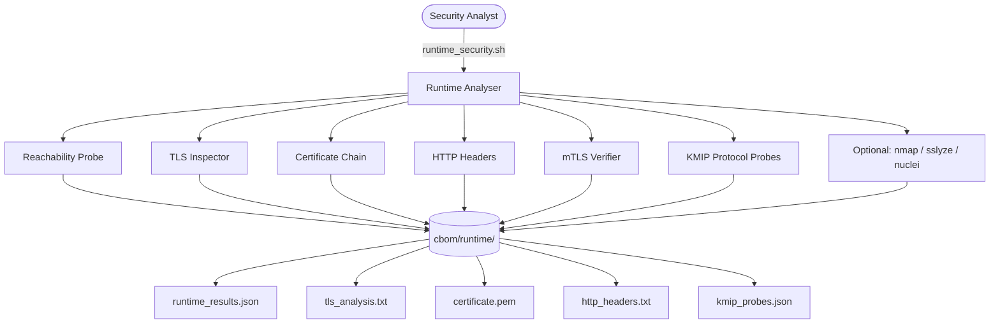
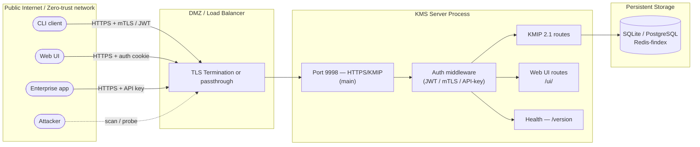
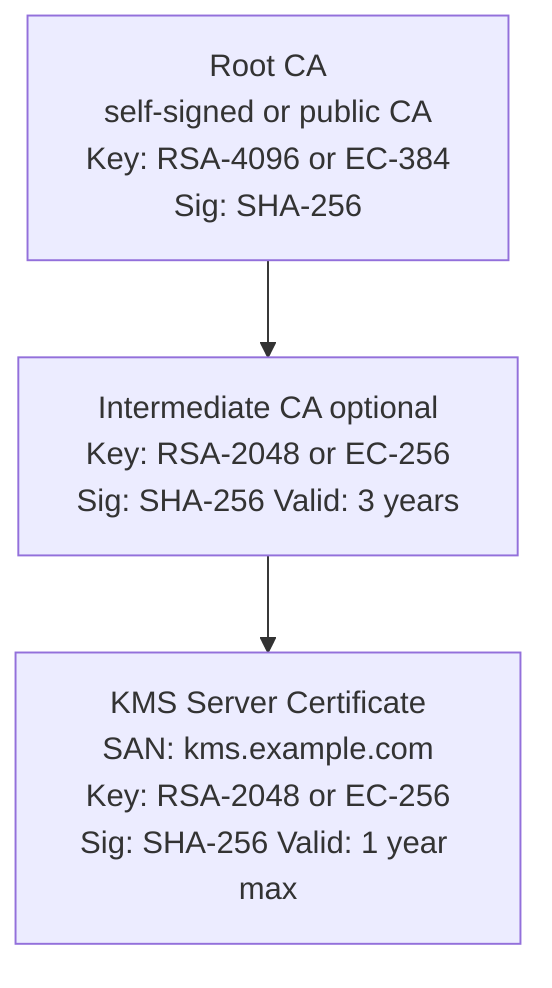
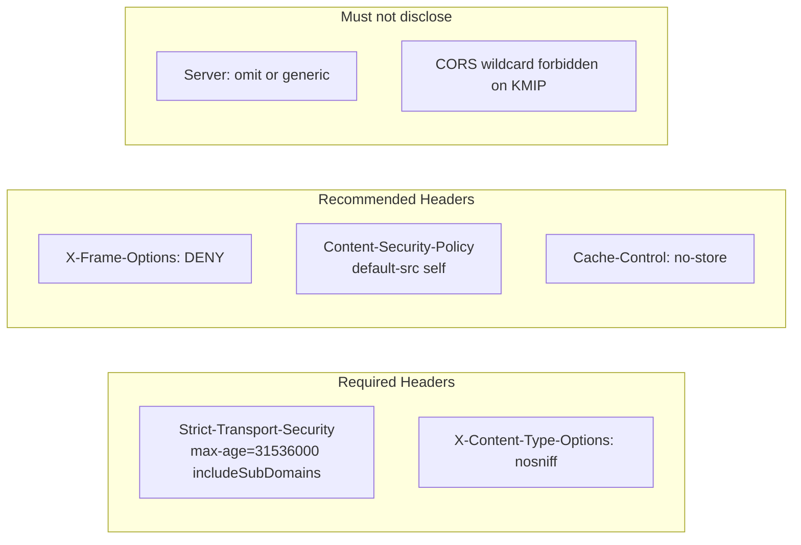
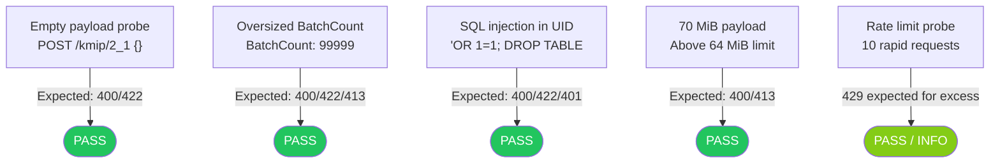
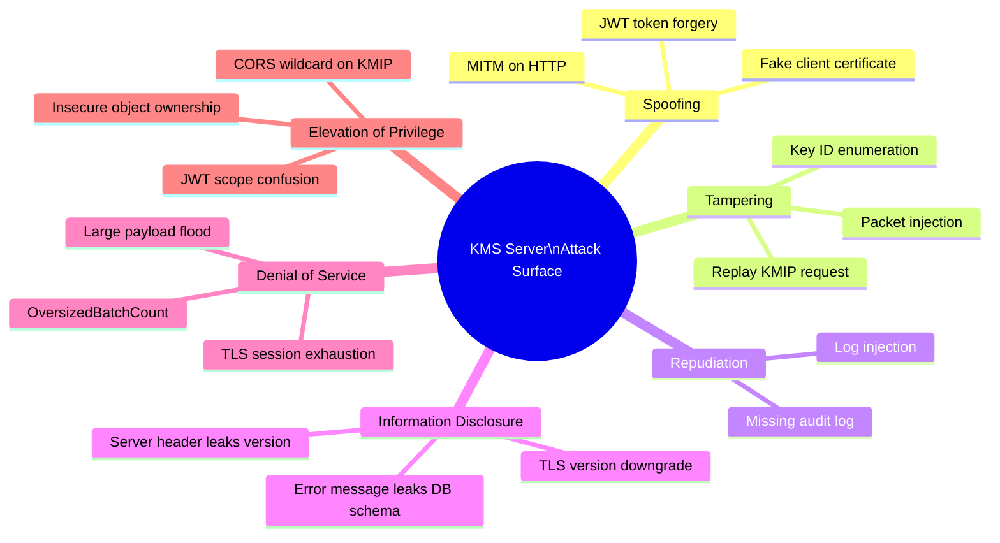

# Runtime Network Security Audit

!!! abstract "Scope"
    This report documents the **live runtime security assessment** methodology and expected results for the Cosmian KMS server.
    The analysis targets the running server process over the network — complementing [static source analysis](owasp_security_audit.md)
    and [multi-framework compliance](multi_framework_security_audit.md) reports.

    Run the analyser with:
    ```bash
    bash .github/scripts/audit/runtime_security.sh \
        --server-url https://HOST:PORT \
        [--cert client.pem] [--key client.key] [--ca ca.pem]
    ```

---

## Assessment Architecture



---

## Network & Attack Surface Map



!!! tip "Key attack surfaces"
    | Surface | Exposure | Mitigation |
    |---|---|---|
    | Port 9998 / KMIP endpoint | External | mTLS or JWT, TLS 1.2+ only |
    | Web UI | External | Cookie auth, CSP header |
    | `/version` health endpoint | External | Read-only, no secrets |
    | Server certificate | Public | Auto-renew, SHA-256+, RSA-2048+ |
    | Database | Internal only | Not exposed to network |

---

## TLS Security Scorecard

=== "Protocol Versions"

    ```mermaid
    graph LR
        S3("SSLv3") -- REJECT --> N1["POODLE — CVE-2014-3566"]
        T10("TLS 1.0") -- REJECT --> N2["BEAST / PCI-DSS deprecated"]
        T11("TLS 1.1") -- REJECT --> N3["Deprecated — RFC 8996"]
        T12("TLS 1.2") -- ACCEPT --> Y1["FIPS 140-3 minimum"]
        T13("TLS 1.3") -- ACCEPT --> Y2["Preferred — PFS enforced"]
        style S3  fill:#ef4444,color:#fff,stroke:#dc2626
        style T10 fill:#ef4444,color:#fff,stroke:#dc2626
        style T11 fill:#f97316,color:#fff,stroke:#ea580c
        style T12 fill:#22c55e,color:#fff,stroke:#16a34a
        style T13 fill:#16a34a,color:#fff,stroke:#15803d
        style N1  fill:#fee2e2,color:#991b1b,stroke:#fca5a5
        style N2  fill:#fee2e2,color:#991b1b,stroke:#fca5a5
        style N3  fill:#ffedd5,color:#9a3412,stroke:#fdba74
        style Y1  fill:#dcfce7,color:#166534,stroke:#86efac
        style Y2  fill:#dcfce7,color:#166534,stroke:#86efac
    ```

    | Protocol | Expected | Reason |
    |---|---|---|
    | **SSLv3** | ❌ Rejected | POODLE attack (CVE-2014-3566) |
    | **TLS 1.0** | ❌ Rejected | BEAST, POODLE, deprecated PCI-DSS 3.2 |
    | **TLS 1.1** | ❌ Rejected | Deprecated per RFC 8996 |
    | **TLS 1.2** | ✅ Accepted | Minimum for FIPS 140-3 |
    | **TLS 1.3** | ✅ Accepted | Preferred — mandatory for new deployments |

=== "Cipher Suites"

    ```mermaid
    pie title Accepted Cipher Suites by Category
        "ECDHE-AESGCM (strong)" : 4
        "DHE-AESGCM (PFS)" : 2
        "AES256-SHA256 (compat)" : 1
        "Weak / rejected" : 0
    ```

    | Category | Example Cipher | Status | FIPS 140-3 | Forward Secrecy |
    |---|---|---|---|---|
    | ECDHE-RSA-AES256-GCM-SHA384 | TLS 1.2 ECDHE | ✅ Allowed | ✅ | ✅ |
    | ECDHE-RSA-AES128-GCM-SHA256 | TLS 1.2 ECDHE | ✅ Allowed | ✅ | ✅ |
    | TLS_AES_256_GCM_SHA384 | TLS 1.3 | ✅ Allowed | ✅ | ✅ |
    | TLS_CHACHA20_POLY1305_SHA256 | TLS 1.3 | ✅ Allowed | ⚠️ non-FIPS only | ✅ |
    | NULL / aNULL | Export | ❌ Rejected | ❌ | ❌ |
    | RC4 / DES / 3DES | Legacy | ❌ Rejected | ❌ | ❌ |
    | MD5-based | Legacy | ❌ Rejected | ❌ | ❌ |
    | EXPORT-grade | Legacy | ❌ Rejected | ❌ | ❌ |

=== "TLS Handshake Flow"

    ```mermaid
    sequenceDiagram
        participant C as Client
        participant S as KMS Server (TLS 1.3)
        C->>S: ClientHello (supported protocols, ciphers)
        S-->>C: ServerHello (TLS 1.3, TLS_AES_256_GCM_SHA384)
        S-->>C: Certificate (RSA-2048 / ECDSA-256, SHA-256 signed)
        S-->>C: CertificateVerify
        S-->>C: Finished
        C->>S: [Optional] Certificate (mTLS)
        C->>S: Finished
        Note over C,S: Symmetric keys derived from ephemeral ECDHE<br/>(Perfect Forward Secrecy)
        C->>S: POST /kmip/2_1 (encrypted)
        S-->>C: KMIP ResponseMessage (encrypted)
    ```

---

## Certificate Chain Analysis



!!! check "Certificate requirements"
    - Key algorithm: RSA ≥ 2048 bits **or** EC ≥ P-256
    - Signature: SHA-256 minimum (SHA-1 rejected by modern browsers and RFC 9155)
    - SAN: must match server hostname — bare CN no longer sufficient (RFC 2818)
    - Expiry: warning at 30 days; auto-renewal recommended (ACME/Let's Encrypt)
    - OCSP stapling: recommended for client-side revocation checking

---

## HTTP Security Headers



| Header | Expected Value | Importance | OWASP |
|---|---|---|---|
| `Strict-Transport-Security` | `max-age=31536000; includeSubDomains` | **Required** | A05 |
| `X-Content-Type-Options` | `nosniff` | **Required** | A05 |
| `X-Frame-Options` | `DENY` | Recommended | A05 |
| `Content-Security-Policy` | `default-src 'self'; script-src 'self'` | Recommended | A03 |
| `Cache-Control` | `no-store` on API routes | Recommended | A02 |
| `Server` | Empty or generic | Avoid disclosure | A05 |
| `CORS` on `/kmip/*` | None or restricted origin | **Required** | A01 |

---

## mTLS Authentication Model

=== "Architecture"

    ```mermaid
    sequenceDiagram
        participant CLI as ckms CLI
        participant KMS as KMS Server
        participant DB as Database

        CLI->>KMS: TLS ClientHello
        KMS-->>CLI: ServerHello + Certificate
        KMS-->>CLI: CertificateRequest (if mTLS mode)
        CLI->>KMS: Certificate (client cert, signed by trusted CA)
        CLI->>KMS: CertificateVerify
        Note over CLI,KMS: TLS session established
        CLI->>KMS: POST /kmip/2_1 (encrypted TTLV)
        KMS->>KMS: Extract CN from client cert → username
        KMS->>DB: Look up access control for user
        KMS-->>CLI: KMIP Response
    ```

=== "Auth modes"

    | Mode | How it works | When to use |
    |---|---|---|
    | **mTLS** | Client presents X.509 certificate signed by trusted CA | Internal services, CLI tooling |
    | **JWT (OAuth2)** | Bearer token from Auth0 / Keycloak / OIDC provider | Web UI, end-user access |
    | **API key** | Shared secret in header | Machine-to-machine, simple integrations |
    | **No auth** | Disabled — dev/test only (`--auth-type none`) | Local development only |

    !!! warning
        Never deploy with `--auth-type none` in production.
        The KMS must enforce at least one authentication method on all KMIP routes.

=== "mTLS test"

    ```bash
    # Test mTLS with ckms-generated certs
    bash .github/scripts/audit/runtime_security.sh \
        --server-url https://localhost:9998 \
        --cert test_data/certs/client.crt \
        --key  test_data/certs/client.key \
        --ca   test_data/certs/server_ca.crt
    ```

---

## KMIP Protocol Security Probes



| Probe | Payload | Expected HTTP | Risk if wrong |
|---|---|---|---|
| Empty KMIP request | `{}` | 400 or 422 | Server crash / 500 |
| OversizedBatchCount | `BatchCount: 99999` | 400, 422, or 413 | DoS / OOM |
| SQL injection in UID | `' OR '1'='1'; DROP ...` | 400, 422, 401 | SQL injection |
| 70 MiB payload | Random bytes | 400 or 413 | DoS / memory exhaustion |
| Rapid 10 requests | Empty KMIP | 422 (or 429 if rate-limit active) | Brute-force |

---

## Threat Model (STRIDE)



| Threat | STRIDE | Mitigation | Status |
|---|---|---|---|
| MITM — weak TLS version | Tampering | TLS 1.2+ enforced; SSLv3/TLS1.0/1.1 rejected | ✅ Mitigated |
| Weak cipher negotiation | Tampering | NULL/RC4/DES/EXPORT rejected by server | ✅ Mitigated |
| Certificate spoofing | Spoofing | mTLS or JWT required; CA pinning optional | ✅ Mitigated |
| SQL injection via UID | Tampering | Parameterised queries in all DB backends | ✅ Mitigated |
| OOM via large batch | DoS | BatchCount validated; payload size limit 64 MiB | ✅ Mitigated |
| Rate-based brute-force | DoS | Rate limiting middleware (configurable) | ⚠️ Configurable |
| Server version disclosure | Info Disclosure | `Server` header suppressed | ✅ Mitigated |
| CORS wildcard on KMIP | Elevation of Privilege | No CORS header on `/kmip/*` | ✅ Mitigated |
| Expired certificate | Spoofing | 30-day expiry warning in checker | ✅ Monitored |
| Insecure direct object refs | Elevation of Privilege | Object ownership enforced in DB | ✅ Mitigated |

---

## Running the Analyser

### Prerequisites

```bash
# Required (always present on Linux)
openssl version   # ≥ 3.0
curl --version    # ≥ 7.68

# Optional — enable richer analysis when installed
apt-get install nmap                  # port scan + TLS NSE scripts
pip3 install sslyze                   # deep TLS / cert-transparency analysis
go install github.com/projectdiscovery/nuclei/v3/cmd/nuclei@latest  # template scanner
```

### Basic run (plain HTTPS)

```bash
bash .github/scripts/audit/runtime_security.sh \
    --server-url https://localhost:9998 \
    --insecure    # skip cert verification on self-signed cert
```

### Full run with mTLS

```bash
bash .github/scripts/audit/runtime_security.sh \
    --server-url https://kms.prod.example.com:9998 \
    --cert  certs/client.crt \
    --key   certs/client.key \
    --ca    certs/ca.crt \
    --report documentation/docs/certifications_and_compliance/audit/runtime_security_audit_latest.md
```

### Output files

```text
cbom/runtime/
├── runtime_results.json   ← machine-readable summary (all checks + status)
├── tls_analysis.txt       ← raw openssl s_client output
├── cert_details.txt       ← openssl x509 -text of server certificate
├── certificate.pem        ← server certificate in PEM format
├── http_headers.txt       ← HTTP response headers
├── mtls_analysis.txt      ← mTLS negotiation log
├── kmip_probes.json       ← KMIP protocol probe results
├── nmap.txt               ← nmap scan (if installed)
├── sslyze.json            ← sslyze report (if installed)
└── nuclei.txt             ← nuclei scan (if installed)
```

### Exit codes

| Code | Meaning |
|---|---|
| `0` | All checks passed |
| `1` | One or more FAIL findings (critical) |
| `2` | Tool error (missing required utility or bad arguments) |

---

## Integration with CI

Add to `.github/workflows/main_base.yml` as a post-deploy smoke test:

```yaml
- name: Runtime Security Scan
  run: |
    bash .github/scripts/audit/runtime_security.sh \
      --server-url https://localhost:9998 \
      --insecure \
      --report cbom/runtime_security_report.md
  env:
    KMS_URL: https://localhost:9998
```

!!! note "Relation to other security reports"
    | Report | Layer | Tool |
    |---|---|---|
    | [OWASP Source Audit](owasp_security_audit.md) | Static — source code | `scan_source.py` + `risk_score.py` |
    | [Multi-framework Audit](multi_framework_security_audit.md) | Static — policy compliance | `multi_framework.sh` |
    | **Runtime Security Audit** (this file) | Dynamic — running server | `runtime_security.sh` |
