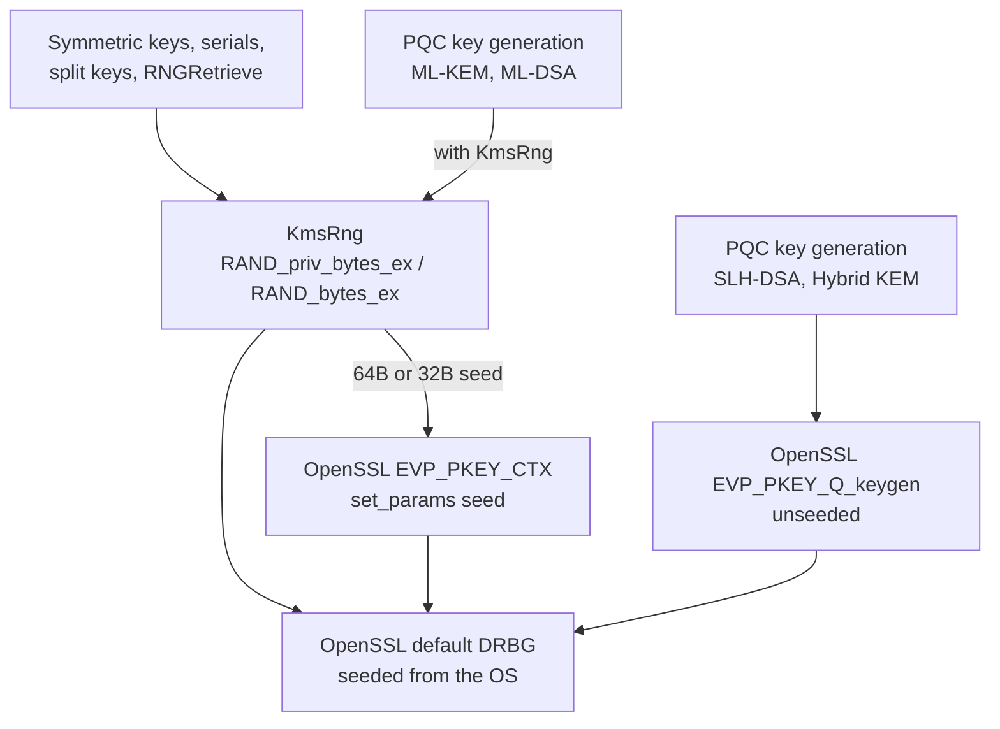

# PQC Entropy Sourcing: Status and Limits

!!! warning "Not an ESV or CMVP compliance statement"
    This page describes how Eviden KMS sources randomness today. It does **not** claim that Eviden KMS holds
    a NIST Entropy Source Validation (ESV) certificate, or that post-quantum (PQC) key generation meets
    NIST SP 800-90B/C or FIPS 140-3 entropy requirements. While ML-KEM and ML-DSA now draw seeds from `KmsRng`,
    `KmsRng` itself is backed by OpenSSL's operating-system-seeded DRBG without an ESV certificate. Furthermore,
    **SLH-DSA and hybrid KEM do not draw seeds from `KmsRng`** (see [How PQC key generation uses `KmsRng`](#how-pqc-key-generation-uses-kmsrng) and [Why hybrid KEM cannot benefit from KmsRng PQC ESV properties](#why-hybrid-kem-cannot-benefit-from-kmsrng-pqc-esv-properties)).

## Summary

| Question | Answer |
|----------|--------|
| Is there a single RNG abstraction in the server? | Partly: `KmsRng` (one shared instance) is used for keys, seeds, serials, split keys and `RNGRetrieve`. Some call sites (symmetric nonces/keys in `symmetric_ciphers.rs`, JOSE, OpenPGP, AWS XKS, `ui_auth`) call OpenSSL `rand_bytes` directly: same OpenSSL DRBG hierarchy, but not through `KmsRng`. A few non-OpenSSL generators remain (see [Random generators outside OpenSSL](#random-generators-outside-openssl)) |
| What does `KmsRng` use underneath? | OpenSSL's DRBG hierarchy through `RAND_priv_bytes_ex` (keys, seeds) and `RAND_bytes_ex` (`RNGRetrieve` output), each requesting 256-bit security strength; no lock, no state of its own |
| Do ML-KEM and ML-DSA key generation use `KmsRng`? | **Yes.** When `rng` is provided, 64-byte (ML-KEM) and 32-byte (ML-DSA) seeds are drawn from `KmsRng` and injected into OpenSSL |
| Do SLH-DSA and hybrid KEM key generation use `KmsRng`? | **No.** SLH-DSA seed parameter is testing-only in OpenSSL; hybrid KEM composite keygen does not expose a seed parameter |
| Is the entropy source ESV-validated? | Not claimed. Entropy comes from the operating system through OpenSSL, and no ESV certificate is referenced |
| Is PQC key generation routed to a FIPS provider? | No. PQC algorithms are available in non-FIPS builds only |
| Can a customer-supplied OpenSSL build satisfy ESV/FIPS 140-3 for PQC today? | No. No CMVP-validated FIPS 140-3 module — OpenSSL's own or any third-party rebuild — currently includes ML-KEM, ML-DSA, or SLH-DSA |
| Can upgrading the vendored OpenSSL version alone close the gap? | No. FIPS/ESV certification is bound to one exact validated build via a CMVP certificate number; newer source code is never itself validated |
| Does a future FIPS-140-3-validated OpenSSL version automatically mean its entropy source is ESV-certified? | No. FIPS 140-3 module validation and Entropy Source Validation (ESV) are independent CMVP programs; OpenSSL's FIPS provider places the entropy source outside its module boundary regardless of version |
| What is the governing NIST standard for KEM (ML-KEM / hybrid-KEM) entropy specifically? | NIST SP 800-227 (Sept 2025): RS4 requires SP 800-90A/B/C-approved random bits; RS2 requires following FIPS 140-3 guidance. Neither is met — see [What SP 800-227 requires that is not implemented in source code](#what-sp-800-227-requires-that-is-not-implemented-in-source-code) |

## Background

NIST's most specific and current entropy-compliance reference for PQC key establishment is
**[NIST SP 800-227, Recommendations for Key-Encapsulation Mechanisms](https://doi.org/10.6028/NIST.SP.800-227)**
(September 2025), which applies to ML-KEM and any KEM, including the hybrid KEMs used here. Its Section 1.3
lists five CMVP-testable **shall** requirements (RS1–RS5); three bear directly on entropy and FIPS compliance:

- **RS2** (§3.1): "KEM implementations **shall** follow the guidelines given in FIPS 140-3 and associated
  implementation guidance."
- **RS4** (§3.1): "Random bits **shall** be generated using **approved** techniques, as described in the
  latest revisions of SP 800-90A, SP 800-90B, and SP 800-90C."
- **RS5** (§3.2): "Except for random seeds and data that can be easily computed from public information, all
  intermediate values used in any given KEM algorithm (i.e., KeyGen, Encaps, and Decaps) **shall** be
  destroyed before the algorithm terminates."

SP 800-227 does **not** cover ML-DSA or SLH-DSA — those are digital signature schemes (FIPS 204, FIPS 205),
not KEMs; their key-generation entropy remains governed by the general SP 800-133r2 and FIPS 140-3 IG D.H–D.K
guidance listed below. CMVP's companion testing guidance for KEMs is FIPS 140-3 Implementation Guidance
Annex D.S, "Key Encapsulation Mechanisms" (see [References](#references)). See
[What SP 800-227 requires that is not implemented in source code](#what-sp-800-227-requires-that-is-not-implemented-in-source-code)
for the concrete gap analysis.

The broader standards landscape:

| Standard | Scope |
|----------|-------|
| NIST SP 800-227 | Recommendations for Key-Encapsulation Mechanisms — ML-KEM and hybrid-KEM entropy/FIPS requirements |
| NIST SP 800-90A | Deterministic random bit generators (DRBG) |
| NIST SP 800-90B | Entropy source testing and validation |
| NIST SP 800-90C | RBG constructions |
| NIST SP 800-133r2 | Cryptographic key generation (§4: keys come from an approved RBG instantiated at a sufficient security strength) |
| FIPS 140-3 Implementation Guidance | Entropy source requirements for modules (Annex D.S covers KEMs specifically) |

The algorithms concerned are ML-KEM (FIPS 203), ML-DSA (FIPS 204), SLH-DSA (FIPS 205) and the hybrid KEMs
X25519-ML-KEM-768 and X448-ML-KEM-1024.

## What `KmsRng` is

`KmsRng` (`crate/crypto/src/crypto/rng/mod.rs`) is a stateless, thread-safe wrapper around OpenSSL's DRBG
hierarchy (AES-256 CTR-DRBG: a primary DRBG seeded by the operating system, plus per-thread public and
private DRBGs). It offers:

- `fill_bytes` / `random_vec`: secret values (keys, seeds, split-key material, serial numbers), drawn from
  OpenSSL's **private** DRBG with `RAND_priv_bytes_ex`. `random_vec` returns a `Zeroizing<Vec<u8>>`.
- `fill_public_bytes`: values handed to clients (KMIP `RNGRetrieve`), drawn from OpenSSL's **public** DRBG with
  `RAND_bytes_ex`, so output visible to a client never comes from the generator that produces keys.
- `reseed`: passes caller-supplied data to `RAND_add`. In OpenSSL 3.6 built with an entropy source this is
  downgraded to **additional input** of an immediate reseed of the primary DRBG (`crypto/rand/rand_lib.c`);
  per SP 800-90A r1 §8.7.2 additional input cannot lower the DRBG's security strength, and it is credited with
  zero bits of entropy. Each `RNGSeed` therefore forces a reseed from the operating system; the operation is
  not rate-limited.

Every generate call requests 256 bits of security strength (SP 800-133r2 §4; SP 800-90A r1 §9.3.1 makes
the DRBG return an error if it cannot provide it), so a weaker DRBG fails closed instead of silently
serving lower-strength bits.

The server creates one `Arc<KmsRng>` at startup (`KMS.rng`).

!!! note
    Earlier versions serialised every call behind a `Mutex<()>`. OpenSSL's RAND API is already thread-safe, so
    the lock only added contention and a permanent-failure mode if a thread panicked while holding it. It was
    removed. `KmsRng` is not an entropy or compliance mechanism.

### Which provider serves the DRBG

`KmsRng` claims nothing about FIPS unless the DRBG is actually served by the FIPS provider. A FIPS-mode
build's generated `openssl.cnf` previously activated the **default** provider next to `fips`
(`[default_sect] activate = 1`), and the DRBG behind `RAND_bytes` was then the default provider's, not the
validated module's. `crate/crypto/build.rs` no longer activates it, and the integration test
`crate/crypto/tests/fips_rng_provider.rs` asserts that the primary, public and private DRBGs report provider
`fips` with strength ≥ 256. The Nix build's `openssl.cnf` (`nix/openssl.nix`) configures only `fips` and `base`; this
was not re-verified at run time here.

### Random generators outside OpenSSL

Not everything goes through OpenSSL's DRBG. As found by code search:

- `create_split_key.rs` seeds a `ChaCha20Rng` with 32 bytes from `KmsRng` and uses it to produce the XOR
  shares: ChaCha20 is not an SP 800-90A DRBG, so the shares are not "output of an approved RBG" in the sense
  of SP 800-133r2 §4.
- `cosmian_crypto_core::CsRng` (ChaCha12) is used by `ceremony_keys.rs` (unconditionally compiled, AES-GCM
  nonces), the Redis store, the `ecies` module and `kms_object.rs` (PKCS#11 provider key bytes).
- `rand::rng()` (ChaCha12) generates `C_GenerateRandom` output in the PKCS#11 module.

## What uses `KmsRng`

| Consumer | Location |
|----------|----------|
| Symmetric key generation | `core/kms/other_kms_methods.rs` |
| `SecretData` seed generation | `core/kms/other_kms_methods.rs` |
| Certificate serial numbers | `core/operations/certify/build_certificate.rs` |
| Split key seeding | `core/operations/create_split_key.rs` |
| KMIP `RNGRetrieve` | `core/operations/rng_retrieve.rs` |
| KMIP `RNGSeed` | `core/operations/rng_seed.rs` (calls `reseed`) |

## How PQC key generation uses `KmsRng`

PQC key generation functions accept an optional `&KmsRng` (`create_ml_kem_key_pair`, `create_ml_dsa_key_pair`,
`create_slh_dsa_key_pair`, `create_hybrid_kem_key_pair`), and the server passes `kms.rng` from `CreateKeyPair`,
key-pair rekeying, and certificate generation:

- **ML-KEM (FIPS 203)**: When `rng` is provided, a 64-byte seed ($d, z$) is drawn via `generate_pqc_seed(rng, 64)`
  and injected into OpenSSL's `EVP_PKEY_CTX` via the `"seed"` parameter (`OSSL_PKEY_PARAM_ML_KEM_SEED`). OpenSSL
  generates the key pair deterministically from this seed per FIPS 203 §7.1.
- **ML-DSA (FIPS 204)**: When `rng` is provided, a 32-byte seed ($\xi$) is drawn via `generate_pqc_seed(rng, 32)`
  and injected into OpenSSL's `EVP_PKEY_CTX` via the `"seed"` parameter (`OSSL_PKEY_PARAM_ML_DSA_SEED`). OpenSSL
  generates the key pair deterministically from this seed per FIPS 204 §6.1.
- **SLH-DSA (FIPS 205)**: OpenSSL's SLH-DSA implementation supports a `"seed"` parameter, but its man page
  `EVP_PKEY-SLH-DSA(7)` explicitly states that this parameter is **strictly for testing and CAVP/KAT validation**.
  Consequently, production SLH-DSA keys are generated unseeded via `EVP_PKEY_Q_keygen`, drawing directly from OpenSSL's DRBG.
- **Hybrid KEM**: Neither X25519-ML-KEM-768 nor X448-ML-KEM-1024 accepts a seed parameter (see details below).



## Why hybrid KEM cannot benefit from KmsRng PQC ESV properties

OpenSSL 3.6.2 implements hybrid KEMs (`X25519MLKEM768` and `X448MLKEM1024`) via composite key management in
`providers/implementations/keymgmt/mlx_kmgmt.c`.

A hybrid KEM key consists of two sub-keys:

1. A classical curve key (X25519 or X448).
2. An ML-KEM key (ML-KEM-768 or ML-KEM-1024).

In `mlx_kmgmt.c`, the parameter list for key generation (`mlx_gen_set_params_list`) only accepts property queries:

```c
static const OSSL_PARAM mlx_gen_set_params_list[] = {
    OSSL_PARAM_utf8_string(OSSL_PKEY_PARAM_PROPERTIES, NULL, 0),
    OSSL_PARAM_END
};
```

Unlike pure ML-KEM (`ml_kem_kmgmt.c`) and pure ML-DSA (`ml_dsa_kmgmt.c`), `mlx_kmgmt.c` has **no `"seed"` parameter decoder or implementation**.
During hybrid key generation (`mlx_kem_gen`), OpenSSL creates both the classical and post-quantum component keys atomically in one operation,
drawing entropy entirely from its internal default DRBG.

Because OpenSSL exposes no API to inject an external seed into composite key generation:

- Hybrid KEMs cannot draw seed entropy from `KmsRng`.
- Even if `KmsRng` were backed by an ESV-validated entropy source, hybrid KEM keys generated by OpenSSL 3.6 would not inherit those ESV properties.
- Hybrid KEM key generation must rely strictly on OpenSSL's internal DRBG.

`generate_pqc_seed` (`pqc/mod.rs`) returns `rng.random_vec(len)` in a `Zeroizing` buffer, and is now directly called by `pqc_keygen` when generating ML-KEM and ML-DSA keys with a provided `KmsRng`.

## What is not claimed

- An ESV certificate, or an SP 800-90B entropy assessment, for the entropy source.
- That `KmsRng` confers FIPS 140-3 validation or independent entropy guarantees beyond the underlying OS DRBG.
- Conformance to FIPS 140-3 IG 9.3.A, D.J, D.K or D.O, or any other CMVP requirement.
- That SLH-DSA or hybrid KEM keys are seeded via `KmsRng`.

## Tests

The behaviour that exists today is covered by unit tests. They check that output is non-zero, that consecutive
outputs differ, and that zeroizing buffers work. They do not demonstrate entropy quality.

```bash
cargo test -p cosmian_kms_crypto --lib --features non-fips rng
cargo test -p cosmian_kms_crypto --lib --features non-fips pqc
```

## Work completed and remaining requirements

### Completed in Eviden KMS

1. **Seed injection for ML-KEM and ML-DSA**: `pqc_keygen_seeded` draws 64 bytes (ML-KEM) or 32 bytes (ML-DSA) from `KmsRng`
   and passes it via `OSSL_PARAM` to `EVP_PKEY_generate`.
2. **Safe OpenSSL Migration (Issue #894)**: Replaced raw BIO serialization (`evp_pkey_to_pkcs8_der`, `evp_pkey_to_spki_der`)
   and raw buffer extraction with safe native `openssl::pkey::PKey` methods.

### Remaining to reach ESV / CMVP validation

1. **Entropy Source Validation (ESV)**: a NIST ESV certificate for the actual noise source on each deployment
   platform. This is always a separate, platform-specific submission — it is never satisfied by an OpenSSL
   version or build, because the OpenSSL FIPS provider's own Security Policy places the entropy source
   "outside the Module boundary" (see [Path to NIST ESV / FIPS 140-3 entropy compliance](#path-to-nist-esv--fips-140-3-entropy-compliance-for-pqc) below).
2. **A CMVP-validated, PQC-inclusive FIPS provider**: as of this writing, no OpenSSL FIPS provider release has
   a published CMVP certificate that includes ML-KEM, ML-DSA, or SLH-DSA. The newest validated OpenSSL FIPS
   provider (NIST CMVP Certificate #4985) is version 3.1.2, which predates OpenSSL's PQC support (OpenSSL 3.5+).
3. **Callers that actually request a FIPS provider for PQC, once one exists**: the PQC keygen functions accept
   an optional property query such as `fips=yes` (and check the `fips-indicator`), but every production caller
   passes `None`, and `pqc` (`crate/crypto/src/crypto/mod.rs`) is gated entirely behind the `non-fips` Cargo
   feature and compiles out of FIPS-mode builds. Both would need to change before any validated FIPS provider —
   OpenSSL's own or a customer's — could be consulted for PQC key generation. Not scheduled; no validated
   provider to target yet.
4. **Upstream Hybrid KEM Seeding**: contributing or awaiting OpenSSL support for composite keygen seeding if
   hybrid KEMs are ever to use external entropy sources.

## Path to NIST ESV / FIPS 140-3 Entropy Compliance for PQC

### The governing standard for KEM entropy: NIST SP 800-227

[NIST SP 800-227, Recommendations for Key-Encapsulation Mechanisms](https://doi.org/10.6028/NIST.SP.800-227)
(final, September 2025; PDF: <https://nvlpubs.nist.gov/nistpubs/SpecialPublications/NIST.SP.800-227.pdf>) is
the NIST publication written specifically to fill the compliance gap FIPS 203 itself flagged at publication:
"NIST will specify both the particulars of the ML-KEM scheme and the general properties of KEMs in FIPS 203
and SP 800-227, respectively" (FIPS 203 Initial Public Draft). It is the authoritative, current reference for
"PQC entropy compliance" as it applies to key establishment (ML-KEM and PQ/T hybrid KEMs).

Section 1.3 lists its full set of CMVP-testable requirements, verbatim:

- **RS1** (§3.1): "KEM implementations **shall** comply with a specific NIST FIPS or SP that specifies the
  algorithms of the relevant KEM. For example, a conforming implementation of ML-KEM shall comply with
  FIPS 203."
- **RS2** (§3.1): "KEM implementations **shall** follow the guidelines given in FIPS 140-3 and associated
  implementation guidance."
- **RS3** (§3.1): "KEM implementations **shall** use **approved** components with security strengths that meet
  or exceed the required strength for each KEM parameter set."
- **RS4** (§3.1): "Random bits **shall** be generated using **approved** techniques, as described in the
  latest revisions of SP 800-90A, SP 800-90B, and SP 800-90C."
- **RS5** (§3.2): "Except for random seeds and data that can be easily computed from public information, all
  intermediate values used in any given KEM algorithm (i.e., KeyGen, Encaps, and Decaps) **shall** be
  destroyed before the algorithm terminates."

**Scope**: SP 800-227 covers KEMs only — ML-KEM and PQ/T hybrid KEMs (its §4.6, "Multi-Algorithm KEMs and
PQ/T Hybrids," covers exactly the X25519-ML-KEM-768 / X448-ML-KEM-1024 construction used in this codebase). It
does not cover ML-DSA or SLH-DSA, which are digital signature schemes, not KEMs.

CMVP's companion testing guidance is FIPS 140-3 Implementation Guidance Annex D, section **D.S, "Key
Encapsulation Mechanisms"** (current IG, page 223 of
<https://csrc.nist.gov/CSRC/media/Projects/cryptographic-module-validation-program/documents/fips%20140-3/FIPS%20140-3%20IG.pdf>),
positioned in the same Annex D family as IG D.J "Entropy Estimation and Compliance with SP 800-90B" and IG D.K
"Interpretation of SP 800-90B Requirements" (both already referenced above under
[What is not claimed](#what-is-not-claimed)). D.S is CMVP's KEM-specific testing annex; its detailed resolution
text is not reproduced here.

### What SP 800-227 requires that is not implemented in source code

Mapping each entropy/FIPS-relevant requirement to Eviden KMS's current code:

- **RS2 — not met.** `pqc` (`crate/crypto/src/crypto/mod.rs` lines 25-26) is gated entirely behind
  `#[cfg(feature = "non-fips")]` and is absent from every FIPS-mode build. RS2 cannot be attempted in Eviden's
  default build configuration because the PQC code does not exist in that build at all.
- **RS4 — not met, two independent gaps:**
  1. `KmsRng` (`crate/crypto/src/crypto/rng/mod.rs`) draws from OpenSSL's `RAND_bytes` with no SP 800-90B
     ESV-validated entropy source backing it (its own doc comment states this explicitly).
  2. **Library support exists; deliberately not wired to callers.** `pqc_keygen_seeded`, `pqc_keygen` and
     `pqc_keygen_raw` (`crate/crypto/src/crypto/pqc/mod.rs`) accept an optional OpenSSL property query (e.g.
     `"fips=yes"`) and seeded keygen checks the `fips-indicator`, failing closed. Every production caller passes
     `None`, so the default provider is always selected. This is intentional, not an oversight: the only
     CMVP-validated OpenSSL FIPS provider (3.1.2, Certificate #4985) contains no ML-KEM, ML-DSA or SLH-DSA, so
     passing `"fips=yes"` today would make every PQC key generation fail. The caller change is blocked on a
     validated PQC-capable FIPS provider existing, not on engineering work in this repository.
- **RS5 — already met for Eviden's own code; not applicable beyond it.** `generate_pqc_seed`
  (`crate/crypto/src/crypto/pqc/mod.rs`) returns a `Zeroizing<Vec<u8>>`, so the seed Eviden generates
  and hands to OpenSSL is destroyed on drop. The additional intermediate values RS5 covers (matrix `A`, NTT
  state, polynomial coefficients computed inside ML-KEM `KeyGen`/`Encaps`/`Decaps`) are produced and destroyed
  entirely inside OpenSSL's own implementation, outside Eviden's code; their RS5 compliance is a property of
  OpenSSL's own eventual CMVP submission, not something this codebase can satisfy or violate.
- **RS1, RS3 — already met** as a byproduct of using OpenSSL's unmodified FIPS-203/204-conformant
  implementations with standard parameter sets; no code gap.

**What should change in source code, concretely:**

1. **Done in the library; not wired to callers.** `pqc_keygen_seeded`, `pqc_keygen` and `pqc_keygen_raw`
   (`crate/crypto/src/crypto/pqc/mod.rs`) now take an optional OpenSSL property query (for example
   `"fips=yes"`), and seeded keygen verifies the provider's `fips-indicator`, failing closed. This closes gap
   RS4-2 at library level. What remains is a server-side configuration or caller that supplies a non-null query.
   It does not by itself achieve RS4 compliance (the entropy-source half, RS4-1, remains unmet — see item 3),
   and it has no effect until a qualifying provider exists (none does, per the existing "Can upgrading the
   vendored OpenSSL version alone close the gap?" section of this page).
2. Remove the `#[cfg(feature = "non-fips")]` gate on `pub mod pqc;` (`crate/crypto/src/crypto/mod.rs` lines
   25-26) so PQC key generation compiles in FIPS-mode builds — a prerequisite for item 1 to ever take effect,
   and for RS2 to be attempted at all, in a FIPS-mode build. This is already tracked as item 3 of the page's
   existing "Remaining to reach ESV / CMVP validation" list; this plan does not duplicate that list, only
   cross-references it.
3. **No source-code change can close RS4-1.** An SP 800-90B-compliant entropy source is a CMVP-lab-tested
   property of specific deployment hardware/OS, obtained via the ESV submission process described in
   [What an ESV certificate requires](#what-an-esv-certificate-requires) below — not a code change. State this
   explicitly rather than implying it is an engineering backlog item.
4. **No source-code change can close hybrid-KEM RS4 compliance.** OpenSSL 3.6's `mlx_kmgmt.c` exposes no
   seed-parameter decoder for composite keygen (documented in the existing
   [Why hybrid KEM cannot benefit from KmsRng PQC ESV properties](#why-hybrid-kem-cannot-benefit-from-kmsrng-pqc-esv-properties)
   section of this page); this requires upstream OpenSSL work, already tracked as item 4 of "Remaining to
   reach ESV / CMVP validation."

### What an ESV certificate requires

An Entropy Source Validation (ESV) certificate (NIST SP 800-90B) is issued by CMVP after an NVLAP-accredited
Cryptographic and Security Testing Laboratory (CSTL) assesses the actual noise source — not the DRBG, and not
OpenSSL — that feeds the FIPS module's random bit generator. Concretely, this requires:

1. An entropy source description and a raw-noise-sample dataset (per SP 800-90B §3.1.3) submitted to a CSTL,
   which runs the SP 800-90B min-entropy estimation suite (`ea_iid`/`ea_non_iid`) and health tests.
2. CMVP issuance of an ESV certificate number for that specific noise source and conditioning component, on
   the specific hardware/OS platform tested.
3. A FIPS 140-3 module Security Policy that references the ESV certificate number in its "Entropy Sources"
   table, establishing the chain from noise source to DRBG seed to Approved algorithm output.

Crucially, **the OpenSSL FIPS Provider's own Security Policy places the entropy source outside the module
boundary**: "The Module relies on the use of a [SP 800-90B] compliant entropy source outside the Module
boundary. The calling application is responsible for use of an [SP 800-90B] compliant entropy source..."
(OpenSSL FIPS Provider 3.1.2, FIPS 140-3 Non-Proprietary Security Policy, NIST CMVP Certificate #4985, §2.8
"RBG and Entropy"). No OpenSSL version — vendored by Eviden, upgraded, or customer-supplied — carries an ESV
certificate of its own; the entropy source is always a separate, platform-specific validation tied to the
actual OS/hardware RNG that `RAND_bytes` draws from on the deployed machine.

### Can a customer's own OpenSSL build close the gap?

Only under conditions none of which are met today, and only partially:

- Mechanically, `crate/crypto/build.rs` already supports substituting a pre-built OpenSSL: if the `OPENSSL_DIR`
  environment variable points at a directory containing `ssl/openssl.cnf` and `lib/ossl-modules`, the build
  script skips compiling its own OpenSSL and links against that directory instead
  (`crate/crypto/build.rs` lines 61-72). A customer could point this at their own OpenSSL installation.
- However, swapping the OpenSSL build alone does not confer FIPS/ESV compliance unless **all** of the following
  additionally hold, none of which exist today:
  1. The customer's OpenSSL build must itself be an exact, unmodified copy of a CMVP-validated FIPS 140-3
     module (matching the "Tested Module Identification" in a published Security Policy by name, version, and
     integrity-test digest). As of this research, the newest CMVP-validated "OpenSSL FIPS Provider" module is
     version **3.1.2** (NIST CMVP Certificate #4985, Security Policy dated July 2025), which **predates PQC
     support** — OpenSSL's ML-KEM/ML-DSA/SLH-DSA implementations landed in OpenSSL 3.5, after this validated
     module's source baseline. No published CMVP certificate for any OpenSSL FIPS provider version ≥3.5 exists
     as of this research.
  2. That validated module's own Security Policy must itself reference an ESV certificate for the entropy
     source on the customer's specific deployment hardware/OS (per the previous section, OpenSSL's own policy
     explicitly does not — this would have to be the customer's own, separate CMVP submission binding their
     specific hardware RNG).
  3. Eviden KMS's code must actually request the FIPS provider for PQC operations. The PQC keygen functions
     (`crate/crypto/src/crypto/pqc/mod.rs`) now accept an optional OpenSSL property query (for example
     `fips=yes`) and, for seeded ML-KEM/ML-DSA keygen, verify the `fips-indicator` result, failing closed. But
     every production caller passes `None`, and `pqc` is gated entirely behind `#[cfg(feature = "non-fips")]`
     (`crate/crypto/src/crypto/mod.rs`) so it compiles out of FIPS-mode builds. A validated customer OpenSSL
     build would therefore still not be consulted for PQC key generation without a caller and a build change.
- Vendors do take the OpenSSL FIPS provider source, patch/rebuild it, and submit it for their own CMVP
  certificate under their own name (e.g., "Philips FIPS Provider based on the OpenSSL FIPS Provider",
  CMVP Certificate #5224; a Progress Software "LoadMaster FIPS Object Module based on the OpenSSL FIPS
  Provider" certificate) — this is an explicitly supported path per OpenSSL's own `README-FIPS.md`
  ("3rd-Party Vendor Builds"). A customer or Eviden could pursue the same path for a PQC-inclusive FIPS
  provider, but this is a multi-month CMVP submission process, not something achieved by merely "bringing a
  build."
- Separately, at least one third party (wolfSSL's `wolfProvider`) already holds FIPS 140-3 validated ML-KEM
  (FIPS 203) and ML-DSA (FIPS 204) implementations (wolfCrypt), usable as a drop-in OpenSSL provider. Using
  that provider instead of OpenSSL's own PQC implementation is a materially different integration (a new
  provider dependency, not an OpenSSL version/build swap) and is out of scope for this analysis.

**Conclusion**: a customer's own OpenSSL build cannot close the gap today. It could in principle, in
combination with (a) a CMVP-validated, PQC-inclusive FIPS provider build, (b) an ESV certificate for that
customer's specific entropy source, and (c) Eviden KMS callers that actually pass a `fips=yes` property query
(the library-level support exists, but no server code path or configuration supplies it yet) — (a) and (b)
do not exist today, and (c) is only partially in place.

### Can upgrading the vendored OpenSSL version alone close the gap?

No. Per OpenSSL's own `README-FIPS.md`: "A cryptographic module is only FIPS validated after it has gone
through the complex FIPS 140 validation process... it is not possible to validate every minor release of
OpenSSL, ... If you need a FIPS validated module then you must ONLY generate a FIPS provider using OpenSSL
versions that have valid FIPS certificates." The same document explicitly warns, using OpenSSL 3.6.0 as the
example: "Note that the OpenSSL 3.6.0 FIPS provider has not been validated so it must not be used for FIPS
purposes." FIPS/ESV certification is bound to one specific, tested binary via a CMVP certificate number
published in a Security Policy — never to "the latest source code." Bumping `OPENSSL_MAIN_VERSION` /
`OPENSSL_MAIN_TARBALL` / `OPENSSL_MAIN_SHA256` in `crate/crypto/build.rs` (lines 15-19) to a newer OpenSSL
release (even one whose source includes FIPS-indicator-tagged ML-KEM/ML-DSA/SLH-DSA, as OpenSSL 3.5+ does per
`docs.openssl.org/3.5/man7/OSSL_PROVIDER-FIPS`) does not grant FIPS validation or an ESV certificate; it only
makes the *option* of building a FIPS provider with that source available once that specific version is
independently validated by CMVP, which has not happened for any OpenSSL release ≥3.5 as of this research.

### Does FIPS validation of an OpenSSL version imply ESV-certified entropy?

No — this is a common but incorrect inference, and this page corrects it explicitly: **FIPS 140-3 module
validation and Entropy Source Validation (ESV) are two independent CMVP programs with separate certificate
numbers.** A future OpenSSL FIPS provider release (version >3.5, potentially including ML-KEM/ML-DSA/SLH-DSA)
obtaining a FIPS 140-3 certificate would say nothing on its own about its entropy source's ESV status, because:

- Every OpenSSL FIPS Provider Security Policy examined (the only one currently validated, NIST CMVP
  Certificate #4985, version 3.1.2) places the entropy source **outside the module's cryptographic boundary**:
  "The Module relies on the use of a [SP800-90B] compliant entropy source outside the Module boundary. The
  calling application is responsible for use of an [SP800-90B] compliant entropy source..." (§2.8). This is an
  architectural property of how the OpenSSL FIPS provider is designed (entropy supplied via callback from the
  calling application), not something that changes when new algorithms (PQC or otherwise) are added to the
  Approved Algorithms table. A future validated 3.5+ release would be expected to follow the same pattern
  unless OpenSSL explicitly changes the provider's entropy architecture.
- The default entropy source OpenSSL's FIPS provider is built against is `os` (the operating system RNG) per
  `README-FIPS.md`, which is not itself ESV-certified by that validation. The only documented path to an
  ESV-referenced entropy claim is the `enable-fips-jitter` build option (OpenSSL ≥3.5), and even then only
  "unless an entropy assessment [ESV] and validation through the [CMVP] are additionally conducted" — i.e., a
  **separate** ESV submission specific to that jitter-entropy build, independent of the main FIPS 140-3 module
  validation. As of this research, no OpenSSL release — at any version — has a published Security Policy that
  references an ESV certificate.

**Corrected assertion**: a future OpenSSL version (>3.5) becoming FIPS 140-3 validated would only establish
that its Approved Algorithms (potentially including ML-KEM/ML-DSA/SLH-DSA) are CMVP-certified. It would **not**,
by itself, establish an ESV-certified entropy source. Eviden KMS could only claim ESV-certified entropy for a
given OpenSSL build if that build's own published FIPS 140-3 Security Policy explicitly names an ESV
certificate number in its RBG/Entropy section — a fact that must be checked per-release, never assumed from
the FIPS validation status or the version number alone.

### Default build: FIPS provider pinned to the validated OpenSSL 3.1.2

Independent of PQC, Eviden's default "FIPS mode" build (the `non-fips` Cargo feature absent) must load a FIPS
provider built from a version holding a CMVP certificate. The only two CMVP-validated OpenSSL FIPS Provider
certificates found are Certificate #4985 (version 3.1.2, Active, FIPS 140-3) and Certificate #4282 (versions
3.0.8/3.0.9, **Historical**, FIPS 140-2). Neither covers OpenSSL 3.6.2, and OpenSSL's own `README-FIPS.md`
states that a FIPS provider must ONLY be generated from a version holding a valid FIPS certificate.

`crate/crypto/build.rs` therefore builds two separate OpenSSL trees in FIPS mode:

- the main library, **OpenSSL 3.6.2**, configured **without** `enable-fips`, which is what Eviden links against;
- the FIPS provider, built from the validated **OpenSSL 3.1.2** source (`OPENSSL_FIPS_*` constants, SHA-256
  pinned), whose `fips.{so,dylib}`, `openssl.cnf` and `fipsmodule.cnf` are copied into the main prefix and loaded
  at runtime.

This matches the Nix build (`nix/common.nix`: "Always link against OpenSSL 3.6.2; the FIPS provider (3.1.2) is
loaded at runtime"). Building from the validated source is necessary but not sufficient for a validated
claim: the module must also be built and operated as the Security Policy describes (operating environment,
unmodified source, integrity check), which this page does not assert.

## See also

- [Cryptographic algorithms](algorithms.md)
- [FIPS 140-3 compliance](../fips.md)
- [Zeroization](../zeroization.md)

## References

- FIPS 203: Module-Lattice-Based Key-Encapsulation Mechanism Standard
- FIPS 204: Module-Lattice-Based Digital Signature Standard
- FIPS 205: Stateless Hash-Based Digital Signature Standard
- NIST SP 800-90A, SP 800-90B, SP 800-90C: Random bit generation
- NIST SP 800-133r2: Recommendation for Cryptographic Key Generation
- OpenSSL `README-FIPS.md`: <https://github.com/openssl/openssl/blob/master/README-FIPS.md>
- NIST CMVP Certificate #4985 — OpenSSL FIPS Provider 3.1.2, FIPS 140-3 Non-Proprietary Security Policy (July 2025): <https://csrc.nist.gov/CSRC/media/projects/cryptographic-module-validation-program/documents/security-policies/140sp4985.pdf>
- `OSSL_PROVIDER-FIPS` (OpenSSL 3.5 manual page): <https://docs.openssl.org/3.5/man7/OSSL_PROVIDER-FIPS>
- NIST SP 800-227, Recommendations for Key-Encapsulation Mechanisms (September 2025): <https://doi.org/10.6028/NIST.SP.800-227>
