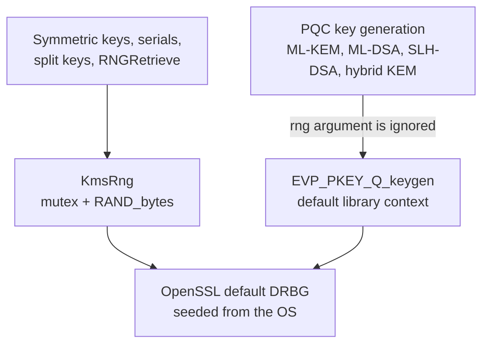

# PQC Entropy Sourcing: Status and Limits

!!! warning "Not an ESV or CMVP compliance statement"
    This page describes how Eviden KMS sources randomness today. It does **not** claim that Eviden KMS holds
    a NIST Entropy Source Validation (ESV) certificate, or that post-quantum (PQC) key generation meets
    NIST SP 800-90B/C or FIPS 140-3 entropy requirements. **Post-quantum key generation does not currently draw
    from `KmsRng`** (see [What does not use `KmsRng`](#what-does-not-use-kmsrng)).

## Summary

| Question | Answer |
|----------|--------|
| Is there a single RNG abstraction in the server? | Yes: `KmsRng`, one instance shared by the whole server |
| What does `KmsRng` use underneath? | OpenSSL `RAND_bytes` in the default library context, behind a mutex |
| Do ML-KEM, ML-DSA, SLH-DSA and hybrid KEM key generation use `KmsRng`? | **No.** They call OpenSSL `EVP_PKEY_Q_keygen`, which uses OpenSSL's own DRBG |
| Is the entropy source ESV-validated? | Not claimed. Entropy comes from the operating system through OpenSSL, and no ESV certificate is referenced |
| Is PQC key generation routed to a FIPS provider? | No. PQC algorithms are available in non-FIPS builds only |

## Background

NIST CMVP is moving towards requiring that approved key generation draw entropy from a validated entropy
source (SP 800-90B) through an approved DRBG construction (SP 800-90A/C), with key generation methods that follow
SP 800-133r3. The relevant standards are:

| Standard | Scope |
|----------|-------|
| NIST SP 800-90A | Deterministic random bit generators (DRBG) |
| NIST SP 800-90B | Entropy source testing and validation |
| NIST SP 800-90C | RBG constructions |
| NIST SP 800-133r3 | Cryptographic key generation |
| FIPS 140-3 Implementation Guidance | Entropy source requirements for modules |

The algorithms concerned are ML-KEM (FIPS 203), ML-DSA (FIPS 204), SLH-DSA (FIPS 205) and the hybrid KEMs
X25519-ML-KEM-768 and X448-ML-KEM-1024.

## What `KmsRng` is

`KmsRng` (`crate/crypto/src/crypto/rng/mod.rs`) is a thin, thread-safe wrapper around OpenSSL's random
generator. It offers:

- `fill_bytes`: fills a buffer using OpenSSL `RAND_bytes`, holding an internal mutex for the call.
- `random_vec`: the same, returning a `Zeroizing<Vec<u8>>`.
- `reseed`: mixes caller-supplied data into OpenSSL's generator with `RAND_add`.

The server creates one `Arc<KmsRng>` at startup (`KMS.rng`).

!!! note
    The mutex only serializes access to OpenSSL calls that OpenSSL already makes thread-safe. It is not an
    entropy or compliance mechanism.

## What uses `KmsRng`

| Consumer | Location |
|----------|----------|
| Symmetric key generation | `core/kms/other_kms_methods.rs` |
| `SecretData` seed generation | `core/kms/other_kms_methods.rs` |
| Certificate serial numbers | `core/operations/certify/build_certificate.rs` |
| Split key seeding | `core/operations/create_split_key.rs` |
| KMIP `RNGRetrieve` | `core/operations/rng_retrieve.rs` |
| KMIP `RNGSeed` | `core/operations/rng_seed.rs` (calls `reseed`) |

## What does not use `KmsRng`

PQC key generation accepts an optional `&KmsRng` (`create_ml_kem_key_pair`, `create_ml_dsa_key_pair`,
`create_slh_dsa_key_pair`, `create_hybrid_kem_key_pair`), and the server passes `kms.rng` from `CreateKeyPair`,
key-pair rekeying and certificate generation. **The parameter is currently unused.** The key generation
helpers `pqc_keygen` and `pqc_keygen_raw` in `crate/crypto/src/crypto/pqc/mod.rs` discard it
(`let _ = rng;`) and call OpenSSL `EVP_PKEY_Q_keygen` with a null library context and no property query.
OpenSSL therefore generates the key material from its own default DRBG, **not** from `KmsRng`.



Both paths end at the same OpenSSL generator, so `KmsRng` does not make PQC key generation any stronger or
weaker, and it does not add a validated entropy source.

`generate_pqc_seed` (`pqc/mod.rs`) returns `rng.random_vec(len)` in a `Zeroizing` buffer. It is not called by
any key generation code today; it is only exercised by unit tests.

## What is not claimed

- An ESV certificate, or an SP 800-90B entropy assessment, for the entropy source.
- That PQC key material is derived from `KmsRng`, or from a FIPS-validated DRBG.
- Conformance to FIPS 140-3 IG 9.3.A, D.J, D.K or D.O, or any other CMVP requirement.
- Deterministic or reproducible PQC key generation: no seed is passed to key generation.

## Tests

The behaviour that exists today is covered by unit tests. They check that output is non-zero, that consecutive
outputs differ, and that zeroizing buffers work. They do not demonstrate entropy quality.

```bash
cargo test -p cosmian_kms_crypto --lib --features non-fips rng
cargo test -p cosmian_kms_crypto --lib --features non-fips pqc
```

## Work needed to reach the stated goal

Making PQC key generation actually draw from `KmsRng`, or from a validated source, would require:

1. Generating the PQC seed material from the chosen DRBG and passing it to key generation, or running
   key generation inside a provider whose DRBG is the validated one. `EVP_PKEY_Q_keygen` with the default
   context does not allow this.
2. A validated entropy source, with its ESV certificate referenced, behind that DRBG.
3. Routing PQC through a FIPS provider once the OpenSSL FIPS module offers approved ML-KEM, ML-DSA and
   SLH-DSA, with a property query such as `fips=yes`.
4. Removing the unused `rng` parameter, or making it effective, so the API does not suggest a guarantee it
   does not give.

## See also

- [Cryptographic algorithms](algorithms.md)
- [FIPS 140-3 compliance](../fips.md)
- [Zeroization](../zeroization.md)

## References

- FIPS 203: Module-Lattice-Based Key-Encapsulation Mechanism Standard
- FIPS 204: Module-Lattice-Based Digital Signature Standard
- FIPS 205: Stateless Hash-Based Digital Signature Standard
- NIST SP 800-90A, SP 800-90B, SP 800-90C: Random bit generation
- NIST SP 800-133r3: Recommendation for Cryptographic Key Generation
