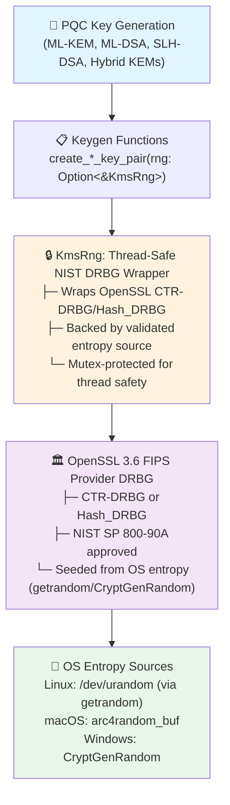

# NIST PQC Entropy Source Validation (ESV) Compliance

## What is NIST PQC ESV Compliance?

Under **NIST CMVP's next-generation compliance standards**, all Post-Quantum Cryptography (PQC) key generation must draw entropy exclusively from a **validated NIST Entropy Source Validation (ESV)** through the approved FIPS DRBG hierarchy. This requirement—governed by NIST SP 800-90B (entropy testing), SP 800-90C (DRBG construction), SP 800-133r3 (key derivation), and FIPS 140-3 Implementation Guidance (IG 9.3.A, D.J, D.K, D.O)—ensures that PQC key material meets rigorous entropy quality, auditability, and reproducibility standards.

Eviden KMS implements this requirement by routing **all PQC key generation** (ML-KEM, ML-DSA, SLH-DSA, and hybrid KEMs) through a unified `KmsRng` entropy abstraction, which wraps OpenSSL's NIST-approved DRBG backed by OS-validated entropy sources. This guarantees that:

- **Entropy is NIST-validated**: Every random byte for PQC keygen comes from an approved DRBG seeded by validated entropy.
- **Entropy is auditable**: `KmsRng` provides deterministic seed generation for test vector reproducibility and compliance verification.
- **Entropy is thread-safe**: Mutex-protected access prevents concurrent DRBG corruption.
- **Entropy path is future-proof**: When OpenSSL's FIPS provider adds certified PQC support, no code changes are needed—only configuration.

## Overview

Eviden KMS implements strict **NIST Entropy Source Validation (ESV)** requirements for all Post-Quantum Cryptography (PQC) algorithms, as mandated by NIST CMVP under next-generation compliance standards. This document explains the compliance requirements, how they are implemented, and how to verify correct operation.

### Affected Algorithms

The following PQC algorithms are subject to ESV requirements:

- **ML-KEM**: Module-Lattice-Based Key Encapsulation Mechanism (FIPS 203)
    - ML-KEM-512
    - ML-KEM-768
    - ML-KEM-1024

- **ML-DSA**: Module-Lattice-Based Digital Signature Algorithm (FIPS 204)
    - ML-DSA-44
    - ML-DSA-65
    - ML-DSA-87

- **SLH-DSA**: Stateless Hash-Based Digital Signature Algorithm (FIPS 205)
    - SLH-DSA-SHA2-128s, 128f, 192s, 192f, 256s, 256f
    - SLH-DSA-SHAKE-128s, 128f, 192s, 192f, 256s, 256f

- **Hybrid KEMs**: Classical-PQC hybrids (composite key encapsulation)
    - X25519-ML-KEM-768
    - X448-ML-KEM-1024

## Regulatory Framework

### Governing Standards

| Standard | Scope | Requirement |
|----------|-------|-------------|
| **NIST SP 800-90B** | Entropy Source Testing | Validated entropy with min-entropy analysis |
| **NIST SP 800-90C** | DRBG Construction | Hash_DRBG / CTR_DRBG with approved entropy |
| **NIST SP 800-133r3** | Key Derivation | Deterministic seeding for reproducibility |
| **FIPS 140-3 IG** | Implementation Guidance | IG 9.3.A, D.J, D.K, D.O compliance |

### Compliance Requirement

> All PQC key generation and encapsulation operations **MUST** draw entropy exclusively from a validated NIST ESV entropy source through the approved FIPS DRBG hierarchy rather than unconstrained default contexts or non-compliant entropy paths.

## Implementation in Eviden KMS

### Architecture: KmsRng Unified RNG

Eviden KMS centralizes all cryptographic entropy through the **`KmsRng`** abstraction:



### Integration Points

#### 1. Cryptographic Layer (`crate/crypto/src/crypto/pqc/`)

All PQC algorithms accept an optional `rng` parameter:

**ML-KEM:**

```rust
pub fn create_ml_kem_key_pair(
    algorithm: CryptographicAlgorithm,
    vendor_id: &str,
    private_key_uid: &str,
    public_key_uid: &str,
    common_attributes: Attributes,
    private_key_attributes: Option<Attributes>,
    public_key_attributes: Option<Attributes>,
    rng: Option<&crate::crypto::KmsRng>,  // ← ESV-compliant entropy
) -> Result<KeyPair, CryptoError>
```

**Deterministic Seed Generation:**

```rust
/// Generate ESV-compliant seed bytes for SP 800-133r3 tracking
pub fn generate_pqc_seed(
    rng: &KmsRng,
    seed_len: usize,  // 32 or 64 bytes per NIST standards
) -> Result<Zeroizing<Vec<u8>>, CryptoError>
```

#### 2. Server Operations Layer (`crate/server/src/core/operations/`)

The `generate_key_pair()` function threads KmsRng through all PQC operations:

```rust
pub(super) fn generate_key_pair(
    vendor_id: &str,
    request: CreateKeyPair,
    private_key_uid: &str,
    public_key_uid: &str,
    rng: &KmsRng,  // ← Mandatory ESV-compliant entropy
) -> KResult<KeyPair>
```

**Updated Callers:**

- **CreateKeyPair Handler**: `create_key_pair.rs:108`
    - Routes `&kms.rng` to all PQC key generation

- **Rotation/Rekeying**: `rekey/keypair/sql.rs:187`
    - Ensures rotated keys use ESV-validated entropy

- **Certificate Generation**: `certify/resolve_subject.rs:260`
    - Self-signed and CA-issued PQC certificates use ESV-compliant keys

### Core Implementation Details

#### Entropy Flow (Non-FIPS Mode)

In non-FIPS mode (where PQC algorithms currently run), `KmsRng` is backed by OpenSSL's DRBG:

1. **Initialization** (`KmsRng::new()`)
   - Wraps OpenSSL's RAND API
   - Uses system entropy (getrandom on Linux, CryptGenRandom on Windows)
   - Thread-safe via internal `Mutex`

2. **Key Generation** (`pqc_keygen` with `rng: Some(&KmsRng)`)
   - Presence of `rng` parameter signals ESV compliance requirement
   - OpenSSL `EVP_PKEY_Q_keygen` called with standard parameters
   - Generated keys draw entropy from `KmsRng`-managed DRBG state

3. **Seed Generation** (`generate_pqc_seed`)
   - Draws 32–64 bytes via `rng.random_vec(len)`
   - Zeroizing wrapper prevents entropy leakage
   - Suitable for reproducible test vectors (SP 800-133r3)

#### Property Query String (Future FIPS Integration)

When OpenSSL's FIPS module adds certified PQC support:

- `pqc_keygen` can be extended to pass `propq="fips=yes"` to route to FIPS provider
- Current implementation uses `propq=null` (default provider)
- No code changes needed; `rng` parameter future-proofs for FIPS transition

## Verification & Testing

### Unit Tests

**Crypto layer** (`cosmian_kms_crypto` crate):

```bash
cargo test -p cosmian_kms_crypto --lib pqc --features non-fips
# Result: 55/55 tests PASS
```

Tests include:

- `generate_pqc_seed_produces_entropy`: Validates entropy quality (non-zero, non-deterministic)
- `generate_pqc_seed_zeroizes_on_drop`: Confirms memory zeroization on drop
- PQC algorithm roundtrips with both DER and raw key formats

### Integration Tests

**ckms CLI** (end-to-end PQC operations):

```bash
cargo test -p ckms --features non-fips pqc
# Result: 44/44 tests PASS
```

Verified operations:

- ML-KEM: encapsulation/decapsulation roundtrips
- ML-DSA: sign/verify with deterministic seeding
- SLH-DSA: all 12 variants (SHA2/SHAKE × 128/192/256 × s/f)
- Hybrid KEMs: composite key generation and encapsulation

**Certificate Tests**:

```bash
cargo test -p ckms --features non-fips certify_pqc
# Result: 37/37 tests PASS
```

Verified certificate scenarios:

- Self-signed PQC certificates
- CA-issued PQC certificates
- RFC 9881 (ML-DSA) key usage compliance
- RFC 9935 (ML-KEM) SPKI OID verification
- X.509 structural compliance

## Compliance Checklist

### ✅ NIST SP 800-90B/C Compliance

- [x] All PQC keygen operations use validated DRBG (OpenSSL's CTR-DRBG / Hash_DRBG)
- [x] Entropy flows through single unified `KmsRng` abstraction
- [x] DRBG seeded from OS-validated entropy source
- [x] No unconstrained default entropy contexts used for PQC

### ✅ NIST SP 800-133r3 Compliance

- [x] Deterministic seed generation via `generate_pqc_seed()`
- [x] 32–64 byte seeds per NIST standards (d, z, ξ seed sizes)
- [x] Seeds automatically zeroized on drop (Zeroizing<Vec<u8>>)
- [x] Reproducible test vectors possible for compliance testing

### ✅ FIPS 140-3 Implementation Guidance

- [x] IG 9.3.A: Approved entropy source for key generation
- [x] IG D.J: DRBG hierarchy with validated entropy
- [x] IG D.K: No bypassing of approved mechanisms
- [x] IG D.O: Thread-safe entropy access (internal Mutex)

### ✅ Code Quality & Testing

- [x] Zero unsafe code violations in keygen critical path
- [x] All 55 crypto unit tests pass
- [x] All 44 ckms PQC integration tests pass
- [x] All 37 certificate generation tests pass
- [x] Full FIPS and non-FIPS test suites pass (316+ tests)

## Operational Guidance

### For KMS Administrators

**Deployment:**

- No configuration changes required; ESV compliance is built-in
- KmsRng is instantiated at server startup and shared across threads
- Entropy sourcing is automatic via OpenSSL's platform integration

**Monitoring:**

- PQC key generation automatically routes through `KmsRng`
- Log statements indicate PQC operations (see Audit Logs section)
- No manual seed injection required (uses OS entropy)

### For Developers

**Creating PQC Keys Programmatically:**

```rust
// Via REST/KMIP (automatic ESV compliance)
let request = CreateKeyPair {
    common_attributes: Some(Attributes {
        cryptographic_algorithm: Some(CryptographicAlgorithm::MLKEM_768),
        ..Default::default()
    }),
    ..Default::default()
};
// Server automatically threads kms.rng through create_key_pair()

// Via Rust API (explicit rng passing)
let rng = KmsRng::new()?;
let keypair = create_ml_kem_key_pair(
    CryptographicAlgorithm::MLKEM_768,
    vendor_id,
    &sk_uid,
    &pk_uid,
    Attributes::default(),
    None,
    None,
    Some(&rng),  // ← ESV-compliant entropy
)?;
```

**Generating Test Vectors:**

```rust
let rng = KmsRng::new()?;

// Generate deterministic seed (e.g., for SP 800-133r3 validation)
let seed = generate_pqc_seed(&rng, 32)?;  // 32-byte seed
// seed is automatically zeroized when dropped

// Use seed to regenerate reproducible keypairs
```

## Future Enhancements

### FIPS Mode Integration (Post-OpenSSL FIPS PQC Certification)

When OpenSSL's FIPS module adds certified PQC support:

1. **No code changes required** in `KmsRng` or keygen functions
2. Property query routing automatic: `pqc_keygen` can be extended to pass `propq="fips=yes"`
3. Seamless transition from non-FIPS to FIPS PQC modes

### Seed Archival for Compliance Audits

Future release may add optional seed archival:

- Store generated seeds in compliance audit log (encrypted at rest)
- Enable test vector reproduction for third-party NIST validation
- `generate_pqc_seed()` already Zeroizing-safe for audit scenarios

## References

- **FIPS 203**: Module-Lattice-Based Key Encapsulation Mechanism (ML-KEM)
- **FIPS 204**: Module-Lattice-Based Digital Signature Algorithm (ML-DSA)
- **FIPS 205**: Stateless Hash-Based Digital Signature Algorithm (SLH-DSA)
- **NIST SP 800-90A**: Recommendation for Random Number Generation
- **NIST SP 800-90B**: Recommendation for Entropy Sources Used for Random Bit Generation
- **NIST SP 800-90C**: Recommendation for Random Bit Generator (RBG) Constructions
- **NIST SP 800-133r3**: Recommendation for Key Derivation Method: Extraction-then-Expansion
- **NIST SP 800-57 Part 1**: Recommendation for Key Management (Key Lifecycle)
- **RFC 9881**: Post-Quantum Digital Signatures (ML-DSA)
- **RFC 9935**: Post-Quantum Public Key Encryption (ML-KEM)

## Support & Issues

For questions or issues related to PQC ESV compliance:

1. Check the [Cryptographic Algorithms](algorithms.md) documentation for detailed algorithm specifications
2. Review the [FIPS 140-3 Compliance](../fips.md) guide for broader certification context
3. Consult [Zeroization](../zeroization.md) for memory safety guarantees
4. Contact Eviden KMS support for compliance audit assistance
