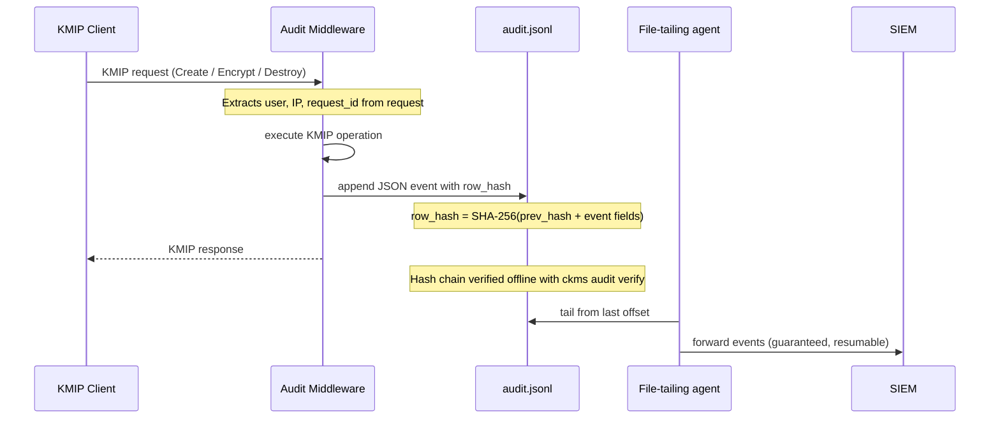

# Audit logging

The Eviden KMS server can write a cryptographically-chained, tamper-evident audit trail of every
KMIP operation to a local JSONL file. Each line is a JSON object; the file is human-readable and
can be parsed by any standard tooling.

Audit logging is **disabled by default**. No file is created and no background writer thread is
spawned until the feature is explicitly enabled.



---

## Enable audit logging

=== "TOML configuration file"

    ```toml
    [audit]
    enabled = true

    [audit.file]
    path = "/var/log/cosmian-kms/audit.jsonl"
    ```

=== "Command line"

    ```bash
    cosmian_kms --audit-enable --audit-file-path /var/log/cosmian-kms/audit.jsonl
    ```

=== "Environment variables"

    ```bash
    export KMS_AUDIT_ENABLE=true
    export KMS_AUDIT_FILE_PATH=/var/log/cosmian-kms/audit.jsonl
    cosmian_kms
    ```

When `audit.file.path` is omitted the file defaults to `<root-data-path>/audit.jsonl`.

!!! warning "Not safe for multiple KMS instances sharing one file"
The audit file backend is designed for **one writer per file**. If you run multiple KMS
instances (horizontal scaling, Kubernetes replicas), each one needs its **own** audit file —
never point several instances at the same path on a shared volume. Only one instance will ever hold the
lock and write, so the others' events are effectively never recorded. A centralized,
multi-writer-safe audit trail is planned via a PostgreSQL backend.

---

## Configuration reference

| CLI flag                      | Environment variable            | Default                        | Description                                                                                                                                                                                                            |
| ----------------------------- | ------------------------------- | ------------------------------ | ---------------------------------------------------------------------------------------------------------------------------------------------------------------------------------------------------------------------- |
| `--audit-enable`              | `KMS_AUDIT_ENABLE`              | `false`                        | Enable the audit pipeline. When `false` no file is created and no writer thread is spawned.                                                                                                                            |
| `--audit-file-path`           | `KMS_AUDIT_FILE_PATH`           | `<root-data-path>/audit.jsonl` | Absolute path to the JSONL audit log file. Parent directories are created automatically on first write.                                                                                                                |
| `--audit-file-max-size-bytes` | `KMS_AUDIT_FILE_MAX_SIZE_BYTES` | _(unlimited)_                  | Stops all further writes once the file reaches this many bytes. Omitted means unlimited. Must be > 0 when set. See [Audit file size cap](#audit-file-size-cap).                                                        |
| `--audit-channel-capacity`    | `KMS_AUDIT_CHANNEL_CAPACITY`    | `4096`                         | Capacity of the bounded in-memory channel between request threads and the writer task. Each event is ≈ 500 B (≈ 2 MiB total at default).                                                                               |
| `--audit-trusted-proxy-cidrs` | `KMS_AUDIT_TRUSTED_PROXY_CIDRS` | _(empty)_                      | Comma-separated CIDR blocks (e.g. `10.0.0.0/8,172.16.0.0/12`) of reverse proxies/load balancers allowed to set `client_ip` via `X-Forwarded-For`. See [Client IP and reverse proxies](#client-ip-and-reverse-proxies). |
| `--audit-failure-mode`        | `KMS_AUDIT_FAILURE_MODE`        | `continue`                     | What to do when an event cannot be queued. `continue` — log the error, keep serving. `reject` — return HTTP 503. See [Audit failure mode](#audit-failure-mode).                                                        |

## SIEM integration

Audit events are forwarded to a SIEM (Splunk, Elastic, Loki, OpenSearch, …) by a
**dedicated file-tailing agent** running alongside the KMS.  This is the architecturally
correct pattern for audit data, which by definition must be **exhaustive** — a property
that cannot be guaranteed by an in-process forwarding channel.

```text
audit.jsonl ──► Vector / Filebeat / Fluent Bit ──► SIEM
                          │
                          └── optional: ckms audit verify (detect tampering before ingest)
```

**Why file-tailing and not an in-process OTLP channel?**

The hash-chained JSONL file is the sole authoritative source of truth.  An in-process
channel is best-effort: if the process crashes, the channel buffer is lost; if the
receiver is down, events are silently dropped with no way to detect the gap.  A
file-tailing agent reading from its last committed offset survives restarts and recovers
automatically — delivering every event exactly once.

Per **PCI-DSS Req. 10**, access to the audit trail must be restricted to personnel with a
documented business need (the SOC).  Route the agent's output to a dedicated, access-controlled
SIEM pipeline, separate from the application metrics/traces pipeline (operated by SRE).

See [SIEMs](./siems.md) for end-to-end configuration examples with Vector, Filebeat, and
Fluent Bit.

> **Tip**: if you see `AuditFileStore: channel full` in the server log under sustained high load, raise
> `--audit-channel-capacity`. When the channel is full the event is dropped (non-blocking) and an
> `error!` line is emitted — the request itself is never blocked.

### Client IP and reverse proxies

By default (`--audit-trusted-proxy-cidrs` empty), `client_ip` in every audit event is always the
direct TCP peer address — the `X-Forwarded-For` header is ignored entirely.

If the KMS runs **directly reachable** by clients (no reverse proxy/load balancer in front), leave
this unset: the TCP peer address is always the real client.

If the KMS runs **behind a reverse proxy or load balancer**, the direct TCP peer is always the
proxy, not the real client. Set `--audit-trusted-proxy-cidrs` to the proxy's IP/CIDR so the audit
middleware knows it can trust `X-Forwarded-For` coming from that address — otherwise every audit
event will record the proxy's IP instead of the real client's.

**Never** trust `X-Forwarded-For` unconditionally: any direct caller can set that header to an
arbitrary value, corrupting the forensic trail (e.g. framing another IP, or hiding its own).
Restricting trust to known proxy CIDRs prevents this while still letting a legitimate reverse
proxy forward the real client IP.

---

### Audit failure mode

By default (`continue`) the KMS keeps serving even when an audit event cannot be queued — the
event is dropped, an `error!` is logged, and the request succeeds normally.

Set `--audit-failure-mode reject` to enforce strict auditability: if an event cannot be placed in
the writer channel (channel full or writer task dead), the KMS returns **HTTP 503** to the client
instead of the normal KMIP response. The KMIP operation has already executed at this point; the
503 signals that its outcome was not recorded.

!!! warning "`reject` mode can cause service disruption"
When `failure_mode = reject`, a saturated audit channel or a dead writer task will
make every subsequent KMIP request fail with 503 until the condition is resolved.
Only use this mode when unlogged operations are strictly unacceptable (e.g.
regulated environments requiring a complete audit trail).

---

### Audit file size cap

`--audit-file-max-size-bytes` (or `[audit.file] max_size_bytes` in TOML) stops the writer from
appending to the audit file once it reaches the configured size. This is a **write-stop cap, not
rotation or retention** — the writer never deletes, truncates, or rolls the file on its own.

```toml
[audit.file]
max_size_bytes = 1073741824 # 1 GiB
```

Behavior:

- Omitted (the default): unlimited, today's behavior.
- The event that pushes the file to or past the cap is still persisted — only events **after**
  that one are dropped (subject to `--audit-failure-mode`, exactly like a full channel or a dead
  writer).
- Once capped, the condition does **not** clear itself: an external process truncating or
  rotating the file does not resume writing. The KMS must be restarted after the log is safely
  remediated. KMS-aware rotation/reopen is a possible future improvement.
- A `0` value is rejected at startup as a configuration error.

---

## Event schema

Each line in the JSONL file is a complete JSON object with the following fields:

| Field         | Type                                     | Nullable | Description                                                                                                                                      |
| ------------- | ---------------------------------------- | -------- | ------------------------------------------------------------------------------------------------------------------------------------------------ |
| `id`          | `integer`                                | No       | Monotonically increasing row counter, starting at 0.                                                                                             |
| `timestamp`   | `string` (RFC 3339 / UTC)                | No       | Wall-clock time of the KMIP operation.                                                                                                           |
| `operation`   | `string`                                 | No       | KMIP operation name, e.g. `"Create"`, `"Encrypt"`, `"Destroy"`. Batch requests produce a `+`-joined name such as `"Create+Encrypt"`.             |
| `user`        | `string`                                 | No       | Authenticated username. `"unauthenticated"` when no identity was presented (e.g. 401 paths).                                                     |
| `object_uid`  | `string` or `null`                       | Yes      | KMIP `UniqueIdentifier` of the object involved. `null` when unavailable (e.g. failed auth, batch).                                               |
| `algorithm`   | `string` or `null`                       | Yes      | Cryptographic algorithm, e.g. `"AES"`, `"RSA"`. `null` when the operation carries no algorithm.                                                  |
| `client_ip`   | `string` or `null`                       | Yes      | Source IP from `X-Forwarded-For` (if present) or the TCP peer address.                                                                           |
| `result`      | `"Success"` or `{"Failure": "<reason>"}` | No       | Outcome of the operation.                                                                                                                        |
| `duration_ms` | `integer`                                | No       | Wall-clock duration of the operation in milliseconds.                                                                                            |
| `details`     | `string` or `null`                       | Yes      | Structured JSON payload attached to synthetic recovery events (`audit:torn-write-recovered`, `audit:reanchor`). `null` for ordinary KMIP events. |
| `prev_hash`   | `string` (64 hex chars)                  | No       | SHA-256 of the previous row's canonical bytes. All-zeros for the first row (`id = 0`).                                                           |
| `row_hash`    | `string` (64 hex chars)                  | No       | SHA-256 of this row's canonical bytes (including `prev_hash`).                                                                                   |

**Example event**:

```json
{
  "id": 4,
  "timestamp": "2026-05-06T20:31:42.321328507Z",
  "operation": "Encrypt",
  "user": "admin",
  "object_uid": "417fe2de-827d-48d0-8d51-851bec315b76",
  "algorithm": "AES",
  "client_ip": "127.0.0.1",
  "result": "Success",
  "duration_ms": 1,
  "prev_hash": "e492c0f02860bc6c428259d44414651eda3aaaee2f48eb857144c940ac0fe909",
  "row_hash": "699a2837830af4a26fe79aeb48509fc707507e514da5850d953366a14e730c38"
}
```

---

## Hash chain

Every persisted event includes a SHA-256 hash chain that makes tampering detectable offline.

The hash is computed over a canonical byte sequence of the event's fields:
`id || timestamp || operation || user || object_uid || algorithm || client_ip || result || duration_ms || prev_hash`

`prev_hash` of the first event (`id = 0`) is the 32-byte all-zeros sentinel.

Any modification to a field in any row — including reordering rows, deleting rows, or appending
forged rows — breaks at least one `prev_hash → row_hash` link and is detected by `ckms audit verify`.

### Durability

Each write is followed by [`fsync()`](https://pubs.opengroup.org/onlinepubs/9699919799/functions/fsync.html) to ensure data is physically written to disk. Events survive
an OS crash or power failure as long as the storage medium has confirmed the write.

On restart, the KMS always verifies the entire chain — every row's hash and its link to the
previous row — before serving traffic, then reads the last 64 KiB of the file to decide how to
resume. **The KMS always starts**, regardless of what it finds — see
[Startup recovery](#startup-recovery) below.

---

## Startup recovery

No condition found in the audit log — whether at the tail or anywhere in the middle of the
file — ever prevents the KMS from starting. Recovery is routed by cause:

| Condition                                                                                                   | What happens                                                                                                                                                                                                                                                                                                                               |
| ----------------------------------------------------------------------------------------------------------- | ------------------------------------------------------------------------------------------------------------------------------------------------------------------------------------------------------------------------------------------------------------------------------------------------------------------------------------------ |
| No file, or empty file                                                                                      | Fresh chain starts at `id = 0`.                                                                                                                                                                                                                                                                                                            |
| **Mid-chain tamper** — any row other than the last fails its own hash check or its link to the previous row | **Seal-and-roll** (below) — caught by the unconditional whole-chain scan that runs on every boot, not just a tail check.                                                                                                                                                                                                                   |
| Last row is valid but missing its trailing newline                                                          | Resumes in place; the missing newline is repaired before the next event is appended.                                                                                                                                                                                                                                                       |
| **Torn write** — an incomplete trailing row, but the row before it (or genesis) is valid                    | The incomplete fragment is truncated away; an `audit:torn-write-recovered` event is appended recording the bytes discarded. The chain continues in place — no data loss beyond the incomplete row, which was never durably committed.                                                                                                      |
| **Tampered last row**, or structural garbage with no trustworthy fallback row                               | **Seal-and-roll**: the corrupted file is renamed aside as `<name>.<UTC-timestamp>.<8-hex>.corrupt.<ext>` — kept as forensic evidence, never modified or deleted by the KMS. A fresh chain starts at the original path with an `audit:reanchor` event as row 0, recording the sealed file's name, size, and SHA-256 in its `details` field. |

A torn write is the common case after an ungraceful restart (OOM kill, pod eviction, power
loss) and is expected to happen periodically at fleet scale — it does not indicate tampering.

### Concurrent instances (rolling updates)

The KMS takes a best-effort, non-blocking exclusive lock (`<audit-file-path>.lock`) before
recovering or writing to the audit file, preventing two live instances — e.g. old and new pods
overlapping during a rolling update on a shared volume — from corrupting the same log. If the
lock is held by another instance, the KMS still starts and serves immediately; audit events are
buffered (up to `--audit-channel-capacity`) and flushed in order once the lock becomes available.

### Unwritable path (permissions, read-only mount, disk fault)

A path that cannot be opened for a reason unrelated to log content is treated as a deployment
fault, not corruption. The KMS starts and serves traffic; each audit event is dropped with an
`error!` log line, and the writer periodically retries opening the path — audit logging resumes
automatically once the fault is fixed, with no restart required.

---

## Verify the chain offline

You can run the following command:

```bash
ckms audit verify --path /var/log/cosmian-kms/audit.jsonl
```

`--path` also accepts a **directory**, verifying every non-sealed `*.jsonl` file in it as its
own independent chain. Sealed `*.corrupt.jsonl` evidence files from past recoveries are not
independent chains; they are checked through the SHA-256 recorded in their live log's reanchor:

```bash
ckms audit verify --path /var/log/cosmian-kms/
```

**Sample output: intact chain**:

```text
/var/log/cosmian-kms/audit.jsonl: chain OK: 42 events verified
```

**Sample output: tampered file**:

```text
TAMPERED: /var/log/cosmian-kms/audit.jsonl event id=17 (line 18) has an invalid row_hash
```

For every `audit:reanchor` event encountered, `verify` also confirms the sealed evidence file it
references still exists next to the log and its SHA-256 still matches the digest recorded in the
event — this is what makes deleting or altering sealed evidence after the fact detectable:

```
MISSING EVIDENCE: /var/log/cosmian-kms/audit.jsonl: reanchor event id=0 references sealed file
audit.20260814T140233Z.9f3ac1b2.corrupt.jsonl which no longer exists
```

**Exit codes**: `0` = intact (and all sealed evidence present and unaltered), `1` = broken,
tampered, or missing/altered sealed evidence.

With `--verbose`, a summary line is printed for every event:

```text
id=0  2026-05-06T20:31:15Z  Create   chain=ok
id=1  2026-05-06T20:31:15Z  Encrypt  chain=ok
...
```

---

## Best practices

- Use an **append-only** filesystem or object store (e.g. S3 with Object Lock) for the audit
  file.
- Restrict read access to the audit file to the KMS process user and auditors only; the file
  contains usernames and operation details.
- Retain audit files for the compliance window required by your framework
  (PCI-DSS Req. 10.7: 12 months; HIPAA §164.312(b): 6 years). This includes sealed
  `*.corrupt.jsonl` files left behind by a seal-and-roll recovery — they are forensic evidence
  and are never deleted automatically; clean them up as part of your retention/rotation process.
- Monitor the recovery audit events and server logs when a torn-write or seal-and-roll recovery
  happens — the KMS no longer refuses to start on audit-log corruption, so these are the primary
  operator signals for noticing and triaging it.
- For SIEM ingestion and CEF export, see [SIEMs](./siems.md).
