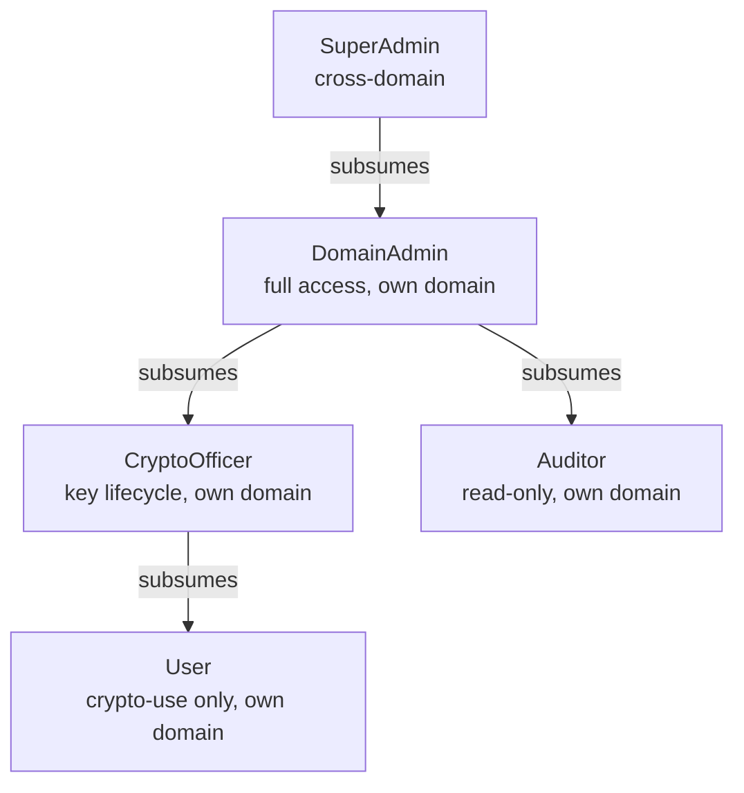
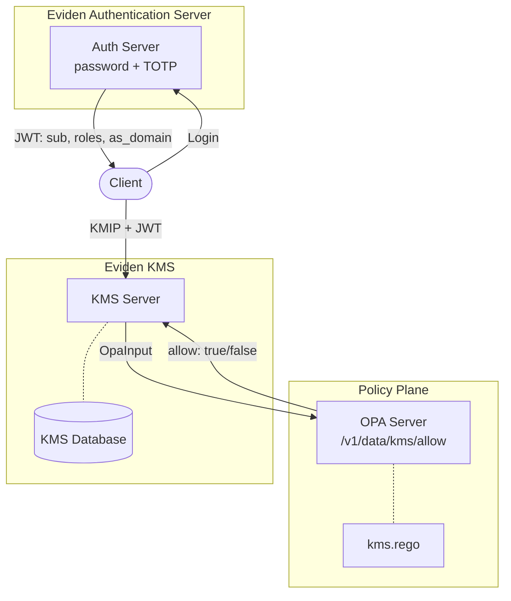

# Authorization

The Eviden KMS implements **two independent, composable authorization systems**
that can be used alone or together.

| System | Decides based on | Configured via |
| ------ | ---------------- | -------------- |
| **Native KMS permissions** | Object ownership + per-user grants | Runtime API (`/access/grant`, `/access/revoke`) and `kms.toml` |
| **OPA RBAC** | JWT roles + domain scoping | Rego policy on an OPA sidecar + Eviden Authentication Server |

---

## Quick-start: pick your mode

| Mode | Name | When to use |
| :--: | ---- | ----------- |
| **1** | [Native KMS only](mode1.md) | Default. Suitable for single-tenant or air-gapped deployments. |
| **2** | [Exclusive OPA](mode2.md) | Multi-tenant or regulated environments where all access decisions must go through OPA. |
| **3** | [OPA + Native KMS](mode3.md) | Layered security: OPA enforces role policy first, then per-object ownership/grants apply. |

The OPA modes require the **Eviden Authentication Server** (JWT issuer) and an
**OPA sidecar** running the reference Rego policy. See the
[RBAC, OPA, JWT and IdP setup guide](rbac-opa-jwt-setup.md) for a step-by-step
walkthrough.

---

## CryptoOfficer role and split-key ceremony

Independent of OPA, the KMS also provides a built-in **CryptoOfficer** role
that satisfies the ISO/IEC 19790:2012 §7.4 / FIPS 140-3 mandatory two-role
model.

The role can optionally require a **split-key ceremony** (XOR n-of-n,
NIST SP 800-57 Part 2 §4.6 dual control) before the CryptoOfficer gains
unrestricted access:

→ **[Role management and key ceremony](key_ceremony.md)**

!!! note "Interaction with OPA modes"
    The CryptoOfficer activation ceremony operates exclusively inside the native
    KMS gate. In Mode 2 (exclusive OPA) the ceremony has no effect; in Mode 3
    it takes effect only after OPA has allowed the request.

---

## OPA role model



| Role | Allowed operations | Domain-scoped? |
| ---- | ------------------ | :------------: |
| `SuperAdmin` | All KMIP operations | No |
| `DomainAdmin` | All KMIP operations | **Yes** |
| `CryptoOfficer` | create, import, get, export, locate, get_attributes, set_attribute, modify_attribute, delete_attribute, add_attribute, activate, revoke, archive, recover, destroy, rekey, rekey_key_pair | **Yes** |
| `Auditor` | locate, get, get_attributes, list_access, query_access, mac_verify | **Yes** |
| `User` | encrypt, decrypt, sign, verify, mac, mac_verify, derive_key, locate, get_attributes | **Yes** |

### Object owner override

Regardless of role, the object **owner** always has full access. The `is_owner`
flag is computed by the KMS and included in the OPA input.

---

## Architecture overview



---

## Domain model

Domain-based isolation enforces "within own domain" scoping for `DomainAdmin`,
`CryptoOfficer`, `Auditor`, and `User` roles.

- **User domain** (`user_domain`) — from the `as_domain` JWT private claim.
- **Object domain** (`object_domain`) — stamped at creation from the creator's
  `user_domain`; stored immutably in the `domain` column of the `objects` table.
- **Object-less operations** (e.g. `Create`) — `object_domain` = `user_domain`.

!!! note "Existing objects (pre-migration)"
    Objects created before RBAC deployment have `domain = ""`. They remain
    accessible to their owner but invisible to domain-scoped role rules. Only
    `SuperAdmin` can access them via the role path.

---

## OPA input document

On every KMIP operation (in Modes 2 and 3), the KMS sends:

```json
{
  "input": {
    "user":          "alice@acme.com",
    "user_domain":   "acme.com",
    "roles":         ["CryptoOfficer"],
    "operation":     "create",
    "object_uid":    "*",
    "object_domain": "acme.com",
    "is_owner":      false
  }
}
```

| Field | Source | Default |
| ----- | ------ | ------- |
| `user` | JWT `sub` / TLS CN / API-token id | — |
| `user_domain` | JWT `as_domain` | `""` |
| `roles` | JWT `roles` (RFC 9068) | `[]` |
| `operation` | KMIP operation name (snake_case) | — |
| `object_uid` | Target object UID | `"*"` |
| `object_domain` | `objects.domain` column | `user_domain` |
| `is_owner` | `user == object.owner` | `false` |

Response: `{"result": true}`. Any error or non-`true` value → `false` (fail-closed).

---

## Configuration reference

```toml
# kms.toml
[opa]
# OPA server base URL. Omit to disable OPA (Mode 1).
opa_url  = "http://localhost:8181"

# "exclusive" → Mode 2; "enforcing" → Mode 3.
opa_mode = "enforcing"
```

See the [setup guide](rbac-opa-jwt-setup.md) for Authentication Server and OPA
sidecar configuration.

---

## Normative references

| Standard | Usage |
| -------- | ----- |
| RFC 7519 | JWT claims (`sub`, `exp`, `iat`, `iss`) |
| RFC 9068 §2.2.3.1 | `roles` as IANA-registered JWT claim |
| RFC 7643 §4.1.2 | SCIM `roles` attribute definition |
| FIPS 140-3 §7.4 | `CryptoOfficer` and `User` mandatory module roles |
| NIST SP 800-57 Part 2 §4.3 | Key management role definitions |
| ANSI/INCITS 359-2004 §4.2 | Hierarchical RBAC model |
| NIST SP 800-53 Rev 5 AC-5, AC-6, AU-9 | Least privilege, separation of duties |
