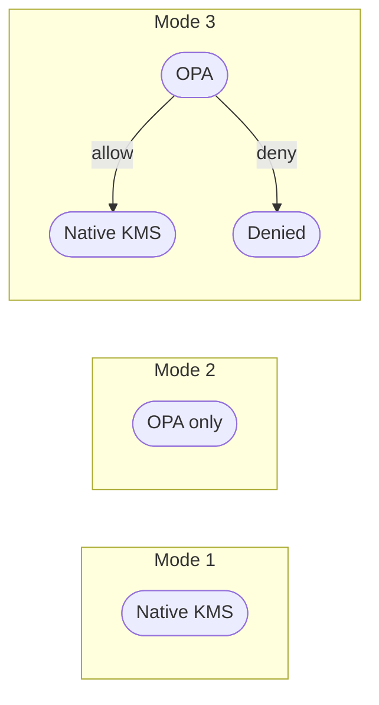
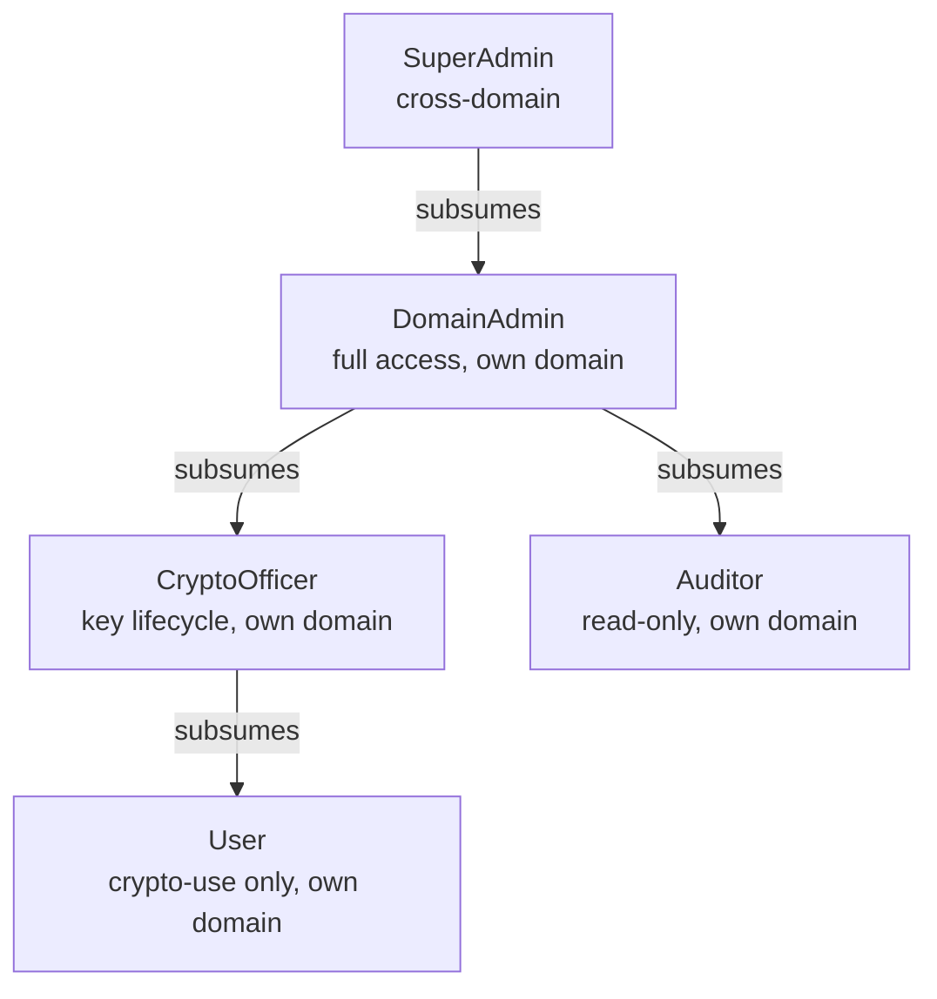
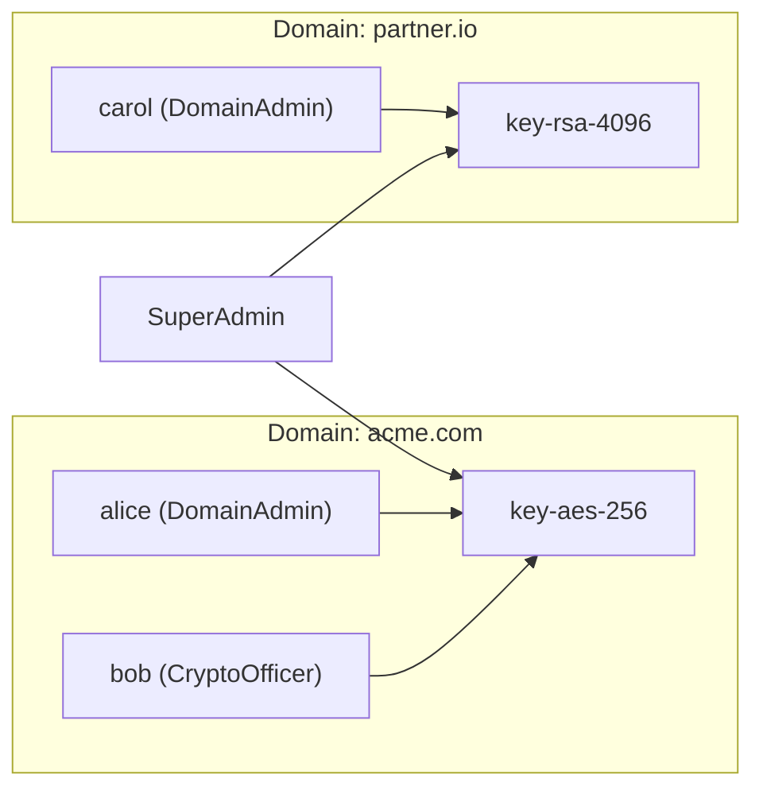

# Authorization

The Eviden KMS implements **two independent, composable authorization systems**. They can
be used alone or together, depending on the deployment requirements.

| System | Decides based on | Configured via |
| ------ | ---------------- | -------------- |
| **Native KMS permissions** | Object ownership + per-user grants | Runtime API (`/access/grant`, `/access/revoke`) and `kms.toml` (`privileged_users`) |
| **OPA RBAC** | JWT roles + domain scoping | Rego policy on an OPA sidecar + Eviden Authentication Server |

The two systems are **fully decoupled**: OPA knows nothing about native KMS grants, and
native KMS knows nothing about OPA roles. They can be combined as a dual-gate but never
share internal state.

---

## The three authorization modes

| Mode | Name | `--opa-url` | `--opa-mode` | Description |
| :--: | ---- | ----------- | ------------ | ----------- |
| 1 | [Native KMS](mode1.md) | _(unset)_ | _(n/a)_ | Only native ownership + grants. Default. |
| 2 | [Exclusive OPA](mode2.md) | set | `exclusive` | Only OPA decides. Native KMS is bypassed. |
| 3 | [Enforcing](mode3.md) | set | `enforcing` | OPA first, then native KMS. Both must allow. |



---

## Architecture overview


---

## OPA role model

Roles are stored per-user per-realm in the Authentication Server's `userpass` table as a
JSON array. OPA evaluates them with existential (union) semantics — any matching role is
sufficient.



| Role | Allowed operations | Domain-scoped? |
| ---- | ------------------ | :------------: |
| `SuperAdmin` | All KMIP operations | No |
| `DomainAdmin` | All KMIP operations | **Yes** |
| `CryptoOfficer` | create, import, get, export, locate, get_attributes, set_attribute, modify_attribute, delete_attribute, add_attribute, activate, revoke, archive, recover, destroy, rekey, rekey_key_pair | **Yes** |
| `Auditor` | locate, get, get_attributes, list_access, query_access, mac_verify | **Yes** |
| `User` | encrypt, decrypt, sign, verify, mac, mac_verify, derive_key, locate, get_attributes | **Yes** |

### Object owner override

Regardless of role, the object **owner** always has full access. The `is_owner` flag is
computed by the KMS and included in the OPA input.

---

## Domain model

Domain-based isolation enforces "within own domain" scoping for `DomainAdmin`,
`CryptoOfficer`, `Auditor`, and `User` roles.



- **User domain** (`user_domain`) — from the `as_domain` JWT private claim.
- **Object domain** (`object_domain`) — stamped at creation from the creator's `user_domain`;
  stored immutably in the `domain` column of the `objects` table.
- **Object-less operations** (e.g. `Create`) — `object_domain` = `user_domain`.

!!! note "Existing objects (pre-migration)"
    Objects created before RBAC deployment have `domain = ""`. They remain accessible to
    their owner but invisible to domain-scoped role rules. Only `SuperAdmin` can access
    them via the role path.

---

## JWT claims from the Authentication Server

The Authentication Server embeds two claims in the JWT:

| Claim | Type | Description | Specification |
| ----- | ---- | ----------- | ------------- |
| `roles` | `string[]` | RBAC roles | RFC 9068 §2.2.3.1, RFC 7643 §4.1.2 |
| `as_domain` | `string` | User's domain | RFC 7519 §4.3 (private claim) |

Example decoded JWT:

```json
{
  "sub": "alice@acme.com",
  "iss": "https://auth.acme.com",
  "exp": 1720000000,
  "roles": ["CryptoOfficer"],
  "as_domain": "acme.com"
}
```

Non-JWT authentication (mTLS, API token) → `roles: []`, `user_domain: ""` → all
role-based rules deny (fail-closed).

---

## OPA input document

On every KMIP operation (in Modes 2 and 3), the KMS sends:

```json
{
  "input": {
    "user":          "alice@acme.com",
    "user_domain":   "acme.com",
    "roles":         ["CryptoOfficer"],
    "operation":     "create",
    "object_uid":    "*",
    "object_domain": "acme.com",
    "is_owner":      false
  }
}
```

| Field | Source | Default |
| ----- | ------ | ------- |
| `user` | JWT `sub` / TLS CN / API-token id | — |
| `user_domain` | JWT `as_domain` | `""` |
| `roles` | JWT `roles` (RFC 9068) | `[]` |
| `operation` | KMIP operation name (snake_case) | — |
| `object_uid` | Target object UID | `"*"` |
| `object_domain` | `objects.domain` column | `user_domain` |
| `is_owner` | `user == object.owner` | `false` |

Response: `{"result": true}`. Any error or non-`true` value → `false` (fail-closed).

---

## Ceremony super-admin

The KMS ceremony super-admin (Shamir split-key activation) operates **exclusively
inside the native KMS permission gate** and is invisible to OPA in all modes:

- **Mode 1** — ceremony super-admin grants unrestricted access as today.
- **Mode 2** — ceremony super-admin has no effect (native KMS gate is not consulted).
- **Mode 3** — ceremony super-admin takes effect in Gate 2 only, after OPA has allowed.

---

## Configuration reference

### KMS server (`kms.toml`)

```toml
[opa]
# OPA server base URL. Omit to disable OPA (Mode 1).
opa_url  = "http://localhost:8181"

# "exclusive" → Mode 2; "enforcing" → Mode 3.
opa_mode = "enforcing"
```

### Authentication Server

Roles are managed per-user per-realm via the admin API:

```bash
curl -X PUT https://auth.acme.com/realms/acme/credentials/alice \
  -H "Authorization: Bearer <admin_token>" \
  -H "Content-Type: application/json" \
  -d '{"password": "...", "roles": ["CryptoOfficer"], "domain": "acme.com"}'
```

### OPA sidecar

```bash
opa run --server --addr :8181 test_data/opa/kms.rego
```

For production: use OPA bundles for hot-reloadable policy updates.

---

## Normative references

| Standard | Usage |
| -------- | ----- |
| RFC 7519 | JWT claims (`sub`, `exp`, `iat`, `iss`) |
| RFC 9068 §2.2.3.1 | `roles` as IANA-registered JWT claim |
| RFC 7643 §4.1.2 | SCIM `roles` attribute definition |
| FIPS 140-3 §7.4 | `CryptoOfficer` and `User` mandatory module roles |
| NIST SP 800-57 Part 2 §4.3 | Key management role definitions |
| ANSI/INCITS 359-2004 §4.2 | Hierarchical RBAC model |
| NIST SP 800-53 Rev 5 AC-5, AC-6, AU-9 | Least privilege, separation of duties |
