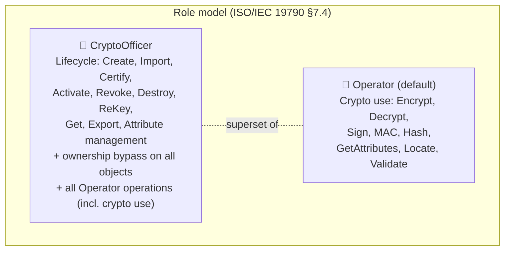
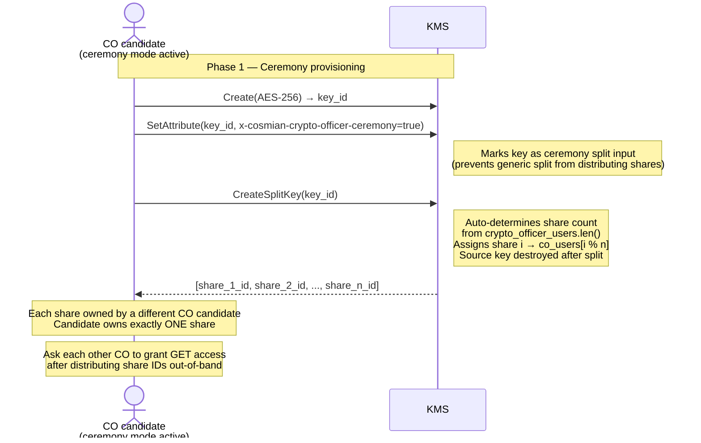
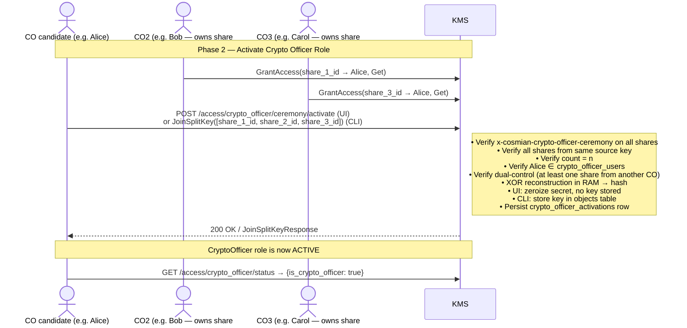
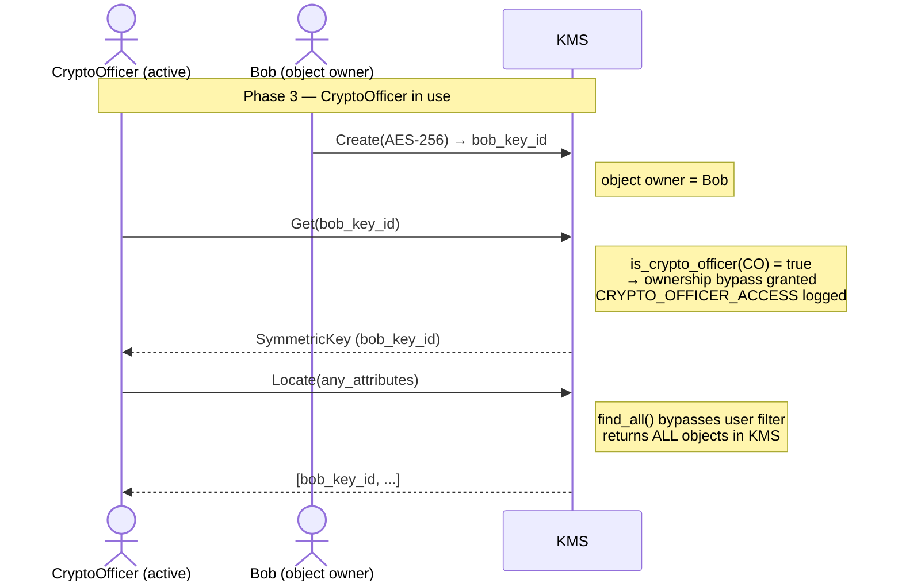
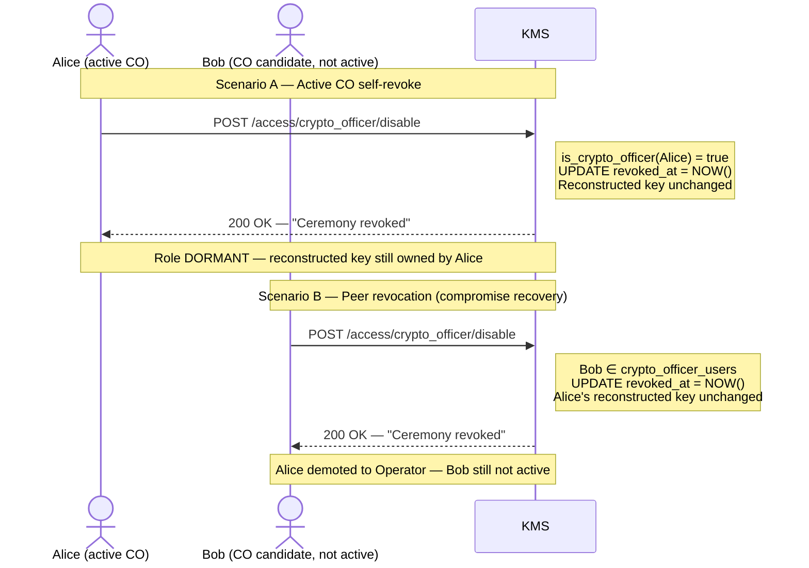
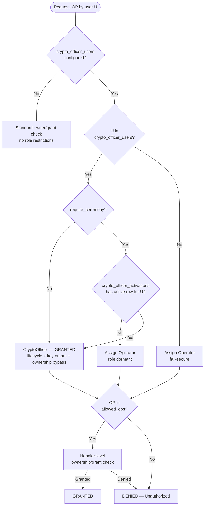

# Role Management and Key Ceremony

Cosmian KMS implements a two-role **Role-Based Access Control** (RBAC) model drawing on
two normative sources:

- **[ISO/IEC 19790:2012](https://csrc.nist.gov/pubs/fips/140-3/final)** (adopted by [FIPS 140-3](https://csrc.nist.gov/pubs/fips/140-3/final)) —
  defines mandatory Crypto Officer and User roles for cryptographic modules.
- **[NIST SP 800-57 Part 2 Rev 1](https://csrc.nist.gov/pubs/sp/800/57/pt2/r1/final)** —
  prescribes split knowledge and dual control for key management.

The **CryptoOfficer** role can optionally require a *split-key ceremony* for activation
under the principle of *split knowledge*
([NIST SP 800-57 Part 2 Rev 1 §4.6](https://csrc.nist.gov/pubs/sp/800/57/pt2/r1/final)).
Without a ceremony, users in the `crypto_officer_users` list are immediately active.
With a ceremony, the role is **dormant** until a quorum of custodians assembles
all key shares.

---

## Normative foundations

### XOR-based split knowledge

The ceremony relies on **$n$-of-$n$ split knowledge**: the master key is split into $n$
shares using XOR, and *all* $n$ shares are required to reconstruct the secret.
The scheme is information-theoretically secure: any strict subset of shares reveals zero
information about the master key.

1. A dealer generates $n-1$ uniformly random byte strings, each of the same length $\ell$ as the secret $s$.
2. The final share is the XOR of the secret with all other shares: $r_n = s \oplus r_1 \oplus \cdots \oplus r_{n-1}$.
3. Reconstruction: $s = r_1 \oplus r_2 \oplus \cdots \oplus r_n$ — all shares are required.

The constraint: $n \ge 3$ (threshold equals total parts, minimum 3 custodians required).

!!! danger "Why n ≥ 3 is mandatory (not n ≥ 2)"
    With only two custodians (Alice and Bob), the scheme provides no real dual control.
    The dealer who creates the master key $K$ and retains share $S_1$ can trivially compute
    Bob's share: $S_2 = K \oplus S_1$. This means Alice knows both shares from the moment of
    creation — Bob's active cooperation is never required.

    With **n ≥ 3** custodians, the dealer knows $K$ and one share $S_1$, but can only compute
    $S_2 \oplus S_3 \oplus \cdots \oplus S_n$ — not any individual share. Genuine cooperation
    from at least $n-1$ other custodians is always required.

    This follows directly from the information-theoretic security of XOR splitting (see
    [NIST SP 800-57 Part 2 Rev 1 §4.6](https://nvlpubs.nist.gov/nistpubs/SpecialPublications/NIST.SP.800-57pt2r1.pdf)).
    **The KMS rejects ceremony configuration with fewer than 3 custodians at startup.**

!!! warning "Ceremony key destroyed after split"
    When a key is split for a ceremony (`x-cosmian-crypto-officer-ceremony` attribute),
    the server **automatically destroys** the original key after all shares are stored.
    This is a defense-in-depth measure: even if the dealer had exported the original key
    before splitting, destroying it removes the direct reconstruction path and forces
    genuine custodian cooperation from the moment of the ceremony.

### Role store vs. key store

**Important security boundary:**

| Store | Written by | Purpose |
|---|---|---|
| `crypto_officer_activations` DB table | Both activation paths (see below) | **Sole source of truth** for CO role status. Sealed with AES-256-GCM under `ceremony_secret`. |
| `objects` DB table | **`JoinSplitKey` KMIP path only** | Stores the reconstructed key as a managed KMS object owned by the caller. The REST activation path never writes here. |

!!! info "Two ceremony completion paths — different key-storage behaviour"
    - **`JoinSplitKey` KMIP operation** — **CLI path** (`ckms sym keys join-split-key`): stores the
      reconstructed key in `objects` **and** writes the CO activation record. The key persists as an
      Active managed object the caller can use for wrapping, encryption, or re-keying operations.
    - **`POST /access/crypto_officer/ceremony/activate`** — **Web UI path**: reconstructs the secret
      in RAM only (to verify the SHA-256 key fingerprint), writes the CO activation record, then
      **zeroizes the secret immediately** — no key object is ever written to `objects`. Verified by
      unit test `test_activation_endpoint_does_not_store_reconstructed_key`.

The `x-cosmian-crypto-officer-ceremony` tag on shares identifies which shares belong to
a ceremony split. **It does NOT grant any privilege.** The server checks this tag only
during ceremony activation validation — never for privilege checks. This prevents:
an attacker calling `Create(key)` + `SetAttribute(x-cosmian-crypto-officer-ceremony=true)`
from escalating to CO role.

### Design rationale

| Standard | Relevant area | What it requires | How Cosmian KMS applies it |
|---|---|---|---|
| [NIST SP 800-57 Part 2 Rev 1](https://csrc.nist.gov/pubs/sp/800/57/pt2/r1/final) | Split knowledge (§4.6) | No single entity shall have access to the complete cryptographic key | Split-key ceremony with XOR n-of-n |
| [NIST SP 800-57 Part 2 Rev 1](https://csrc.nist.gov/pubs/sp/800/57/pt2/r1/final) | Dual control (§4.6) | At least two authorised persons required for sensitive key-management operations | All $n$ shares required for ceremony activation |
| [ISO/IEC 19790:2012](https://csrc.nist.gov/pubs/fips/140-3/final) ([FIPS 140-3](https://csrc.nist.gov/pubs/fips/140-3/final)) | Roles, services, and authentication (§7.4) | Mandatory Crypto Officer and User roles; separation between key management and key use | CryptoOfficer (lifecycle + ownership bypass) vs. Operator (crypto use) |

---

## The two roles



| Role | Config key | Allowed KMIP operations | Can access other users' objects? |
|---|---|---|:---:|
| **Operator** | *(default — no config key)* | Encrypt, Decrypt, Sign, SignatureVerify, MAC, Hash, GetAttributes, Locate, Validate | No |
| **CryptoOfficer** | `crypto_officer_users` | **All Operator operations** + Create, Certify, Import, Get, Export, ReKey, DeriveKey, Activate, Revoke, Destroy, Set/Modify/Add/DeleteAttribute, CreateSplitKey, JoinSplitKey | **Yes — ownership bypass** |

!!! note "Fail-secure default"
    When `crypto_officer_users` is configured but a user is not in the list, the server
    assigns the **Operator** role (minimum privilege). Users are never silently promoted.

---

## CryptoOfficer role

CryptoOfficers may:

- Create, import, certify, activate, revoke, and destroy objects
- Access raw key material (`Get`, `Export`) — "key output" per ISO/IEC 19790 §7.4
- Manage object attributes
- **Use keys cryptographically** (`Encrypt`, `Decrypt`, `Sign`, `SignatureVerify`, `MAC`, `Hash`, `Validate`)
- **Access any object** regardless of ownership (bypass per-object permission checks)
- **Locate all objects** (bypasses user filtering in `Locate`)

### Mode 1 — Config-only (no ceremony)

```toml
[roles]
crypto_officer_users            = ["key-mgr@example.com"]
crypto_officer_require_ceremony = false   # default
```

`key-mgr@example.com` is a CryptoOfficer on first connection. Suitable when physical security
controls or organisational policy already enforce the required trust level.

### Mode 2 — Split-key ceremony required

```toml
[roles]
crypto_officer_users = [
    "key-mgr@example.com",
    "co-backup@example.com",
    "co-auditor@example.com",
]
crypto_officer_require_ceremony = true
ceremony_secret = "0123456789abcdef0123456789abcdef0123456789abcdef0123456789abcdef"
```

CryptoOfficer privileges are **inactive** at startup. At least **3** users must be listed
in `crypto_officer_users` when `require_ceremony = true` (the server rejects fewer).
Each configured CO candidate activates **independently** by running their own ceremony
(`JoinSplitKey` with a fresh set of shares). Multiple COs can be simultaneously active
at any time — activating your own ceremony does **not** revoke any other currently active
CO.

---

## Ceremony lifecycle

### Phase 1 — Provisioning

The CO candidate creates an AES key, stamps it with the ceremony marker, splits it into $n$
shares, and distributes them to custodians. The number of shares is auto-determined by the
server from the `crypto_officer_users` count, and each share is auto-assigned to a different
CO candidate (dual-control enforcement).

No restart is required — the ceremony candidate exemption allows
`Create`, `Import`, `CreateSplitKey`, and `JoinSplitKey` even before the ceremony
completes, breaking the chicken-and-egg problem.



!!! note "Source key is destroyed"
    The server destroys the ceremony source key immediately after all shares are stored.

### Phase 2 — Activate Crypto Officer Role

The CO candidate assembles all $n$ share UIDs (after each other CO grants GET access to
their share), then activates via one of two paths:

**Web UI path** (`POST /access/crypto_officer/ceremony/activate`):

1. Retrieves each share — the candidate must have `Get` on each.
2. Verifies all shares carry `x-cosmian-crypto-officer-ceremony`.
3. Verifies all shares originate from the same source key.
4. Verifies the share count equals the threshold.
5. Verifies the candidate is in `crypto_officer_users`.
6. Verifies that at least one share is owned by a **different** CO (dual-control).
7. XOR-reconstructs the secret in RAM, computes the SHA-256 fingerprint.
8. **Zeroizes the secret immediately** — it is never written to `objects`.
9. Persists a `crypto_officer_activations` record (activated-by, participants, hash).
10. The candidate is now an **active CryptoOfficer**.

**CLI path** (`ckms sym keys join-split-key` → KMIP `JoinSplitKey`):

Same verification steps 1–6, then:

1. Stores the reconstructed key as an Active managed object in `objects` (owned by the caller).
2. Persists the `crypto_officer_activations` record.
3. The candidate is now an **active CryptoOfficer**.

!!! warning "Key storage difference between paths"
    The CLI path (`JoinSplitKey`) stores the reconstructed key as a usable KMS object.
    The UI path (`POST /access/crypto_officer/ceremony/activate`) does **not** — the secret
    is RAM-only and zeroized after the activation record is written.
    Both paths enforce identical ceremony constraints; they differ only in whether a managed
    key object is created as a side-effect.



### Phase 3 — Active use

!!! info "Per-user independent activation"
    Each CO candidate activates independently. Multiple COs can be **simultaneously active**
    — when Alice activates, Bob (already active) is **not** affected. The `is_crypto_officer`
    field in `GET /access/crypto_officer/status` is always per-user ("am I personally active?").
    The `ceremony_activated` field is global ("is anyone active?"). Revocation is per-user:
    revoking Alice does not affect Bob's active status.

While the ceremony is active, an active CryptoOfficer can manage all keys in the KMS:



### Phase 4 — Revocation

Any configured CO candidate may revoke the active CO's ceremony:

| Who calls | Outcome |
|---|---|
| **Active CO** (currently holds the ceremony) | Immediate self-revoke — 200 OK. |
| **Any other CO candidate** (in `crypto_officer_users`, not currently active) | Peer revocation — revokes the active CO's role immediately. |
| Any other user | 401 Unauthorized. |

The reconstructed key is **NOT revoked** — only the `crypto_officer_activations` row
is updated. The demoted CO retains their reconstructed key as an Operator.

!!! warning "What revocation does and does not do"
    Revoking a CO ceremony removes the **role** (ownership bypass + lifecycle privileges)
    but does **not** touch the reconstructed KMS key object. This is by design:
    the reconstructed key may be actively wrapping other data keys, and destroying it
    would orphan any dependent objects (NIST SP 800-152 FR:6.119 requires
    key continuity on role revocation).

    After revocation the former CO becomes an Operator and retains:

    - **Ownership** of the reconstructed key — they can still Encrypt/Decrypt/Sign with
      it (all Operator operations).
    - **No ownership bypass** — they can only access objects they own or have been
      explicitly granted.

    If you want the former CO to lose access to the reconstructed key entirely,
    you must explicitly take one of these additional steps:

    1. **Revoke their key** (`ckms sym keys revoke <key-uid>`) — marks it as
       `Compromised`/`Destroyed`; prevents further use.
    2. **Transfer ownership** — re-key, or have another CO take over wrapping duties
       using a different key, then destroy the original.
    3. **Restrict permissions** — use `ckms access-rights revoke` to remove the former
       CO's access grants on any objects you want protected.

    These are manual administrative steps; the server does not take them automatically.



#### Emergency revocation (config path)

When all CO candidates are unavailable:

1. **Remove** the user from `crypto_officer_users` in `kms.toml`.
2. **Restart** the KMS server.

---

## Security properties

| Property | Guarantee |
|---|---|
| **Information-theoretic secrecy** | $< n$ shares reveal zero bits about the secret |
| **Single-point-of-failure elimination** | No single custodian can activate the role alone |
| **Independent per-user activation** | Each CO candidate activates independently via their own ceremony run. Multiple COs can be simultaneously active; activating your own ceremony never revokes another CO's active status. |
| **Per-user revocation isolation** | Revoking CO Alice does not affect CO Bob's active status — only Alice's `crypto_officer_activations` row is updated. |
| **Insider threat mitigation** | A CO candidate cannot escalate without all custodians cooperating (n ≥ 3 prevents dealer computing other shares) |
| **Dealer-colluder resistance** | With n ≥ 3, the key creator knows one share; deriving any other individual share is impossible without that custodian's cooperation |
| **Audit trail** | Every activation records: activator, participant list, SHA-256 key fingerprint, timestamp |
| **Self-revocability** | The active CO can revoke their own ceremony immediately in one call |
| **Peer revocability** | Any CO candidate can revoke a specific active CO — enables compromise recovery without server restart |
| **Reconstructed key independent** | Revoking the CO role does NOT destroy the reconstructed key — it remains accessible to its owner as an Operator |
| **Tag-based escalation prevention** | CO role is determined by `crypto_officer_activations` table only. The `x-cosmian-crypto-officer-ceremony` tag on KMS objects is used only as validation input, never for privilege checks. |
| **Dual-control enforcement** | Assembling user must not own any share — all shares must come from other CO candidates |
| **Replay prevention** | Re-activation requires re-running the full ceremony (JoinSplitKey with new ceremony-tagged shares) |
| **RAM-only reconstruction (UI path)** | Via `POST /access/crypto_officer/ceremony/activate`: the XOR secret is reconstructed in RAM, used for hash verification, then zeroized — no key object is stored. |
| **Ceremony key destruction** | The source key is automatically destroyed after all shares are stored, removing any direct reconstruction path |
| **HSM key exclusion** | Ownership bypass does not apply to HSM-backed keys (governed by HSM admin rules) |
| **Emergency recovery** | If all CO candidates unavailable: remove from `crypto_officer_users` and restart |

---

## Permission model



---

## Configuration reference

```toml
[roles]
# ── CryptoOfficer role — key lifecycle management + ownership bypass ─────────
crypto_officer_users = ["key-mgr@example.com"]

# Set to true to require a JoinSplitKey ceremony before the role becomes active.
crypto_officer_require_ceremony = true

# Hex-encoded 32-byte secret for ceremony record encryption (AES-256-GCM).
# Required when crypto_officer_require_ceremony = true.
# Generate with: openssl rand -hex 32
ceremony_secret = "0123456789abcdef0123456789abcdef0123456789abcdef0123456789abcdef"

# (ADP-26, planned) UID of a KMS symmetric key to use as the ceremony sealing key.
# When set, takes precedence over ceremony_secret. Enables key rotation and HSM backing.
# The key must be created before enabling require_ceremony (use config-only mode first).
# ceremony_key_id = "ceremony-seal-2026"
```

!!! note "Operator is the default"
    Users not listed in `crypto_officer_users` automatically receive Operator privileges.
    There is no `operator_users` config key — the Operator role is the implicit
    fail-secure default.

---

## CLI quick reference

```bash
# 1. Create ceremony key (as CO candidate, before ceremony)
ckms sym keys create --id ceremony-key-2026 --number-of-bits 256

# 2. Stamp ceremony marker (using the Crypto Officer Role Web UI page
#    or directly via CLI):
ckms attributes set-attribute ceremony-key-2026 \
  --vendor-id cosmian \
  --attr-name x-cosmian-crypto-officer-ceremony \
  --attr-value true

# 3. Split the key (server auto-assigns shares to CO candidates)
ckms sym keys create-split-key --key-id ceremony-key-2026 --ceremony
# Share count = crypto_officer_users.len() (auto-determined)
# Source key auto-destroyed after split

# 4. Each other CO grants you GET access to their share
#    (run as each other CO candidate):
ckms access-rights grant <your-identity> -i <their-share-uid> get

# 5. Activate — JoinSplitKey IS the activation (no separate step needed)
ckms sym keys join-split-key <share_1_uid> <share_2_uid> <share_3_uid>
# → CO role activated; reconstructed key stored

# 6. Check status
ckms access-rights crypto-officer status

# 7. Revoke (self or peer)
ckms access-rights crypto-officer disable
```

### REST API equivalents

```bash
# Status
curl -s https://<kms>/access/crypto_officer/status

# Activate (via JoinSplitKey)
curl -s -X POST https://<kms>/kmip/2_1 \
  -H 'Content-Type: application/json' \
  -d '{"tag":"JoinSplitKey","type":"Structure","value":[
    {"tag":"ObjectType","type":"Enumeration","value":"SymmetricKey"},
    {"tag":"PrivateKeyUniqueIdentifier","type":"TextString","value":"<share_1_uid>"},
    {"tag":"PrivateKeyUniqueIdentifier","type":"TextString","value":"<share_2_uid>"},
    {"tag":"PrivateKeyUniqueIdentifier","type":"TextString","value":"<share_3_uid>"},
    {"tag":"SplitKeyMethod","type":"Enumeration","value":"XOR"}
  ]}'

# Revoke (self or peer)
curl -s -X POST https://<kms>/access/crypto_officer/disable
```

---

## References

| # | Standard | Full title | Link |
|---|---|---|---|
| 1 | FIPS 140-3 | NIST FIPS PUB 140-3, *Security Requirements for Cryptographic Modules*, March 2019. | [PDF](https://nvlpubs.nist.gov/nistpubs/FIPS/NIST.FIPS.140-3.pdf) |
| 2 | SP 800-57 Part 2 Rev 1 | NIST SP 800-57 Part 2 Rev 1, *Recommendation for Key Management: Part 2 — Best Practices for Key Management Organizations*, May 2019. | [PDF](https://nvlpubs.nist.gov/nistpubs/SpecialPublications/NIST.SP.800-57pt2r1.pdf) |
| 3 | SP 800-152 | NIST SP 800-152, *A Profile for U.S. Federal Cryptographic Key Management Systems (CKMS)*. FR:6.118/6.119 (personnel compromise minimization and recovery). | [PDF](https://nvlpubs.nist.gov/nistpubs/SpecialPublications/NIST.SP.800-152.pdf) |
| 4 | ANSI INCITS 359-2004 | *Information Technology — Role Based Access Control*. Defines `DeassignUser(user, role)` as a mandatory RBAC administrative operation. | [Standard](https://webstore.ansi.org/standards/incits/ansiincits3592004) |

---

## Related pages

- [Authorization and access rights](../authorization.md)
- [Configuration file reference](../server_configuration_file.md)
- [FIPS 140-3 compliance](../../certifications_and_compliance/fips.md)
