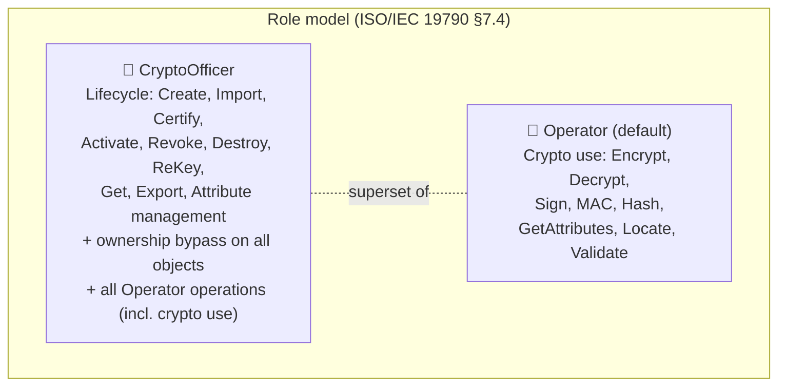
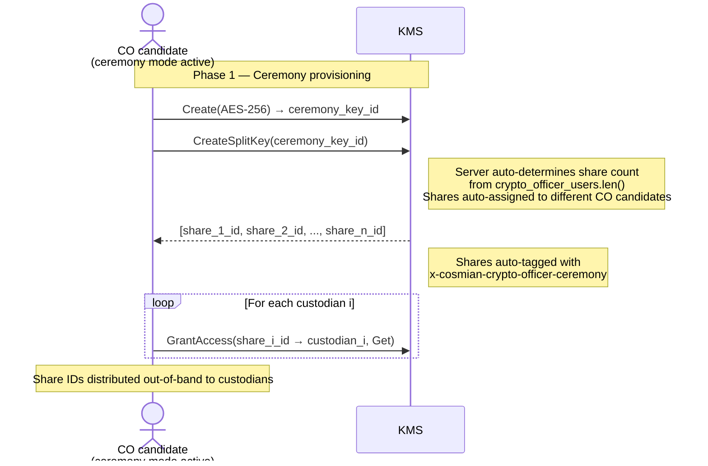
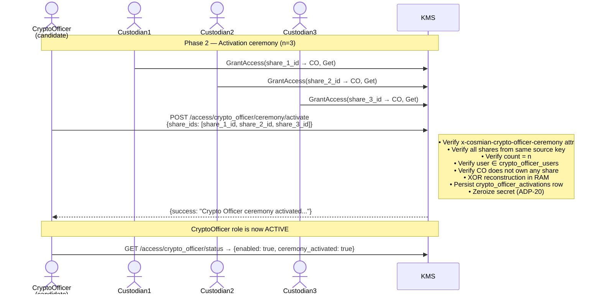
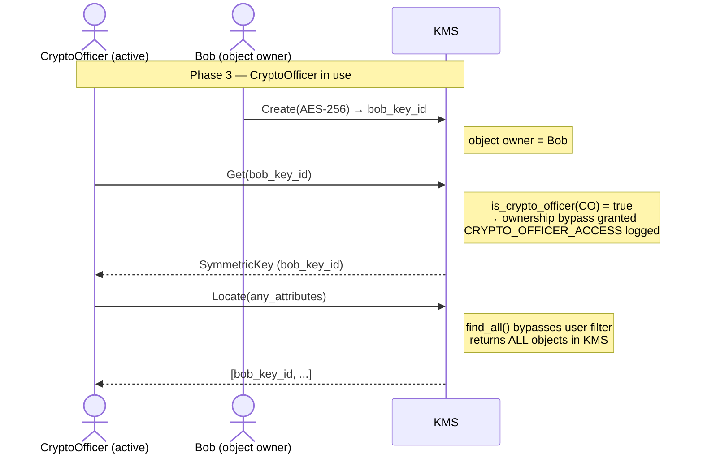
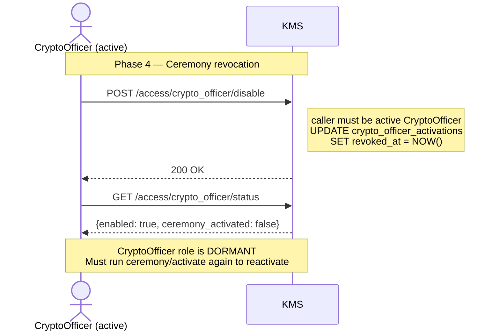

# Role Management and Key Ceremony

Cosmian KMS implements a two-role **Role-Based Access Control** (RBAC) model drawing on
two normative sources:

- **[ISO/IEC 19790:2012](https://csrc.nist.gov/pubs/fips/140-3/final)** (adopted by [FIPS 140-3](https://csrc.nist.gov/pubs/fips/140-3/final)) —
  defines mandatory Crypto Officer and User roles for cryptographic modules.
- **[NIST SP 800-57 Part 2 Rev 1](https://csrc.nist.gov/pubs/sp/800/57/pt2/r1/final)** —
  prescribes split knowledge and dual control for key management.

The **CryptoOfficer** role can optionally require a *split-key ceremony* for activation
under the principle of *split knowledge*
([NIST SP 800-57 Part 2 Rev 1 §4.6](https://csrc.nist.gov/pubs/sp/800/57/pt2/r1/final)).
Without a ceremony, users in the `crypto_officer_users` list are immediately active.
With a ceremony, the role is **dormant** until a quorum of custodians assembles
all key shares — making a single compromised account insufficient to
gain the privileged role.

---

## Normative foundations

### XOR-based split knowledge

The ceremony relies on **$n$-of-$n$ split knowledge**: the master key is split into $n$
shares using XOR, and *all* $n$ shares are required to reconstruct the secret.
The scheme is information-theoretically secure: any strict subset of shares reveals zero
information about the master key.

1. A dealer generates $n-1$ uniformly random byte strings, each of the same length $\ell$ as the secret $s$.
2. The final share is the XOR of the secret with all other shares: $r_n = s \oplus r_1 \oplus \cdots \oplus r_{n-1}$.
3. Reconstruction: $s = r_1 \oplus r_2 \oplus \cdots \oplus r_n$ — all shares are required.

The constraint: $n \ge 3$ (threshold equals total parts, minimum 3 custodians required).

!!! danger "Why n ≥ 3 is mandatory (not n ≥ 2)"
    With only two custodians (Alice and Bob), the scheme provides no real dual control.
    The dealer who creates the master key $K$ and retains share $S_1$ can trivially compute
    Bob's share: $S_2 = K \oplus S_1$. This means Alice knows both shares from the moment of
    creation — Bob's active cooperation is never required.

    With **n ≥ 3** custodians, the dealer knows $K$ and one share $S_1$, but can only compute
    $S_2 \oplus S_3 \oplus \cdots \oplus S_n$ — not any individual share. Genuine cooperation
    from at least $n-1$ other custodians is always required.

    This follows directly from the information-theoretic security of XOR splitting (see
    [NIST SP 800-57 Part 2 Rev 1 §4.6](https://nvlpubs.nist.gov/nistpubs/SpecialPublications/NIST.SP.800-57pt2r1.pdf)).
    **The KMS rejects ceremony configuration with fewer than 3 custodians at startup.**

!!! warning "Ceremony key destroyed after split"
    When a key is split for a ceremony (`x-cosmian-crypto-officer-ceremony` attribute),
    the server **automatically destroys** the original key after all shares are stored.
    This is a defense-in-depth measure: even if the dealer had exported the original key
    before splitting, destroying it removes the direct reconstruction path and forces
    genuine custodian cooperation from the moment of the ceremony.

### Design rationale

| Standard | Relevant area | What it requires | How Cosmian KMS applies it |
|---|---|---|---|
| [NIST SP 800-57 Part 2 Rev 1](https://csrc.nist.gov/pubs/sp/800/57/pt2/r1/final) | Split knowledge (§4.6) | No single entity shall have access to the complete cryptographic key | Split-key ceremony with XOR n-of-n |
| [NIST SP 800-57 Part 2 Rev 1](https://csrc.nist.gov/pubs/sp/800/57/pt2/r1/final) | Dual control (§4.6) | At least two authorised persons required for sensitive key-management operations | All $n$ shares required for ceremony activation |
| [ISO/IEC 19790:2012](https://csrc.nist.gov/pubs/fips/140-3/final) ([FIPS 140-3](https://csrc.nist.gov/pubs/fips/140-3/final)) | Roles, services, and authentication (§7.4) | Mandatory Crypto Officer and User roles; separation between key management and key use | CryptoOfficer (lifecycle + ownership bypass) vs. Operator (crypto use) |

---

## The two roles



| Role | Config key | Allowed KMIP operations | Can access other users' objects? |
|---|---|---|:---:|
| **Operator** | *(default — no config key)* | Encrypt, Decrypt, Sign, SignatureVerify, MAC, Hash, GetAttributes, Locate, Validate | No |
| **CryptoOfficer** | `crypto_officer_users` | **All Operator operations** + Create, Certify, Import, Get, Export, ReKey, DeriveKey, Activate, Revoke, Destroy, Set/Modify/Add/DeleteAttribute | **Yes — ownership bypass** |

!!! note "Fail-secure default"
    When `crypto_officer_users` is configured but a user is not in the list, the server
    assigns the **Operator** role (minimum privilege). Users are never silently promoted.

!!! info "ISO/IEC 19790 mapping"
    ISO/IEC 19790:2012 §7.4 defines two mandatory roles: the Crypto Officer (key management
    and module configuration) and the User (general cryptographic operations). The Cosmian KMS
    `CryptoOfficer` corresponds to the Crypto Officer and the `Operator` corresponds to
    the User. ISO/IEC 19790 requires each role's services to be clearly defined and enforced,
    but does **not** prohibit the CO from also holding User services. NIST SP 800-57 Part 2
    Rev 1 confirms that a CO "can perform encryption, decryption, and other operations to the
    extent defined by policy." Cosmian KMS policy grants the CO the full superset.

---

## CryptoOfficer role

The CryptoOfficer role enforces **key lifecycle management**, **key output**, **cryptographic use**,
and **ownership bypass** as defined in
[ISO/IEC 19790:2012 §7.4](https://csrc.nist.gov/pubs/fips/140-3/final) and
[NIST SP 800-57 Part 2 Rev 1](https://nvlpubs.nist.gov/nistpubs/SpecialPublications/NIST.SP.800-57pt2r1.pdf).

CryptoOfficers may:

- Create, import, certify, activate, revoke, and destroy objects
- Access raw key material (`Get`, `Export`) — "key output" per ISO/IEC 19790 §7.4
- Manage object attributes
- **Use keys cryptographically** (`Encrypt`, `Decrypt`, `Sign`, `SignatureVerify`, `MAC`, `Hash`, `Validate`)
- **Access any object** regardless of ownership (bypass per-object permission checks)
- **Locate all objects** (bypasses user filtering in `Locate`)

!!! note "Why COs can also encrypt/decrypt"
    A dormant CO candidate is treated as an Operator and can already use keys cryptographically.
    Removing those privileges upon CO activation would reduce permissions on promotion — contrary
    to least-privilege semantics and operational necessity (a CO must be able to test keys they
    manage). ISO/IEC 19790 §7.4 mandates that each role's services are *defined and enforced*;
    it does not mandate mutual exclusion between the two role service sets.

### Mode 1 — Config-only (no ceremony)

```toml
[roles]
crypto_officer_users            = ["key-mgr@example.com"]
crypto_officer_require_ceremony = false   # default
```

`key-mgr@example.com` is a CryptoOfficer on first connection. Suitable when physical security
controls or organisational policy already enforce the required trust level.

### Mode 2 — Split-key ceremony required

```toml
[roles]
crypto_officer_users = [
    "key-mgr@example.com",
    "co-backup@example.com",
    "co-auditor@example.com",
]
crypto_officer_require_ceremony = true
```

CryptoOfficer privileges are **inactive** at startup. At least **3** users must be listed
in `crypto_officer_users` when `require_ceremony = true` (the server rejects fewer).
The role becomes active only after the ceremony completes with all shares tagged
`x-cosmian-crypto-officer-ceremony` (XOR n-of-n).

---

## Ceremony lifecycle

### Phase 1 — Provisioning

The CO candidate creates an AES key, splits it into $n$ shares, and distributes them
to custodians. The number of shares is auto-determined by the server from the
`crypto_officer_users` count, and each share is auto-assigned to a different CO
candidate (dual-control enforcement).

No restart is required — the ceremony candidate exemption allows
`Create`, `Import`, `CreateSplitKey`, and `JoinSplitKey` even before the ceremony
completes, breaking the chicken-and-egg problem.



!!! note "Source key is destroyed"
    The server destroys the ceremony source key immediately after all shares are stored,
    as a defense-in-depth measure (see note in the XOR scheme section above).

### Phase 2 — Activation ceremony

**One candidate — one ceremony.** A single person in `crypto_officer_users` calls
`POST /access/crypto_officer/ceremony/activate`. Only that person becomes an active
CryptoOfficer; other users in the list remain Operators until they complete their own
ceremony.

The candidate assembles all $n$ custodians who each grant access to their share, then
calls the ceremony activation endpoint with all share UIDs. The server:

1. Retrieves each share — the candidate must have `Get` on each.
2. Verifies all shares carry the `x-cosmian-crypto-officer-ceremony` attribute.
3. Verifies all shares originate from the same source key.
4. Verifies the share count equals the threshold.
5. Verifies the candidate is in `crypto_officer_users`.
6. Verifies the candidate does **not** own any of the shares (strict dual-control).
7. Reconstructs the secret via XOR **in server RAM only** — never stored as a KMS object.
8. Persists a `crypto_officer_activations` record (activated-by user, SHA-256 key
   fingerprint, participant list, timestamp).
9. Zeroizes the reconstructed secret (ADP-20).

**The activation is bound to the activating user**: only the user named in
`activated_by` of the sealed record is granted CryptoOfficer status.

!!! info "Ceremony activation is separate from JoinSplitKey"
    `JoinSplitKey` (KMIP operation) is a key reconstruction tool — it produces a usable
    cryptographic object. The ceremony activation uses a dedicated REST endpoint
    (`POST /access/crypto_officer/ceremony/activate`) that reconstructs the secret in
    RAM and zeroizes it immediately, never creating a managed KMS object. This
    separation implements ADP-20 and keeps key management operations distinct from
    access-control operations.



### Phase 3 — Active use

While the ceremony is active, the CryptoOfficer can manage all keys in the KMS:



### Phase 4 — Revocation

Any active CryptoOfficer can disable the ceremony (self-disable). The role becomes
dormant until a new `JoinSplitKey` ceremony completes.



---

## Security properties

| Property | Guarantee |
|---|---|
| **Information-theoretic secrecy** | $< n$ shares reveal zero bits about the secret |
| **Single-point-of-failure elimination** | No single custodian can activate the role alone |
| **Insider threat mitigation** | A user in `crypto_officer_users` cannot escalate without all custodians cooperating (n ≥ 3 prevents dealer computing other shares) |
| **Dealer-colluder resistance** | With n ≥ 3, the key creator knows one share; deriving any other individual share is impossible without that custodian's cooperation |
| **Audit trail** | Every activation records: activator, participant list, SHA-256 key fingerprint, timestamp |
| **Self-revocability** | Any active CryptoOfficer can immediately revoke the ceremony |
| **Dual-control enforcement** | Assembling user must not own any share — all shares must come from other CO candidates |
| **Replay prevention** | Re-activation requires re-running the full ceremony activation endpoint |
| **RAM-only reconstruction** | The ceremony secret is reconstructed in server process RAM only during `/ceremony/activate`; zeroized immediately after — never stored as a KMS object (ADP-20) |
| **Ceremony key destruction** | The source key is automatically destroyed after all shares are stored, removing any direct reconstruction path |
| **HSM key exclusion** | Ownership bypass does not apply to HSM-backed keys (governed by HSM admin rules) |

---

## Permission model


---

## Configuration reference

```toml
[roles]
# ── CryptoOfficer role — key lifecycle management + ownership bypass ─────────
crypto_officer_users = ["key-mgr@example.com"]

# Set to true to require a JoinSplitKey ceremony before the role becomes active.
crypto_officer_require_ceremony = true

# Hex-encoded 32-byte secret for ceremony record encryption (AES-256-GCM).
# Required when crypto_officer_require_ceremony = true.
# Generate with: openssl rand -hex 32
ceremony_secret = "0123456789abcdef0123456789abcdef0123456789abcdef0123456789abcdef"
```

!!! note "Operator is the default"
    Users not listed in `crypto_officer_users` automatically receive Operator privileges
    (crypto use only, no lifecycle operations, no ownership bypass).
    There is no `operator_users` config key — the Operator role is the implicit
    fail-secure default.

!!! warning "TOML scoping"
    All role keys must appear under the `[roles]` section header.
    Placing them at root level or inside another section (e.g. `[http]`, `[db]`)
    causes them to be silently ignored.

---

## CLI quick reference

```bash
# 1. Create and split the ceremony key (no restart needed — ceremony candidates
#    are exempted from Create/CreateSplitKey permission checks)
ckms sym keys create --size 256
ckms sym keys create-split-key --key-id <co_key_id>
# Share count is auto-determined from crypto_officer_users (minimum 3)

# 2. Grant shares to custodians (each share is auto-assigned to a different CO candidate)
#    The source key is automatically destroyed after all shares are stored.
ckms access-rights grant custodian1@example.com -i <share_1_id> get
ckms access-rights grant custodian2@example.com -i <share_2_id> get
ckms access-rights grant custodian3@example.com -i <share_3_id> get

# 3. Custodians grant the CryptoOfficer candidate access at ceremony time
ckms access-rights grant key-mgr@example.com -i <share_1_id> get  # run as custodian1
ckms access-rights grant key-mgr@example.com -i <share_2_id> get  # run as custodian2
ckms access-rights grant key-mgr@example.com -i <share_3_id> get  # run as custodian3

# 4. CryptoOfficer candidate activates the role (dedicated ceremony endpoint — not JoinSplitKey)
#    The server reconstructs the secret in RAM and zeroizes it — no key stored.
ckms access-rights crypto-officer activate <share_1_id> <share_2_id> <share_3_id>

# 5. Check status
ckms access-rights crypto-officer status

# 6. Revoke the ceremony (self-disable)
ckms access-rights crypto-officer disable
```

!!! note "JoinSplitKey is for key reconstruction, not ceremony activation"
    `ckms sym keys join-split-key` (KMIP `JoinSplitKey`) reconstructs a split key into
    a usable managed KMS object — use it when you need the raw key material for
    cryptographic operations. To activate the Crypto Officer ceremony role, use
    `ckms access-rights crypto-officer activate` or the Web UI **Crypto Officer Role**
    page instead.

### REST API equivalents

```bash
# Status (any authenticated user)
curl -s https://<kms>/access/crypto_officer/status

# Activate ceremony (CO candidate; secret reconstructed in RAM, then zeroized)
curl -s -X POST https://<kms>/access/crypto_officer/ceremony/activate \
  -H 'Content-Type: application/json' \
  -d '{"share_ids": ["<share_1_id>", "<share_2_id>", "<share_3_id>"]}'

# Disable (requires active CryptoOfficer)
curl -s -X POST https://<kms>/access/crypto_officer/disable
```

---

## References

| # | Standard | Full title | Link |
|---|---|---|---|
| 1 | FIPS 140-3 | NIST FIPS PUB 140-3, *Security Requirements for Cryptographic Modules*, March 2019. Adopts ISO/IEC 19790:2012(E). | [PDF](https://nvlpubs.nist.gov/nistpubs/FIPS/NIST.FIPS.140-3.pdf) |
| 2 | FIPS 140-3 IG | NIST, *FIPS 140-3 Implementation Guidance*, April 2026. | [PDF](https://csrc.nist.gov/csrc/media/Projects/cryptographic-module-validation-program/documents/fips%20140-3/FIPS%20140-3%20IG.pdf) |
| 3 | SP 800-57 Part 2 Rev 1 | NIST SP 800-57 Part 2 Rev 1, *Recommendation for Key Management: Part 2 — Best Practices for Key Management Organizations*, May 2019. | [PDF](https://nvlpubs.nist.gov/nistpubs/SpecialPublications/NIST.SP.800-57pt2r1.pdf) |

---

## Related pages

- [Authorization and access rights](../authorization.md)
- [Configuration file reference](../server_configuration_file.md)
- [FIPS 140-3 compliance](../../certifications_and_compliance/fips.md)
