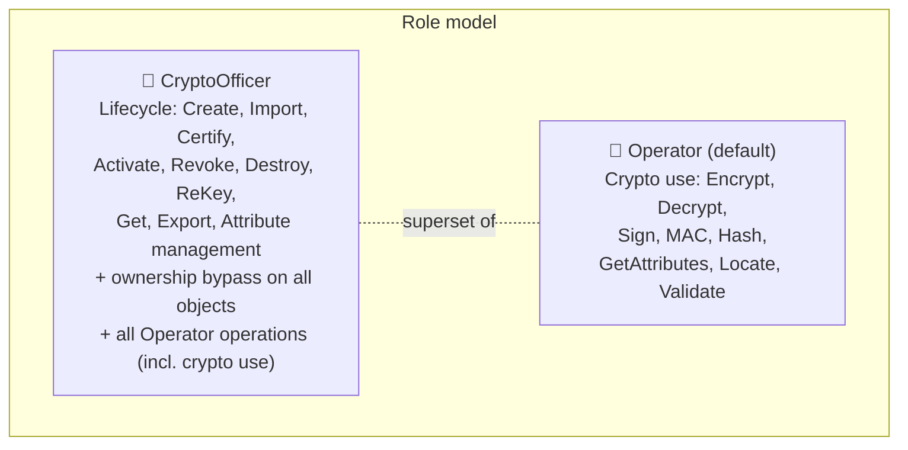
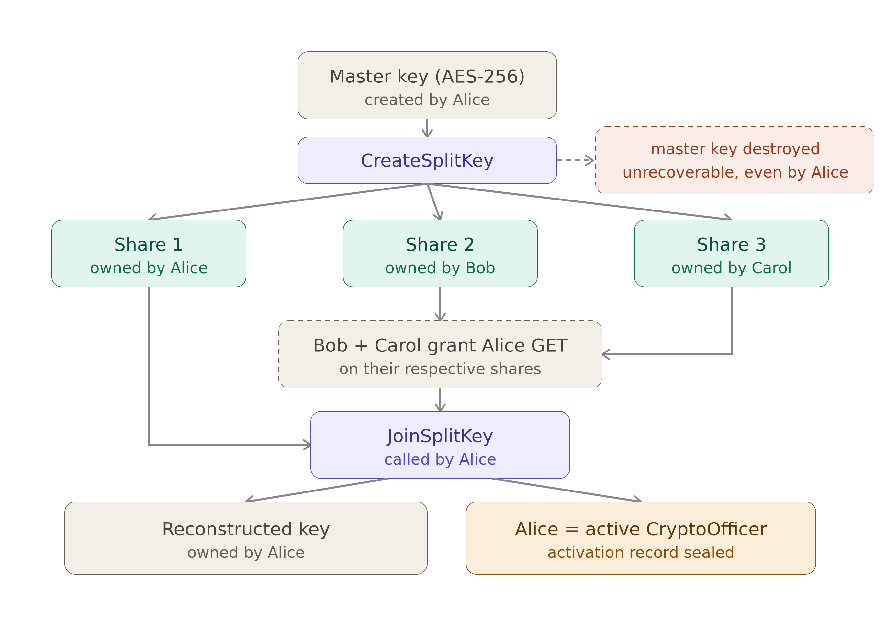
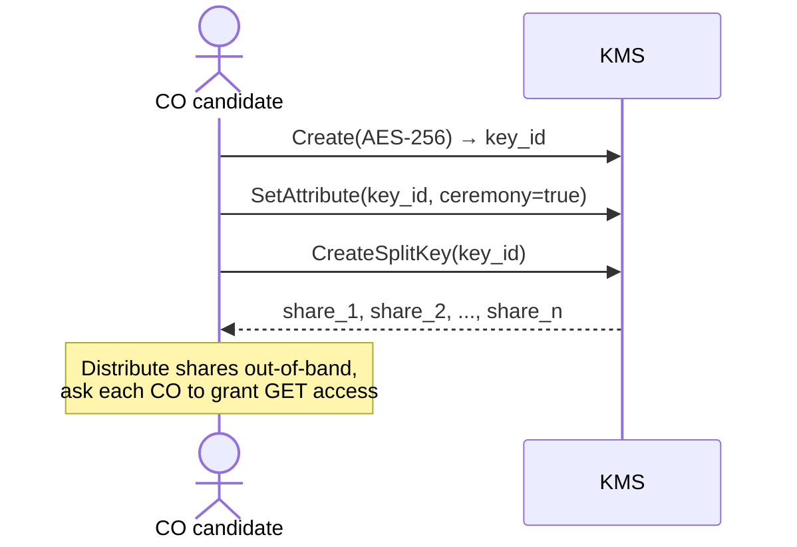
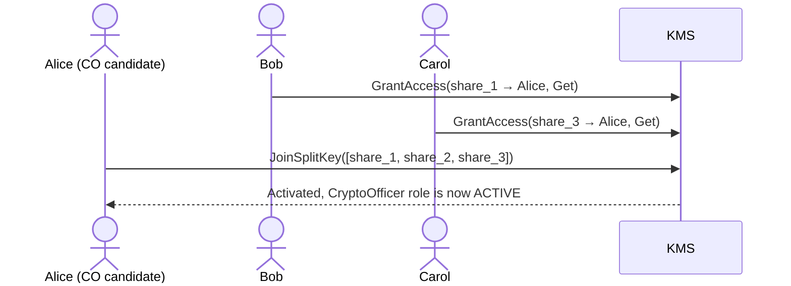

# Role Management and Key Ceremony

Cosmian KMS supports two built-in roles, **Operator** and **CryptoOfficer**, so that
day-to-day cryptographic use (encrypt, sign, decrypt) can be kept separate from
key-lifecycle administration (create, activate, destroy, cross-user access). For
deployments that want extra assurance around who can become a CryptoOfficer, the role
can optionally require a **split-key ceremony**: instead of one person activating the
role alone, the key that grants it is split across several people, and all of them must
cooperate to activate it.

---

## Table of Contents

- [Role Management and Key Ceremony](#role-management-and-key-ceremony)
  - [Table of Contents](#table-of-contents)
  - [The Officer/Operator two roles model](#the-officeroperator-two-roles-model)
  - [Turning on CryptoOfficer](#turning-on-cryptoofficer)
    - [Mode 1: Config-only (no ceremony)](#mode-1-config-only-no-ceremony)
    - [Mode 2: Split-key ceremony required](#mode-2-split-key-ceremony-required)
  - [Walkthrough: a 3-person ceremony](#walkthrough-a-3-person-ceremony)
    - [Phase 1: Provisioning](#phase-1-provisioning)
    - [Phase 2: Activate Crypto Officer Role (JoinSplitKey)](#phase-2-activate-crypto-officer-role-joinsplitkey)
  - [Revoking](#revoking)
    - [Emergency revocation (config path)](#emergency-revocation-config-path)
  - [Quick reference](#quick-reference)
    - [Permission model](#permission-model)
    - [Configuration](#configuration)
    - [CLI](#cli)
      - [REST API equivalents](#rest-api-equivalents)
    - [Role store vs. key store](#role-store-vs-key-store)
  - [Standards this design draws on](#standards-this-design-draws-on)
  - [Related pages](#related-pages)

---

## The Officer/Operator two roles model



| Role              | Config key                 | Allowed KMIP operations                                                                                                                                                       | Can access other users' objects? |
| ----------------- | -------------------------- | ----------------------------------------------------------------------------------------------------------------------------------------------------------------------------- | :------------------------------: |
| **Operator**      | _(default, no config key)_ | Encrypt, Decrypt, Sign, SignatureVerify, MAC, Hash, GetAttributes, Locate, Validate                                                                                           |                No                |
| **CryptoOfficer** | `crypto_officer_users`     | **All Operator operations** + Create, Certify, Import, Get, Export, ReKey, DeriveKey, Activate, Revoke, Destroy, Set/Modify/Add/DeleteAttribute, CreateSplitKey, JoinSplitKey |    **Yes, ownership bypass**     |

!!! note "Fail-secure default"
    When `crypto_officer_users` is configured but a user is not in the list, the server
    assigns the **Operator** role (minimum privilege). Users are never silently promoted.

!!! warning "Ownership bypass excludes HSM-backed keys"
    The CryptoOfficer ownership bypass applies to KMS-managed objects only. Keys stored
    in an HSM are **not** covered: access to them stays governed by the HSM's own admin
    rules, regardless of CryptoOfficer status.

---

## Turning on CryptoOfficer

There are two ways to grant the CryptoOfficer role, chosen per deployment.

### Mode 1: Config-only (no ceremony)

```toml
[roles]
crypto_officer_users            = ["key-mgr@example.com"]
crypto_officer_require_ceremony = false   # default
```

`key-mgr@example.com` is a CryptoOfficer on first connection. Suitable when physical security
controls or organisational policy already enforce the required trust level.

### Mode 2: Split-key ceremony required

```toml
[roles]
crypto_officer_users = [
    "key-mgr@example.com",
    "co-backup@example.com",
    "co-auditor@example.com",
]
crypto_officer_require_ceremony = true
ceremony_secret = "0123456789abcdef0123456789abcdef0123456789abcdef0123456789abcdef"
```

CryptoOfficer privileges are **inactive** at startup. At least **3** users must be listed
in `crypto_officer_users` when `require_ceremony = true` (the server rejects fewer).
Each configured CO candidate activates **independently** by running their own ceremony
(`JoinSplitKey` with a fresh set of shares). Multiple COs can be simultaneously active
at any time — activating your own ceremony does **not** revoke any other currently active
CO.

---

## Walkthrough: a 3-person ceremony

The diagram below follows a ceremony with three custodians, Alice, Bob, and Carol,
(which is also the minimum the KMS accepts).



Alice creates the master key and splits it into three shares; the KMS destroys the
original immediately, so from that point on not even Alice can recover it alone. Bob and
Carol each hold a share Alice does not have. To activate the CryptoOfficer role, Alice
needs her own share plus at least one of theirs, which means Bob or Carol must actively
grant her access first, so Alice cannot silently activate on her own.

!!! info "Why not just two people?"
    With two custodians, whoever creates the key can always compute the other person's
    share from the key and their own share, so no real cooperation is required. Three is
    the minimum where that shortcut disappears, which is why the KMS rejects fewer than
    3 custodians at startup.

### Phase 1: Provisioning

The number of shares is auto-determined from the `crypto_officer_users` count, and each
share is auto-assigned to a different CO candidate. No server restart is needed: the
ceremony candidate exemption lets a CO candidate call `Create`, `CreateSplitKey`, and
`JoinSplitKey` even before the ceremony completes, which is what breaks the
chicken-and-egg problem of needing the role to set up the role.



### Phase 2: Activate Crypto Officer Role (JoinSplitKey)

The CO candidate assembles all $n$ share UIDs (after each other CO grants GET access to
their share), then activates via one of two mechanisms, both reachable from the CLI and
the Web UI:

- **KMIP `JoinSplitKey`** (`ckms sym keys join-split-key`, or the Web UI's Join Split Key
  page): stores the reconstructed key as an Active managed object in `objects`, owned by
  the caller.
- **`POST /access/crypto_officer/ceremony/activate`** (`ckms access-rights crypto-officer
  activate`, or the Web UI's Crypto Officer Role page): reconstructs the secret in RAM
  only to verify its SHA-256 fingerprint, then zeroizes it. No key object is stored.

Both run the same checks first:

1. Retrieves each share (the candidate must have `Get` on each) and validates them: same
   ceremony tag, same source key, correct count, and the candidate listed in
   `crypto_officer_users`.
2. Checks that at least one share belongs to a **different** CO: the activating candidate
   may own shares, but not all of them. This is what prevents solo self-activation.

Either way, the server persists the `crypto_officer_activations` record and the candidate
is now an **active CryptoOfficer**.

!!! warning "Key storage difference between the two mechanisms"
    `JoinSplitKey` stores the reconstructed key as a usable KMS object; `ceremony/activate`
    does not — the secret is RAM-only and zeroized immediately after the activation record
    is written. Pick based on whether you need the reconstructed key as a managed object
    afterward.



## Revoking

Any configured CO candidate may revoke the active CO's ceremony:

| Who calls                                                                    | Outcome                                                    |
| ---------------------------------------------------------------------------- | ---------------------------------------------------------- |
| **Active CO** (currently holds the ceremony)                                 | Immediate self-revoke: 200 OK.                             |
| **Any other CO candidate** (in `crypto_officer_users`, not currently active) | Peer revocation: revokes the active CO's role immediately. |
| Any other user                                                               | 401 Unauthorized.                                          |

The reconstructed key is **NOT revoked**; only the `crypto_officer_activations` row
is updated. The demoted CO retains their reconstructed key as an Operator.

### Emergency revocation (config path)

When all CO candidates are unavailable:

1. **Remove** the user from `crypto_officer_users` in `kms.toml`.
2. **Restart** the KMS server.

---

## Quick reference

### Permission model

```text
Request: operation OP by user U
│
├─ crypto_officer_users not configured
│  └─ Standard owner/grant check (no role restrictions)
│
└─ crypto_officer_users configured
   │
   ├─ U not in crypto_officer_users
   │  └─ role = Operator (fail-secure default)
   │
   └─ U in crypto_officer_users
      │
      ├─ require_ceremony = false
      │  └─ role = CryptoOfficer: GRANTED
      │           (lifecycle + key output + ownership bypass)
      │
      └─ require_ceremony = true
         │
         ├─ no active row in crypto_officer_activations
         │  └─ role = Operator (dormant until ceremony completes)
         │
         └─ active row in crypto_officer_activations
            └─ role = CryptoOfficer: GRANTED

Once a role is assigned (CryptoOfficer or Operator):
│
└─ OP in the role's allowed operations?
   │
   ├─ No  → DENIED (Unauthorized)
   │
   └─ Yes → handler-level ownership/grant check
      │
      ├─ Denied  → DENIED (Unauthorized)
      └─ Granted → GRANTED
```

---

### Configuration

```toml
[roles]
# ── CryptoOfficer role: key lifecycle management + ownership bypass ─────────
crypto_officer_users = ["key-mgr@example.com"]

# Set to true to require a JoinSplitKey ceremony before the role becomes active.
crypto_officer_require_ceremony = true

# Hex-encoded 32-byte secret for ceremony record encryption (AES-256-GCM).
# Required when crypto_officer_require_ceremony = true.
# Generate with: openssl rand -hex 32
ceremony_secret = "0123456789abcdef0123456789abcdef0123456789abcdef0123456789abcdef"

# (ADP-26, planned) UID of a KMS symmetric key to use as the ceremony sealing key.
# When set, takes precedence over ceremony_secret. Enables key rotation and HSM backing.
# The key must be created before enabling require_ceremony (use config-only mode first).
# ceremony_key_id = "ceremony-seal-2026"
```

!!! note "Operator is the default"
    Users not listed in `crypto_officer_users` automatically receive Operator privileges.
    There is no `operator_users` config key; the Operator role is the implicit
    fail-secure default.

---

### CLI

```bash
# 1. Create ceremony key (as CO candidate, before ceremony)
ckms sym keys create --id ceremony-key-2026 --number-of-bits 256

# 2. Stamp ceremony marker (using the Crypto Officer Role Web UI page
#    or directly via CLI):
ckms attributes set-attribute ceremony-key-2026 \
  --vendor-id cosmian \
  --attr-name x-cosmian-crypto-officer-ceremony \
  --attr-value true

# 3. Split the key (server auto-assigns shares to CO candidates)
ckms sym keys create-split-key --key-id ceremony-key-2026 --ceremony
# Share count = crypto_officer_users.len() (auto-determined)
# Source key auto-destroyed after split

# 4. Each other CO grants you GET access to their share
#    (run as each other CO candidate):
ckms access-rights grant <your-identity> -i <their-share-uid> get

# 5. Activate: JoinSplitKey IS the activation (no separate step needed)
ckms sym keys join-split-key <share_1_uid> <share_2_uid> <share_3_uid>
# → CO role activated; reconstructed key stored

# 6. Check status
ckms access-rights crypto-officer status

# 7. Revoke (self or peer)
ckms access-rights crypto-officer disable
```

#### REST API equivalents

```bash
# Status
curl -s https://<kms>/access/crypto_officer/status

# Activate (via JoinSplitKey)
curl -s -X POST https://<kms>/kmip/2_1 \
  -H 'Content-Type: application/json' \
  -d '{"tag":"JoinSplitKey","type":"Structure","value":[
    {"tag":"ObjectType","type":"Enumeration","value":"SymmetricKey"},
    {"tag":"PrivateKeyUniqueIdentifier","type":"TextString","value":"<share_1_uid>"},
    {"tag":"PrivateKeyUniqueIdentifier","type":"TextString","value":"<share_2_uid>"},
    {"tag":"PrivateKeyUniqueIdentifier","type":"TextString","value":"<share_3_uid>"},
    {"tag":"SplitKeyMethod","type":"Enumeration","value":"XOR"}
  ]}'

# Revoke (self or peer)
curl -s -X POST https://<kms>/access/crypto_officer/disable
```

---

### Role store vs. key store

**Important security boundary:**

| Store                                 | Written by                                                                            | Purpose                                                                                                                                                                     |
| ------------------------------------- | ------------------------------------------------------------------------------------- | --------------------------------------------------------------------------------------------------------------------------------------------------------------------------- |
| `crypto_officer_activations` DB table | `JoinSplitKey` on ceremony shares, or `POST /access/crypto_officer/ceremony/activate` | **Sole source of truth** for CO role status. Sealed with AES-256-GCM under `ceremony_secret`.                                                                               |
| `objects` DB table                    | Every `JoinSplitKey` call (ceremony and non-ceremony)                                 | Stores the reconstructed key as a managed KMS object owned by the caller. For ceremony shares the key is stored **unconditionally** before the activation side-effect runs. |

!!! info "Two ceremony completion paths"
    - **`JoinSplitKey` KMIP operation**: stores the reconstructed key in `objects` **and** writes the CO activation record. Suitable when you need the reconstructed key as a usable KMS object.
    - **`POST /access/crypto_officer/ceremony/activate`**: reconstructs the secret in RAM only (for hash verification), writes the CO activation record, and **does not store a key object**.

The `x-cosmian-crypto-officer-ceremony` tag on shares identifies which shares belong to
a ceremony split. **It does NOT grant any privilege.** The server checks this tag only
during ceremony activation validation, never for privilege checks. This prevents an
attacker calling `Create(key)` + `SetAttribute(x-cosmian-crypto-officer-ceremony=true)`
from escalating to CO role.

---

## Standards this design draws on

This design is inspired by two publications:
[FIPS 140-3](https://nvlpubs.nist.gov/nistpubs/FIPS/NIST.FIPS.140-3.pdf) (cryptographic
module role separation) and
[NIST SP 800-57 Part 2 Rev 1](https://nvlpubs.nist.gov/nistpubs/SpecialPublications/NIST.SP.800-57pt2r1.pdf)
(split knowledge and dual control as organizational practices to document). Neither
standard mandates a specific implementation.

---

## Related pages

- [Authorization and access rights](../authorization.md)
- [Configuration file reference](../server_configuration_file.md)
- [FIPS 140-3 compliance](../../certifications_and_compliance/fips.md)
