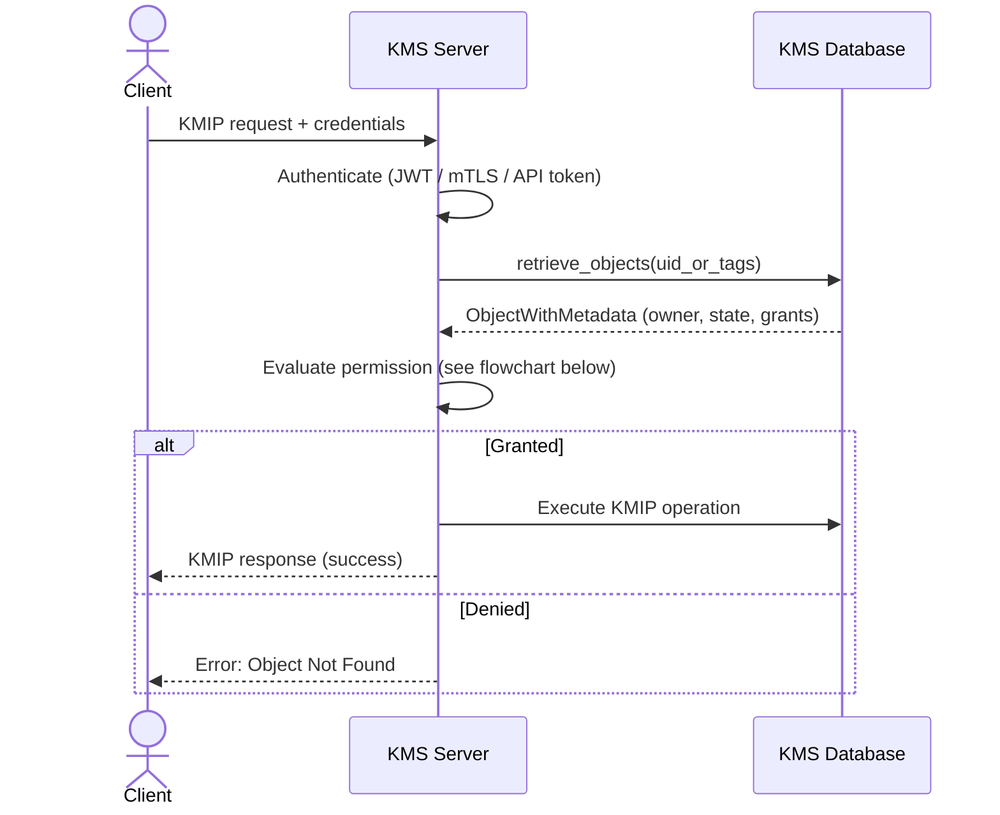
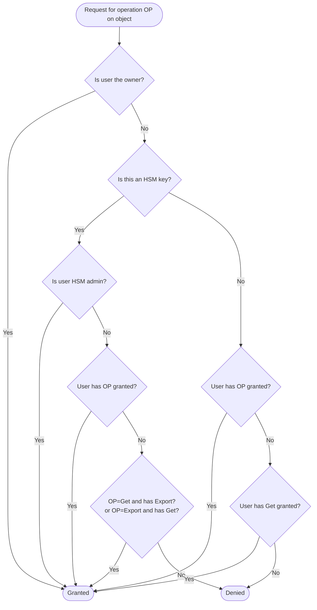

# Mode 1 — Native KMS Permissions

When no OPA server is configured (`--opa-url` is unset), the KMS uses its built-in
permission system. This is the default mode.

```toml
# kms.toml — no [opa] section needed
```

---

## How it works



---

## Permission evaluation flowchart



---

## Core principles

### Ownership

Every cryptographic object has an assigned owner. Ownership is established when an
object is created via `Create`, `CreateKeyPair`, or `Import`. The owner can perform
**all** KMIP operations on their objects.

### Access rights delegation

Owners can grant access rights, allowing other users to perform specific KMIP
operations on an object. The owner retains the authority to withdraw these access
rights at any time.

---

## Delegable KMIP operations

| Operation           | Description                                                     |
| ------------------- | --------------------------------------------------------------- |
| `create`            | Create new cryptographic objects (symmetric keys, key pairs, …) |
| `certify`           | Issue or renew X.509 certificates                               |
| `decrypt`           | Decrypt ciphertext using a managed key                          |
| `derive_key`        | Derive a new key from an existing key                           |
| `destroy`           | Permanently destroy an object                                   |
| `encrypt`           | Encrypt plaintext using a managed key                           |
| `export`            | Export an object (key material + metadata) from the KMS         |
| `get`               | Retrieve an object — **this is a super-privilege** (see below)  |
| `get_attributes`    | Read the KMIP attributes of an object                           |
| `hash`              | Compute a cryptographic hash                                    |
| `import`            | Import an external object into the KMS                          |
| `locate`            | Search for objects matching given attributes                    |
| `mac`               | Compute a Message Authentication Code                           |
| `revoke`            | Revoke (deactivate) an object                                   |
| `rekey`             | Re-key an existing symmetric key                                |
| `sign`              | Generate a digital signature                                    |
| `signature_verify`  | Verify a digital signature                                      |
| `validate`          | Validate a certificate chain                                    |
| `set_attribute`     | Set (replace) an attribute on an object                         |
| `modify_attribute`  | Modify an existing attribute on an object                       |
| `add_attribute`     | Add a new attribute value to an object                          |
| `delete_attribute`  | Remove an attribute from an object                              |

Multiple operations can be granted or revoked in a single call:

```bash
# Grant encrypt and decrypt to user "alice"
ckms access-rights grant alice -i <object-uid> encrypt decrypt

# Revoke the get privilege from user "bob"
ckms access-rights revoke bob -i <object-uid> get
```

---

## The `Get` super-privilege

The `Get` operation acts as a **super-privilege that implies every other object-level
operation** (except lifecycle operations `revoke` and `destroy`).

The evaluation order:

1. **Owner check** — owner always has full access.
2. **Explicit permission** — user has been granted the specific operation.
3. **`Get` fallback** — user holds `Get` → access granted for any non-lifecycle operation.

| Granted permissions  | Can `encrypt`? | Can `export`? | Can `destroy`? |
| -------------------- | :------------: | :-----------: | :------------: |
| `encrypt`            |      Yes       |      No       |       No       |
| `get`                |      Yes       |      Yes      |       No       |
| `encrypt`, `destroy` |      Yes       |      No       |      Yes       |
| `get`, `destroy`     |      Yes       |      Yes      |      Yes       |

!!! warning "Security implication"
    Grant `get` with care. If you only need a user to encrypt data, grant `encrypt` — not `get`.

!!! note
    `destroy` and `revoke` are **never** implied by `get`. They require explicit grants.

---

## Special handling of the `Create` permission

The `Create` operation controls whether a user can create *new* objects. It is stored
against the wildcard object identifier `*`.

- When granting or revoking `create`, no object UID is required.
- `Create` can be combined with object-level operations in the same request.

---

## Privileged users

By default all users can create or import objects. When `privileged_users` is
configured in `kms.toml`:

- Only privileged users can create/import objects.
- Privileged users can grant/revoke `create` to regular users.
- Regular users cannot create unless explicitly granted by a privileged user.
- Privileged users cannot revoke creation from other privileged users.

### Operations gated by the privileged-user restriction

| Operation        | Reason                                                  |
| ---------------- | ------------------------------------------------------- |
| `Create`         | Creates a new symmetric key or secret data object       |
| `CreateKeyPair`  | Creates a new asymmetric key pair                       |
| `Import`         | Imports an external object into the KMS                 |
| `Register`       | Registers an externally-generated object                |
| `Certify`        | May create a new key pair when issuing a certificate    |
| `ReKey`          | Creates a new replacement symmetric key                 |
| `ReKeyKeyPair`   | Creates a new replacement asymmetric key pair           |

---

## The wildcard user `*`

!!! important "The Wildcard User: *"
    Granting a permission to user `*` makes it effective for **all** authenticated users.
    Per-user grants are merged with wildcard grants during evaluation.

---

## HSM keys

Keys stored in an HSM follow a stricter permission model:

| Aspect                        | KMS keys                              | HSM keys                                        |
| ----------------------------- | ------------------------------------- | ----------------------------------------------- |
| Key material stored in        | KMS database (encrypted)              | HSM hardware                                    |
| `Get` is a super-privilege    | Yes                                   | **No** — each operation must be granted         |
| `Get` ↔ `Export` equivalence  | No                                    | **Yes** — holding either grants both            |
| `Destroy` / `Revoke` delegable | Yes                                  | **No** — admin-only                             |
| `Create`                      | Any user (or privileged)              | HSM admin only                                  |

See the [HSM operations](../../hsm_support/hsm_operations.md) page for details.

---

## Access management endpoints

| Method | Endpoint                   | Description                                               |
| ------ | -------------------------- | --------------------------------------------------------- |
| POST   | `/access/grant`            | Grant operations on an object to a user                   |
| POST   | `/access/revoke`           | Revoke operations on an object from a user                |
| GET    | `/access/list/{object_id}` | List all access rights granted on an object (owner only)  |
| GET    | `/access/owned`            | List all objects owned by the authenticated user          |
| GET    | `/access/obtained`         | List all access rights obtained by the authenticated user |
| GET    | `/access/create`           | Check whether the authenticated user can create objects   |
| GET    | `/access/privileged`       | Check whether the authenticated user is privileged        |

---

## Authorization rules summary

| Scenario                                         | Access granted? |
| ------------------------------------------------ | :-------------: |
| User is the object owner                         |     Always      |
| User has the exact requested operation granted   |       Yes       |
| User has `Get` granted (non-lifecycle operation) |       Yes       |
| User has no matching permission                  |     Denied      |
| User tries to grant/revoke own permissions       |     Denied      |
| Non-owner tries to grant permissions             |     Denied      |

---

## Typical workflow

### Step 1 — Create the key (as admin/owner)

```bash
ckms sym keys create --algorithm aes --number-of-bits 256 --tag user-alice-key
```

### Step 2 — Grant limited permissions

```bash
ckms access-rights grant alice@example.com -i <key-uid> encrypt decrypt
```

### Step 3 — Alice uses the key

Alice authenticates and calls encrypt/decrypt referencing the key UID.

### Step 4 — Revoke access

```bash
ckms access-rights revoke alice@example.com -i <key-uid> encrypt decrypt
```
