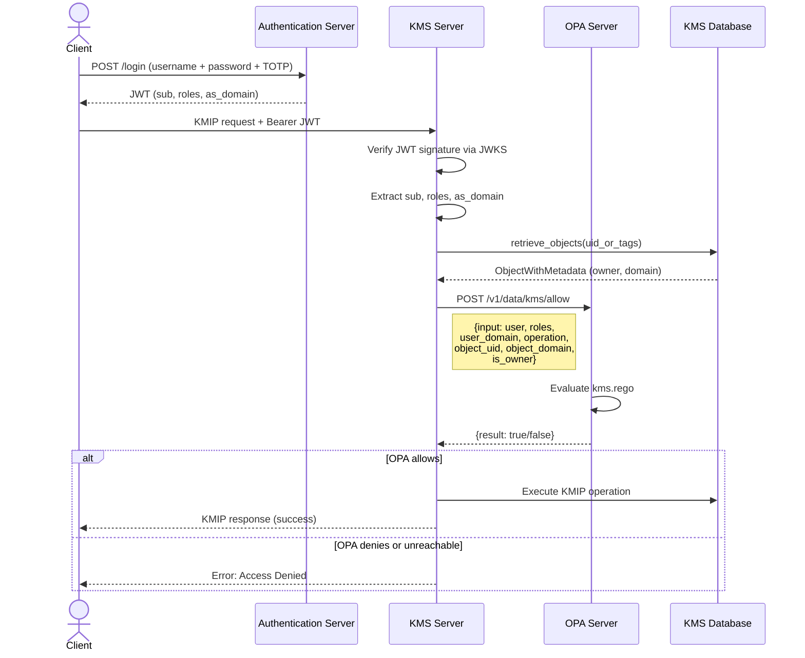
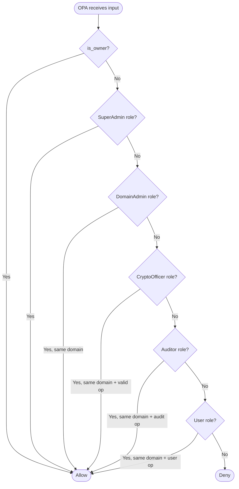
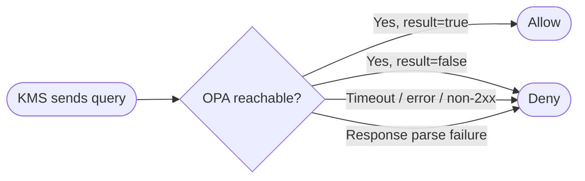

# Mode 2 — Exclusive OPA (RBAC)

When the OPA server is configured with `opa_mode = "exclusive"`, OPA is the **sole
authorization decision maker**. The native KMS permission system (ownership, grants)
is completely bypassed.

```toml
# kms.toml — Mode 2
[opa]
opa_url  = "http://localhost:8181"
opa_mode = "exclusive"
```

| Environment variable | Example |
| -------------------- | ------- |
| `KMS_OPA_URL`        | `http://localhost:8181` |
| `KMS_OPA_MODE`       | `exclusive` |

---

## Prerequisites

- **JWT authentication required** — all users must authenticate via JWT issued by the
  Eviden Authentication Server. The JWT must contain the `roles` and `as_domain` claims.
- **Non-JWT auth is fail-closed** — mTLS and API token users receive `roles: []` in the
  OPA input, causing all role-based rules to evaluate to `false`.
- **Native KMS grants are ignored** — even if a user has explicit grants in the KMS
  database, they are not consulted.

---

## Sequence diagram



---

## OPA decision flowchart

The Rego policy evaluates rules top-to-bottom. The first matching rule grants access:



---

## Fail-closed behaviour



If OPA is configured but unreachable, **all requests are denied**. This is
intentional: a crashed sidecar does not degrade the KMS to open access.

---

## What is NOT evaluated in Mode 2

| Native KMS concept | Evaluated? | Reason |
| ------------------ | :--------: | ------ |
| Object ownership grants | No | OPA handles `is_owner` directly |
| Per-user operation grants | No | Replaced by role-based rules |
| `Get` super-privilege | No | OPA does not implement this shortcut |
| Privileged users (creation rights) | No | OPA controls who can `Create` |
| HSM admin bypass | No | OPA handles all HSM key decisions |
| Ceremony super-admin | No | Native KMS gate is not consulted |

---

## Deploying the OPA sidecar

Minimal start:

```bash
opa run --server --addr :8181 kms.rego
```

Production (hot-reloadable via bundles):

```bash
opa run --server --addr :8181 \
  --set bundles.kms.service=policy-service \
  --set bundles.kms.resource=kms/bundle.tar.gz \
  --set services.policy-service.url=https://policy.example.com
```

The policy can be updated at runtime without restarting KMS or OPA.

---

## Debugging denied requests

Query the debug endpoint to see which rules matched:

```bash
curl -s -X POST http://localhost:8181/v1/data/kms/reason \
  -H "Content-Type: application/json" \
  -d '{
    "input": {
      "user": "alice@acme.com",
      "user_domain": "acme.com",
      "roles": ["CryptoOfficer"],
      "operation": "destroy",
      "object_uid": "key-123",
      "object_domain": "acme.com",
      "is_owner": false
    }
  }'
```

Response: `{"result": ["crypto_officer"]}` — the `CryptoOfficer` role allows `destroy`.

If the response contains `"denied"`, no rule matched.

---

## See also

- [Authorization overview](index.md) — role model, JWT claims, OPA input document
- [Mode 3 — Enforcing](mode3.md) — dual-gate mode (OPA + native KMS)
- Rego policy source: `test_data/opa/kms.rego`
