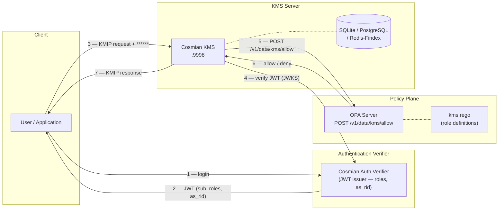
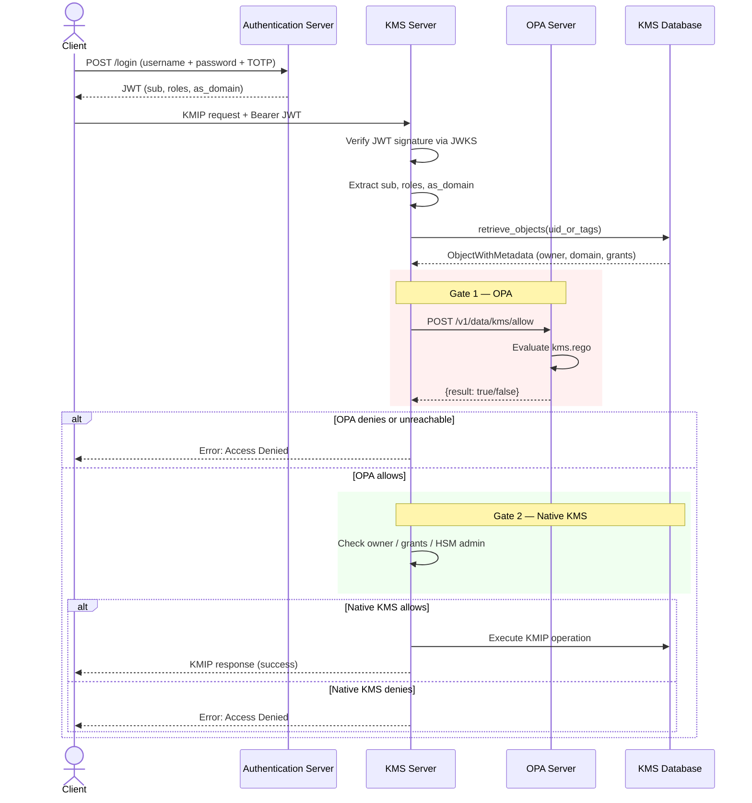
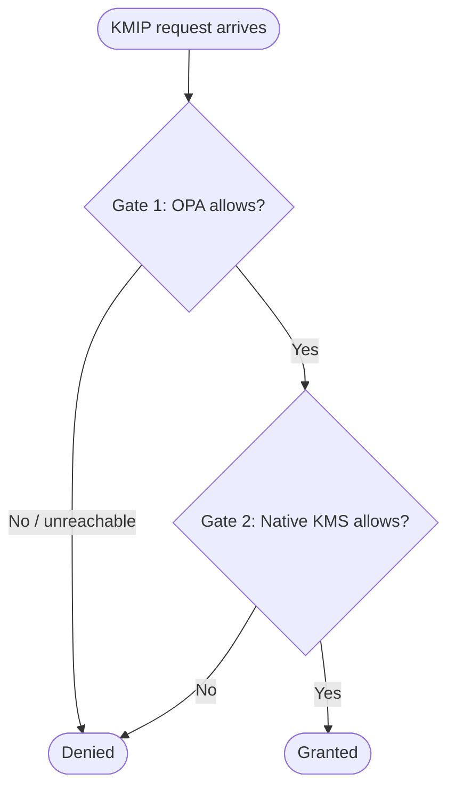

# Mode 3 — Enforcing (OPA + Native KMS)

When the OPA server is configured with `opa_mode = "enforcing"`, **both** authorization
systems must allow the request. OPA acts as the first gate; if it denies, the request
is rejected immediately. If OPA allows, the native KMS permission system runs as a
second gate with **veto power**.

```toml
# kms.toml — Mode 3
[opa]
opa_url  = "http://localhost:8181"
opa_mode = "enforcing"
```

| Environment variable | Example |
| -------------------- | ------- |
| `KMS_OPA_URL`        | `http://localhost:8181` |
| `KMS_OPA_MODE`       | `enforcing` |

→ **[Full setup guide: OPA + Authentication Verifier](opa-authverifier-setup.md)**

---

## Architecture overview



---

## When to use Mode 3

- **Migration path** — you have an existing Mode 1 deployment with fine-grained grants
  and want to layer RBAC guardrails without discarding them.
- **Defence in depth** — role-based rules prevent broad misuse; per-object grants
  enforce least-privilege on individual keys.
- **Compliance** — some standards require both role-based and object-level access
  control to be active simultaneously.

---

## Sequence diagram



---

## Dual-gate decision flowchart



### Gate 1 detail — OPA evaluation

Same as [Mode 2](mode2.md): role hierarchy, domain scoping, owner override.

### Gate 2 detail — Native KMS evaluation

Same as [Mode 1](mode1.md): owner → HSM admin → explicit grant → Get wildcard.

The ceremony super-admin (Shamir split-key) operates exclusively within Gate 2 and is
invisible to OPA.

---

## Interaction scenarios

| OPA decision | Native KMS decision | Final result | Explanation |
| :----------: | :-----------------: | :----------: | ----------- |
| Allow        | Allow (owner)       | **Granted**  | Both gates pass |
| Allow        | Allow (grant)       | **Granted**  | Role allows + explicit grant exists |
| Allow        | Deny                | **Denied**   | Role allows but no object-level permission |
| Deny         | _(not evaluated)_   | **Denied**   | Short-circuit: OPA veto |
| Unreachable  | _(not evaluated)_   | **Denied**   | Fail-closed: OPA down |
| Allow        | Allow (HSM admin)   | **Granted**  | HSM admin passes Gate 2 |
| Allow        | Allow (ceremony SA) | **Granted**  | Ceremony super-admin passes Gate 2 |

---

## Practical example

Alice has `CryptoOfficer` role in domain `acme.com` and was granted `encrypt` on key
`key-123` (also in domain `acme.com`).

```text
Gate 1 (OPA): CryptoOfficer + same domain + "encrypt" in crypto_officer_ops → Allow ✓
Gate 2 (KMS): Alice has explicit "encrypt" grant on key-123 → Allow ✓
Final: Granted
```

Now Alice tries `destroy` on `key-123`:

```text
Gate 1 (OPA): CryptoOfficer + same domain + "destroy" in crypto_officer_ops → Allow ✓
Gate 2 (KMS): Alice has no "destroy" grant and is not owner → Deny ✗
Final: Denied
```

OPA role allows it, but the native KMS gate vetoes because no explicit grant exists.

---

## Comparison with Mode 2

| Aspect | Mode 2 (Exclusive) | Mode 3 (Enforcing) |
| ------ | :----------------: | :----------------: |
| OPA consulted | Yes | Yes |
| Native KMS consulted | No | Yes (second gate) |
| OPA deny = final deny | Yes | Yes |
| Native KMS can veto | N/A | **Yes** |
| Ceremony super-admin | Suspended | Active (in Gate 2) |
| Per-object grants used | No | **Yes** |
| HSM admin bypass | No | **Yes** (in Gate 2) |

---

## See also

- [Authorization overview](index.md) — role model, JWT claims, OPA input document
- [Mode 1 — Native KMS permissions](mode1.md) — details on Gate 2 logic
- [Mode 2 — Exclusive OPA](mode2.md) — details on Gate 1 logic
