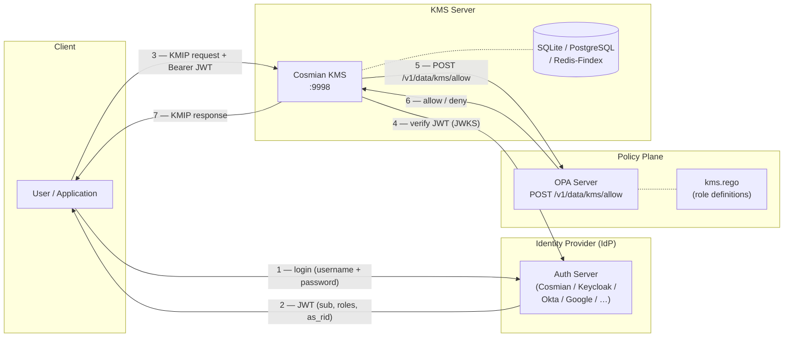

# RBAC, OPA, JWT and Identity Provider Setup

This guide walks through setting up the full Role-Based Access Control (RBAC) stack
for Cosmian KMS: an Identity Provider (IdP) that issues JWTs carrying role claims,
an OPA sidecar that evaluates the Rego policy, and a KMS server wired to both.

---

## Architecture overview



---

## Step 1 — Identity Provider: issuing JWTs with role claims

The KMS reads three JWT claims for RBAC:

| Claim | RFC | Content | Example |
|---|---|---|---|
| `sub` | RFC 7519 §4.1.2 | User identity (forwarded to OPA as `input.user`) | `"alice@acme.com"` |
| `roles` | RFC 9068 §2.2.3.1 | Array of role strings | `["CryptoOfficer"]` |
| `as_rid` | private (RFC 7519 §4.3) | Realm ID = tenant domain (forwarded as `input.user_domain`) | `"acme.com"` |

> The KMS accepts both **`as_rid`** (Cosmian Auth Server) and **`as_domain`** (legacy alias)
> for the domain claim. Third-party IdPs should map their tenant field to `as_rid`.

### Cosmian Authentication Server (recommended)

The Cosmian Auth Server is the reference IdP for this feature. It supports realms
(= domains) and per-user role assignment natively, and emits the `roles` and
`as_rid` claims required by the KMS OPA policy.

#### Build and start

```bash
cd /path/to/authentication   # the authentication workspace root

# Build
cargo build -p auth_server

# Start with the bundled dev configuration (self-signed certs, SQLite, no setup needed)
cargo run -p auth_server -- server/auth_server.dev.toml
```

The server listens on `https://localhost:8443`. On first start it auto-creates:

- Super-admin realm `_` — login: `admin` / `change_me`
- Dev realm `dev-realm` — login: `realm-admin` / `change_me`

The test CA certificate for TLS verification:
```
server/src/tests/certificates/ec/auth.server.cert.pem  (server cert, used by KMS)
server/src/tests/certificates/ec/auth.ca.pem           (CA cert, used by curl)
```

#### Provision a realm and users

The realm `id` becomes the `as_rid` claim in the JWT and the `object_domain` used by
the OPA `same_domain` rule.

```bash
CA=/path/to/authentication/server/src/tests/certificates/ec/auth.ca.pem

# 1 — Login as super-admin (stores session cookie)
curl -s --cacert $CA -c /tmp/auth-admin.txt \
  -X POST "https://localhost:8443/login?realm=_" \
  -u "admin:change_me" \
  -H "Content-Type: application/json" \
  -d '{"public_key_pem":null,"totp_code":null}'

# 2 — Create realm "acme.com"
curl -s --cacert $CA -b /tmp/auth-admin.txt \
  -X POST "https://localhost:8443/admins/realms" \
  -H "Content-Type: application/json" \
  -d '{
    "id": "acme.com",
    "auth_params": {
      "username_password_params": {"allow_expired_passwords": false}
    },
    "session_max_age_seconds": 3600,
    "session_max_stale_age_seconds": 7200
  }'

# 3 — Create a user with role CryptoOfficer
#     Passwords must be hashed: Argon2id(password, salt=base64(SHA-256(username)))
#     Auth server uses argon2 v0.4.1 defaults: m=4096, t=3, p=1
HASH=$(python3 - << 'EOF'
import hashlib, base64
from argon2 import PasswordHasher
username, password = "alice", "alice-pass"
salt = base64.b64encode(hashlib.sha256(username.encode()).digest()).rstrip(b"=")
ph = PasswordHasher(time_cost=3, memory_cost=4096, parallelism=1, hash_len=32)
print(ph.hash(password, salt=base64.b64decode(salt + b"==")))
EOF
)

curl -s --cacert $CA -b /tmp/auth-admin.txt \
  -X POST "https://localhost:8443/realms/acme.com/userpass" \
  -H "Content-Type: application/json" \
  -d "{
    \"realm\": \"acme.com\",
    \"username\": \"alice\",
    \"password\": \"$HASH\",
    \"change_password\": false,
    \"roles\": [\"CryptoOfficer\"],
    \"domain\": \"acme.com\"
  }"
```

Repeat step 3 for each user, adjusting `username`, `password`, `roles`, and optionally
`domain` (defaults to realm `id` if omitted).

#### Obtain a JWT

```bash
JWT=$(curl -s --cacert $CA -D - \
  -X POST "https://localhost:8443/login?realm=acme.com" \
  -u "alice:alice-pass" \
  -H "Content-Type: application/json" \
  -d '{"public_key_pem":null,"totp_code":null}' \
  | grep -i "set-cookie: _ea_=" \
  | sed 's/.*_ea_=\([^;]*\).*/\1/' | tr -d '\r')

echo "JWT: $JWT"
# Inspect claims: echo $JWT | cut -d. -f2 | base64 -d 2>/dev/null | python3 -m json.tool
```

The JWT is a standard ES256-signed token (or the key type configured in
`tls_params`). Its payload contains:

```json
{
  "sub":    "alice",
  "iss":    "cosmian-auth-test",
  "roles":  ["CryptoOfficer"],
  "as_rid": "acme.com",
  "exp":    <unix timestamp>
}
```

#### Configure KMS to trust the auth server

The KMS validates JWTs against the auth server's JWKS endpoint
(`https://<auth-server>/public/jwks`).

```toml
# kms.toml
[idp_auth]
# Format: "issuer,jwks_uri"
# The issuer string must match the `iss` claim in the JWT.
jwt_auth_provider = ["cosmian-auth-test,https://localhost:8443/public/jwks"]

[opa]
opa_url  = "http://localhost:8181"
opa_mode = "enforcing"
```

Because the auth server uses a self-signed certificate, start the KMS with the CA cert
or with `--accept-invalid-certs` (dev only):

```bash
cargo run --features non-fips --bin cosmian_kms -- \
  --database-type sqlite \
  --sqlite-path /tmp/kms-data \
  --jwt-auth-provider "cosmian-auth-test,https://localhost:8443/public/jwks" \
  --opa-url http://localhost:8181 \
  --opa-mode enforcing \
  --accept-invalid-certs
```

#### Auth server REST API summary

| Endpoint | Method | Auth | Description |
|---|---|---|---|
| `POST /login?realm=_` | Basic auth | — | Login as admin, receive `_ea_` session cookie |
| `POST /login?realm=<realm>` | Basic auth | — | Login as user, receive `_ea_` JWT cookie |
| `GET /public/jwks` | — | Public | JWKS endpoint (KMS fetches this to validate JWTs) |
| `GET /public/roles` | — | Public | List of configured role names |
| `POST /admins/realms` | JSON | Admin session | Create a realm |
| `POST /admins` | JSON | Admin session | Create a realm-scoped admin account |
| `POST /realms/<realm>/userpass` | JSON | Admin session | Create a user with roles + domain |
| `DELETE /realms/<realm>/userpass/<username>` | — | Admin session | Delete a user |
| `GET /public/version` | — | Public | Server version |

### Keycloak

1. Create a realm (e.g. `acme`).
2. Add a `roles` claim via a **Mapper** of type *User Attribute* or *User Realm Role*.
3. Add a custom `as_rid` attribute mapper that reads a user attribute `domain`.
4. The JWKS URI is `https://<host>/realms/<realm>/protocol/openid-connect/certs`.

```toml
# kms.toml — KMS side
[idp_auth]
jwt_auth_provider = ["https://keycloak.acme.com/realms/acme,https://keycloak.acme.com/realms/acme/protocol/openid-connect/certs"]
```

### Other OIDC providers (Okta, Auth0, Google)

Any OIDC-compliant provider works as long as it can emit `roles` and `as_rid` (or `as_domain`) in the
JWT. For providers that do not support custom claims natively, use a token transformation
step (e.g. Okta hooks, Auth0 rules/actions).

---

## Step 2 — OPA server: deploy and load the Rego policy

### Docker Compose (recommended for production)

```yaml
# docker-compose.yml
services:
  opa:
    image: openpolicyagent/opa:edge-static-debug
    ports:
      - "8181:8181"
    volumes:
      - ./test_data/opa/kms.rego:/policies/kms.rego:ro
    command:
      - run
      - --server
      - --log-level=info
      - --addr=0.0.0.0:8181
      - /policies/kms.rego
```

```bash
docker compose up -d opa
```

### Standalone Docker

```bash
docker run -d --name opa \
  -p 8181:8181 \
  -v "$(pwd)/test_data/opa/kms.rego:/policies/kms.rego:ro" \
  openpolicyagent/opa:edge-static-debug \
  run --server --log-level=info --addr=0.0.0.0:8181 /policies/kms.rego
```

### Verify OPA is ready

```bash
# Health check
curl http://localhost:8181/health

# Test a CryptoOfficer create request — expect {"result":true}
curl -s -X POST http://localhost:8181/v1/data/kms/allow \
  -H "Content-Type: application/json" \
  -d '{
    "input": {
      "user": "alice@acme.com",
      "user_domain": "acme.com",
      "roles": ["CryptoOfficer"],
      "operation": "create",
      "object_uid": "*",
      "object_domain": "acme.com",
      "is_owner": false
    }
  }'
```

---

## Step 3 — KMS server: wire JWT auth and OPA

### kms.toml

```toml
[http]
hostname = "0.0.0.0"
port     = 9998

[db]
database_type = "sqlite"
sqlite_path   = "/var/lib/kms/data"

# ── Identity Provider ─────────────────────────────────────────────────────
[idp_auth]
# Format: "issuer,jwks_uri,audience1,audience2,..."
# For Cosmian Auth Server: issuer = "cosmian-auth-test", JWKS = /public/jwks
jwt_auth_provider = ["cosmian-auth-test,https://localhost:8443/public/jwks"]
# For Keycloak:
# jwt_auth_provider = ["https://keycloak.acme.com/realms/acme"]

# ── OPA sidecar ──────────────────────────────────────────────────────────
[opa]
opa_url  = "http://localhost:8181"  # or "http://opa:8181" in Docker Compose
opa_mode = "enforcing"              # "exclusive" or "enforcing"
```

### Environment variables (alternative to kms.toml)

| Variable | Example | Description |
|---|---|---|
| `KMS_JWT_AUTH_PROVIDER` | `https://auth.acme.com` | IdP issuer (+ optional JWKS URI and audiences) |
| `KMS_OPA_URL` | `http://localhost:8181` | OPA base URL |
| `KMS_OPA_MODE` | `enforcing` | `exclusive` or `enforcing` |

### cargo run (development)

```bash
RUST_LOG="cosmian_kms_server=debug" \
cargo run --features non-fips --bin cosmian_kms -- \
  --database-type sqlite \
  --sqlite-path /tmp/kms-data \
  --jwt-auth-provider "cosmian-auth-test,https://localhost:8443/public/jwks" \
  --opa-url http://localhost:8181 \
  --opa-mode enforcing \
  --accept-invalid-certs
```

---

## Step 4 — Obtain a JWT and call the KMS

### With the Cosmian Authentication Server

The Cosmian Auth Server issues JWTs via a direct login API (cookie-based, not OAuth2
PKCE). The `ckms login` command **cannot** be used with it. Instead, extract the JWT
from the `_ea_` cookie and place it in `ckms.toml` directly.

```bash
CA=/path/to/authentication/server/src/tests/certificates/ec/auth.ca.pem

# Login as alice in realm acme.com — JWT comes back as the _ea_ cookie
JWT=$(curl -s --cacert $CA -D - \
  -X POST "https://localhost:8443/login?realm=acme.com" \
  -u "alice:alice-pass" \
  -H "Content-Type: application/json" \
  -d '{"public_key_pem":null,"totp_code":null}' \
  | grep -i "set-cookie: _ea_=" \
  | sed 's/.*_ea_=\([^;]*\).*/\1/' | tr -d '\r')

# Inspect the JWT claims (optional)
echo $JWT | cut -d. -f2 | base64 -d 2>/dev/null | python3 -m json.tool

# Write to ckms.toml
cat > /tmp/ckms-alice.toml << EOF
[http_config]
server_url           = "http://127.0.0.1:9998"
accept_invalid_certs = false
access_token         = "${JWT}"
EOF

# Use it
cargo run --bin ckms -- -c /tmp/ckms-alice.toml sym keys create -t test-key
```

### With a standard OIDC provider (Keycloak, Okta, …): `ckms login`

Standard OIDC providers support OAuth2 PKCE. Configure `ckms.toml` with OAuth2
settings and use `ckms login` to obtain the token via a browser flow:

```toml
# ckms.toml
[http_config]
server_url = "http://localhost:9998"

[http_config.oauth2_conf]
client_id     = "ckms-client"
client_secret = ""           # empty for PKCE-only flows
authorize_url = "https://keycloak.acme.com/realms/acme/protocol/openid-connect/auth"
token_url     = "https://keycloak.acme.com/realms/acme/protocol/openid-connect/token"
scopes        = ["openid", "email"]
```

```bash
ckms -c ckms.toml login   # opens browser → saves token to ckms.toml
ckms -c ckms.toml sym keys create
ckms -c ckms.toml logout
```

### Development: unsigned JWT (no IdP needed, requires `--features insecure`)

The KMS server must be running with `--features insecure` (skips JWT signature and
expiry validation). **Never use this in production.**

```bash
# Build a test JWT for a CryptoOfficer in domain acme.com
PAYLOAD=$(echo -n '{"sub":"alice","as_rid":"acme.com","roles":["CryptoOfficer"],"iss":"test","exp":9999999999}' \
  | base64 -w0 | tr '+/' '-_' | tr -d '=')
JWT="eyJhbGciOiJub25lIn0.${PAYLOAD}."

# Write it to a ckms config
cat > /tmp/ckms-officer.toml << EOF
[http_config]
server_url = "http://127.0.0.1:9998"
access_token = "${JWT}"
EOF

# Create a key as CryptoOfficer
cargo run --bin ckms -- -c /tmp/ckms-officer.toml sym keys create -t test-key

# Create a JWT for a User role
PAYLOAD=$(echo -n '{"sub":"bob","as_rid":"acme.com","roles":["User"],"iss":"test","exp":9999999999}' \
  | base64 -w0 | tr '+/' '-_' | tr -d '=')
JWT_USER="eyJhbGciOiJub25lIn0.${PAYLOAD}."
cat > /tmp/ckms-user.toml << EOF
[http_config]
server_url = "http://127.0.0.1:9998"
access_token = "${JWT_USER}"
EOF

# Locate the key (User can read attributes) — allowed
cargo run --bin ckms -- -c /tmp/ckms-user.toml locate --tag test-key

# Destroy the key as User — denied by OPA (destroy ∉ user_ops)
cargo run --bin ckms -- -c /tmp/ckms-user.toml sym keys destroy --key-id <uid>
```

### Via the `-H` flag (one-off, no config file)

```bash
cargo run --bin ckms -- \
  --url http://127.0.0.1:9998 \
  -H "Authorization: Bearer ${JWT}" \
  sym keys create -a aes
```

---

## Role reference

| Role | Domain scope | Allowed KMIP operations |
|---|---|---|
| `SuperAdmin` | All domains | All |
| `DomainAdmin` | Own domain | All |
| `CryptoOfficer` | Own domain | `create`, `create_key_pair`, `import`, `get`, `export`, `locate`, `get_attributes`, `set_attribute`, `modify_attribute`, `delete_attribute`, `add_attribute`, `activate`, `revoke`, `archive`, `recover`, `destroy`, `rekey`, `rekey_key_pair` |
| `Auditor` | Own domain | `locate`, `get`, `get_attributes`, `list_access`, `query_access`, `mac_verify` |
| `User` | Own domain | `encrypt`, `decrypt`, `sign`, `verify`, `mac`, `mac_verify`, `derive_key`, `locate`, `get_attributes` |

Object owners always have full access regardless of role.

---

## OPA input document (reference)

The KMS sends this JSON to `POST /v1/data/kms/allow` on every request:

```json
{
  "input": {
    "user":          "alice@acme.com",
    "user_domain":   "acme.com",
    "roles":         ["CryptoOfficer"],
    "operation":     "create",
    "object_uid":    "*",
    "object_domain": "acme.com",
    "is_owner":      false
  }
}
```

| Field | Source | Notes |
|---|---|---|
| `user` | JWT `sub` | Authenticated identity |
| `user_domain` | JWT `as_rid` (or legacy `as_domain`) | Empty `""` for non-JWT auth |
| `roles` | JWT `roles` | Empty `[]` for non-JWT auth → fail-closed |
| `operation` | KMIP operation tag | Lowercase snake_case (e.g. `"create"`, `"get_attributes"`) |
| `object_uid` | Target object UID | `"*"` for object-less operations |
| `object_domain` | `objects.domain` column | Equals `user_domain` for object-less operations |
| `is_owner` | `user == object.owner` | Always grants access regardless of role |

---

## Debugging access denials

### Query the OPA reason endpoint

```bash
curl -s -X POST http://localhost:8181/v1/data/kms/reasons \
  -H "Content-Type: application/json" \
  -d '{
    "input": {
      "user": "alice@acme.com",
      "user_domain": "acme.com",
      "roles": ["CryptoOfficer"],
      "operation": "destroy",
      "object_uid": "key-123",
      "object_domain": "acme.com",
      "is_owner": false
    }
  }'
# {"result":["crypto_officer"]}  → CryptoOfficer allows destroy
# {"result":["denied"]}          → no rule matched
```

### Enable trace logging on the KMS

```bash
RUST_LOG="cosmian_kms_server=trace" cargo run --bin cosmian_kms -- ...
```

Look for:
- `cosmian_kms_server::middlewares::ensure_auth` — JWT extraction and role/domain parsing
- `cosmian_kms_server::core::retrieve_object_utils` — OPA input document and decision
- `cosmian_kms_server::core::opa::client` — HTTP round-trip timing and result

### Enable OPA decision logging

Add `--log-level=info` to OPA's startup flags (default in the Docker Compose service).
OPA prints a structured JSON decision log for every query.

---

## Common problems

| Symptom | Likely cause | Fix |
|---|---|---|
| `401 Unauthorized` | JWT missing or signature invalid | Check KMS `--jwt-auth-provider` issuer and JWKS URI |
| `403 Forbidden` — OPA deny | Role not in JWT or cross-domain | Check `roles` claim; verify `as_rid` realm matches `object_domain` |
| `403 Forbidden` — OPA unreachable | OPA not running or wrong port | Check `KMS_OPA_URL`; run `curl http://localhost:8181/health` |
| `403 Forbidden` — Native KMS deny | Mode 3: no DB grant exists | Add grant with `ckms access-rights grant`, or switch to Mode 2 |
| Empty `roles: []` in OPA input | Using mTLS or API-token auth | Roles only come from JWT; switch auth method or write a custom Rego rule |
| `roles` claim not in JWT | IdP not configured to emit it | Add a `roles` claim mapper in Keycloak / Auth0 / Okta |

---

## See also

- [Authorization overview and mode comparison](index.md)
- [Mode 2 — Exclusive OPA](mode2.md)
- [Mode 3 — Enforcing (OPA + KMS)](mode3.md)
- [Authentication methods](../authentication.md)
- [ADR-0003: RBAC Authorization Model with OPA Sidecar](../../adr/0003-rbac-opa-authorization.md)
- Rego policy source: `test_data/opa/kms.rego`
