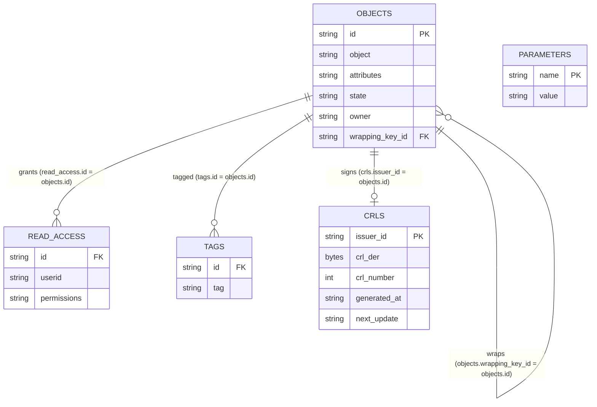

# Database tables

This page describes the tables used by the KMS server to persist its data, and the links between them.
It applies to the SQL backends: **SQLite**, **PostgreSQL**, **MySQL**, **MariaDB**, and **Percona XtraDB Cluster**.

The Redis-with-Findex backend does not use relational tables; see [Redis with Findex](./redis.md).

## Overview

The KMS schema is small and consists of six tables:

| Table | Purpose |
| ----- | ------- |
| `parameters` | Internal key/value store (migration state, database version, one-time markers) |
| `objects` | KMIP objects (keys, certificates, secrets, and so on) |
| `read_access` | Per-user read permissions granted on objects |
| `tags` | Tags attached to objects, used by `Locate` |
| `crypto_officer_activations` | Records of the Crypto Officer activation ceremony |
| `crls` | Most recently signed CRL per issuer CA (RFC 5280 §5), for CDP serving after restart |

The links between tables are **logical** relationships (enforced by the application, not by SQL foreign-key constraints).

## `objects`

The central table. One row per KMIP object.

| Column | Type | Description |
| ------ | ---- | ----------- |
| `id` | `VARCHAR(128)` | Primary key. The object's unique identifier (UID). |
| `object` | `VARCHAR` (PG/SQLite) / `LONGTEXT` (MySQL) | The serialized KMIP object (JSON). |
| `attributes` | `jsonb` (PG) / `json` (MySQL) | The KMIP attributes attached to the object. |
| `state` | `VARCHAR(32)` | The KMIP lifecycle state of the object (for example `Active`, `Destroyed`). |
| `owner` | `VARCHAR(255)` | The user identifier of the object's owner. |
| `wrapping_key_id` | `VARCHAR(128)` | The UID of the key that wraps this object. Self-reference to `objects.id`. |

The following secondary indexes are created on `objects`:

| Index | Columns |
| ----- | ------- |
| `idx_objects_owner` | `owner` |
| `idx_objects_state` | `state` |
| `idx_objects_wrapping_key_id` | `wrapping_key_id` |

## `read_access`

Stores the operations that a given user is allowed to perform on a given object.

| Column | Type | Description |
| ------ | ---- | ----------- |
| `id` | `VARCHAR(128)` | The object UID. References `objects.id`. |
| `userid` | `VARCHAR(255)` | The user identifier granted access. |
| `permissions` | `json` | The operations granted to the user, serialized as JSON. |

The pair (`id`, `userid`) is unique.
In PostgreSQL and SQLite it is declared `UNIQUE (id, userid)`; in MySQL (since 5.13.0) it is the composite `PRIMARY KEY (id, userid)`.

A secondary index `idx_read_access_userid` is created on `userid`.

## `tags`

Stores the tags attached to objects. Tags are used to locate objects by tag.

| Column | Type | Description |
| ------ | ---- | ----------- |
| `id` | `VARCHAR(128)` | The object UID. References `objects.id`. |
| `tag` | `VARCHAR(255)` | A single tag. |

The pair (`id`, `tag`) is unique.
In PostgreSQL and SQLite it is declared `UNIQUE (id, tag)`; in MySQL (since 5.13.0) it is the composite `PRIMARY KEY (id, tag)`.

## `parameters`

A generic key/value store used internally by the KMS for database metadata.

| Column | Type | Description |
| ------ | ---- | ----------- |
| `name` | `VARCHAR(128)` | Primary key. The parameter name. |
| `value` | `VARCHAR(256)` | The parameter value. |

Known parameters:

| `name` | Meaning |
| ------ | ------- |
| `db_state` | The database migration state: `ready` or `upgrading`. |
| `db_version` | The version of the KMS software that last ran against this database. |
| `wrapping_key_id_backfilled` | A one-time marker recording that the `objects.wrapping_key_id` backfill has completed. |

## `crypto_officer_activations`

Records the Crypto Officer activation ceremony.
One row is added each time the Crypto Officer role is activated via a split-key ceremony.

| Column | Type | Description |
| ------ | ---- | ----------- |
| `activated_at` | `TIMESTAMP` | When the activation was created (defaults to `CURRENT_TIMESTAMP`). |
| `sealed_record` | `TEXT` | The sealed record produced by the activation ceremony (AES-256-GCM encrypted). |
| `revoked_at` | `TIMESTAMP` | When the activation was revoked, or `NULL` while still active. |
| `revoked_by` | `VARCHAR(255)` | The user who revoked the activation. |

In MySQL, an additional `id INTEGER PRIMARY KEY AUTO_INCREMENT` column is added.
In PostgreSQL and SQLite there is no explicit `id` column; the active activation is the latest row where `revoked_at IS NULL`.

## `crls`

Stores the most recently generated CRL for each issuer CA, persisted so that the
public CDP endpoint (`GET /public/certificates/{issuer_id}/crl`) can serve the
last signed CRL immediately after a server restart without requiring a manual
`generate-crl` call.

One row per CA certificate. The row is replaced atomically on every CRL regeneration
(upsert on `issuer_id`).

| Column | Type | Description |
| ------ | ---- | ----------- |
| `issuer_id` | `VARCHAR(128)` | Primary key. The UID of the issuer CA certificate in the `objects` table. |
| `crl_der` | `BYTEA` (PG) / `BLOB` (SQLite) / `LONGBLOB` (MySQL) | DER-encoded signed CRL bytes. |
| `crl_number` | `BIGINT` | Monotonically increasing CRL sequence number (RFC 5280 §5.2.3). |
| `generated_at` | `VARCHAR(32)` | ISO-8601 UTC timestamp of when this CRL was signed. |
| `next_update` | `VARCHAR(32)` | ISO-8601 UTC timestamp of CRL expiry (= `generated_at` + validity days). |

The Redis-with-Findex backend stores each CRL as a JSON value under the key
`crl:<issuer_id>`.

## Links between tables

- `objects.id` is referenced by `read_access.id` and `tags.id`: one object can have many access rows and many tags.
- `objects.wrapping_key_id` points to `objects.id`: a wrapping key is itself an object, and many objects can be wrapped by the same key.
- `crls.issuer_id` logically references `objects.id` (the CA certificate): one CA has at most one current CRL row.
- `objects.owner` and `read_access.userid` hold user identifiers.
  Users are authenticated identities and are **not** stored in a dedicated table.
- `parameters` and `crypto_officer_activations` are standalone and do not reference `objects`.

These relationships are managed by the application layer (`crate/server_database/`) rather than database foreign-key constraints.
