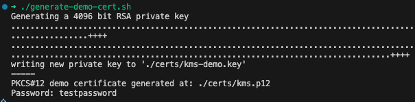
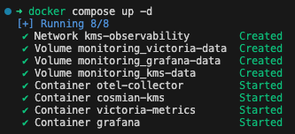
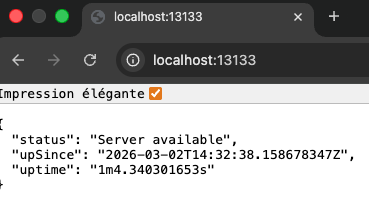
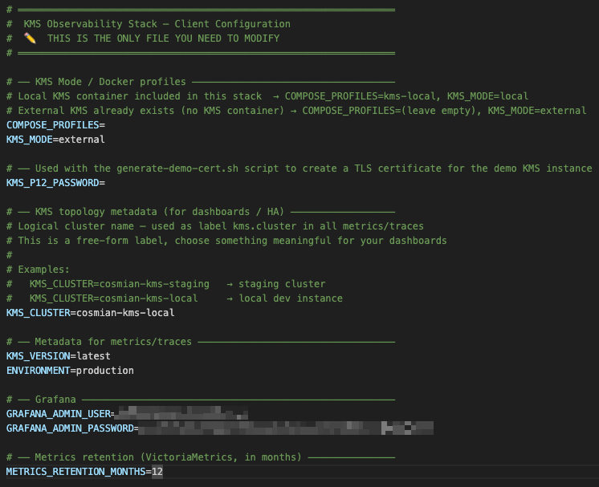
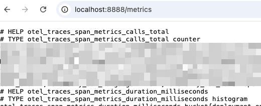
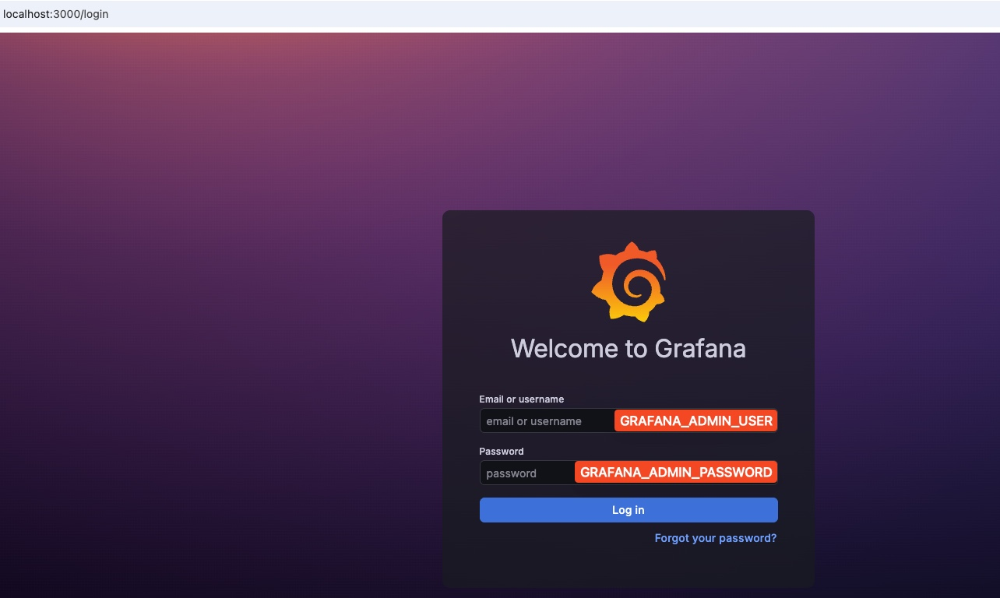
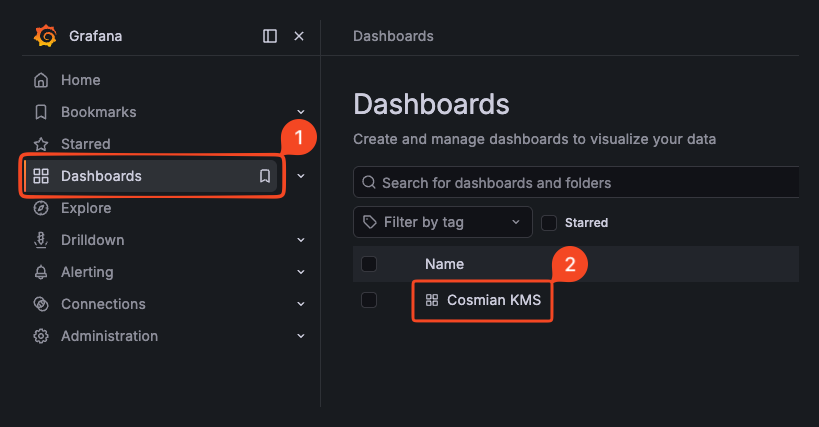
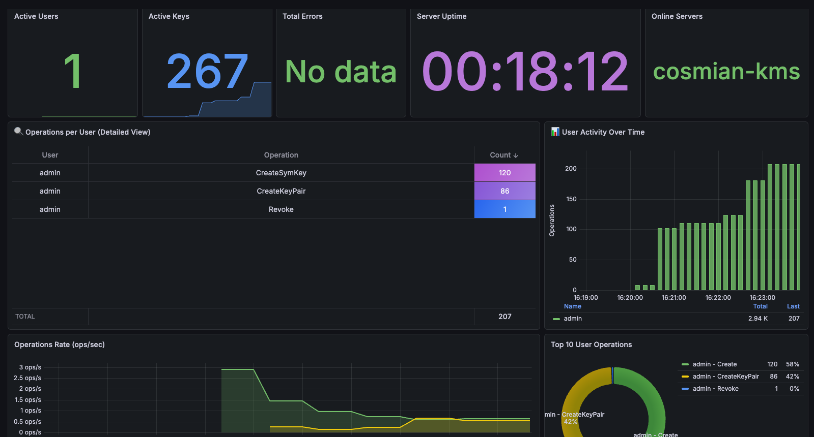

# Monitoring Stack — Setup Guide

> This guide walks you through deploying the KMS observability stack step by step.
> For a full reference of OTLP options and pipeline internals, see → [KMS Telemetry](./logging.md)

---

## Table of contents

1. [Prerequisites](#prerequisites)
2. [Local mode — KMS included](#local-mode--kms-included)
3. [External mode — existing KMS](#external-mode--existing-kms)
4. [Explore Grafana](#explore-grafana)
5. [Troubleshooting](#troubleshooting)

---

## Prerequisites

Before getting started, make sure the following tools are installed on your machine.

### Required

- **[Docker Engine](https://docs.docker.com/get-docker/) ≥ 20.10**
  Compose profiles (`COMPOSE_PROFILES`) require Docker Compose **v2** and Docker Engine **20.10+**.
  Verify your version:

  ```bash
  docker --version
  docker compose version
  ```

- **[Docker Compose V2](https://docs.docker.com/compose/)** (included in Docker Desktop 3.4+)
  The stack uses the `docker compose` command (with a space), not the legacy `docker-compose`.

### Local mode only

- **`openssl`** — used by `generate-demo-cert.sh` to generate the demo TLS certificate.
  Verify it is available:

  ```bash
  openssl version
  ```

  > On macOS it is pre-installed. On Linux: `apt install openssl` or `dnf install openssl`.

### External mode only

- Your existing KMS must be configured to export telemetry via OTLP to the collector:

  ```bash
  # gRPC (recommended)
  KMS_OTLP_URL=http://<collector-host>:4317
  # or HTTP
  KMS_OTLP_URL=http://<collector-host>:4318
  ```

  See → [KMS Telemetry — OTLP configuration](./logging.md#otlp-telemetry)

### Ports availability

The following ports must be free on the host before starting the stack:

| Port | Service |
|---|---|
| `3000` | Grafana |
| `4317` | OTel Collector (gRPC) |
| `4318` | OTel Collector (HTTP) |
| `8428` | VictoriaMetrics |
| `9998` | KMS *(local mode only)* |

---

## Local mode — KMS included

In this mode, the full stack starts together: KMS, OTel Collector, VictoriaMetrics, and Grafana.
Use this mode for local development or to evaluate the stack end-to-end.

### 1. Configure `.env`

Open the `.env` file — this is the **only file you need to edit**.

Make sure the following values are set:

```ini
# ── KMS Mode / Docker profiles ───────────────────────────────────
COMPOSE_PROFILES=kms-local
KMS_MODE=local

# ── TLS certificate password (used by generate-demo-cert.sh) ─────
KMS_P12_PASSWORD=testpassword

# ── KMS topology metadata ────────────────────────────────────────
KMS_CLUSTER=cosmian-kms-local

# ── Metadata for metrics/traces ──────────────────────────────────
KMS_VERSION=latest
ENVIRONMENT=demo

# ── Grafana ──────────────────────────────────────────────────────
GRAFANA_ADMIN_USER=demo
GRAFANA_ADMIN_PASSWORD=demo

# ── Metrics retention (VictoriaMetrics, in months) ───────────────
METRICS_RETENTION_MONTHS=12
```

> ✏️ **Screenshot placeholder** — `.env` file open in editor, `COMPOSE_PROFILES` and `KMS_MODE` highlighted.

### 2. Generate the demo TLS certificate

The KMS container requires a PKCS#12 certificate to serve its API over TLS.
The provided script generates a self-signed certificate valid for 10 years,
using the password defined in `KMS_P12_PASSWORD`:

```bash
bash generate-demo-cert.sh
```

Expected output:

```text
Generating a 4096 bit RSA private key
.............................................++++
.............................................++++
.............................................++++
writing new private key to './certs/kms-demo.key'
-----
PKCS#12 demo certificate generated at: ./certs/kms.p12
Password: testpassword
```



> ⚠️ This certificate is for **demo purposes only**. Do not use it in production.

### 3. Start the stack

```bash
docker compose up -d
```

Docker will pull the required images and start all containers.
On first run, this may take a minute depending on your network speed.



### 4. Verify the stack is healthy

```bash
docker compose ps
```

All containers should show `Up` or `Up (healthy)`:

```text
NAME                STATUS
kms                 Up (healthy)
otel-collector      Up
victoria-metrics    Up
grafana             Up (healthy)
```

You can also check the OTel Collector health endpoint:

```bash
curl http://localhost:13133
```

Expected response: `{"status":"Server available"}`



---

## External mode — existing KMS

Use this mode when you already have a running KMS instance and only want to attach
the observability stack to it.

### 1. Configure `.env`

Only a few lines change compared to local mode:

```diff
-COMPOSE_PROFILES=kms-local
-KMS_MODE=local
+COMPOSE_PROFILES=
+KMS_MODE=external

-# KMS_P12_PASSWORD is not needed in external mode
-KMS_P12_PASSWORD=testpassword

 KMS_CLUSTER=cosmian-kms-local
 KMS_VERSION=latest
-ENVIRONMENT=demo
+ENVIRONMENT=production

 GRAFANA_ADMIN_USER=demo
 GRAFANA_ADMIN_PASSWORD=demo
 METRICS_RETENTION_MONTHS=12
```



### 2. Point your KMS to the collector

On your existing KMS, enable OTLP export toward the collector host:

```bash
# via environment variable
KMS_OTLP_URL=http://<collector-host>:4317

# or via CLI argument
./cosmian_kms_server --otlp http://<collector-host>:4317 --enable-metering
```

> If the KMS runs on the same machine as the stack, use `http://localhost:4317`.

### 3. Start the stack (without KMS)

```bash
docker compose up -d
```

With `COMPOSE_PROFILES` left empty, Docker Compose will start only
OTel Collector, VictoriaMetrics, and Grafana — the KMS container is skipped.

### 4. Verify the stack is healthy

```bash
docker compose ps
```

Expected output (no `kms` container):

```text
NAME                STATUS
otel-collector      Up
victoria-metrics    Up
grafana             Up (healthy)
```

Verify the collector is receiving data from your KMS:

```bash
# Check that otelcol_receiver_accepted_spans is incrementing
curl -s http://localhost:8888/metrics | grep otelcol_receiver_accepted_spans
```

Or



---

## Explore Grafana

Once the stack is running, open Grafana in your browser:

```text
http://localhost:3000
```

Login with:

| Field | Value |
|---|---|
| Username | value of `GRAFANA_ADMIN_USER` in `.env` (default: `demo`) |
| Password | value of `GRAFANA_ADMIN_PASSWORD` in `.env` (default: `demo`) |



Pre-provisioned dashboards are available under **Dashboards → Browse**:



After few seconds metrics will be available



---

## Troubleshooting

### Containers not starting

```bash
docker compose logs -f otel-collector
docker compose logs -f kms          # local mode only
```

### No data in Grafana dashboards

1. Confirm the OTel Collector is up:

   ```bash
   curl http://localhost:13133
   ```

2. Confirm VictoriaMetrics is receiving data:

   ```bash
   curl http://localhost:8428/health
   ```

3. Check that your KMS is sending OTLP — look for incoming spans in collector logs:

   ```bash
   docker compose logs otel-collector | grep "traces"
   ```

### KMS container fails to start (local mode)

Verify the certificate was generated:

```bash
ls -la .certs/kms.p12
```

If missing, re-run:

```bash
bash generate-demo-cert.sh
```

### Port conflict

If a port is already in use, identify the process:

```bash
# macOS / Linux
lsof -i :<port>

# Windows
netstat -ano | findstr :<port>
```

Then either stop the conflicting process or edit the port mapping in `docker-compose.yml`.

---

> For a complete reference of all OTLP options, log levels, and pipeline internals,
> see → [KMS Telemetry](./logging.md)
