# Object Cache and Unwrapped Cache

The KMS server uses two in-memory caches backed by
[`moka::future::Cache`](https://docs.rs/moka/latest/moka/future/struct.Cache.html),
a lock-free concurrent hash map. Both caches use sharding so multiple
Actix-web worker threads can read simultaneously without serialization.

---

## Architecture overview

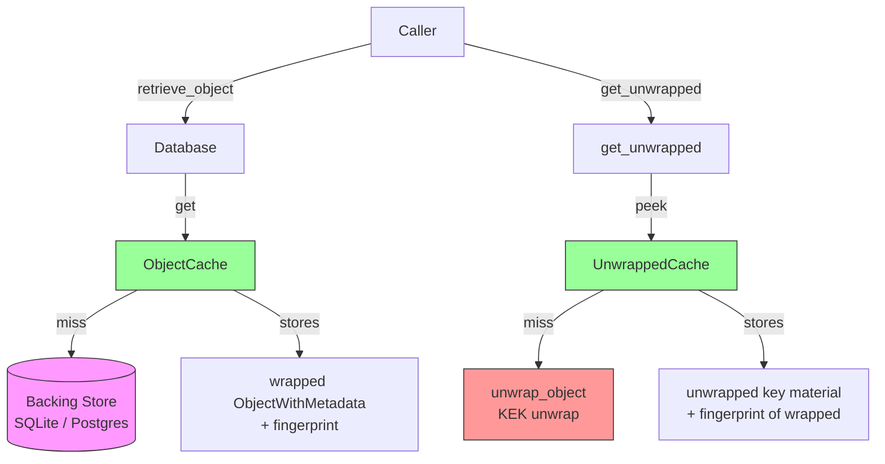

| Cache | Key | Value | Miss path |
|---|---|---|---|
| **ObjectCache** | UID string | `Arc<ObjectWithMetadata>` (wrapped) + fingerprint | DB fetch → insert → return |
| **UnwrappedCache** | UID string | unwrapped `Object` + fingerprint of wrapped | Crypto unwrap → insert → return |

---

## ObjectCache

**Source:** `crate/server_database/src/core/object_cache.rs`

Caches full `ObjectWithMetadata` as read from the database to eliminate repeated
DB round-trips on the hot path.

### Public API

| Method | Returns | Description |
|---|---|---|
| `get(uid)` | `Option<Arc<ObjectWithMetadata>>` | Lock-free lookup. Returns cheap `Arc` clone. |
| `insert(uid, owm)` | `DbResult<()>` | Store with fingerprint of `owm.object()`. |
| `insert_arc(uid, arc_owm)` | `DbResult<()>` | Store from existing `Arc` (saves one allocation). |
| `invalidate(uid)` | — | Remove entry. |
| `validate_cache(uid, current)` | `DbResult<()>` | Compare fingerprints; invalidate on mismatch. |

### Callers

- `Database::retrieve_object()` — `get()` on hot path, `insert()` on miss
- `Database::retrieve_object_arc()` — `get()`, `insert_arc()` on miss
- `Database::update_object()` — `invalidate()` on write
- `Database::validate_cache()` — `validate_cache()` after forced re-fetch

### Scenarios

#### S1 — Cold start (first access)

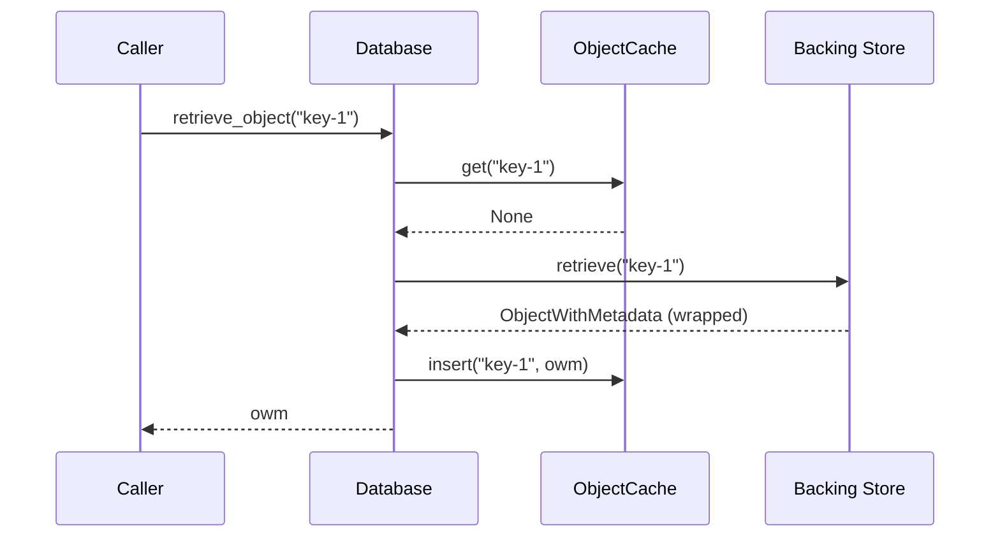

#### S2 — Hot path (cache hit)

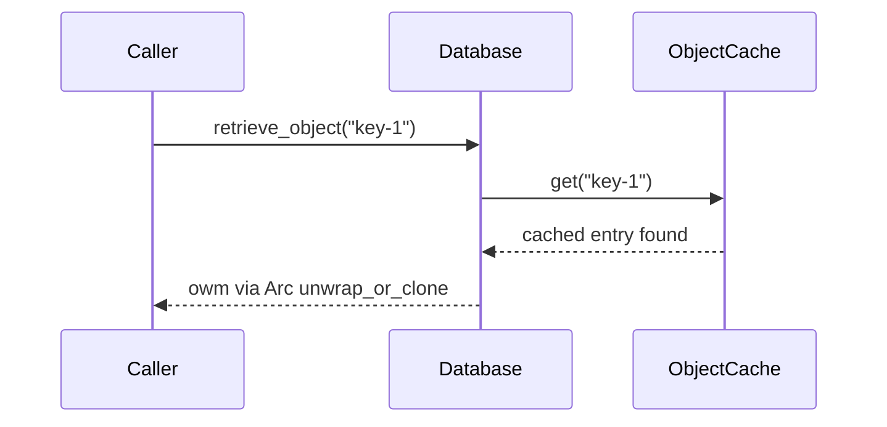

#### S3 — retrieve_object_arc (zero-copy Arc path)

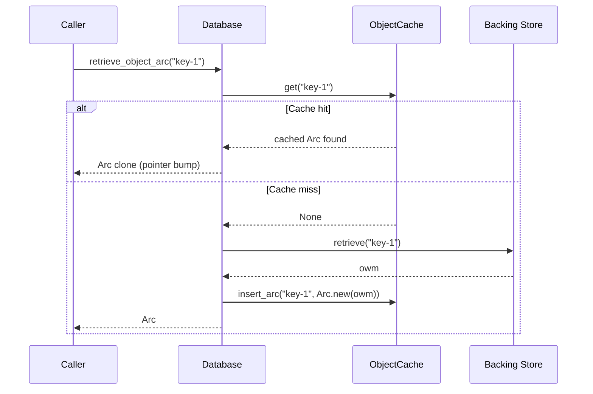

#### S4 — Out-of-band mutation detected

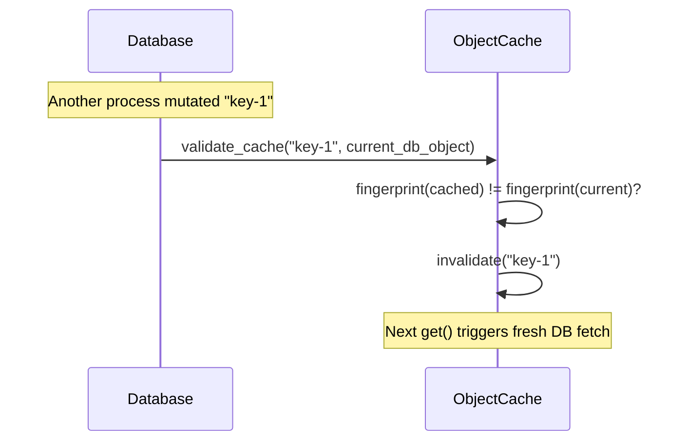

#### S5 — Object update invalidates cache

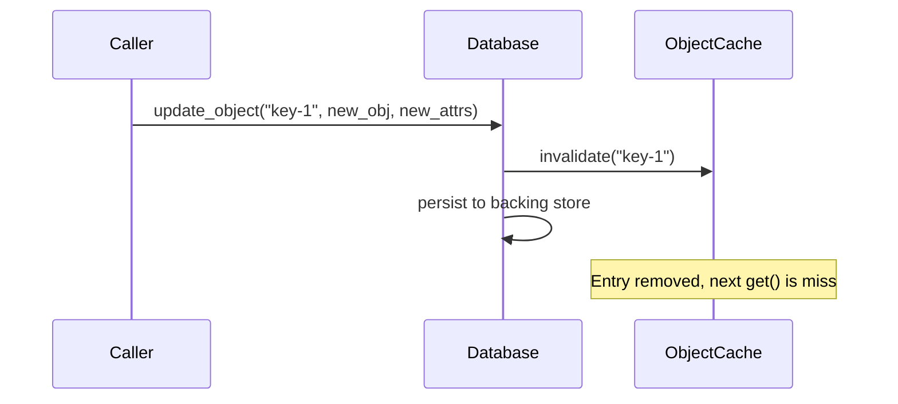

#### S6 — Eviction (automatic)

moka eviction requires no explicit call:

| Policy | Trigger | Effect |
|---|---|---|
| LRU | `max_capacity` exceeded | Least-recently-used entry evicted |
| TTL | `time_to_idle` elapsed without access | Entry evicted |

---

## UnwrappedCache

**Source:** `crate/server_database/src/core/unwrapped_cache.rs`

Caches unwrapped key material to avoid repeated KEK-unwrap cryptographic operations.
The fingerprint of the **wrapped** object is stored alongside the unwrapped payload
so stale entries (after key re-wrapping or KEK rotation) are silently rejected.

### Public API

| Method | Returns | Description |
|---|---|---|
| `peek(uid, wrapped)` | `DbResult<Option<Object>>` | Returns unwrapped object if fingerprint matches. |
| `insert(uid, wrapped, unwrapped)` | `DbResult<()>` | Stores unwrapped with wrapped fingerprint. |
| `clear_cache(uid)` | — | Removes entry. |
| `validate_cache(uid, object)` | `DbResult<()>` | Fingerprint check; invalidate on mismatch. |

**Security guard:** `insert` returns `Err` if `wrapped == unwrapped` (defense-in-depth
against plaintext-persistence bugs).

### Callers

- `KMS::get_unwrapped()` — `peek()` + `insert()` on miss
- KMIP ReKey / ReKeyKeyPair — `clear_cache()` after rotation
- `Database::validate_cache()` chain — `validate_cache()` for defense-in-depth

### Scenarios

#### U1 — First unwrap (cold)

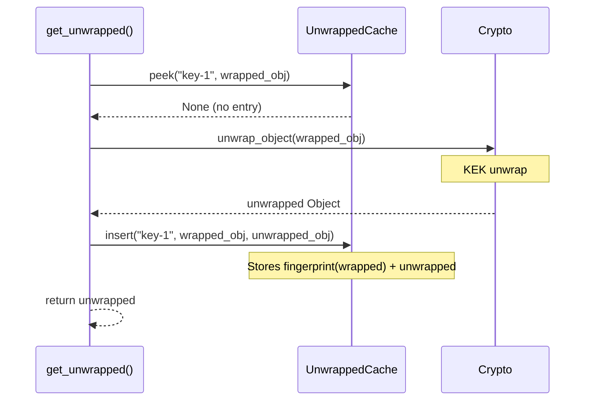

#### U2 — Subsequent unwrap (hot, zero crypto)

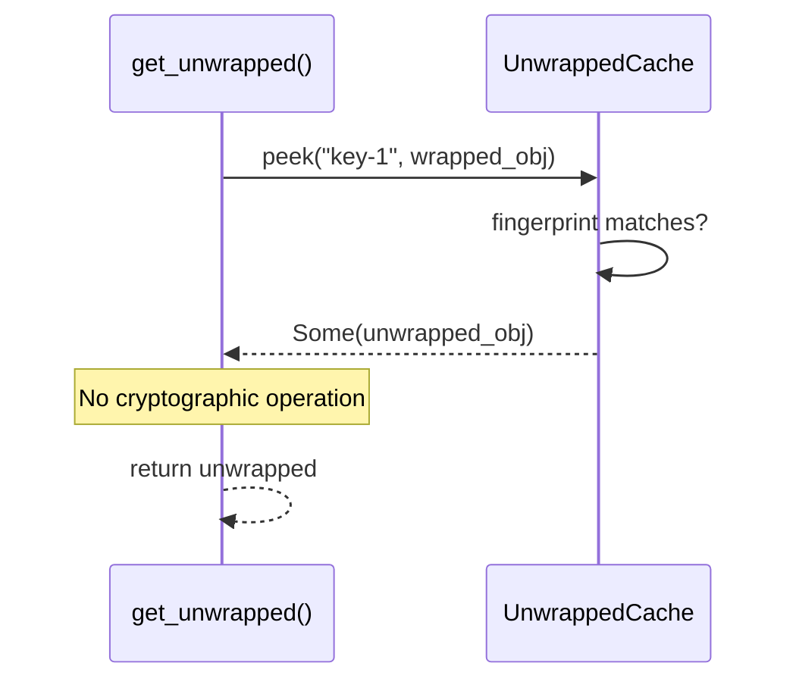

#### U3 — Key re-wrapped (KEK rotation)

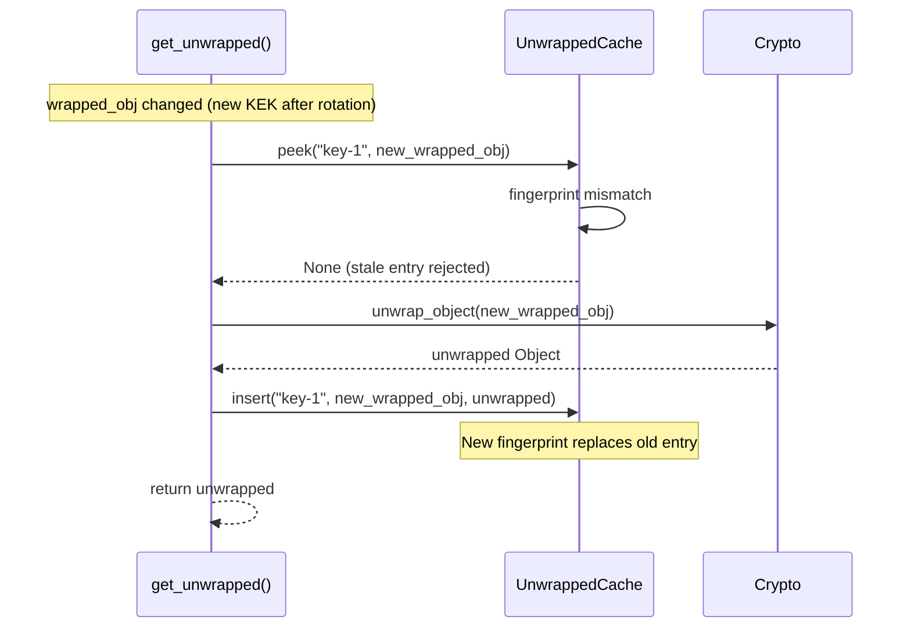

#### U4 — Security guard (wrapped == unwrapped)

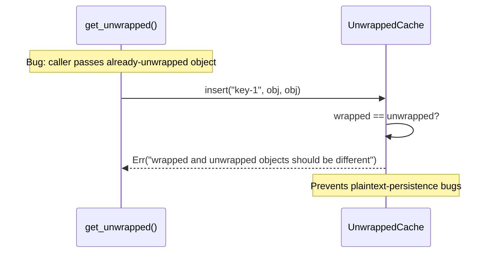

#### U5 — Explicit invalidation on key rotation

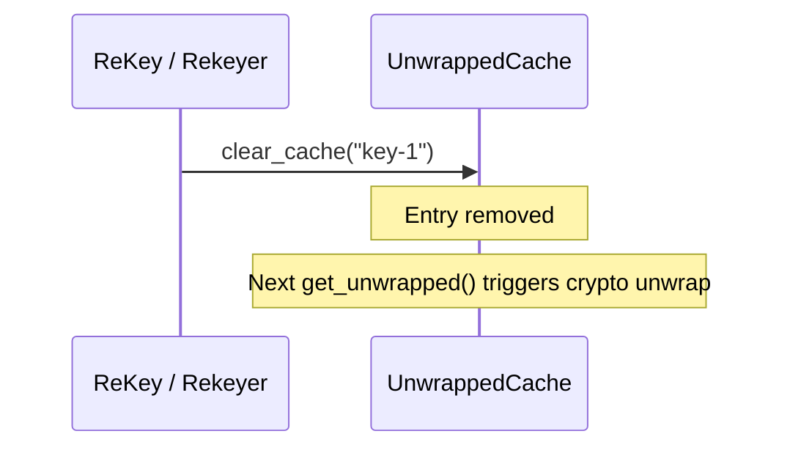

#### U6 — Concurrent workers (double-unwrap acceptable)

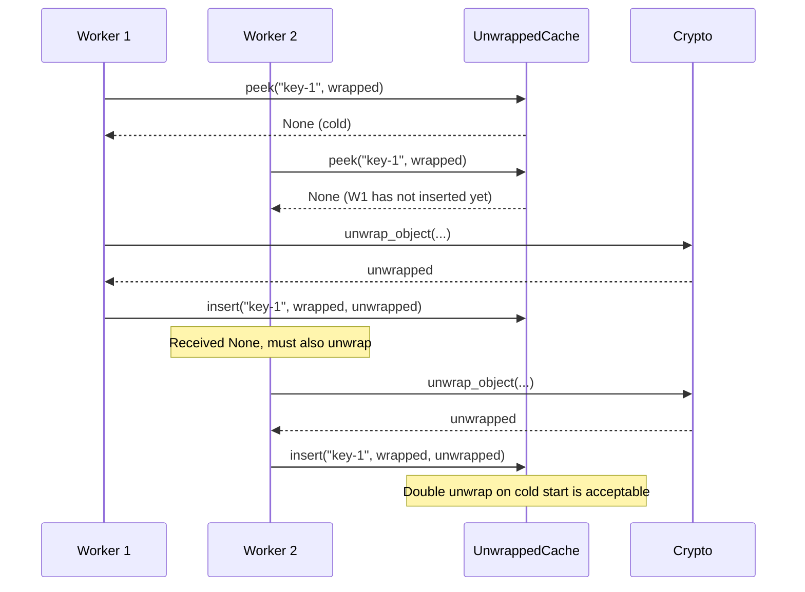

---

## End-to-end: JOSE decrypt

Full trace of `POST /v1/crypto/decrypt` with `alg: RSA-OAEP`. The RSA wrapping
key (persistent DB object, identified by `kid`) passes through both caches.
The CEK (ephemeral, from the JWE `encrypted_key` field) is never cached.

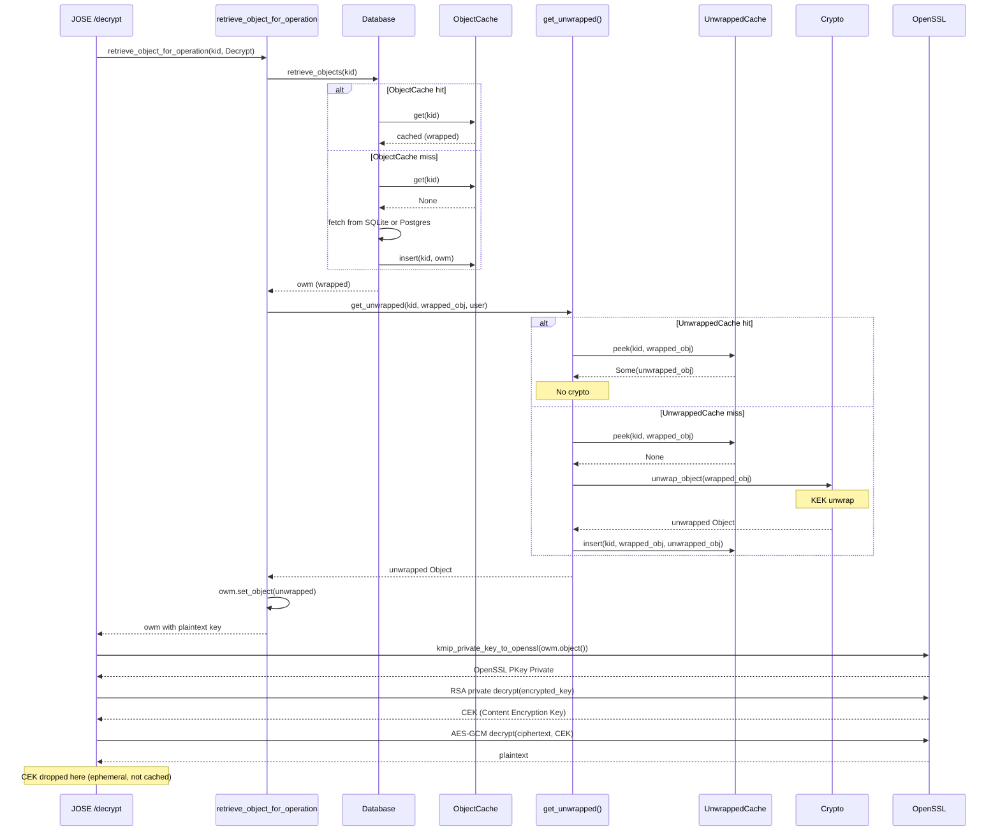

---

## Per-scenario cache behavior

| Scenario | ObjectCache | UnwrappedCache | DB round-trip | Crypto unwrap |
|---|---|---|---|---|
| 1st access, cold | miss → DB → insert | miss → crypto → insert | ✓ | ✓ |
| 2nd access, hot | hit | hit | — | — |
| Key re-wrapped (new KEK) | hit (wrapped) | miss → crypto → insert | — | ✓ |
| Cache evicted (TTL / LRU) | miss → DB → insert | miss → crypto → insert | ✓ | ✓ |
| Object updated in DB | invalidated → miss → DB | still valid (fingerprint unchanged) | ✓ | — |
| KEK rotated (Rekey) | invalidated | `clear_cache()` called explicitly | ✓ | ✓ (next access) |

---

## Configuration

Both caches are configured via the [server configuration file](server_configuration_file.md)
or CLI flags:

| Parameter | Default | Description |
|---|---|---|
| `object_cache_max_size` | Varies | Max entries in ObjectCache before LRU eviction |
| `object_cache_max_age` | Varies | Time-to-idle before eviction (seconds) |
| `unwrapped_cache_max_size` | 1000 | Max entries in UnwrappedCache (see CLI `--unwrapped-cache-max-size`) |

---

## Security considerations

1. **ObjectCache never stores plaintext keys.** It mirrors the database:
   objects are stored as-retrieved (wrapped). All callers provide the DB state.

2. **UnwrappedCache validates against wrapped fingerprint.** `peek()` compares
   the caller's `wrapped_object` fingerprint against the stored fingerprint.
   If the wrapped object changed (re-wrapped, corrupted), the entry is silently
   rejected.

3. **Security guard rejects `wrapped == unwrapped`.** `insert()` returns an
   error if the caller passes an already-unwrapped object as the wrapped argument.
   This is defense-in-depth against plaintext-persistence bugs.

4. **UnwrappedCache does NOT participate in persistence.** Unlike ObjectCache
   (checked by `retrieve_object` before every DB read), UnwrappedCache is only
   consulted by `get_unwrapped()`. Objects from UnwrappedCache are consumed
   in-memory for cryptographic operations and never written back to the database.

5. **Concurrent cold-start double-unwrap is acceptable.** If two workers call
   `get_unwrapped()` simultaneously for a cold key, both perform the cryptographic
   unwrap. The second `insert()` overwrites the first. This wastes one unwrap but
   avoids lock contention — a tradeoff favoring throughput.
