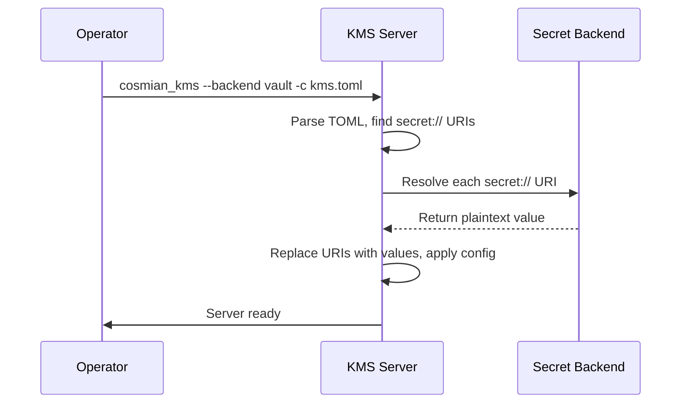

# Secret backends

Store sensitive configuration values — database passwords, API keys, tokens — in
an external secret manager instead of plain text in the KMS TOML config file.

## How it works



1. In your `kms.toml`, replace any sensitive value with a `secret://...` URI.
2. Start the KMS with `--backend <backend>` (or set `KMS_SECRET_BACKEND` env var).
3. At startup the KMS resolves every `secret://` URI **once**, then applies the config normally.

The config file never contains actual secrets — only references.

---

## Supported backends

| Backend | `--backend` | URI format | Required env vars |
|---------|-------------------|-----------|-------------------|
| HashiCorp Vault | `vault` | `secret://<mount>/<path>[#<field>]` | `VAULT_ADDR`, `VAULT_TOKEN` |
| AWS SSM Parameter Store | `aws-ssm` | `secret://<region>/<parameter-name>` | `AWS_ACCESS_KEY_ID`, `AWS_SECRET_ACCESS_KEY` |
| Azure Key Vault | `azure-kv` | `secret://<vault>/secrets/<name>[/<version>]` | `AZURE_TENANT_ID`, `AZURE_CLIENT_ID`, `AZURE_CLIENT_SECRET` |
| Cosmian KMS | `cosmian-kms` | `secret://<host>[:<port>]/<object-id>` | _(optional)_ `COSMIAN_KMS_SECRET_TOKEN` |

---

## HashiCorp Vault

Uses the **KV-v2** secrets engine. The URI fragment `#field` selects a specific
key in the secret's JSON data; defaults to `value` if omitted.

### 1. Store a secret in Vault

```bash
vault kv put secret/kms/db password=my-db-password
```

### 2. Reference it in `kms.toml`

```toml
[db]
database_type = "postgresql"
postgres_url = "postgresql://kms:secret://secret/kms/db#password@db.internal:5432/kms"
```

Or for a standalone field:

```toml
[db]
database_type = "postgresql"
postgres_url = "secret://secret/kms/postgres-url#value"
```

### 3. Start the KMS

```bash
export VAULT_ADDR=http://vault.internal:8200
export VAULT_TOKEN=s.xxxxxxxx
cosmian_kms --backend vault -c /etc/cosmian/kms.toml
```

---

## AWS SSM Parameter Store

Fetches a **SecureString** parameter. The leading `/` is prepended automatically — do not include it in the URI.

### 1. Store a secret in SSM

```bash
aws ssm put-parameter \
  --name /kms/db-password \
  --value "my-db-password" \
  --type SecureString \
  --region eu-west-1
```

### 2. Reference it in `kms.toml`

```toml
[db]
postgres_url = "secret://eu-west-1/kms/db-password"
```

### 3. Start the KMS

```bash
export AWS_ACCESS_KEY_ID=AKIA...
export AWS_SECRET_ACCESS_KEY=...
# Optional: export AWS_SESSION_TOKEN=...
cosmian_kms --backend aws-ssm -c /etc/cosmian/kms.toml
```

---

## Azure Key Vault

Uses **service-principal client credentials** (OAuth2) to authenticate to
Azure AD, then fetches the secret from the Key Vault REST API (v7.4).

### 1. Store a secret

```bash
az keyvault secret set \
  --vault-name myvault \
  --name db-password \
  --value "my-db-password"
```

### 2. Reference it in `kms.toml`

```toml
[db]
postgres_url = "secret://myvault/secrets/db-password"
```

To pin a specific version:

```toml
postgres_url = "secret://myvault/secrets/db-password/abc123def456"
```

### 3. Start the KMS

```bash
export AZURE_TENANT_ID=...
export AZURE_CLIENT_ID=...
export AZURE_CLIENT_SECRET=...
cosmian_kms --backend azure-kv -c /etc/cosmian/kms.toml
```

---

## Cosmian KMS (self-referencing)

Use another Cosmian KMS instance as the secret store. The secret must be stored
as a **SecretData** or **OpaqueObject** whose raw bytes are the UTF-8 value.

This is useful for hierarchical deployments where a "vault KMS" holds
credentials used by downstream KMS instances.

### 1. Import a secret into the vault KMS

```bash
ckms secret-data create --value "my-db-password" --type password
# → UniqueIdentifier: 550e8400-e29b-41d4-a716-446655440000
```

### 2. Reference it in `kms.toml`

```toml
[db]
postgres_url = "secret://vault-kms.internal:9998/550e8400-e29b-41d4-a716-446655440000"
```

For localhost (uses `http` automatically):

```toml
postgres_url = "secret://localhost:9998/550e8400-e29b-41d4-a716-446655440000"
```

### 3. Start the KMS

```bash
# Optional token if the vault KMS requires authentication:
export COSMIAN_KMS_SECRET_TOKEN=eyJhbGciOi...
# Accept self-signed certs (dev only):
export COSMIAN_KMS_INSECURE_CERTS=true
cosmian_kms --backend cosmian-kms -c /etc/cosmian/kms.toml
```

---

## Security considerations

| Concern | Mitigation |
|---------|-----------|
| Secret exposure in config files | Only `secret://` references are stored on disk — never plaintext values. |
| Secret lifetime | URIs are resolved **once at startup**. Resolved values live only in process memory. |
| Backend credentials | Always inject via environment variables, never in the TOML file. |
| Network security | Use TLS for all backend communication. For Vault and Cosmian KMS, ensure `VAULT_ADDR` uses `https://` in production. |
| Rotation | Restart the KMS to pick up rotated secrets. There is no hot-reload. |

!!! warning "Do not mix backends"
    Only one `--backend` can be active at a time. All `secret://` URIs
    in the config must be resolvable by the selected backend.
