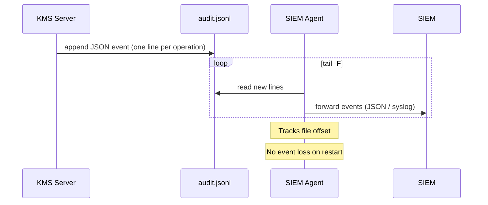
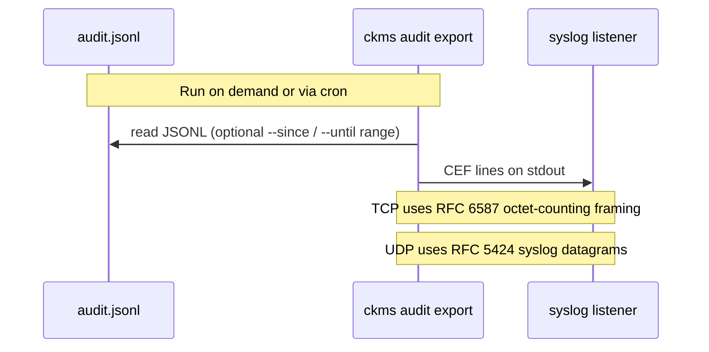
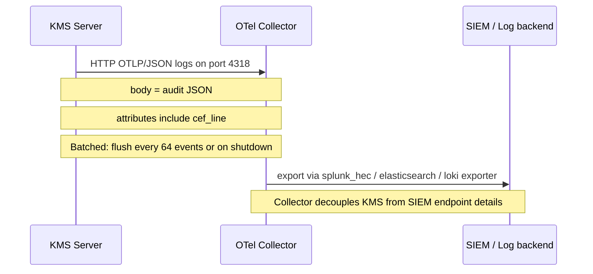

# SIEM integration

The Eviden KMS produces audit events that can be ingested by any SIEM (Security Information
and Event Management) system. This page describes the available integration models and
provides configuration examples for common SIEM products.

For details on the CEF format itself — field mapping, severity rules, escaping, and
specification reference — see [CEF export format](./cef-export.md).

---

## Integration models

The KMS supports two integration models today, with a third planned:

| Model | How it works | Format | Continuous? |
| ----- | ------------ | ------ | ----------- |
| **File tailing** | SIEM agent tails the JSONL audit file directly | JSON | Yes |
| **CEF export** | `ckms audit export` converts JSONL → CEF on stdout | CEF v27 | Manual / scripted |
| **OTLP audit push** | Server-side pipeline pushes events as OTLP log records | OTLP+CEF | Yes |

> The JSONL file is the **authoritative audit store** (see [Audit logs](./audit-logs.md)).
> CEF is a serialisation *view* — it does not replace the JSONL file and does not include
> hash-chain fields (`prev_hash`, `row_hash`).

### Model 1 — File tailing



Supported agents: Filebeat, Fluent Bit, Splunk Universal Forwarder, rsyslog imfile.

### Model 2 — CEF export (ad hoc or scripted)



Supported targets: rsyslog, ArcSight, Splunk, nc listener.

### Model 3 — OTLP audit push (server-side, continuous)



Supported SIEM targets via OTel exporter: Splunk HEC, Elasticsearch, Loki, and any
OpenTelemetry-compatible log backend.

---

## File tailing (recommended for continuous ingestion)

The simplest and most reliable integration: a SIEM agent monitors the JSONL audit file
and forwards events as they are written. No format conversion is needed, and delivery
state is tracked by the agent.

### Splunk

Add to `inputs.conf` on the indexer or a Universal Forwarder:

```ini
[monitor:///var/log/cosmian-kms/audit.jsonl]
disabled = false
sourcetype = _json
index = kms_audit
```

Splunk's built-in `_json` sourcetype parses one JSON object per line as a searchable event.
Before enabling the monitor, validate field extraction against representative audit events
and ensure the `kms_audit` index exists with appropriate retention and access controls.

### Datadog

Datadog's Agent can tail the JSONL file and parse each line as a JSON log event. Add to
`datadog.yaml` or a dedicated integration config:

```yaml
logs:
  - type: file
    path: /var/log/cosmian-kms/audit.jsonl
    service: cosmian-kms
    source: json
```

Datadog automatically extracts top-level JSON fields as log attributes. You can then create
facets on `operation`, `user`, `result`, and build dashboards or monitors around KMS audit
activity.

### Elasticsearch / OpenSearch

Ship the JSONL file via Filebeat 8.x with the `filestream` input and `ndjson` parser:

```yaml
filebeat.inputs:
  - type: filestream                       # replaces deprecated 'log' input in Filebeat 8.x
    id: kms-audit
    paths:
      - /var/log/cosmian-kms/audit.jsonl
    parsers:
      - ndjson:
          target: ""
          overwrite_keys: true
          add_error_key: false
    prospector.scanner.check_interval: 1s

processors:
  - drop_fields:
      fields: ["message", "log", "host", "agent", "ecs", "input", "event"]
      ignore_missing: true

output.elasticsearch:
  hosts: ["http://elasticsearch:9200"]
  index: "kms-audit"
  pipeline: "kms-audit-normalize"         # required — see ingest pipeline below

setup.template.enabled: false             # use your own index mapping
setup.ilm.enabled: false                  # write to a plain index, not a data stream
```

#### The `result` field and the ingest pipeline

The `result` field is a Rust enum that serializes as either a plain string or an object:

```jsonl
{"result": "Success", ...}
{"result": {"Failure": "access denied"}, ...}
```

Elasticsearch cannot dynamically map a single field as both a `keyword` and an object — the
first event maps `result` as `keyword`, and every subsequent `{"Failure": ...}` event is
**silently dropped** with a mapping conflict error.

Create this ingest pipeline before starting Filebeat. It normalizes `result` into two
consistently typed fields:

```bash
curl -X PUT "http://elasticsearch:9200/_ingest/pipeline/kms-audit-normalize" \
  -H "Content-Type: application/json" -d '{
  "description": "Normalize KMS audit result field (polymorphic Rust enum)",
  "processors": [{
    "script": {
      "lang": "painless",
      "source": "def r = ctx[\"result\"]; if (r instanceof String) { ctx[\"result_status\"] = r; } else if (r instanceof Map && r.containsKey(\"Failure\")) { ctx[\"result_status\"] = \"Failure\"; ctx[\"result_error\"] = r[\"Failure\"]; } else { ctx[\"result_status\"] = \"Unknown\"; } ctx.remove(\"result\");"
    }
  }]
}'
```

After the pipeline runs, each indexed document has:

| Field | Type | Description |
|-------|------|-------------|
| `result_status` | `keyword` | Always `"Success"` or `"Failure"` |
| `result_error` | `text` | Error message — present only on `"Failure"` events |

### JSONL field reference for SIEM mapping

All SIEM integrations above ingest the same JSONL schema. Use this table to configure
field extraction, facets, or dashboards:

| Field | Type | Nullable | SIEM mapping suggestion |
|-------|------|----------|------------------------|
| `id` | integer | No | Event sequence number |
| `timestamp` | string (RFC 3339) | No | Event time |
| `operation` | string | No | Action / event type (e.g. `Encrypt`, `Create`, `Destroy`) |
| `user` | string | No | Source user identity |
| `object_uid` | string | Yes | Target object identifier (KMIP `UniqueIdentifier`) |
| `algorithm` | string | Yes | Cryptographic algorithm (e.g. `AES`, `RSA`) |
| `client_ip` | string | Yes | Source IP address |
| `result` | `"Success"` or `{"Failure": "..."}` | No | Polymorphic — normalize with the ingest pipeline described above into `result_status` + `result_error` |
| `result_status` | `"Success"` or `"Failure"` | No | Normalized outcome (after pipeline); use for facets and alerts |
| `result_error` | string | Yes | Normalized error message (after pipeline); present only on Failure events |
| `duration_ms` | integer | No | Operation latency |
| `request_id` | string (UUID) | Yes | Correlation ID across batch operations |
| `prev_hash` | string (64 hex) | No | Hash-chain link (integrity only — ignore in SIEM) |
| `row_hash` | string (64 hex) | No | Row integrity hash (integrity only — ignore in SIEM) |

> **Note**: `prev_hash` and `row_hash` are tamper-evidence fields for offline chain
> verification (see [Audit logs](./audit-logs.md)). They carry no semantic meaning for
> SIEM correlation and can be excluded from indexing to save storage.

### Generic file tailing (rsyslog, Filebeat, Fluent Bit)

Any log shipping agent that supports file tailing can forward the JSONL file. Configure
the agent to:

1. Monitor the audit file path (default: `/var/log/cosmian-kms/audit.jsonl`)
2. Track file position (cursor) to avoid duplicate delivery
3. Use a sourcetype or tag that your SIEM recognises as JSON

---

## CEF export (for SIEMs requiring CEF format)

The `ckms audit export --format cef` command converts the JSONL audit store into
[CEF v27](./cef-export.md) and prints it to stdout. This is useful for:

- **Verification** — sending a sample of events to a CEF listener to confirm parsing
- **Scripted pipelines** — wrapping the export in a cron job or log rotation hook
- **SIEMs that require CEF** — ArcSight, QRadar, and others that expect CEF input

### CEF over TCP syslog (rsyslog)

For reliable delivery, use TCP with RFC 6587 octet-counting framing instead of UDP.
Any TCP syslog receiver (rsyslog, syslog-ng, Splunk TCP input) can ingest this format.

Example with rsyslog — add to `/etc/rsyslog.conf` or `/etc/rsyslog.d/kms.conf`:

```conf
module(load="imtcp")
input(type="imtcp" port="5514" Ruleset="kms_cef")
ruleset(name="kms_cef") {
  action(type="omfile" file="/var/log/kms-cef.log" template="RSYSLOG_ForwardFormat")
}
```

Send CEF events with octet-counting framing:

```bash
# Each frame: "<byte-count> <message>"
# The message is a syslog PRI header + CEF line.
while IFS= read -r line; do
  msg="<134>$(date '+%b %d %H:%M:%S') kms-audit: ${line}"
  printf '%zu %s' "${#msg}" "${msg}" > /dev/tcp/<host>/5514
done < <(ckms audit export --format cef --path /var/log/cosmian-kms/audit.jsonl)
```

!!! note "TCP vs UDP"
    - **TCP with octet-counting**: reliable, ordered delivery — suitable for production
      pipelines. Each frame carries its own length prefix (`<count> <message>`).
    - **UDP**: no delivery guarantee — suitable only for ad hoc verification.

### Ad hoc export to a CEF listener (UDP)

```bash
# Send today's events as CEF to a test listener on port 5514
ckms audit export --format cef \
  --path /var/log/cosmian-kms/audit.jsonl \
  --since "$(date -u +%Y-%m-%dT00:00:00Z)" \
  | nc -u -w 1 <host> 5514
```

!!! warning "Testing only — expect loss"

    - **UDP has no delivery guarantee**: events can be silently dropped or reordered.
    - **Use a port ≥ 1024** (e.g. `5514`): port 514 is privileged on Linux and usually
      occupied by the system syslog daemon.
    - **No cursor state**: each run re-exports from the beginning of the file (or from
      `--since`). This is fine for verification and unsuitable for continuous delivery.

### ArcSight / CEF-native SIEMs

ArcSight SmartConnectors natively ingest CEF over syslog. Configure the connector to
accept CEF on a TCP or UDP port, then forward the KMS CEF export output to that port.

Refer to the [ArcSight CEF Implementation Standard v27](https://www.microfocus.com/documentation/arcsight/arcsight-smartconnectors-24.2/pdfdoc/cef-implementation-standard/cef-implementation-standard.pdf)
for connector-specific configuration details.

---

## Interoperability testing

The KMS SIEM integrations are validated using Docker-based integration tests that exercise
each documented integration path end-to-end. Every test has **zero error tolerance**: if no
evidence is found (0 events, 0 records, 0 metrics) the test exits with code 1.

### Test commands

| Command | ADRs proven | What it validates |
|---------|-------------|-------------------|
| `mise test:audit` | ADR-003, ADR-004 | Tamper-evident JSONL written, hash chain valid, all required fields present |
| `mise test:cef` | ADR-005, ADR-007 | CEF format correctness + UDP syslog + TCP rsyslog (RFC 6587) delivery |
| `mise test:siem` | ADR-005, ADR-006 | Fluent Bit file tailing, Filebeat→Elasticsearch, OTLP audit log export |
| `mise test:monitoring` | ADR-006 | KMS metrics on OTel Prometheus endpoint, VictoriaMetrics and Grafana stack health |

Run all tests locally (requires Docker and a built KMS binary):

```bash
# Build once
cargo build --features non-fips

# Run each integration area (all require Docker)
KMS_SKIP_BUILD=1 mise test:audit     --variant non-fips
KMS_SKIP_BUILD=1 mise test:cef       --variant non-fips
KMS_SKIP_BUILD=1 mise test:siem      --variant non-fips
KMS_SKIP_BUILD=1 mise test:monitoring --variant non-fips
```

Or run individual suites:

```bash
mise test:siem --suite fluent-bit    # Fluent Bit JSONL file tailing
mise test:siem --suite filebeat      # Filebeat → Elasticsearch
mise test:siem --suite otlp          # OTLP audit log export to OTel collector
mise test:cef  --suite format        # CEF v27 format validation (jc parser)
mise test:cef  --suite syslog        # CEF → UDP syslog
mise test:cef  --suite tcp-syslog    # CEF → TCP rsyslog (RFC 6587)
```

### Audit log test (`mise test:audit`)

Proves ADR-003 (tamper-evident JSONL) and ADR-004 (HTTP middleware):

- Starts KMS with audit enabled, exercises Create / GetAttributes / Encrypt / Destroy
- GUARD: ≥ 4 events written to the audit JSONL file
- GUARD: `ckms audit verify` exits 0 — hash chain is intact
- GUARD: every event has all required fields (`timestamp`, `operation`, `user`, `result`, `request_id`, `client_ip`)
- GUARD: ≥ 1 `Success` event and ≥ 1 `Failure` event are present

### CEF format and syslog tests (`mise test:cef`)

Proves ADR-005 (CEF v27 format) and ADR-007 (syslog transport):

- GUARD: every audit event produces exactly one CEF line (1:1 mapping, fail if 0)
- GUARD: every line matches `CEF:0|Cosmian|KMS|<version>|<op>|<op>|<severity>|`
- GUARD: all required extension keys present (`rt`, `suser`, `act`, `cn1`, `cn1Label`, `outcome`, `externalId`, `devicePayloadId`)
- GUARD: ≥ 1 `outcome=Success` and ≥ 1 `outcome=Failure`
- GUARD (syslog): all 4 CEF lines received by the UDP syslog listener
- GUARD (tcp-syslog): all 4 CEF lines received by rsyslog via TCP with RFC 6587 framing, field integrity preserved

The CEF format is additionally validated against [jc](https://github.com/kellyjonbrazil/jc), an independent open-source CEF parser.

### OTLP audit export test (`mise test:siem --suite otlp`)

Proves ADR-006 (OTLP log export):

- Starts an OpenTelemetry Collector container with HTTP receiver (port 4318) and file exporter
- Configures KMS with `[audit.otlp] endpoint = "http://127.0.0.1:4318"` and `allow_insecure = true`
- Generates 66 KMIP operations to trigger the 64-event batch flush while KMS is running
- GUARD: ≥ 64 OTLP log records in the collector output file (fail if 0)
- GUARD: ≥ 1 record has a `cef_line` attribute (CEF string carried as OTLP attribute)
- GUARD: all `severityText` values are either `"Success"` or `"Failure"`

### Monitoring stack test (`mise test:monitoring`)

Proves ADR-006 (metrics export) and the full monitoring stack:

- Starts OTel Collector (gRPC receiver), VictoriaMetrics, and Grafana containers
- Configures KMS to export metrics via `--otlp grpc://127.0.0.1:<port>`
- GUARD: ≥ 100 KMS metric lines on the OTel Prometheus debug endpoint (fail if 0)
- GUARD: required metric families present (`kms_active_connections`, `kms_active_users`, `kms_database_operations_total`, `kms_server_uptime_seconds_total`)
- GUARD: Grafana `/api/health` returns HTTP 200 with `database=ok`

The Filebeat test validates:

- JSONL audit file is correctly tailed and parsed
- All required fields (`id`, `timestamp`, `operation`, `user`, `result_status`, …) are indexed
- The `kms-audit-normalize` ingest pipeline correctly transforms both `"Success"` string and
  `{"Failure": "..."}` object results into consistent `result_status`/`result_error` fields
- Both Success and Failure events are indexed (no mapping conflicts)

---

## Access restriction

!!! warning "Restrict access to the audit file"

    The audit file contains actor identities, client IP addresses, object identifiers, and
    operation metadata. Restrict file ownership to the KMS process user and grant read access
    only to the collection agent. Do not expose the file over untrusted networks without
    encryption.
