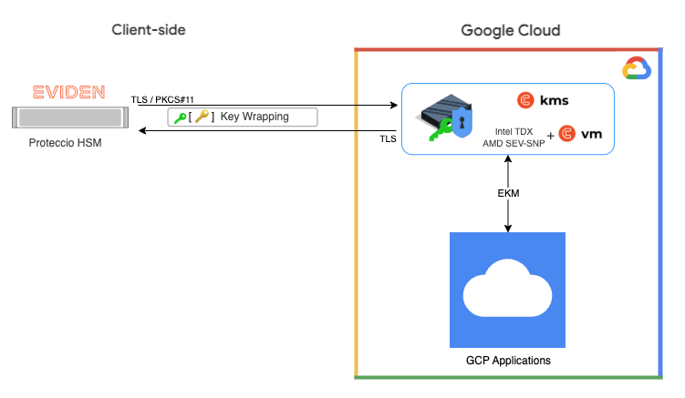

# Cosmian/Eviden for Google EKM

The Cosmian/Eviden offering for Google External Key Management (EKM) provides a GCP-ready, highly secure, and
high-performance external key management solution for Google Cloud Platform.

## Key Features

- The Cosmian KMS operates within a confidential computing VM on GCP infrastructure in the customer's tenant
- A specialized EKM-ready version of the Cosmian KMS will be available on GCP marketplace (note: the standard Cosmian
  KMS for confidential computing is already available on GCP marketplace)
- KMS keys are wrapped by HSM keys for enhanced security
- Keys are unwrapped once by the HSM, then securely cached in the KMS confidential VM's memory
- No additional HSM calls occur until keys are evicted from the cache based on configurable policies

## Automatic Deployment from GCP Marketplace
 
Customers can deploy this solution directly from the Google Cloud Platform (GCP) Marketplace. The system automatically
provisions a pre-configured KMS in a confidential virtual machine within the customer's tenant.

The Cosmian KMS comes pre-configured with all keys wrapped by an external Proteccio HSM. This HSM can be deployed either
on the customer's infrastructure or as a service on Eviden infrastructure. Integration between the KMS and HSM occurs
over a secure TLS, PKCS#11 link, with IPsec available when needed.

## High Performance

The KMS stores all keys wrapped by an HSM key. When Google Cloud first requests a KMS key, the system calls the HSM to
unwrap it. The KMS then securely caches the unwrapped key in memory. Subsequent key usage is served directly from the
KMS without additional HSM calls. This removes dependencies on external infrastructure and network latency, ensuring
high availability and exceptional performance.

## High Security

The system ensures security through multiple layers:

- At rest: KMS keys remain stored wrapped by a key encryption key (KEK) in the HSM, under complete customer control, and
  outside GCP boundaries
- In operation: Unwrapped KMS keys reside only in the encrypted memory of the Cosmian KMS confidential VM with a
  configurable eviction policy.
- Memory protection: VM memory is encrypted using a hardware key derived from an unextractable CPU key
- Integrity verification: Cosmian VM includes a verifiability service that allows customers to externally verify the
  integrity of hardware, operating system, and software at any time

## Components

### Cosmian KMS

- FIPS 140-3 level 2 compliant key management server delivering encryption and decryption services at millions of
  operations per second
- Full KMIP support (versions 1.0-1.4, 2.0-2.1) in both binary and JSON formats.
- Open-source application written in Rust with advanced security features optimized explicitly for confidential
  computing environments. See the code on [GitHub](https://gihub.com/Cosmian/kms)
- HSM integration for enhanced key security with keys wrapped by hardware security modules
- High-availability mode with simple horizontal scaling for enterprise-grade reliability
- Support for all standard NIST cryptographic algorithms and advanced post-quantum cryptography algorithms
- Advanced authentication mechanisms with fine-grained access control policies
- Combines functions of a Key Management System, Encryption Oracle, and Public Key Infrastructure
- Intuitive web interface with comprehensive client tools and multi-language support
- 100% developed in the European Union with full Google Workspace CSE integration capabilities

Learn more at [docs.cosmian.com](https://docs.cosmian.com) or view the source code
on [GitHub](https://github.com/Cosmian/kms).

### Cosmian VM

- Purpose-built confidential computing virtual machine OS (Ubuntu 24 or RHEL 9 based) already available on Google Cloud
  Marketplace for immediate deployment
- Advanced remote attestation capabilities allow Google customers to cryptographically verify the integrity of
  hardware, firmware, and software
- Zero modification of application code required to run in the Cosmian VM

For more information, visit [docs.cosmian.com/cosmian_vm/overview/](https://docs.cosmian.com/cosmian_vm/overview/).

### Proteccio HSM

- Trustway Proteccio NetHSM provides FIPS 140-2 Level 3 compliant hardware security for cryptographic keys
- Certified Common Criteria EAL4+ and qualified at the Enhanced level by the French National Cybersecurity Agency (
  ANSSI)
- Complies with eIDAS regulation for qualified electronic signature and seal creation devices
- Hardware-based random number generation and secure key storage for maximum cryptographic assurance
- Delivers high-performance cryptographic operations suitable for enterprise Google Cloud workloads
- Built with physical anti-tampering technology and secure element protection against unauthorized access
- Supports standard APIs, including PKCS#11, for seamless integration with Cosmian KMS and Google services
- Provides complete key lifecycle management with strong access controls and multi-factor authentication
- Available both on-premises and as a service through Eviden for flexible deployment options
- Designed and manufactured in Europe with a transparent and secure supply chain

Learn more
at [eviden.com/solutions/cybersecurity/data-encryption/trustway-proteccio-nethsm/](https://eviden.com/solutions/cybersecurity/data-encryption/trustway-proteccio-nethsm/).
