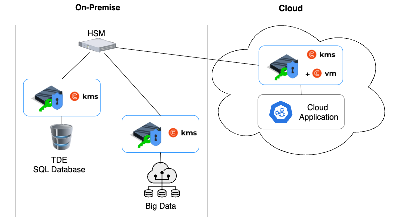

# Encrypting and Decrypting at Scale

The Cosmian KMS is architected specifically to deliver high-performance cryptography at scale for enterprise
applications.

## Scalability Design

The KMS scales efficiently through:

- **Vertical scaling**: Adding CPUs on the same machine
- **Horizontal scaling**: Deploying across multiple machines with load balancing
- **High availability**: Support for [high-availability configuration](./installation/high_availability_mode.md)

## Performance Considerations

Cryptographic operations themselves are rarely the bottleneck. The key factors affecting overall performance are:

1. **Network latency**: Minimizing the distance between the KMS and client applications
2. **CPU resources**: Allocating sufficient processing power for concurrent operations
3. **Database performance**: Using optimized [database configurations](./database.md)

## Deployment Architecture

The optimal architecture places KMS instances as close as possible to the applications they serve. Thanks to Cosmian
KMS's:

- Stateless design
- Per-CPU pricing model
- Containerized an OS packaged deployment option

This makes it practical to deploy KMS instances in multiple locations, including:

- Private data centers
- Edge locations
- Public cloud environments:

## Security Considerations

Placing KMS instances closer to applications can introduce security challenges by potentially exposing key material in
less trusted environments.

### HSM Integration

To maintain strong security while preserving performance, Cosmian KMS can be backed by Hardware Security Modules (HSMs):

- HSM integration details are explained in the [HSM support section](./hsms/index.md)
- HSM master keys wrap all application keys handled by the KMS
- This protects keys at rest while only exposing the cleartext application keys in memory cache; the cach expiration
  delay is configurable
- Supported HSMs include [Trustway Proteccio](./hsms/proteccio.md) and [Utimaco](./hsms/utimaco.md)

For additional security details, see the [FIPS 140-3 compliance](./fips.md) and [zeroization](./zeroization.md)
documentation.

### Additional Protection in Public Clouds

For deployments in public clouds, consider using the [Cosmian VM](https://cosmian.com/marketplaces/) to run the KMS.
The Cosmian VM provides memory and disk encryption and verifiability of the KMS's integrity.

Pre-packaged KMS in Cosmian VMs is available on
the [Azure, GCP, and AWS marketplaces](https://cosmian.com/marketplaces/).

## Integration Examples

For practical examples of integrating the KMS for high-volume operations, see:

- [Client-side and application-level encryption](./client_side_and_application_level_encryption.md)
- [Google Workspace Client-Side Encryption](./google_cse/index.md)
- [Microsoft Double Key Encryption](./ms_dke/index.md)