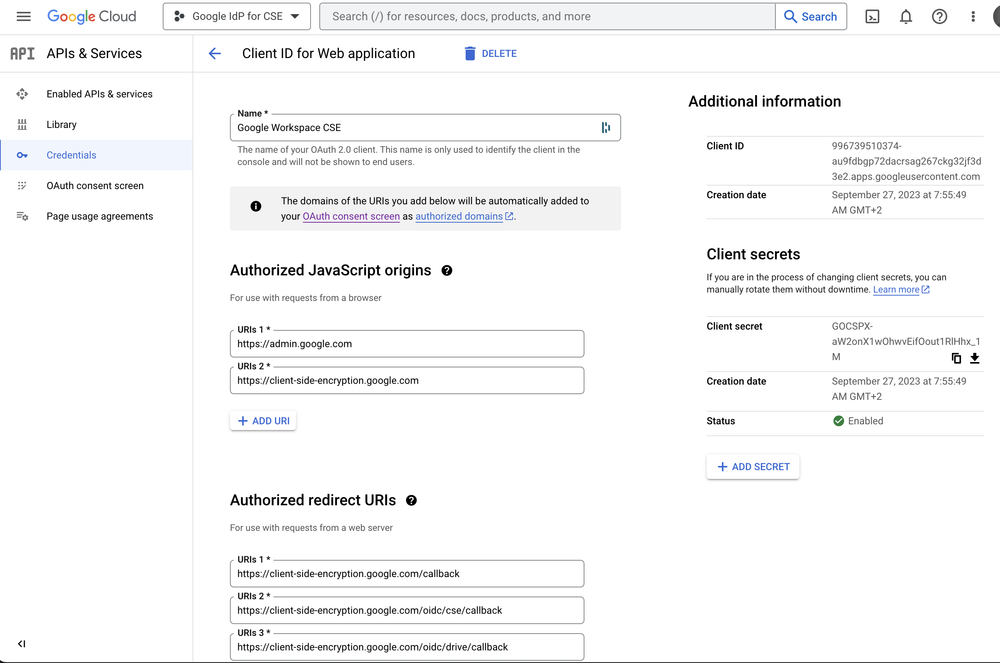

<h1> Configuring the well-known file</h1>

General configuration instructions for Google client-side encryption is available at [this url](https://support.google.com/a/answer/10743588) in paragraph _(Option 1) To connect to your IdP using a .well-known file_

## Using Google as an Identity Provider

To use Google as an Identity Provider, you first need to create a dedicated client ID in the Google Cloud Console. Detailed instructions are available on the page referenced above in the section entitled _Create-a-client-id-for-google-identity_.

The general idea is to create a project, then in _APIs & Services > Credentials_, create a client ID for a web application. This Client ID will be used in the well-known file.

Once created the Client ID should look like this



The list of URLs for _Authorized origins_ and _Authorized redirect_ are available in the Google documentation above, in paragraph _Create a client ID for Google identity_.

### Generating the well-known file

The format of the well-known file is specified by [RFC 8259](https://tools.ietf.org/html/rfc8259)

```json
{
  "name": "Google identity for workspace client-side encryption",
  "client_id": "996739510374-au9fdbgp72dacrsag267ckg32jf3d3e2.apps.googleusercontent.com",
  "discovery_uri": "https://accounts.google.com/.well-known/openid-configuration",
  "grant_type": "implicit",
  "applications": {
    "drivefs": {
      "client_id": "947318989803-k88lapdik9bledfml8rr69ic6d3rdv57.apps.googleusercontent.com"
    },
    "drive-android": {
      "client_id": "313892590415-6lbccuf47cou4q45vanraqp3fv5jt9do.apps.googleusercontent.com"
    },
    "drive-ios": {
      "client_id": "313892590415-d3h1l7kl4htab916r6jevqdtu8bfmh9m.apps.googleusercontent.com"
    },
    "calendar-android": {
      "client_id": "313892590415-q84luo8fon5pn5vl8a6rppo1qvcd3qvn.apps.googleusercontent.com"
    },
    "calendar-ios": {
      "client_id": "313892590415-283b3nilr8561tedgu1n4dcm9hd6g3hr.apps.googleusercontent.com"
    },
    "gmail-android": {
      "client_id": "313892590415-samhd32i4piankgs42o9sit5e9dug452.apps.googleusercontent.com"
    },
    "gmail-ios": {
      "client_id": "313892590415-ijvjpbnsh0gauuunjgsdn64ngg37k6rc.apps.googleusercontent.com"
    },
    "meet-android": {
      "client_id": "313892590415-i06v47su4k03ns7ot38akv7s9ari5oa5.apps.googleusercontent.com"
    },
    "meet-ios": {
      "client_id": "313892590415-32ha2bvs0tr1b12s089i33o58hjvqt55.apps.googleusercontent.com"
    }
  }
}
```

`client_id` is the OAuth 2.0 client ID of the Google Workspace domain that is created using the Google Cloud Console
