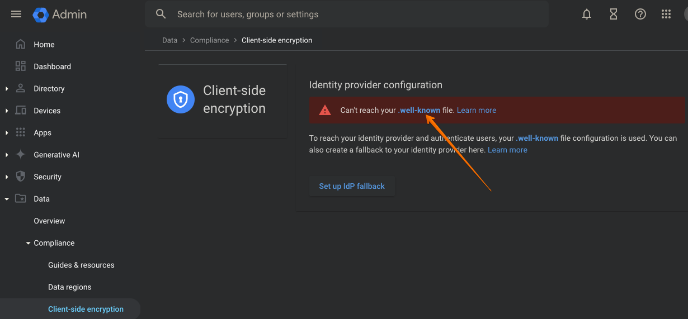

<h1>Configuring a static web server to serve the well-known file</h1>

The URL at which Google client-side encryption expects the well-known file is on the link pointed by the red arrow below.



Assuming your organization is on the domain `acme.com` (which should match that of your email address domain), the URL would be: `https://cse.acme.com/.well-known/cse-configuration`

#### 1. Configure a server running Ubuntu 23.04

The server should be reachable using an external IP; configure your DNS so that a `A` record with value `cse.acme.com` points to that external IP address of the server.

Make sure ports 80 and 443 are open to external traffic on this machine. Access to port 80 can be closed at the end of this procedure.

#### 2. Install `nginx` on the server

```sh
sudo apt update
sudo apt install nginx
```

#### 3. Create an empty well-known file

```sh
sudo mkdir /var/www/html/.well-known
sudo touch /var/www/html/.well-known/cse-configuration
sudo /bin/bash -c "echo '{}' >> /var/www/html/.well-known/cse-configuration"
```

The file will simply contain an empty JSON object `{}` at this stage; you need to fill it with proper values later by following [this documentation](./configuring-the-well-known-file.md).

#### 4. Configure `nginx` to serve the well-known file

Since, the well-known file is served from a different domain than the one used by Google client-side encryption,
CORS calls need to be enabled on NGINX to allow the browser to fetch the well-known file.

Edit the file `/etc/nginx/sites-available/default` and add the following `location`:

```nginx
location /.well-known/ {
    root /var/www/html;
    # Allow CORS calls: see https://support.google.com/a/answer/10743588?hl=en
    add_header 'Access-Control-Allow-Origin' '*';
}
```

Verify that `nginx` is correctly serving the file by running # Allow CORS calls: see https://support.google.com/a/answer/10743588?hl=en
add_header 'Access-Control-Allow-Origin' '\*';
}

````

Then restart the `nginx` service

```sh
sudo systemctl restart nginx
````

Finally, verify that `nginx` is correctly serving the file by running

```sh
➜ curl http://localhost/.well-known/cse-configuration
{}
```

#### 5. Enable HTTPS with `certbot` and Lets's Encrypt

Install `certbot` on the machine using `snap` (the `snap` daemon should already be installed and activated on Ubuntu 23.04)

```sh
sudo snap install --classic certbot
sudo ln -s /snap/bin/certbot /usr/bin/certbot
```

General instructions on installing `certbot` are available at [this URL](https://certbot.eff.org/lets-encrypt/ubuntufocal-nginx).

Get a certificate and configure `nginx`

```sh
sudo certbot --nginx
```

The command will ask you to provide an email address and a domain name. The domain name should be `cse.acme.com` (or whatever domain you chose in step 1).

That's it, the empty well-known file should now be served using HTTPS. From another machine, verify that it is now available on the public address

```sh
➜ curl https://cse.acme.com/.well-known/cse-configuration
{}

```

Port 80 can now be closed on the machine (or `nginx` configuration can be updated to redirect HTTP requests to HTTPS)

#### 6. Enable CORS calls

The well-known file is served from a different domain than the one used by Google client-side encryption. CORS calls need to be enabled on the server to allow the browser to fetch the well-known file.

Edit the file `/etc/nginx/sites-available/default` and add the following at the top of the file (before the `server` block):

```nginx
# Allow CORS calls: see https://apps.google.com/supportwidget/articlehome?hl=en&article_url=https%3A%2F%2Fsupport.google.com%2Fa%2Fanswer%2F10743588%3Fhl%3Den&assistant_id=generic-unu&product_context=10743588&product_name=UnuFlow&trigger_context=a
add_header 'Access-Control-Allow-Origin' '*';
```

Then restart the `nginx` service

```sh
sudo systemctl restart nginx
```

#### 7. Optional: download the well-known file as a proper JSON

The Client-side encryption service does not require this setting to work properly. However, it is useful to be able to download the well-known file as a proper JSON object when viewing it in a browser.

To do so, the `content-type` header of the response must be set to `application/json`. Edit the file `/etc/nginx/sites-available/default` and add the following inside the `server` block that serves the HTTPS requests:

```nginx
location /.well-known/ {
    default_type application/json;
}
```

Then restart the `nginx` service

```sh
sudo systemctl restart nginx
```
