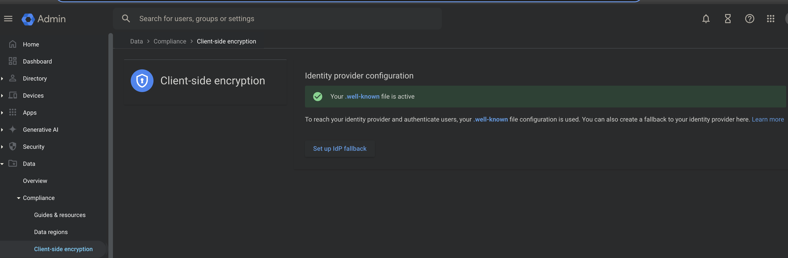

# Google CSE

The Cosmian Key Management Server is compatible with Google Workspace client-side encryption. Using this feature, your users can encrypt files and documents, in their browsers, before sending them to Google servers. The ephemeral encryption keys are protected by "key wrapping keys", stored in the KMS and unavailable to Google. Only users that have the right to unwrap the ephemeral encryption keys inside the KMS, can decrypt the files. An overview is provided in Google's [About client-side encryption page](https://support.google.com/a/answer/10741897?hl=en).

To enable client-side encryption (CSE) in Google Workspace, connect as an admin to the admin console and go to the [Google Workspace client-side encryption page](https://admin.google.com/ac/cse?hl=en).

Google has extensive documentation on how to enable CSE in Google Workspace. The [Use client-side encryption for users' data page](https://support.google.com/a/topic/10742486?hl=en) is a good starting point. It may be slightly overwhelming, and this documentation adds some details to help you get started.

## Choosing and configuring the Identity Provider

The first thing that will need to be done is to configure the Identity Provider. This is the service that the Cosmian Key Management Server will use to authenticate users before they can encrypt files or access encrypted files.

The Identity Provider (IdP) is either a third party IdP or Google identity. Using Google Identity is not recommended since Google as the authority could issue tokens to impersonate users and recover their keys. However, since configuring an Identity Provider is hard and Google Identity is the easiest to configure, we will use it in this tutorial.


The initial page should look like this. What matters here is the link shown at the tip of the red-arrow. This is the URL at which Google client-side encryption expects the well-known file to be served. Assuming your domain is `example.com`, the URL will likely be `https://cse.example.com/.well-known/cse-configuration`.

To configure a well-known file, you need to:

1. Set up a server that serves the file at the URL shown in the image above: [instructions](./configuring-the-well-known-server.md)

2. Create the well-known file with the proper content: instructions are provided in the [Configuring the well-known file](./configuring-the-well-known-file.md) section.

Once this is complete, the screen on refresh should turn to this:



## Configuring the Key Management Server

The KMS must be behind a valid TLS certificate when started.
Assuming it is running at `https://cse.example.com`, you should add the External Key Service with KACLS URL `https://cse.example.com/google_cse` in the Client-Side Encryption page of the Google Workspace admin console.

To enable Client Side Encryption on the Cosmian KMS server, it must be started with the `--google-cse-kacls-url` option. This option is the URL at which the KMS will serve the Key Access Control Lists (KACLs) for the Google CSE service. The KACLs are used by the Google CSE service to determine which users have access to which keys. The KACLs are served by the KMS at the URL `https://cse.example.com/google_cse` in the example above.

The Key Management Server must be configured to use the same Identity Provider as the one configured in the previous step. When using Google Identity, the server should be configured with the following options set in the [corresponding Google documentation](https://developers.google.com/workspace/cse/guides/configure-service?hl=en).

Assuming Google is the Identity Provider, the KMS should be started with the following options:

```sh
--jwt-issuer-uri=https://accounts.google.com
--jwks-uri=https://www.googleapis.com/oauth2/v3/certs
--google-cse-kacls-url=https://cse.example.com/google_cse
```

For example, if you are using the docker image, you can run the following command:

```sh
docker run -p 9998:9998 --name kms ghcr.io/cosmian/kms:4.18.0 \
    --jwt-issuer-uri=https://accounts.google.com \
    --jwks-uri=https://www.googleapis.com/oauth2/v3/certs \
    --google-cse-kacls-url=https://cse.example.com/google_cse
```


Then test the connection; it should show:


Finalize the configuration. The Client Side Encryption page should now show the service to be active and you will now have to decide whether to assign this service to all users or to a subset of users.


## Configuring CSE for Gmail

Follow the [Google documentation](https://support.google.com/a/answer/13069736?hl=en&ref_topic=10742486) to enable S/MIME for client-side encryption in your organization and create a service account to interact with the Gmail API.

### Configure ckms client

The Cosmian `ckms` command line interface (CLI) simplifies the setup of S/MIME keys and certificates for users.

After completing the setup, update your [CLI configuration](../cli/cli.md#smime-gmail-service-account-configuration) with the necessary information for the service account you created for the Gmail API.

### Import certificates chain to Cosmian KMS

According to [Google's requirements](https://support.google.com/a/answer/7300887#zippy=%2Croot-ca%2Cintermediate-ca-certificates-other-than-from-issuing-intermediate-ca%2Cintermediate-ca-certificate-that-issues-the-end-entity%2Cend-entity-certificate) and [configuration guidelines](https://support.google.com/a/answer/13297070?hl=en#guidelines), upload the certificate chain to Cosmian KMS. This certificate chain will be used to generate user certificates.

```sh
ckms certificates import -f pkcs12 intermediate.p12 -p PASSWORD
```

If multiple administrators will be generating key-pairs for users, ensure that each administrator has the appropriate access rights to the imported certificate chain elements.

You'll need the ID of the issuer's private key (imported from the certificate chain) to sign users' public keys and create their certificates.

### Create user key-pair

Gmail uses `key-pairs` (an RSA private key wrapped with its associated certificate) and `identities` (the ID of an uploaded key-pair, associated with a user) to sign and encrypt emails using S/MIME. These objects are uploaded to Google via the Gmail API.

You can create a key-pair (RSA private key and user certificate chain) and upload it to the Gmail API using the following command:

```sh
ckms google key-pairs create --cse-key-id CSE_KEY_ID --subject-name "C=FR, ST=IdF, L=Paris, O=YOUR_ORGANIZATION, OU=DEPARTMENT, CN=user@your_organization.com, emailAddress=user@your_organization.com" -i ISSUER_PRIVATE_KEY_ID user@your_organization.com
```

If you already have an existing RSA key-pair for the user, you can specify it in the command.

Once created, the ID of the key-pair will be displayed.

Note: It may take up to 24 hours for Google to propagate the Client-Side Encryption (CSE) activation for a user within the Gmail API, allowing you to upload the S/MIME elements.

#### Insert user identity

After creating the key-pair, you must associate it with the user’s identity. To do so, run the following command:

```sh
ckms google identities insert --user-id user@your_organization.com CREATED_KEYPAIR_ID
```

You can manage key-pairs (get, list, enable, disable, obliterate) and identities (get, list, delete, patch) using the other available commands in the `ckms` [commands documentation](../cli/main_commands.md).

Note: It may take a few hours for Google to propagate the uploaded elements, after which users can begin using S/MIME for secure email exchanges.

## Handle Guest identity providers

As an administrator, you can allow external users to access your encrypted content via Google Workspace Client-Side Encryption (CSE), including sharing encrypted documents or hosting encrypted Google Meet sessions.

For more information on this configuration, refer to [Google documentation](https://support.google.com/a/answer/14757842?hl=en-0).

Cosmian KMS supports this feature, and to enable it:

Add the identity provider's information in the server-side [Cosmian KMS configuration](../authentication.md)
Ensure that external users can access the Google CSE symmetric key.
